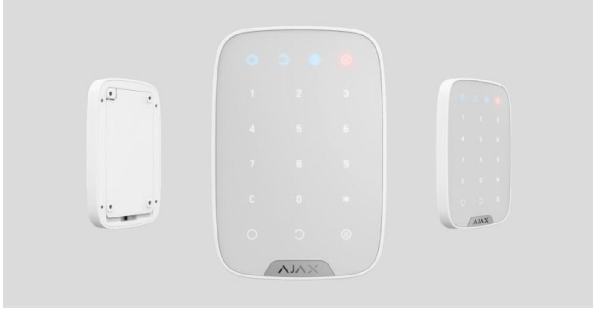
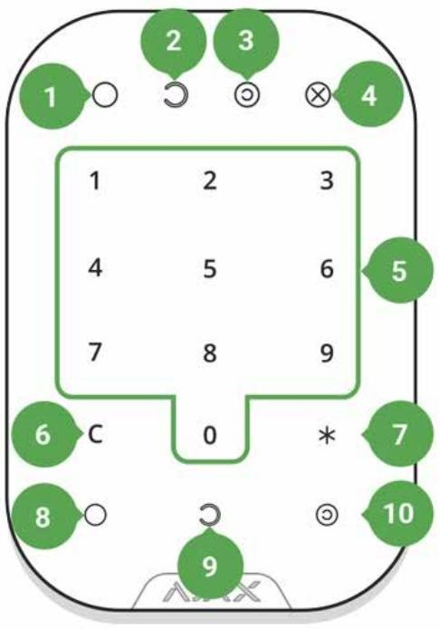
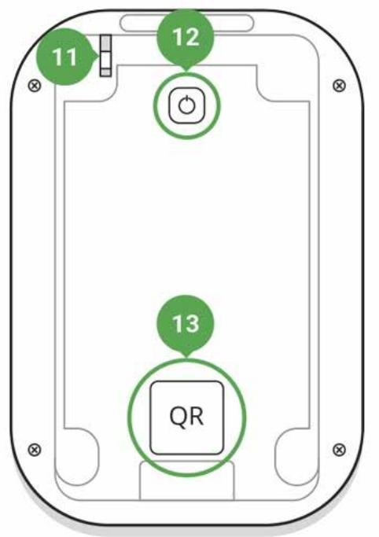

# KeyPad User Manual

Updated December 7, 2021

**KeyPad** is a wireless indoor touch-sensitive keyboard for managing the Ajax security system. Designed for indoor use. With this device, the user can arm and disarm the system and see its security status. KeyPad is protected against attempts to guess the passcode and can raise a silent alarm when the passcode is entered under duress.

Connecting to the Ajax security system via a secured radio protocol, KeyPad communicates with the at a distance of up to 1,700 m in line of sight. Jeweller hub

KeyPad operates with Ajax hubs only and does not support connecting via or integration modules. ocBridge Plus uartBridge

The device is set up via the for iOS, Android, macOS, and Windows. Ajax apps

#### Buy keypad KeyPad

### Functional elements

- **1.** Armed mode indicator
- **2.** Disarmed mode indicator
- **3.** Night mode indicator
- **4.** Malfunction indicator
- **5.** The block of numerical buttons
- **6.** "Clear" button
- **7.** "Function" button
- **8.** "Arm" button
- **9.** "Disarm" button
- **10.** "Night mode" button
- **11.** Tamper button
- **12.** On/Off button
- **13.** QR code

To remove the SmartBracket panel, slide it down (perforated part is required for actuating the tamper in case of any attempt to tear off the device from the surface).

# Operating Principle

KeyPad is a stationary control device located indoors. Its functions include arming/disarming the system with a numerical combination (or just by pressing the button), activating Night Mode, indicating the security mode, blocking when someone tries to guess the passcode and raising the silent alarm when someone forces the user to disarm the system.

KeyPad indicates the state of communication with the hub and system malfunctions. Buttons are highlighted once the user touches the keyboard so you can enter the passcode without external lighting. KeyPad also uses a beeper sound for indication.

To activate KeyPad, touch the keyboard: the backlight will switch on, and the beeper sound will indicate that KeyPad has woken up.

If the battery is low, the backlight switches on at a minimum level, regardless of the settings.

If you do not touch the keyboard for 4 seconds, KeyPad dims the backlight, and after another 12 seconds, the device switches to the sleep mode.

When switching to sleep mode, KeyPad clears the entered commands!

KeyPad supports passcodes of 4-6 digits. The entered passcode is sent to the hub after pressing the button: (arm), (disarm) or (Night mode). Incorrect commands can be reset with the button (Reset).

When incorrect passcode is entered three times during 30 minutes, KeyPad locks for the time preset by the administrator user. Once KeyPad is locked, the hub ignores any commands, simultaneously notifying the security system users of the attempt to guess the passcode. The administrator user can unlock KeyPad in the app. When the pre-set time is up, KeyPad unlocks automatically.

KeyPad allows arming the system without passcode: by pressing the button (Arm). This feature is disabled by default.

When the function button (*) is pressed without entering the passcode, the hub executes the command assigned to this button in the app.

KeyPad can notify a security company of the system being disarmed by force. The **Duress Code** — unlike the panic button — does not activate sirens. KeyPad and the app notify of successful disarming the system, but the security company receives an alarm.

# Indication

When touching KeyPad, it wakes up highlighting the keyboard and indicating the security mode: Armed, Disarmed, or Night Mode. The security mode is always actual, regardless of the control device that was used to change it (the key fob or app).

| Event                                                                   | Indication                                                                                                                                                          |
|-------------------------------------------------------------------------|---------------------------------------------------------------------------------------------------------------------------------------------------------------------|
| Malfunction indicator X blinks                                          | Indicator notifies about lack of communication with hub or keypad lid opening. You can check Ajax the reason for malfunction in the Security System app |
| KeyPad button pressed                                                   | A short beep, the system's current arming state LED blinks once                                                                                                  |
| The system is armed                                                     | Short sound signal, Armed mode / Night mode LED indicator lights up                                                                                              |
| The system is disarmed                                                  | Two short sound signals, LED disarmed LED indicator lights up                                                                                                    |
| Incorrect passcode                                                      | Long sound signal, the keyboard backlight blinks 3 times                                                                                                         |
| A malfunction is detected when arming (e.g., the detector is lost)   | A long beep, the system's current arming state LED blinks 3 times                                                                                                |
| The hub does not respond to the command — no connection              | Long sound signal, the malfunction indicator lights up                                                                                                           |
| KeyPad is locked after 3 unsuccessful attempts to enter the passcode | Long sound signal, security mode indicators blink simultaneously                                                                                                 |
| Low battery                                                             | After arming/disarming the system, the malfunction indicator blinks smoothly. The keyboard is locked while the indicator blinks.                              |

When activating KeyPad with low batteries, it will beep with a long sound signal, the malfunction indicator smoothly lights up and then switches off

# Connecting

# Before connecting the device:

- **1.** Switch on the hub and check its Internet connection (the logo glows white or green).
- **2.** Install the . Create the account, add the hub to the app, and create at least one room. Ajax app
- **3.** Make sure that the hub is not armed, and it does not update by checking its status in the Ajax app.

Only users with administrator rights can add a device to the app

# How to connect KeyPad to the hub:

- **1.** Select the **Add Device** option in the Ajax app.
- **2.** Name the device, scan/write manually the **QR Code** (located on the body and packaging), and select the location room.
- **3.** Select **Add** the countdown will begin.
- **4.** Switch on KeyPad by holding power button for 3 seconds it will blink once with the keyboard backlight.

For detection and pairing to occur, KeyPad should be located within the coverage of the wireless network of the hub (at the same protected object).

A request for connection to the hub is transmitted for a short time at the moment of switching on the device.

If KeyPad failed to connect to the hub, switch it off for 5 seconds and retry.

The connected device will appear in the app device list. Update of the device statuses in the list depends on the detector ping interval in the hub settings (the default value is 36 seconds).

> There are no pre-set passwords for KeyPad. Before using a KeyPad, set all necessary passwords: common, personal, and duress code if you are forced to disarm the system.

# Selecting the Location

The location of the device depends on its remoteness from the hub, and obstacles hindering the radio signal transmission: walls, floors, large objects inside the room.

The device developed only for indoor use.

#### **Do not install KeyPad:**

- **1.** Near the radio transmission equipment, including that operates in 2G/3G/4G mobile networks, Wi-Fi routers, transceivers, radio stations, as well as an Ajax hub (it uses a GSM network).
- **2.** Close to electrical wiring.
- **3.** Close to metal objects and mirrors that can cause radio signal attenuation or shading.
- **4.** Outside the premises (outdoors).
- **5.** Inside premises with the temperature and humidity beyond the range of permissible limits.
- **6.** Closer than 1 m to the hub.

During testing, the signal level is displayed in the app and on the keyboard with security mode indicators (Armed mode), (Disarmed mode), (Night mode) and malfunction indicator **X**.

If the signal level is low (one bar), we cannot guarantee the stable operation of the device. Take all possible measures to improve the quality of the signal. At least, move the device: even a 20 cm shift can significantly improve the quality of signal reception.

If after moving the device still has a low or unstable signal strength, use a . radio signal range extender

KeyPad is designed for operation when fixed to the vertical surface. When using KeyPad in hands, we cannot guarantee successful operation of the sensor keyboard.

### States

**1.** Devices

**2.** KeyPad

| Parameter                | Value                                                                                                                             |
|--------------------------|-----------------------------------------------------------------------------------------------------------------------------------|
| Temperature              | Temperature of the device. Measured on the processor and changes gradually                                                     |
| Jeweller Signal Strength | Signal strength between the hub and KeyPad                                                                                        |
| Battery Charge           | Battery level of the device. Two states available: ОК Battery discharged How battery charge is displayed in Ajax apps |
| Lid                      | The tamper mode of the device, which reacts to the detachment of or damage to the body                                         |
| Connection               | Connection status between the hub and the                                                                                         |

|                        | KeyPad                                                                                                                                                            |
|------------------------|-------------------------------------------------------------------------------------------------------------------------------------------------------------------|
| ReX                    | radio signal Displays the status of using a range extender                                                                                                  |
| Temporary Deactivation | Shows the status of the device: active, completely disabled by the user, or only notifications about triggering of the device tamper button are disabled |
| Firmware               | Detector firmware version                                                                                                                                         |
| Device ID              | Device identifier                                                                                                                                                 |

# Settings

- **1.** Devices
- **2.** KeyPad
- **3.** Settings

| Setting                      | Value                                                                                                                           |
|------------------------------|---------------------------------------------------------------------------------------------------------------------------------|
| First field                  | Device name, can be edited                                                                                                      |
| Room                         | Selecting the virtual room to which the device is assigned                                                                   |
| Arming/Disarming Permissions | Selecting the security group to which KeyPad is assigned                                                                     |
| Group management             | Selecting the way of verification for arming/disarming Keypad code only User passcode only Keypad and user passcode |
| Keypad code                  | Setting a passcode for arming/disarming                                                                                         |
| Duress Code                  | a duress code for silent alarm Setting                                                                                       |
| Function Button              | Selection of the button function * Off — the Function button is disabled and does not execute any commands when           |

|                                               | pressed Alarm — by pressing the Function button, the system sends an alarm to the monitoring station of the security company and to all users Mute Interconnected Fire Alarm — when pressed, mutes the fire alarm of FireProtect/FireProtect Plus detectors. The feature works only if Interconnected FireProtect Alarms is enabled Learn more |
|-----------------------------------------------|------------------------------------------------------------------------------------------------------------------------------------------------------------------------------------------------------------------------------------------------------------------------------------------------------------------------------------------------------------------------------|
| Arming without Passcode                       | If active, the system can be armed by pressing Arm button without passcode                                                                                                                                                                                                                                                                                                |
| Unathorised Access Auto-lock                  | If active, the keyboard is locked for the pre-set time after entering incorrect passcode three times in a row (during 30 min). During this time, the system cannot be disarmed via KeyPad                                                                                                                                                                           |
| Auto-lock Time (min)                          | Lock period after wrong passcode attempts                                                                                                                                                                                                                                                                                                                                    |
| Brightness                                    | Brightness of the keyboard backlight                                                                                                                                                                                                                                                                                                                                         |
| Buttons Volume                                | Volume of the beeper                                                                                                                                                                                                                                                                                                                                                         |
| Alert with a siren if panic button is pressed | The setting appears if the Alarm mode is selected for Function button. If active, the Function button pressing triggers the sirens installed at the object                                                                                                                                                                                                          |
| Jeweller Signal Strength Test                 | Switches the device to the signal strength test mode                                                                                                                                                                                                                                                                                                                      |
| Signal Attenuation Test                       | Switches the KeyPad to the signal fade test mode (available in devices with firmware version 3.50 and later)                                                                                                                                                                                                                                                           |
| Temporary Deactivation                        | Allows the user to disconnect the device without removing it from the system. Two options are available: Entirely — the device will not execute system commands or participate in automation scenarios, and the system will ignore device alarms and other notifications                                                                                   |

|               | Lid only — the system will ignore only notifications about the triggering of the device tamper button |
|---------------|-------------------------------------------------------------------------------------------------------------|
|               | Learn more about temporary deactivation of devices                                                       |
| User Guide    | Opens the KeyPad User Manual                                                                                |
| Unpair Device | Disconnects the device from the hub and deletes its settings                                             |

KeyPad allows to set both general and personal passcodes for each user.

#### **To install a personal passcode:**

**1.** Go to profile settings (**Hub → Settings** →  **Users** → **Your profile settings**)

**2.** Click **Access Code Settings** (in this menu you can also see the user identifier)

- **3.** Set the **User Code** and **Duress Code**
Each user sets a personal passcode individually!

# Security management by passwords

You can control the security of the entire facility or separate groups using common or personal passwords (configured in the app).

If a personal password is used, the name of the user who armed/disarmed the system is displayed in notifications and in the hub event feed. If a common password is used, the name of the user who changed the security mode is not displayed.

# Security management of the entire facility using a common password

Enter the **common password** and press the **arming** / **disarming** / **Night mode activation** .

For example: 1234 →

# Group security management with a common password

Enter the **common password**, press the *, enter the **group ID** and press the **arming** / **disarming** / **Night mode activation** .

For example: 1234 → * → 2 →

#### What is Group ID?

If a group is assigned to the KeyPad (**Arming / Disarming permission** field in the keypad settings), you do not need to enter the group ID. To manage the arming mode of this group, entering a common or personal password is sufficient.

Please note that if a group is assigned to the KeyPad, you will not be able to manage **Night mode** using a common password.

In this case, **Night mode** can only be managed using a personal password (if the user has the appropriate rights).

Rights in the Ajax security system

# Security management of the entire facility using a personal password

Enter **user ID**, press *, enter **personal password**, and press the **arming** / **disarming** / **Night mode activation** .

For example: 2 → * → 1234 →

What is User ID?

Group security management using a personal password

Enter **user ID**, press *, enter **personal password**, press *, enter **group ID**, and press the **arming** / **disarming** / **Night mode activation** .

For example: 2 → * → 1234 → * → 5 →

What is Group ID?

What is User ID?

If a group is assigned to the KeyPad (**Arming / Disarming permission** field in the keypad settings), you do not need to enter the group ID. To manage the arming mode of this group, entering a personal password is sufficient.

# Using a duress password

A **duress password** allows you to raise a silent alarm and imitate alarm deactivation. A silent alarm means that the Ajax app and sirens will not shout and expose you. But a security company and other users will be alerted instantly. You can use both **personal** and **common** duress password.

What is a duress password and how do you use it?

Scenarios and sirens react to disarming under duress in the same way as to normal disarming.

**To use a common duress password:**

Enter the **common duress password** and press the **disarming** key .

For example: 4321 →

**To use a personal duress password:**

Enter **user ID**, press *, then enter **personal duress password** and press the **disarming** key .

For example: 2 → * → 4422 →

### How the fire alarm muting function works

Using the KeyPad, you can mute the interconnected fire detectors alarm by pressing the Function button (if the corresponding setting is enabled). The reaction of the system to pressing a button depends on the state of the system:

- **Interconnected FireProtect Alarms have already propagated** by the first press of the Function button, all sirens of the fire detectors are muted, except for those that registered the alarm. Pressing the button again mutes the remaining detectors.
- **The interconnected alarms delay time lasts** by pressing the Function button, the siren of the triggered FireProtect/FireProtect Plus detector is muted.

#### Learn more about interconnected alarms of fire detectors

With the update, users can mute fire alarms in their groups without affecting detectors in the groups to which they do not have access. OS Malevich 2.12

Learn more

# Functionality Testing

The Ajax security system allows conducting tests for checking the functionality of connected devices.

The tests do not start straight away but within a period of 36 seconds when using the standard settings. The test time start depends on the settings of the detector scanning period (the paragraph on "**Jeweller**" settings in hub settings).

Jeweller Signal Strength Test

Attenuation Test

### Installation

Before installing the detector, make sure that you have selected the optimal location and it is in compliance with the guidelines contained in this manual!

KeyPad should be attached to the vertical surface.

- **1.** Attach the SmartBracket panel to the surface using bundled screws, using at least two fixing points (one of them — above the tamper). After selecting other attachment hardware, make sure that they do not damage or deform the panel.

The double-sided adhesive tape may be only used for temporary attachment of KeyPad. The tape will run dry in course of time, which may result in the falling of the KeyPad and damage of the device.

- **2.** Put KeyPad on the attachment panel and tighten the mounting screw on the body underside.
As soon as the KeyPad is fixed in SmartBracket, it will blink with the LED **X** (Fault) — this will be a signal that the tamper has been actuated.

If the malfunction indicator **X** did not blink after installation in SmartBracket, check the status of the tamper in the and then check the fixing tightness of the panel. Ajax app

If the KeyPad is torn off from the surface or removed from the attachment panel, you will receive the notification.

# KeyPad Maintenance and Battery Replacement

Check the KeyPad operating capability on a regular basis.

The battery installed in the KeyPad ensures up to 2 years of autonomous operation (with the inquiry frequency by the hub of 3 minutes). If the KeyPad battery is low, the security system will send the relevant notices, and the

malfunction indicator will smoothly lights up and goes out after each successful passcode entry.

#### How long Ajax devices operate on batteries, and what affects this

#### Battery Replacement

### Complete Set

- **1.** KeyPad
- **2.** SmartBracket mounting panel
- **3.** Batteries AAA (pre-installed) 4 pcs
- **4.** Installation kit
- **5.** Quick Start Guide

# Technical Specifications

| Sensor type                          | Capacitive                                                                                                                                                    |
|--------------------------------------|---------------------------------------------------------------------------------------------------------------------------------------------------------------|
| Anti-tamper switch                   | Yes                                                                                                                                                           |
| Protection against passcode guessing | Yes                                                                                                                                                           |
| Radio communication protocol         | Jeweller Learn more                                                                                                                                        |
| Radio frequency band                 | 866.0 – 866.5 MHz 868.0 – 868.6 MHz 868.7 – 869.2 MHz 905.0 – 926.5 MHz 915.85 – 926.5 MHz 921.0 – 922.0 MHz Depends on the region of sale. |
| Compatibility                        | hubs radio Operates only with all Ajax , and signal range extenders                                                                               |
| Maximum RF output power              | Up to 20 mW                                                                                                                                                   |
| Modulation of the radio signal       | GFSK                                                                                                                                                          |

| Radio signal range          | Up to 1,700 m (if there are no obstacles)                                                                                   |
|-----------------------------|-----------------------------------------------------------------------------------------------------------------------------|
|                             | Learn more                                                                                                                  |
| Power supply                | 4 × AAA batteries                                                                                                           |
| Power supply voltage        | 3 V (batteries are installed in pairs)                                                                                      |
| Battery life                | Up to 2 years                                                                                                               |
| Installation method         | Indoors                                                                                                                     |
| Operating temperature range | From -10°C to +40°C                                                                                                         |
| Operating humidity          | Up to 75%                                                                                                                   |
| Overall dimensions          | 150 × 103 × 14 mm                                                                                                           |
| Weight                      | 197 g                                                                                                                       |
| Service life                | 10 years                                                                                                                    |
| Certification               | Security Grade 2, Environmental Class II in conformity with the requirements of EN 50131- 1, EN 50131-3, EN 50131-5-3 |

#### Compliance with standards

# Warranty

Warranty for the "AJAX SYSTEMS MANUFACTURING" LIMITED LIABILITY COMPANY products is valid for 2 years after the purchase and does not apply to the pre-installed battery.

If the device does not work correctly, you should first contact the support service — in half of the cases, technical issues can be solved remotely!

The full text of the warranty

User Agreement

Technical support: support@ajax.systems