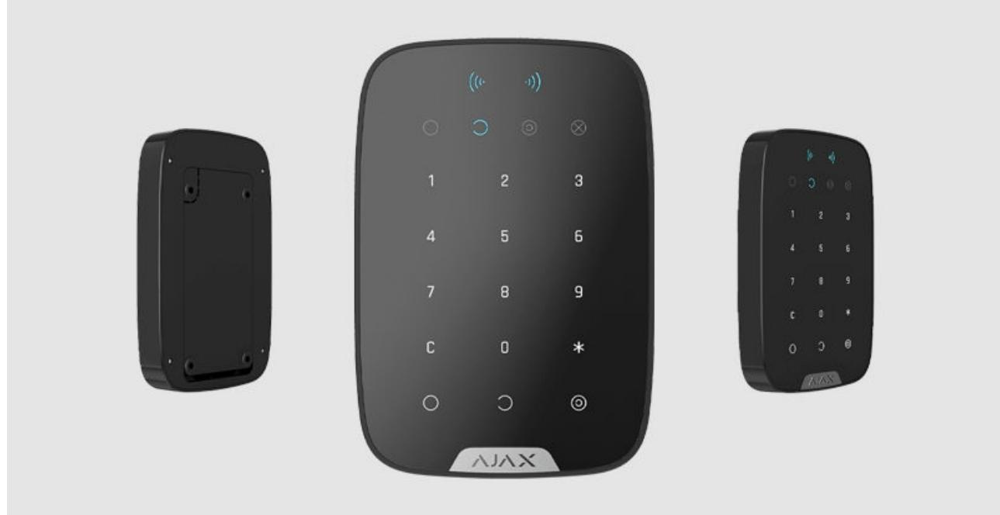
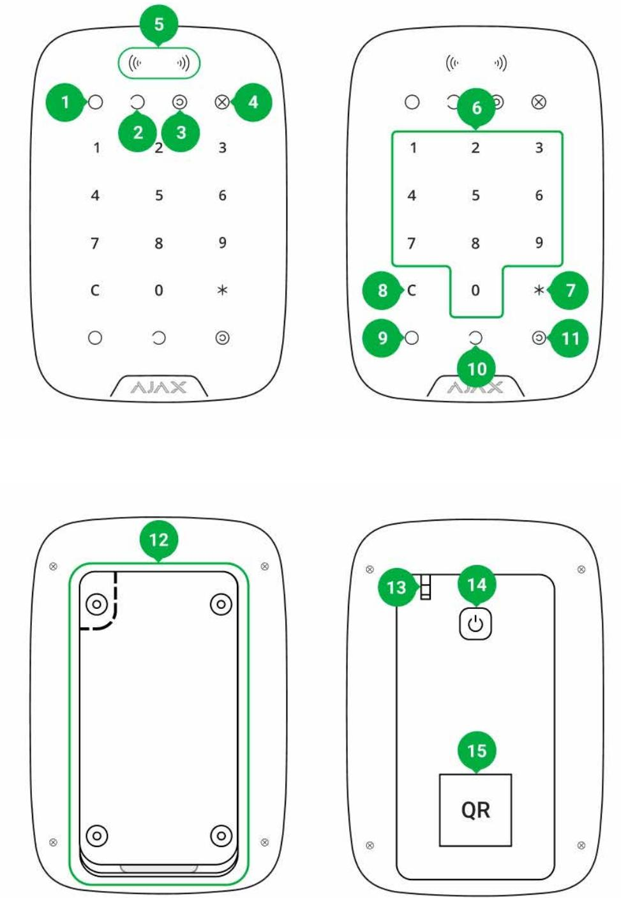
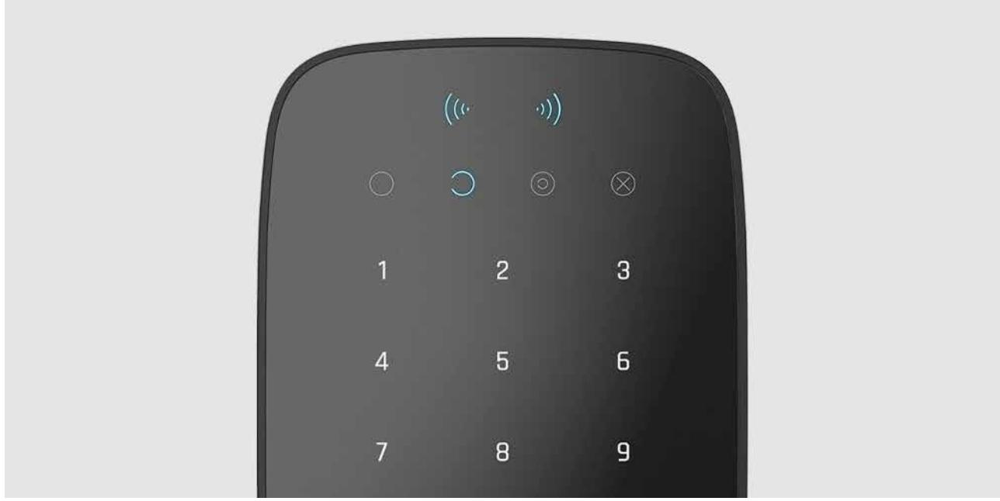
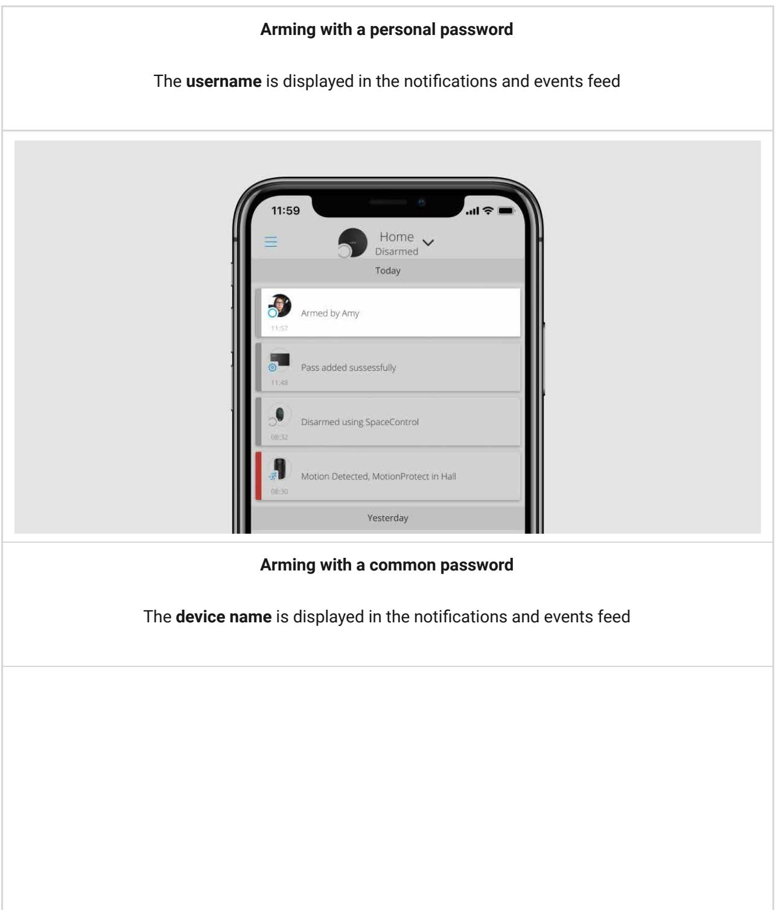
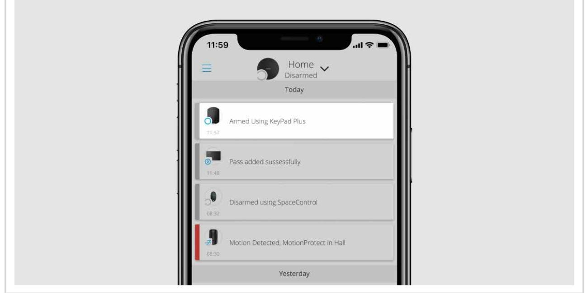
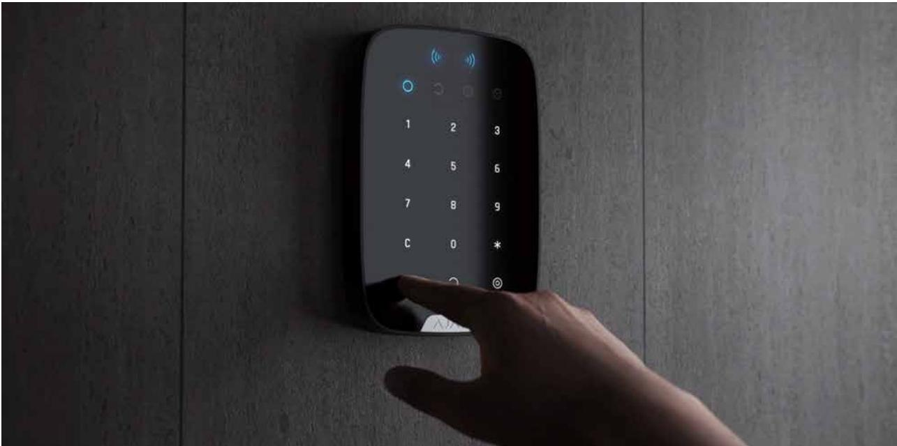
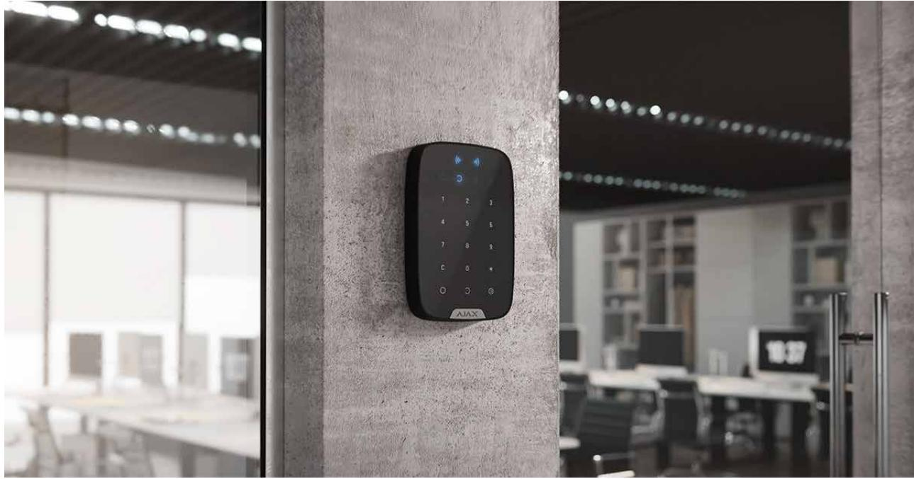
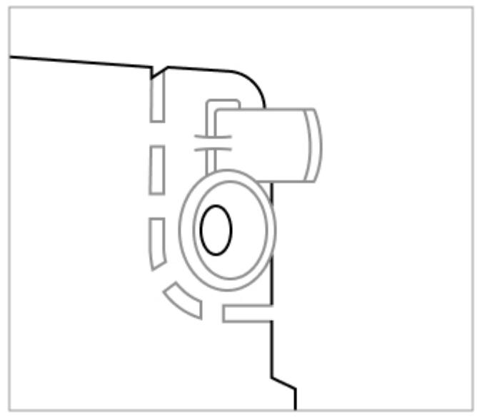

# KeyPad Plus User Manual

Updated December 9, 2021

**KeyPad Plus** is a wireless touch keypad for managing the Ajax security system with encrypted contactless cards and key fobs. Designed for indoor installation. Supports "silent alarm" when entering the . duress code

Manages security modes using passwords and . Indicates the current security mode with a LED light. cards or key fobs

The keypad only works with , and running OS Malevich 2.11 and higher. Connection to and the and integration modules is not supported! Hub Plus Hub 2 Hub 2 Plus Hub ocBridge Plus uartBridge

The keypad operates as part of the Ajax security system by connecting via the to the hub. The communication range without obstacles is up to 1700 meters. The pre-installed battery life is up to 4.5 years. Jeweller secure radio communication protocol

#### Buy KeyPad Plus keypad

### Functional elements

- **1. Armed** indicator
- **2. Disarmed** indicator
- **3. Night mode** indicator
- **4. Malfunction** indicator
- **5. Pass/Tag Reader**
- **6.** Numeric touch button box
- **7. Function** button
- **8. Reset** button
- **9. Arm** button
- **10. Disarm** button
- **11. Night mode** button
- **12.** SmartBracket mounting plate (to remove the plate, slide it down)

- **13.** Tamper button
- **14.** Power button
- **15.** Keypad QR Code

# Operating principle

KeyPad Plus arms and disarms the security of the entire facility or separate groups as well as allows activating the **Night mode**. You can control the security modes with KeyPad Plus using:

- **1. Passwords.** The keypad supports common and personal passwords, as well as arming without entering a password.
- **2. Cards or key fobs**. You can connect and to the system. To quickly and securely identify users, KeyPad Plus uses the DESFire® technology. DESFire® is based on the ISO 14443 international standard and combines 128-bit encryption and copy protection. Tag key fobs Pass cards

Before entering a password or using Tag/Pass, you should activate ("wake up") the KeyPad Plus by sliding your hand over the touch panel from top to bottom. When it is activated, the button backlight is enabled, and the keypad beeps.

The KeyPad Plus is equipped with LED indicators that show the current security mode and keypad malfunctions (if any). The security status is displayed only when the keypad is active (the device backlight is on).

You can use the KeyPad Plus without ambient lighting as the keypad has a backlight. The pressing of the buttons is accompanied by a sound signal. The backlight brightness and keypad volume are adjustable in the settings. If you do not touch the keypad for 4 seconds, KeyPad Plus reduces the backlight brightness, and 8 seconds later goes into power-saving mode and turns off the display.

If the batteries are discharged, the backlight turns on at the minimum level regardless of the settings.

# Function button

KeyPad Plus has a Function button that operates in 3 modes:

- **Off** the button is disabled and nothing happens after it is pressed.
- **Alarm** after the Function button is pressed, the system sends an alarm to the security company monitoring station and all users.
- **Mute interconnected fire alarm** after the Function button is pressed, the system mutes the fire alarm of the FireProtect/FireProtect Plus detectors. Available only if an is enabled (Hub → Settings → Service → Fire detectors settings) Interconnected FireProtect Alarm

#### Learn more

### Duress code

KeyPad Plus supports **duress code**. It allows you to simulate alarm deactivation. The and installed at the facility will not give you away in this case, but the security company and other users of the security system will be warned about the incident. Ajax app sirens

#### Learn more

### Two-stage arming

KeyPad Plus can participate in two-stage arming, but cannot be used as a second-stage device. The two-stage arming process using Tag or Pass is similar to arming using personal or common password on the keypad.

#### Learn more

### Event transmission to the monitoring station

The Ajax security system can connect to the CMS and transmit events and alarms to the monitoring station of the security company in **Sur-Gard** (**ContactID**), SIA DC-09, and other proprietary protocol formats. A complete list of supported protocols is available . The device ID and the number of the loop (zone) can be found in . here its states

# Connection

KeyPad Plus is incompatible with Hub, third-party security central units, and ocBridge Plus and uartBridge integration modules.

### Before starting connection

- **1.** Install the Ajax app and . Add a hub and create at least one room. create an account
- **2.** Ensure that the hub is on and has Internet access (via Ethernet cable, Wi-Fi, and/or mobile network). This can be done by opening the Ajax app or by looking at the hub logo on the faceplate — it lights white or green if the hub is connected to the network.
- **3.** Make sure that the hub is not in armed mode and does not start updates by checking its status in the app.

Only a user or PRO with full administrator rights can add a device to the hub.

### To connect KeyPad Plus

- **1.** Open the Ajax app. If your account has access to multiple hubs, select the one to which you want to connect KeyPad Plus.
- **2.** Go to the **Devices** menu and click **Add Device**.
- **3.** Name the keypad, scan or enter the QR code (located on the package and under the SmartBracket mount), and select a room.
- **4.** Click **Add**; the countdown will begin.
- **5.** Turn on the keypad by holding the power button for 3 seconds. Once connected, KeyPad Plus will appear in the hub device list in the app. To connect, locate the keypad at the same protected facility as the system (within the coverage area of the hub radio network range). If the connection fails, try again in 10 seconds.

The keypad only works with one hub. When connected to a new hub, the device stops sending commands to the old hub. Once added to a new hub, KeyPad Plus is not removed from the device list of the old hub. This must be done manually through the Ajax app.

KeyPad Plus turns off automatically 6 seconds after being turned on if the keypad fails to connect to the hub. Therefore, you do not need to turn off the device to retry the connection.

Updating the statuses of devices in the list depends on the Jeweller settings; the default value is 36 seconds.

#### Icons

The icons represent some of KeyPad Plus states. You can see them in the **Devices** tab in the Ajax app.

| Icon | Value                                                                                                                     |
|------|---------------------------------------------------------------------------------------------------------------------------|
|      | Jeweller signal strength — Displays the signal strength between the hub or radio signal range extender and KeyPad Plus |
|      | Battery charge level of KeyPad Plus                                                                                       |
|      | radio signal range extender KeyPad Plus works via a                                                                    |
|      | KeyPad Plus body status notifications are temporarily disabled                                                            |
|      | Learn more                                                                                                                |
|      | KeyPad Plus is temporarily deactivated                                                                                    |
|      | Learn more                                                                                                                |

| Pass/Tag reading  is enabled in KeyPad Plus settings |
|------------------------------------------------------|
| Pass/Tag reading is disabled in KeyPad Plus settings |

### States

The states include information about the device and its operating parameters. The states of KeyPad Plus can be found in the Ajax app:

- **1.** Go to the **Devices** tab.
- **2.** Select KeyPad Plus from the list.

| Parameter                | Value                                                                                                                                                             |
|--------------------------|-------------------------------------------------------------------------------------------------------------------------------------------------------------------|
| Malfunction              | Pressing opens the KeyPad Plus malfunctions list. The field is displayed only if a malfunction is detected                                            |
| Temperature              | Keypad temperature. It is measured on the processor and changes gradually. Acceptable error between the value in the app and the room temperature: 2–4°C |
| Jeweller signal strength | Jeweller signal strength between the hub / radio signal range extender and the keypad. Recommended values — 2-3 bars                                        |
| Connection               | Connection status between the hub or range extender and the keypad: Online — the keypad is online Offl ine — no connection to the keypad              |
| Battery charge           | The battery charge level of the device. Two states are available: ОК Battery low                                                                         |

|                                                          | When the batteries are discharged, the Ajax apps and the security company will receive appropriate notifications.                                                            |
|----------------------------------------------------------|------------------------------------------------------------------------------------------------------------------------------------------------------------------------------------|
|                                                          | After sending a low battery notification, the keypad can work for up to 2 months                                                                                                |
|                                                          | How battery charge is displayed in                                                                                                                                                 |
|                                                          | Ajax apps                                                                                                                                                                          |
|                                                          | The status of the device tamper, which reacts to the detachment of or damage to the body:                                                                                       |
|                                                          | Opened                                                                                                                                                                             |
| Lid                                                      | Closed                                                                                                                                                                             |
|                                                          | What is a tamper                                                                                                                                                                   |
|                                                          | Displays the status of the ReX range extender use.                                                                                                                              |
| Works via *range extender name*                          | The field is not displayed if the keypad works directly with the hub                                                                                                            |
| Pass/Tag Reading                                         | Displays if card and keyfob reader is enabled                                                                                                                                      |
| Easy armed mode change/Assigned group easy management | Displays whether or not the security mode can be switched with Pass or Tag and without confirmation by the control buttons , ,                                         |
|                                                          | Shows the status of the device:                                                                                                                                                    |
|                                                          | No — the device operates normally and transmits all events                                                                                                                      |
| Temporary Deactivation                                   | Lid only — the hub administrator has disabled notifications about the body opening                                                                                           |
|                                                          | Entirely — the hub administrator has entirely excluded the keypad from the system. The device does not execute system commands and does not report alarms or other events |
|                                                          | Learn more                                                                                                                                                                         |
| Firmware                                                 | KeyPad Plus firmware version                                                                                                                                                       |
|                                                          |                                                                                                                                                                                    |

| ID         | Device identifier                |
|------------|----------------------------------|
| Device No. | Number of the device loop (zone) |

# Settings

KeyPad Plus is configured in the Ajax app:

- **1.** Go to the **Devices** tab.
- **2.** Select KeyPad Plus from the list.
- **3.** Go to **Settings** by clicking on the gear icon .

To apply the settings after the change, click the **Back** button

| Parameter        | Value                                                                                                                                                          |
|------------------|----------------------------------------------------------------------------------------------------------------------------------------------------------------|
|                  | Device name. Displayed in the list of hub devices, SMS text, and notifications in the event feed.                                                        |
| First field      | To change the device name, click on the pencil icon                                                                                                         |
|                  | The name can contain up to 12 Cyrillic characters or up to 24 Latin characters                                                                              |
| Room             | Selecting the virtual room to which KeyPad Plus is assigned. The name of the room is displayed in the text of SMS and notifications in the event feed |
|                  | Selecting the security group controlled by the device. You can select all groups or just one.                                                               |
| Group Management | Group mode The field is displayed when the is enabled                                                                                                    |
| Access Settings  | Selecting the method of arming/disarming:                                                                                                                      |
|                  | Keypad code only                                                                                                                                               |

|                               | User passcode only                                                                                                                                                                                                                                                                                                                                                                                                                                                                   |
|-------------------------------|--------------------------------------------------------------------------------------------------------------------------------------------------------------------------------------------------------------------------------------------------------------------------------------------------------------------------------------------------------------------------------------------------------------------------------------------------------------------------------------|
|                               | Keypad and user passcode                                                                                                                                                                                                                                                                                                                                                                                                                                                             |
| Keypad code                   | Selection of a common password for security control. Contains 4 to 6 digits                                                                                                                                                                                                                                                                                                                                                                                                       |
| Duress code                   | Selecting a common duress code for silent alarm. Contains 4 to 6 digits Learn more                                                                                                                                                                                                                                                                                                                                                                                             |
| Function button               | Selecting the function of the * button (Function button): Off — the Function button is disabled and does not execute any commands when pressed Alarm — after the Function button is pressed, the system sends an alarm to the CMS and to all users Mute Interconnected Fire Alarm — when pressed, mutes the fire alarm of FireProtect/FireProtect Plus detectors. Available only if an Interconnected FireProtect Alarm is enabled Learn more |
| Arming without Password       | The option allows you to arm the system without entering a password. To do this, just click on the Arm or Night mode button                                                                                                                                                                                                                                                                                                                                                    |
| Unauthorized Access Auto-Lock | If active, the keypad is locked for the pre-set time if an incorrect password is entered or unverified passes/tags are used more than 3 times in a row within 1 minute. It is not possible to disarm the system via keypad during this time. You can unlock the keypad through the Ajax app                                                                                                                                                                        |
| Auto-lock Time (min)          | Selecting the keypad lock period after wrong password attempts: 3 minutes 5 minutes                                                                                                                                                                                                                                                                                                                                                                                         |

|                                                          | 10 minutes                                                                                                                                                                                                                                                                                                                                                                                                                                                                     |
|----------------------------------------------------------|--------------------------------------------------------------------------------------------------------------------------------------------------------------------------------------------------------------------------------------------------------------------------------------------------------------------------------------------------------------------------------------------------------------------------------------------------------------------------------|
|                                                          | 20 minutes                                                                                                                                                                                                                                                                                                                                                                                                                                                                     |
|                                                          | 30 minutes                                                                                                                                                                                                                                                                                                                                                                                                                                                                     |
|                                                          | 60 minutes                                                                                                                                                                                                                                                                                                                                                                                                                                                                     |
|                                                          | 90 minutes                                                                                                                                                                                                                                                                                                                                                                                                                                                                     |
|                                                          | 180 minutes                                                                                                                                                                                                                                                                                                                                                                                                                                                                    |
| Brightness                                               | Selecting brightness of the keypad buttons backlight. The backlight works only when the keypad is active. This option does not affect the brightness level of pass/tag reader and security modes indicators                                                                                                                                                                                                                                                     |
| Volume                                                   | Selecting the keypad buttons volume level when pressed                                                                                                                                                                                                                                                                                                                                                                                                                      |
| Pass/Tag Reading                                         | When enabled, the security mode can be controlled with Pass and Tag access devices                                                                                                                                                                                                                                                                                                                                                                                          |
| Easy armed mode change/Assigned group easy management | When enabled, changing the security mode with Tag and Pass does not require confirmation by pressing the arm, disarm, or Night mode button. The security mode is switched automatically. The option is available if Pass/Tag Reading is enabled in the keypad settings. If the group mode is activated, the option is available when the keypad is assigned to a particular group — the Group Management field in the keypad settings Learn more |
| Alert with a siren if the panic button is pressed        | The field is displayed if the Alarm option is selected for the Function button. When the option is enabled, the sirens connected to the security system give an alert when the * button (Function button) is pressed                                                                                                                                                                                                                                               |
| Jeweller Signal Strength Test                            | Switches the keypad to the Jeweller signal strength test mode                                                                                                                                                                                                                                                                                                                                                                                                               |

|                        | Learn more                                                                                                                                                                                                                                                                                                                                                                                                                                                      |
|------------------------|-----------------------------------------------------------------------------------------------------------------------------------------------------------------------------------------------------------------------------------------------------------------------------------------------------------------------------------------------------------------------------------------------------------------------------------------------------------------|
| Attenuation Test       | Switches the keypad to the Attenuation test mode Learn more                                                                                                                                                                                                                                                                                                                                                                                               |
| Pass/Tag Reset         | Allows deleting all hubs associated with Tag or Pass from device memory Learn more                                                                                                                                                                                                                                                                                                                                                                        |
| Temporary Deactivation | Allows the user to disable the device without removing it from the system. Two options are available: Entirely — the device will not execute system commands or participate in automation scenarios, and the system will ignore device alarms and other notifications Lid only — the system will only ignore notifications about the triggering of the device tamper button Learn more about temporary deactivation of devices |
| User Manual            | Opens the KeyPad Plus User Manual in the Ajax app                                                                                                                                                                                                                                                                                                                                                                                                            |
| Unpair Device          | Disconnects KeyPad Plus from the hub and deletes its settings                                                                                                                                                                                                                                                                                                                                                                                                |

Entry and exit delays are set in the corresponding detector settings, not in the keypad settings.

Learn more about entry and exit delays

# Adding a personal password

Both common and personal user passwords can be set for the keypad. A personal password applies to all Ajax keypads installed at the facility. A

common password is set for each keypad individually and can be different or the same as the passwords of other keypads.

#### **To set a personal password in the Ajax app:**

- **1.** Go to the user profile settings (Hub → Settings → Users → Your profile settings).
- **2.** Select **Passcode Settings** (User ID is also visible in this menu).
- **3.** Set **User Code** and **Duress Code**.

Each user sets a personal password individually. The administrator cannot set a password for all users.

# Adding passes and tags

KeyPad Plus can work with , , and third-party cards and key fobs that use DESFire® technology. Tag key fobs Pass cards

> Before adding third-party devices that support DESFire®, make sure they have enough free memory to handle the new keypad. Preferably, the third-party device should be preformatted.

The maximum number of connected passes/tags depends on the hub model. At the same time, the bound passes and tags do not affect the total limit of devices on the hub.

| Hub model  | Number of Tag or Pass devices |
|------------|-------------------------------|
| Hub Plus   | 99                            |
| Hub 2      | 50                            |
| Hub 2 Plus | 200                           |

The procedure for connecting Tag, Pass, and third-party devices is the same. See the connecting instructions . here

### Security management by passwords

You can manage the Night mode, security of the entire facility or separate groups using common or personal passwords. The keypad allows you to use 4 to 6 digit passwords. Incorrectly entered numbers can be cleared with the button.

If a personal password is used, the name of the user who armed or disarmed the system is displayed in the hub event feed and in the notifications list. If a common password is used, the name of the user who changed the security mode is not displayed.

KeyPad Plus is locked for the time specified in the settings if an incorrect password is entered three times in a row within 1 minute. The corresponding notifications are sent to users and to the monitoring station of the security company. A user or PRO with administrator rights can unlock the keypad in the Ajax app.

# Security management of the facility using a common password

- **1.** Activate the keypad by swiping your hand over it.
- **2.** Enter the **common password**.
- **3.** Press the arming /disarming /Night mode key.

For example: 1234 →

### Group security management with a common password

- **1.** Activate the keypad by swiping your hand over it.
- **2.** Enter the **common password**.
- **3.** Press the * (Function button).
- **4.** Enter the **Group ID**.
- **5.** Press the arming /disarming /Night mode key.

For example: 1234 → ***** → 2 →

#### What is Group ID

If a security group is assigned to KeyPad Plus (in the field in the keypad settings), you do not need to enter the group ID. To manage the security mode of this group, entering a common or personal password is sufficient. Group Management

If a group is assigned to KeyPad Plus, you will not be able to manage **Night mode** using a common password. In this case, **Night mode** can only be managed using a personal password if the user has the appropriate rights.

Rights in the Ajax security system

# Security management of the facility using a personal password

- **1.** Activate the keypad by swiping your hand over it.
- **2.** Enter the **User ID**.
- **3.** Press the * (Function button).
- **4.** Enter your **personal password**.
- **5.** Press the arming /disarming /Night mode key.

For example: 2 → * → 1234 →

#### What is User ID

### Group security management with a personal password

- **1.** Activate the keypad by swiping your hand over it.
- **2.** Enter the **User ID**.
- **3.** Press the * (Function button).
- **4.** Enter your **personal password**.
- **5.** Press the * (Function button).
- **6.** Enter the **Group ID**.
- **7.** Press the arming /disarming /Night mode key.

For example: 2 → * → 1234 → * → 5 →

If a group is assigned to KeyPad Plus (in the **Group Management** field in the keypad settings), you do not need to enter the group ID. To manage the security mode of this group, entering a personal password is sufficient.

What is Group ID

What is User ID

# Using a duress code

A duress code allows you to simulate alarm deactivation. The Ajax app and sirens installed at the facility will not give the user away in this case, but the security company and other users will be warned about the incident. You can use both a personal and a common duress code.

> Scenarios and sirens react to disarming under duress in the same way as to normal disarming.

#### Learn more

#### **To use a common duress code**

- **1.** Activate the keypad by swiping your hand over it.
- **2.** Enter the **common duress code**.
- **3.** Press the disarming key .

For example: 4321 →

#### **To use a personal duress code**

- **1.** Activate the keypad by swiping your hand over it.
- **2.** Enter the **User ID**.
- **3.** Press the * (Function button).
- **4.** Enter the **personal duress code**.
- **5.** Press the disarming key .

For example: 2 → * → 4422 →

### Security management using Tag or Pass

- **1.** Activate the keypad by swiping your hand over it. KeyPad Plus will beep (if enabled in the settings) and turn on the backlight.
- **2.** Bring Tag or Pass to the keypad pass/tag reader. It is marked with wave icons.
- **3.** Press the **Arm**, **Disarm**, or **Night mode** button on the keypad.

Note that if is enabled in the KeyPad Plus settings, you do not need to press the **Arm**, **Disarm**, or **Night mode** button. The security mode will change to the opposite after tapping Tag or Pass. Easy armed mode change

# Mute Fire Alarm function

KeyPad Plus can mute an interconnected fire alarm by pressing the Function button (if the required setting is enabled). The reaction of the system to pressing a button depends on the settings and the state of the system:

- **Interconnected FireProtect Alarms have already propagated** by the first press of the Button, all sirens of the fire detectors are muted, except for those that registered the alarm. Pressing the button again mutes the remaining detectors.
- **Interconnected alarms delay time lasts** by pressing the Function button, the siren of the triggered FireProtect/FireProtect Plus detector is muted.
Keep in mind that the option is available only if is enabled. Interconnected FireProtect Alarm

#### Learn more

With the update, users can mute fire alarms in their groups without affecting detectors in the groups to which they do not have access. OS Malevich 2.12

Learn more

# Indication

KeyPad Plus can report the current security mode, keystrokes, malfunctions, and its status by LED indication and sound. The current security mode is displayed by the backlight after the keypad is activated. The information about the current security mode is relevant even if the arming mode is changed by another device: a key fob, another keypad, or an app.

You can activate the keypad by swiping your hand over the touch panel from top to bottom. When activated, the backlight on the keypad will turn on and a beep will sound (if enabled).

| Event | Indication |
|-------|------------|
|-------|------------|

| There is no connection to the hub or radio signal range extender                                                               | LED X blinks                                                                                                                                                      |
|-----------------------------------------------------------------------------------------------------------------------------------|-------------------------------------------------------------------------------------------------------------------------------------------------------------------|
| KeyPad Plus body is open (SmartBracket mount is removed)                                                                       | LED X blinks briefly once                                                                                                                                         |
| Touch button pressed                                                                                                              | Short beep, the current system security status LED blinks once. The volume depends on the keypad settings                                                   |
| The system is armed                                                                                                               | Short beep, Armed or Night mode LED lights up                                                                                                                     |
| The system is disarmed                                                                                                            | Two short beeps, the Disarmed LED lights up                                                                                                                       |
| An incorrect password was entered or there was an attempt to change security mode by an unconnected or deactivated pass/tag | Long beep, digital unit LED backlight blinks 3 times                                                                                                           |
| The security mode cannot be activated (for example, a window is open and the System integrity check is enabled)             | Long beep, the current security status LED blinks 3 times                                                                                                      |
| The hub does not respond to the command — there is no connection                                                               | Long beep, X (Malfunction) LED lights up                                                                                                                          |
| The keypad is locked due to a wrong password attempt or attempt to use an unauthorised pass/tag                             | Long beep, during which the security status LEDs and keypad backlight blink 3 times                                                                            |
|                                                                                                                                   | After changing the security mode, the X LED lights up. The touch buttons are locked for this time.                                                          |
| The batteries are low                                                                                                             | When you try to turn on the keypad with discharged batteries, it emits a long beep, the X LED smoothly lights up and goes off, then the keypad turns off |
|                                                                                                                                   | How to replace batteries in KeyPad Plus                                                                                                                        |

# Functionality testing

The Ajax security system provides several types of tests that help you make sure that installation points of devices are selected correctly.

KeyPad Plus functionality tests do not start straight away but after no more than one hub-detector ping period (36 seconds when using the standard hub

settings). You can change the ping period of devices in the **Jeweller** menu of the hub settings.

Tests are available in the device settings menu (Ajax App → Devices → KeyPad Plus → Settings )

- Jeweller Signal Strength Test
- Attenuation Test

# Choosing a location

When holding KeyPad Plus in your hands or using it on a table, we cannot guarantee that the touch buttons will work properly.

It is a good practice to install the keypad 1.3 to 1.5 meters above the floor for convenience. Install the keypad on a flat, vertical surface. This allows KeyPad Plus to be firmly attached to the surface and to avoid false tamper triggering.

Besides, the placement of the keypad is determined by the distance from the hub or the radio signal range extender, and the presence of obstacles between them that prevent the passage of the radio signal: walls, floors, and other objects.

Be sure to check the Jeweller signal strength at the installation site. If the signal strength is low (a single bar), we cannot guarantee a stable operation of the security system! At the very least, relocate the device as repositioning even by 20 cm can significantly improve the signal reception.

If after moving the device still has a low or unstable signal strength, use a . radio signal range extender

#### **Do not install the keypad:**

- In places where parts of clothing (for example, next to the hanger), power cables, or Ethernet wire may obstruct the keypad. This can lead to false triggering of the keypad.
- Inside premises with temperature and humidity outside the permissible limits. This could damage the device.
- In places where KeyPad Plus has an unstable or poor signal strength with the hub or radio signal range extender.
- Within 1 meter of a hub or radio signal range extender.
- Close to electrical wiring. This may cause communication interferences.
- Outdoors. This could damage the device.

### Installing the keypad

Prior to installing KeyPad Plus, be sure to select the optimal location following the requirements of this manual!

- **1.** Attach the keypad to the surface with double-sided adhesive tape and carry out **signal strength** and **attenuation tests**. If the signal strength is unstable or if one bar is displayed, move the keypad or use the . radio signal range extender

Double-sided adhesive tape may only be used for temporary attachment of the keypad. The device attached with adhesive tape can at any time be detached from the surface and fall, which may lead to failure. Please note that if the device is attached with adhesive tape, the tamper will not trigger when trying to detach it.

- **2.** Check the convenience for password entry using Tag or Pass to manage security modes. If it is inconvenient to manage the security at the selected location, relocate the keypad.
- **3.** Remove the keypad from the SmartBracket mounting plate.
- **4.** Attach the SmartBracket mounting plate to the surface using the bundled screws. When attaching, use at least two fixing points. Be sure to fix the perforated corner on the SmartBracket plate so that the tamper responds to a detachment attempt.

- **5.** Slide KeyPad Plus onto the mounting plate and tighten the mounting screw at the bottom of the body. The screw is needed for more reliable fastening and protection of the keypad from quick dismantling.
- **6.** As soon as the keypad is fixed on the SmartBracket, it shall blink once with LED **X** — this is a signal that the tamper has been triggered. If the LED does not blink after installation on SmartBracket, check the tamper status in the Ajax app, and then make sure the plate is firmly attached.

#### Maintenance

Check the functioning of your keypad on a regular basis. This can be done once or twice a week. Clean the body from dust, cobwebs, and other contaminants as they emerge. Use a soft dry cloth that is suitable for equipment care.

Do not use substances that contain alcohol, acetone, gasoline or other active solvents to clean the detector. Wipe the touch keypad gently: scratches can reduce the sensitivity of the keypad.

The batteries installed in the keypad provide up to 4.5 years of autonomous operation at default settings. If the battery is low, the system sends appropriate notifications, and the **X** (**Malfunction**) indicator smoothly lights up and goes out after each successful password entry.

KeyPad Plus can work up to 2 months after the low battery signal. However, we recommend you replace the batteries immediately upon notification. It is advisable to use lithium batteries. They have a large capacity and are less affected by temperatures.

How long Ajax devices operate on batteries, and what affects this

How to replace batteries in KeyPad Plus

Complete set

**1.** KeyPad Plus

- **2.** SmartBracket mounting plate
- **3.** 4 pre-installed lithium batteries АА (FR6)
- **4.** Installation kit
- **5.** Quick Start Guide

### Technical Specifications

| Compatibility                                                          | Hub Plus Hub 2 Hub 2 Plus ReX ReX 2                                                                                                               |
|------------------------------------------------------------------------|---------------------------------------------------------------------------------------------------------------------------------------------------------------|
| Color                                                                  | Black White                                                                                                                                                |
| Installation                                                           | Indoor only                                                                                                                                                   |
| Keypad type                                                            | Touch-sensitive                                                                                                                                               |
| Sensor type                                                            | Capacitive                                                                                                                                                    |
| Contactless access                                                     | DESFire EV1, EV2 ISO14443-А (13.56 MHz)                                                                                                                    |
| Tamper protection                                                      | Yes                                                                                                                                                           |
| Password guessing protection                                           | Yes. The keypad is locked for the time set in the settings if an incorrect password is entered three times                                              |
| Protection against attempts to use not bound to the system pass/tag | Yes. The keypad is locked for the time defined in the settings                                                                                             |
| Radio communication protocol with hubs and range extenders          | Jeweller Learn more                                                                                                                                        |
| Radio frequency band                                                   | 866.0 – 866.5 MHz 868.0 – 868.6 MHz 868.7 – 869.2 MHz 905.0 – 926.5 MHz 915.85 – 926.5 MHz 921.0 – 922.0 MHz Depends on the region of sale. |
| Radio signal modulation                                                | GFSK                                                                                                                                                          |
|                                                                        |                                                                                                                                                               |

| Maximum radio signal strength | 6.06 mW (limit up to 20 mW)                                                                           |
|-------------------------------|-------------------------------------------------------------------------------------------------------|
| Radio signal range            | Up to 1,700 m (without obstacles)                                                                     |
|                               | Learn more                                                                                            |
| Power supply                  | 4 lithium batteries AA (FR6). Voltage 1.5V                                                            |
| Battery life                  | Up to 3.5 years (if pass/tag reading is enabled) Up to 4.5 years (if pass/tag reading is disabled) |
| Operating temperature range   | From -10°C to +40°C                                                                                   |
| Operating humidity            | Up to 75%                                                                                             |
| Dimensions                    | 165 × 113 × 20 mm                                                                                     |
| Weight                        | 267 g                                                                                                 |
| Service life                  | 10 years                                                                                              |
| Warranty                      | 24 months                                                                                             |

#### Compliance with standards

### Warranty

The warranty for the AJAX SYSTEMS MANUFACTURING Limited Liability Company products is valid for 2 years after purchase and does not extend to the bundled batteries.

If the device does not function properly, we recommend that you first contact the support service as half of the technical issues can be resolved remotely!

#### Warranty obligations

User Agreement

Technical support: support@ajax.systems