# DoorProtect Plus User Manual

Updated December 7, 2021

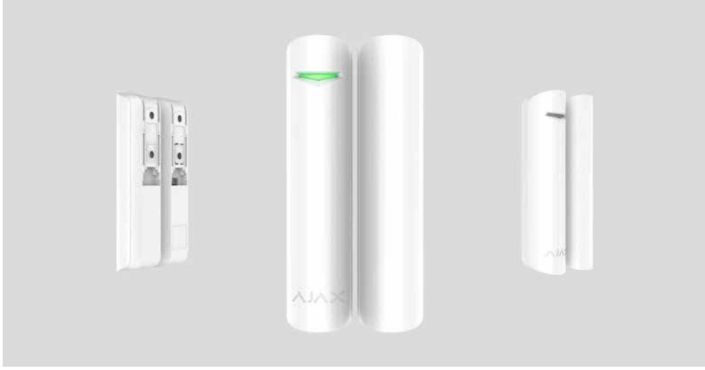

**DoorProtect Plus** is a wireless opening, shock, and tilt detector, that operates within the Ajax security system, connecting via the protected radio protocol. Is used inside premises. The communication range is up to 1,200 m line of sight. DoorProtect Plus can operate up to 5 years from a pre-installed battery and capable to detect more than 2 millions openings. Jeweller

The user can configure the detector via the for iOS, macOS, Windows, or Android. The app notifies the user of all events through push notifications, SMS, and calls (if activated). Ajax app

DoorProtect Plus does not support connecting via the or integration modules. Ajax uartBridge Ajax ocBridge Plus

The Ajax security system can be connected to a central monitoring station of a security company.

# Functional Elements

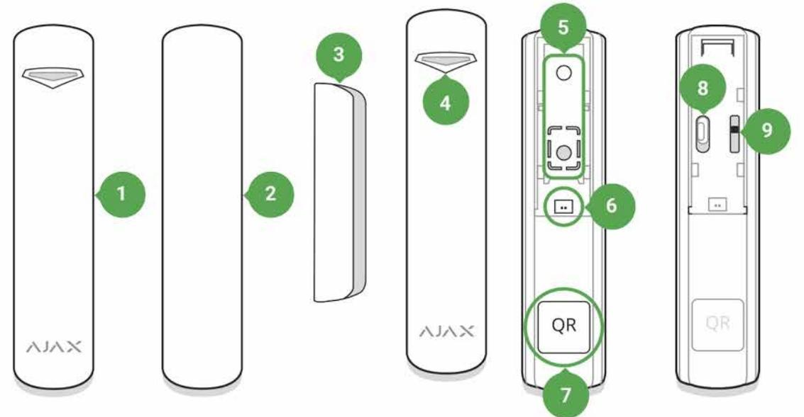

- **1.** DoorProtect Plus
- **2.** Big magnet (should be placed to the right of the detector)
- **3.** Small magnet (should be placed to the right of the detector)
- **4.** LED indicator
- **5.** SmartBracket attachment panel (perforated part triggers the tamper button in case of any attempt to tear off the detector from the surface)
- **6.** External detector connection socket
- **7.** QR code
- **8.** Device switch
- **9.** Tamper button

# Operating Principle

DoorProtect Plus consists of two parts: the detector and the constant magnet. The detector is equipped with the sealed contact reed relay, built-in accelerometer, and socket for a third-party wired detector.

Attach the detector to the door frame, while the magnet can be attached to the moving wing or sliding part of the door. If the sealed contact reed relay is within the coverage area of the magnetic field, it closes the circuit, which means that the detector is closed. The opening of the door pushes out the magnet from the sealed contact reed relay and opens the circuit. In such a way, the detector recognizes the opening.

The DoorProtect Plus set includes two constant magnets. The small one works at a distance of 1 cm, and the big one — up to 2 cm.

The detector can be positioned horizontally. If there is no need to detect opening, use only the detector part (without magnets) and disable the primary detector in the settings.

The accelerometer detects shocks and vertical deviation relative to the initial position of more than 5°. DoorProtect Plus can be installed on windows, including dormer windows, and the system can be armed when they are slightly open (disable the primary detector in the settings рreviously).

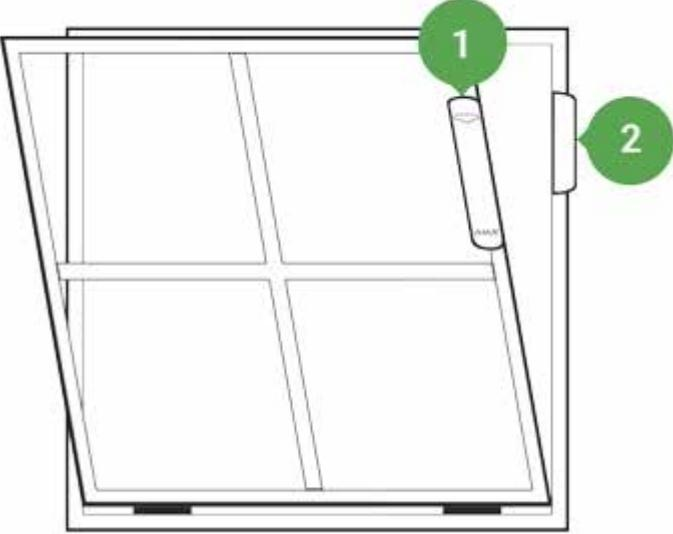

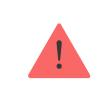

Attach the magnet to the **RIGHT** of the detector.

If triggered, DoorProtect Plus immediately transmits the alarm signal to the hub, activating the sirens and notifying the user and security company.

# Connecting

## Before starting connection

- **1.** Following the hub user guide, install the . Create the account, add the hub, and create at least one room. Ajax app
- **2.** Switch on the hub and check the internet connection (via Ethernet cable and/or GSM network).
- **3.** Make sure that the hub is disarmed and does not update by checking its status in the Ajax app.

Only users with administrator rights can add the device to the hub.

# How to connect the detector to the hub

- **1.** Select **Add Device** in the Ajax app.
- **2.** Name the device, scan or type the **QR code** (located on the detector body and packaging), and select the location room.

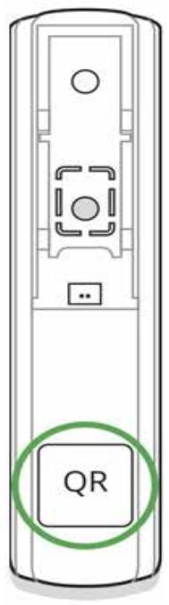

- **3.** Tap **Add** the countdown will start.
- **4.** Switch on the device.

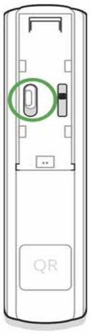

For detection and pairing to occur, the detector should be located within the coverage area of the wireless network of the hub (at a single protected object). The connection request is transmitted for a short time: at the moment of switching on the device.

If the device failed to pair (LED blinks once per second), switch it off for 5 seconds and retry. The detector connected to the hub appears in the list of devices in the app. The update of the detector statuses in the list depends on the device ping interval set in the hub settings (the default value is 36 seconds).

# States

The states screen contains information about the device and its current parameters. Find the DoorProtect Plus states in the Ajax app:

- **1.** Go to the **Devices** tab.
- **2.** Select DoorProtect Plus from the list.

| Parameter   | Value                                                                                                                                                         |
|-------------|---------------------------------------------------------------------------------------------------------------------------------------------------------------|
| Temperature | Device temperature. It is measured on the processor and changes gradually. Displayed in 1°C increment. Acceptable error between the value in the app |
|             | and temperature at the installation site: 2–4°C                                                                                                               |

| Jeweller Signal Strength            | Signal strength between the hub/range extender and the opening detector.                                                                       |
|-------------------------------------|---------------------------------------------------------------------------------------------------------------------------------------------------|
|                                     | We recommend installing the detector in places where the signal strength is 2–3 bars                                                           |
| Connection                          | Connection status between the hub/range extender and the detector:                                                                             |
|                                     | Online — the detector is connected with the hub/range extender                                                                                 |
|                                     | Offl ine — the detector has lost connection with the hub/range extender                                                                     |
| ReX range extender name             | radio Displayed when the detector works via signal range extender                                                                           |
|                                     | Battery level of the device. Displayed as a                                                                                                       |
|                                     | percentage                                                                                                                                        |
| Battery Charge                      | How battery charge is displayed in                                                                                                                |
|                                     | Ajax apps                                                                                                                                         |
| Lid                                 | The tamper mode of the detector, which reacts to the detachment of or damage of the body                                                       |
| Delay When Entering, sec            | Entry delay (alarm activation delay) is the time you have to disarm the security system after entering the room                             |
|                                     | What is delay when entering                                                                                                                       |
| Delay When Leaving, sec             | Delay time when exiting. Delay when exiting (alarm activation delay) is the time you have to exit the room after arming the security system |
|                                     | What is delay when leaving                                                                                                                        |
| Night Mode Delay When Entering, sec | The time of Delay When Entering in the Night                                                                                                      |
|                                     | mode. Delay when entering (alarm activation delay) is the time you have to disarm the security system after entering the premises.          |
|                                     | What is delay when entering                                                                                                                       |
|                                     |                                                                                                                                                   |

| Night Mode Delay When Leaving, sec | The time of Delay When Leaving in the Night mode. Delay when leaving (alarm activation delay) is the time you have to exit the premises after the security system is armed. What is delay when leaving                                                                                                                                                                                                                                                                                                                                                                                                                                                                               |
|------------------------------------|--------------------------------------------------------------------------------------------------------------------------------------------------------------------------------------------------------------------------------------------------------------------------------------------------------------------------------------------------------------------------------------------------------------------------------------------------------------------------------------------------------------------------------------------------------------------------------------------------------------------------------------------------------------------------------------------------|
| Primary Detector                   | Indicates whether the opening sensor is active                                                                                                                                                                                                                                                                                                                                                                                                                                                                                                                                                                                                                                                   |
| External Contact                   | Status of the external detector connected to DoorProtect Plus                                                                                                                                                                                                                                                                                                                                                                                                                                                                                                                                                                                                                                 |
| Shock Sensor                       | Indicates whether the shock sensor is active                                                                                                                                                                                                                                                                                                                                                                                                                                                                                                                                                                                                                                                     |
| Tilt Sensor                        | Indicates whether the tilt sensor is active                                                                                                                                                                                                                                                                                                                                                                                                                                                                                                                                                                                                                                                      |
| Always Active                      | If the option is active, the detector is always in armed mode and notifies about alarms Learn more                                                                                                                                                                                                                                                                                                                                                                                                                                                                                                                                                                                         |
| Chime                              | When enabled, a siren notifies about opening detectors triggering in the Disarmed system mode What is chime and how it works                                                                                                                                                                                                                                                                                                                                                                                                                                                                                                                                                            |
| Temporary Deactivation             | Shows the status of the device temporary deactivation function: No — the device operates normally and transmits all events. Lid only — the hub administrator has disabled notifications about triggering on the device body. Entirely — the device is completely excluded from the system operation by the hub administrator. The device does not follow system commands and does not report alarms or other events. By number of alarms — the device is automatically disabled by the system when the number of alarms is exceeded (specified in the settings for Devices Auto Deactivation). The feature is configured in the Ajax PRO app. |

|            | By timer — the device is automatically disabled by the system when the recovery timer expires (specified in the settings for Devices Auto Deactivation). The feature is configured in the Ajax PRO app. |
|------------|---------------------------------------------------------------------------------------------------------------------------------------------------------------------------------------------------------------------|
| Firmware   | The detector firmware version                                                                                                                                                                                       |
| Device ID  | Device identifier                                                                                                                                                                                                   |
| Device No. | Number of the device loop (zone)                                                                                                                                                                                    |

# Settings

To change the detector settings in the Ajax app:

- **1.** Select the hub if you have several of them or if you are using the PRO app.
- **2.** Go to the **Devices** tab.
- **3.** Select **DoorProtect Plus** from the list.
- **4.** Go to **Settings** by clicking on the .
- **5.** Set the required parameters.
- **6.** Click **Back** to save the new settings.

| Setting                  | Value                                                                                                                                                                                                       |
|--------------------------|-------------------------------------------------------------------------------------------------------------------------------------------------------------------------------------------------------------|
| First field              | Detector name that can be changed. The name is displayed in the text of SMS and notifications in the event feed. The name can contain up to 12 Cyrillic characters or up to 24 Latin characters |
| Room                     | Selecting the virtual room to which DoorProtect is assigned. The name of the room is displayed in the text of SMS and notifications in the event feed                                              |
| Delay When Entering, sec | Selecting delay time when entering. Delay when entering (alarm activation delay) is the time you have to disarm the security system after entering the room                                        |

|                                     | What is delay when entering                                                                                                                                                                      |
|-------------------------------------|--------------------------------------------------------------------------------------------------------------------------------------------------------------------------------------------------|
| Delay When Leaving, sec             | Selecting the delay time when exiting. Delay when exiting (alarm activation delay) is the time you have to exit the room after arming the security system What is delay when leaving |
|                                     | If the option is active, the detector will switch to                                                                                                                                             |
|                                     | the Armed mode when using a Night mode.                                                                                                                                                          |
| Arm in Night Mode                   | Night mode Note that in , all active sensors of the detector are armed. The activation of certain sensors cannot be configured in the Night mode (for example, the tilt sensor)   |
|                                     | The time of Delay When Entering in the Night                                                                                                                                                     |
| Night Mode Delay When Entering, sec | mode. Delay when entering (alarm activation delay) is the time you have to disarm the security system after entering the premises.                                                         |
|                                     | What is delay when entering                                                                                                                                                                      |
| Night Mode Delay When Leaving, sec  | The time of Delay When Leaving in the Night mode. Delay when leaving (alarm activation delay) is the time you have to exit the premises after the security system is armed.             |
|                                     | What is delay when leaving                                                                                                                                                                       |
| Alarm LED indication                | Allows you to disable the flashing of the LED indicator during an alarm. Available for devices with firmware version 5.55.0.0 or higher                                                    |
|                                     | How to find the firmware version or                                                                                                                                                              |
|                                     | the ID of the detector or device?                                                                                                                                                                |
| Primary Detector                    | If setting is active, the DoorProtect Plus primary detector reacts to opening/closing                                                                                                         |
| External Contact                    | If setting is active, DoorProtect Plus registers external detector alarms                                                                                                                     |
| Shock Sensor                        | If active, shock-sensor will detect alarm after more than one impact                                                                                                                          |

| Sensitivity                                                                      | Sensitivity level of the shock sensor. Three options are available: Low Normal High                                                                                                            |
|----------------------------------------------------------------------------------|------------------------------------------------------------------------------------------------------------------------------------------------------------------------------------------------------------|
| Ignore Simple Impact                                                             | If active, the detector ignores single hit                                                                                                                                                                 |
| Tilt Sensor                                                                      | If active, sensor will detect tilt                                                                                                                                                                         |
| Tilt                                                                             | Selecting the normal angle of the sensor. Above this limit, the sensor detects an alarm                                                                                                                 |
| Tilt Alarm Delay                                                                 | The number of seconds from the moment the sensor is tilted to the alarm. The value can be set from 1 second to 1 minute                                                                              |
| Always Active                                                                    | If the option is active, the detector is always in armed mode and notifies about alarms Learn more                                                                                                   |
| External Contact Enabled                                                         | external wired Selecting the type of detector . For the detector connected to DoorProtect Plus terminals. The option is available for devices with firmware version 5.53.1.0 and higher. |
| Time before alarm, sec (available for roller shutter motion detector only) | The time in seconds during which a given number of impulses should be counted. This time is counted after the first impulse of the detector.                                                      |
| Impulses before alarm (available for roller shutter motion detector only)  | Number of detector impulses required to raise an alarm                                                                                                                                                  |
| Alert with a siren if opening detected                                           | sirens If active, added to the system are activated when opening detected                                                                                                                         |
| Alert with a siren if an external contact is opened                           | sirens If active, added to the system are activated during an external detector alarm                                                                                                             |
| Alert with a siren if shock detected                                             | sirens If active, added to the system are activated during a shock alarm                                                                                                                          |
|                                                                                  |                                                                                                                                                                                                            |

| Alert with a siren if tilt detected | sirens If active, added to the system are activated during a tilt alarm                                                                                                                                                                                                                                                                                                                                                                                                        |
|-------------------------------------|-----------------------------------------------------------------------------------------------------------------------------------------------------------------------------------------------------------------------------------------------------------------------------------------------------------------------------------------------------------------------------------------------------------------------------------------------------------------------------------------|
| Chime settings                      | Opens the settings of Chime. How to set Chime What is Chime                                                                                                                                                                                                                                                                                                                                                                                                                       |
| Jeweller Signal Strength Test       | Switches the detector to the Jeweller signal strength test mode. The test allows you to check the signal strength between the hub and DoorProtect Plus and determine the optimal installation site What is Jeweller Signal Strength Test                                                                                                                                                                                                                              |
| Detection Zone Test                 | Switches the detector to the detection area test What is Detection Zone Test                                                                                                                                                                                                                                                                                                                                                                                                         |
| Signal Attenuation Test             | Switches the detector to the signal fade test mode (available in detectors with firmware version 3.50 and later) What is Attenuation Test                                                                                                                                                                                                                                                                                                                                      |
| User Guide                          | Opens DoorProtect Plus User Guide in the Ajax app                                                                                                                                                                                                                                                                                                                                                                                                                                    |
| Temporary Deactivation              | Allows the user to disconnect the device without removing it from the system. Three options are available: No — the device operates normally and transmits all alarms and events Entirely — the device will not execute system commands or participate in automation scenarios, and the system will ignore device alarms and other notifications Lid only — the system will ignore only notifications about the triggering of the device tamper button |

|               | Learn more about temporary                                                                                                               |
|---------------|------------------------------------------------------------------------------------------------------------------------------------------|
|               | deactivation of devices                                                                                                                  |
|               | The system can also automatically deactivate devices when the set number of alarms is exceeded or when the recovery timer expires. |
|               | Learn more about auto deactivation of devices                                                                                         |
| Unpair Device | Disconnects the detector from the hub and deletes its settings                                                                        |

# How to set Chime

Chime is a sound signal that indicates the triggering of the opening detectors when the system is disarmed. The feature is used, for example, in stores, to notify employees that someone has entered the building.

Notifications are configured in two stages: setting up opening detectors and setting up sirens.

#### Learn more about Chime

#### **Detectors settings**

- **1.** Go to the **Devices** menu.
- **2.** Select the DoorProtect Plus detector.
- **3.** Go to its settings by clicking the gear icon in the upper right corner.
- **4.** Go to the **Chime Settings** menu.
- **5.** Select the events to be notified by the siren:
	- If a door or a window is open.
	- If an external contact is open (available if the External Contact option is enabled).
- **6.** Select the chime sound (siren tone): 1 to 4 short beeps. Once selected, the Ajax app will play the sound.
- **7.** Click **Back** to save the settings.
- **8.** Set up the required siren.

#### How to set up a siren for Chime

# Indication

| Event                             | Indication                                                            | Note                                                                                        |
|-----------------------------------|-----------------------------------------------------------------------|---------------------------------------------------------------------------------------------|
| Switching on the detector         | Lights up green for about one second                               |                                                                                             |
| Detector connection to the hub | Lights up continuously for a few seconds                           |                                                                                             |
| Alarm / tamper activation         | Lights up green for about one second                               | Alarm is sent once in 5 seconds                                                          |
| Battery needs replacing           | During the alarm, it slowly lights up green and slowly goes out | Replacement of the detector battery is described in the Battery Replacement manual |

# Performance testing

The Ajax security system allows conducting tests for checking the functionality of connected devices.

The tests do not start immediately but within 36 seconds by default. The starting time depends on the ping interval (the paragraph on "**Jeweller**" settings in hub settings).

Jeweller Signal Strength Test

Detection Area Test

Attenuation Test

## Installing the Detector

The location of DoorProtect Plus depends on its remoteness from the hub, and obstacles hindering the radio signal transmission: walls, floors, large objects inside the room.

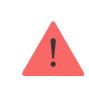

The device developed only for indoor use.

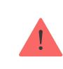

Check the Jeweller signal level at the installation location

If the signal level is low (one bar), we cannot guarantee the stable operation of the detector. Take all possible measures to improve the quality of the signal. At least, move the detector: even a 20 cm shift can significantly improve the quality of signal reception.

If after moving the device still has a low or unstable signal strength, use a . radio signal range extender

#### **Do not install the detector:**

- **1.** outside the premises (outdoors);
- **2.** nearby any metal objects or mirrors causing attenuation or screening of the signal;
- **3.** at any places with fast air circulation (air fans, open windows or doors);
- **4.** inside premises with the temperature and humidity beyond the range of permissible limits;
- **5.** closer than 1 m to the hub.

**Attach the magnet to the right of the detector**. The side to which the magnet should be attached is marked with an arrow on the detector's body. The detector is located either inside or outside the door case (window frame).

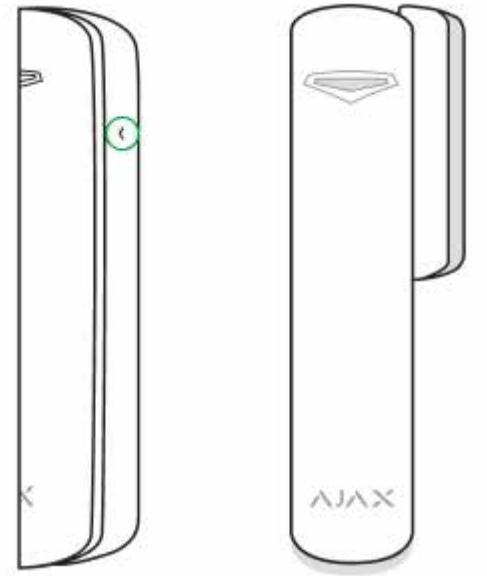

When installing the detector in the perpendicular planes (inside the case/frame), use the small magnet from the set. The distance between the magnet and detector should not exceed 1 cm.

When positioning the parts of DoorProtect Plus in the same plane, use the big magnet. Its actuation threshold is 2 cm.

# Detector Testing

Having defined the location, fix the detector and magnet with the double-sided adhesive tape and check its operation of using the Detection Zone test.

In the test mode, the DoorProtect Plus LED lights continuously, switching off for a second, if the detector is triggered. Check the correct operation of the device by opening/closing the door several times.

# Connecting a Third-Party Wired Detector

A wired detector with an NC (normally closed) contact type can be connected to DoorProtect Plus using the in-built terminal clamp.

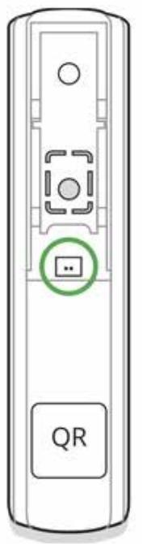

We recommend installing the wired detector at a distance no longer than 1 meter to DoorProtect Plus. Longer wire length increases the risk of its damage and reduces the quality of communication between the detectors.

To put out the wire from the detector body, break out the plug:

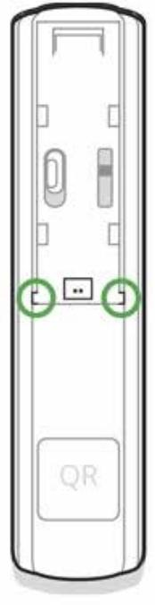

If the connected wired detector is triggered, you receive the notification.

To make sure the alarm is raised when the roller shutter is opened, connect the wired roller shutter motion detector with the NC (normally closed) contact to DoorProtect Plus. The function is available for the devices with firmware version 5.53.1.0 and higher.

#### How to find the firmware version or the ID of the sensor or device?

#### How to connect the roller shutter motion detector to DoorProtect Plus

### Installation

Before installing the detector, make sure that you have selected the optimal location that follows the guidelines of this manual!

- **1.** Fix the SmartBracket attachment panel using bundled screws. If you use any other attachment tools, make sure that they do not damage or deform the attachment panel.
Use double-side adhesive tape only for temporary attachment of the detector. The tape runs dry with time, which can cause falling, false triggering, and detector malfunction.

- **2.** Put the detector on the attachment panel. When the detector is fixed in SmartBracket, it blinks with LED, signaling that the tamper is closed. If LED doesn't blink after fixing in SmartBracket, check the status of the tamper in the Ajax app and then the fixing tightness of the panel.
If someone detaches the detector from the surface or takes it off the attachment panel, the security system notifies you.

- **3.** Put the magnet on the attachment panel.
### Maintenance

Check the operational capability of the detector regularly. Clean the detector body from dust, spider web, and other contaminants as they appear. Use soft dry napkin suitable for tech equipment.

Do not use any substances containing alcohol, acetone, gasoline, and other active solvents to clean the detector.

The battery life depends on its quality, detector triggering frequency, and ping interval by the hub.

If the door opens 10 times a day and the detector ping interval is 60 seconds, then DoorProtect Plus operates 7 years from the pre-installed battery. For instance, a 12-seconds ping interval reduces the battery life to 2 years.

#### How long Ajax devices operate on batteries, and what affects this

If the detector battery is low, the system notifies the user, and the LED indicator smoothly lights up and goes off if a glass break is detected or the tamper is triggered.

#### Battery Replacement

## Tech specs

| Detector actuation threshold     | 1 cm (small magnet) 2 cm (big magnet)                                                                                                                      |
|----------------------------------|---------------------------------------------------------------------------------------------------------------------------------------------------------------|
| Sensor resource                  | 2,000,000 openings                                                                                                                                            |
| Tilt sensor activation threshold | 5° or more (customizable)                                                                                                                                     |
| Shock sensitivity                | 3 levels                                                                                                                                                      |
| Ignore first shock option        | Yes                                                                                                                                                           |
| Tamper protection                | Yes                                                                                                                                                           |
| Radio communication protocol     | Jeweller Learn more                                                                                                                                        |
| Radio frequency band             | 866.0 – 866.5 MHz 868.0 – 868.6 MHz 868.7 – 869.2 MHz 905.0 – 926.5 MHz 915.85 – 926.5 MHz 921.0 – 922.0 MHz Depends on the region of sale. |
| Compatibility                    | hubs radio Operates only with all Ajax , and signal range extenders                                                                               |

| Maximum RF output power              | Up to 20 mW                                                                                                                                         |
|--------------------------------------|-----------------------------------------------------------------------------------------------------------------------------------------------------|
| Modulation of the radio signal       | GFSK                                                                                                                                                |
| Radio signal range                   | Up to 1,200 m (any obstacles absent)                                                                                                                |
| Socket for connecting wire detectors | Yes, NC                                                                                                                                             |
| Power supply                         | 1 battery CR123A, 3 V                                                                                                                               |
| Battery life                         | Up to 5 years                                                                                                                                       |
| Installation method                  | Indoors                                                                                                                                             |
| Protection class                     | IP50                                                                                                                                                |
| Operating temperature range          | From -10°С to +40°С                                                                                                                                 |
| Operating humidity                   | Up to 75%                                                                                                                                           |
| Dimensions                           | Ø 20 × 90 mm                                                                                                                                        |
| Weight                               | 29 g                                                                                                                                                |
| Service life                         | 10 years                                                                                                                                            |
| Certification                        | Security Grade 2, Environmental Class II in conformity with the requirements of EN 50131- 1, EN 50131-2-6, CLC/TS-50131-2-8, EN 50131- 5-3 |

#### Compliance with standards

### Complete Set

- **1.** DoorProtect Plus
- **2.** SmartBracket mounting panel
- **3.** Battery CR123A (pre-installed)
- **4.** Big magnet
- **5.** Small magnet
- **6.** Outside-mounted terminal clamp
- **7.** Installation kit
- **8.** Quick Start Guide

### Warranty

Warranty for the "AJAX SYSTEMS MANUFACTURING" LIMITED LIABILITY COMPANY products is valid for 2 years after the purchase and does not apply to the pre-installed battery.

If the device does not work correctly, you should first contact the support service—in half of the cases, technical issues can be solved remotely!

The full text of the warranty

User Agreement

Technical support: support@ajax.systems