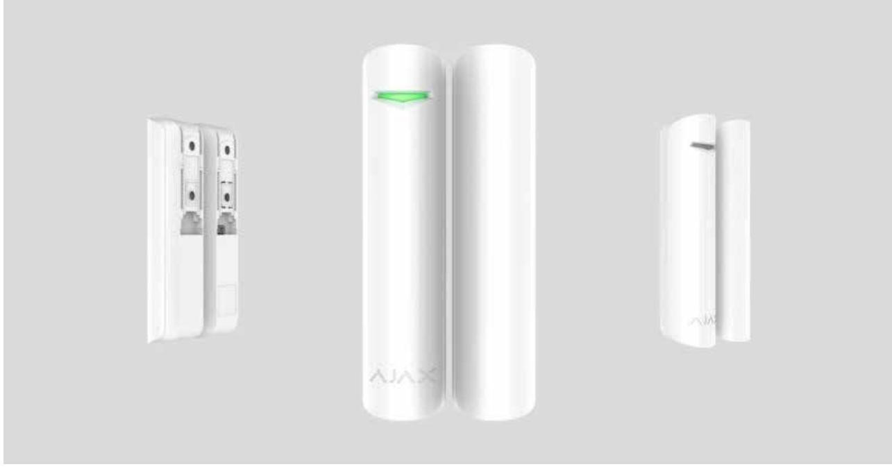
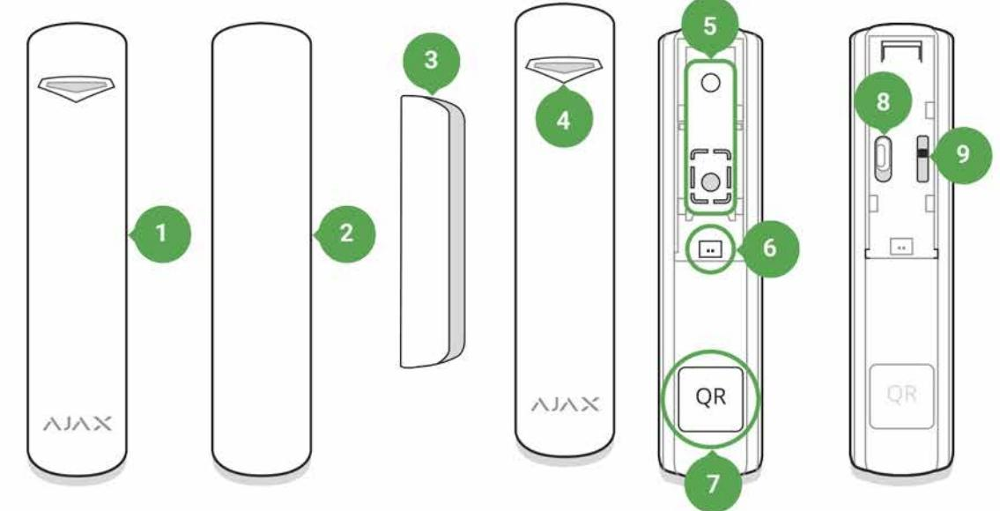
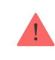
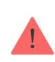
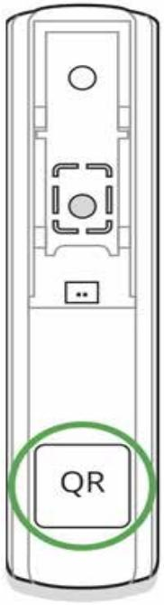
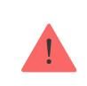
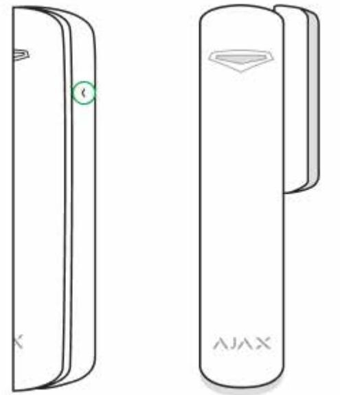
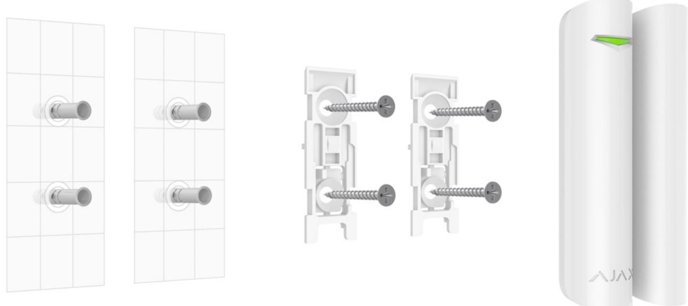
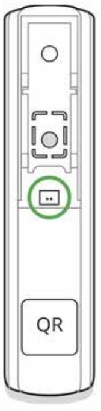
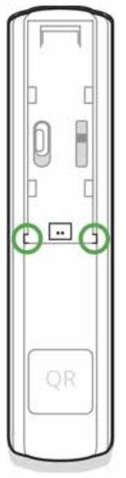

# DoorProtect User Manual

Updated December 6, 2021

**DoorProtect** is a wireless door and window opening detector designed for indoor use. It can operate up to 7 years from a pre-installed battery and capable to detect more than 2 millions openings. DoorProtect has a socket for connecting an external detector.

> The functional element of DoorProtect is a sealed contact reed relay. It consists of ferromagnetic contacts placed in a bulb that form a continuous circuit under the effect of a constant magnet.

DoorProtect operates within the Ajax security system, connecting via the protected radio protocol. Communication range is up to 1,200 m in the line of sight. Using the or integration modules, DoorProtect can be used as part of third party security systems. Jeweller uartBridge ocBridge Plus

The detector is set up via for iOS, Android, macOS and Windows. The app notifies user of all events through push notifications, SMS and calls (if activated). Ajax apps

The Ajax security system is self-sustaining, but the user can connect it to the central monitoring station of a private security company.

Buy opening detector DoorProtect

# Functional Elements

- **1.** DoorProtect
- **2.** Big magnet (should be placed to the right of the detector)
- **3.** Small magnet (should be placed to the right of the detector)
- **4.** LED indicator
- **5.** SmartBracket attachment panel (perforated part is required for actuating the tamper in case of any attempt to dismantle the detector. Don't break it out!)
- **6.** External detector connection socket
- **7.** QR code
- **8.** Device switch
- **9.** Tamper button

# Operating Principle

DoorProtect consists of two parts: the detector with a sealed contact reed relay, and the constant magnet. Attach the detector to the door frame, while the magnet can be attached to the moving wing or sliding part of the door. If the sealed contact reed relay is within the coverage area of the magnetic field, it closes the circuit, which means that the detector is closed. The opening of the door pushes out the magnet from the sealed contact reed relay and opening the circuit. In such a way, the detector recognizes the opening.

Attach the magnet to the **RIGHT** of the detector.

A small magnet works at a distance of 1 cm, and the big one — up to 2 cm.

After actuation, DoorProtect immediately transmits the alarm signal to the hub, activating the sirens and notifying the user and security company.

### Pairing the Detector

#### Before starting pairing:

- **1.** Following the hub instruction recommendations, install the on your smartphone. Create an account, add the hub to the app, and create at least one room. Ajax app
- **2.** Switch on the hub and check the internet connection (via Ethernet cable and/or GSM network).
- **3.** Make sure that the hub is disarmed and does not update by checking its status in the app.

Only users with administrator rights can add the device to the hub.

How to pair the detector with the hub:

- **1.** Select the **Add Device** option in the Ajax app.
- **2.** Name the device, scan/write manually the **QR Code** (located on the body and packaging), and select the location room.

- **3.** Select **Add** the countdown will begin.
- **4.** Switch on the device.

For detection and pairing to occur, the detector should be located within the coverage area of the wireless network of the hub (at the same facility).

The request for connection to the hub is transmitted for a short period of time at the moment of switching on the device.

If pairing with the hub failed, switch off the detector for 5 seconds and retry it.

If the detector has paired with the hub, it will appear in the list of devices in the Ajax app. The update of the detectors statuses in the list depends on the detector ping interval set in the hub settings. The default value is 36 seconds.

# Connecting to Third-Party Systems

To connect the detector to a third-party security central unit using the or integration modules, follow the recommendations in the user manual of the respective device. uartBridge ocBridge Plus

### States

The states screen contains information about the device and its current parameters. Find the DoorProtect states in the Ajax app:

- **1.** Go to the **Devices** tab.
- **2.** Select DoorProtect from the list.

| Parameter                | Value                                                                                                                                                                                                            |
|--------------------------|------------------------------------------------------------------------------------------------------------------------------------------------------------------------------------------------------------------|
| Temperature              | Device temperature. It is measured on the processor and changes gradually. Displayed in 1°C increment. Acceptable error between the value in the app and temperature at the installation site: 2–4°C |
| Jeweller Signal Strength | Signal strength between the hub/range extender and the opening detector. We recommend installing the detector in places where the signal strength is 2–3 bars                                           |
| Connection               | Connection status between the hub/range extender and the detector:                                                                                                                                            |

|                                     | Online — the detector is connected with the hub/range extender Offl ine — the detector has lost connection with the hub/range extender                                                                      |
|-------------------------------------|-------------------------------------------------------------------------------------------------------------------------------------------------------------------------------------------------------------------------|
| ReX range extender name             | Radio signal range extender connection status. radio Displayed when the detector works via signal range extender                                                                                               |
| Battery Charge                      | Battery level of the device. Displayed as a percentage How battery charge is displayed in Ajax apps                                                                                                            |
| Lid                                 | The tamper state, which reacts to detachment or damaging of the detector body                                                                                                                                        |
| Delay When Entering, sec            | Entry delay (alarm activation delay) is the time you have to disarm the security system after entering the room What is delay when entering                                                                    |
| Delay When Leaving, sec             | Delay time when exiting. Delay when exiting (alarm activation delay) is the time you have to exit the room after arming the security system What is delay when leaving                                         |
| Night Mode Delay When Entering, sec | The time of Delay When Entering in the Night mode. Delay when entering (alarm activation delay) is the time you have to disarm the security system after entering the premises. What is delay when entering |
| Night Mode Delay When Leaving, sec  | The time of Delay When Leaving in the Night mode. Delay when leaving (alarm activation delay) is the time you have to exit the premises after the security system is armed.                                    |
|                                     | What is delay when leaving                                                                                                                                                                                              |

| Primary Detector       | The primary detector status                                                                                                                                                                                                                                                                                                                                                                                                                                                                                                                                                                                                                                                                                                                                                                                                                                                                                             |
|------------------------|-------------------------------------------------------------------------------------------------------------------------------------------------------------------------------------------------------------------------------------------------------------------------------------------------------------------------------------------------------------------------------------------------------------------------------------------------------------------------------------------------------------------------------------------------------------------------------------------------------------------------------------------------------------------------------------------------------------------------------------------------------------------------------------------------------------------------------------------------------------------------------------------------------------------------|
| External Contact       | The status of the external detector connected to DoorProtect                                                                                                                                                                                                                                                                                                                                                                                                                                                                                                                                                                                                                                                                                                                                                                                                                                                         |
| Always Active          | If the option is active, the detector is always in armed mode and notifies about alarms Learn more                                                                                                                                                                                                                                                                                                                                                                                                                                                                                                                                                                                                                                                                                                                                                                                                                |
| Chime                  | When enabled, a siren notifies about opening detectors triggering in the Disarmed system mode What is chime and how it works                                                                                                                                                                                                                                                                                                                                                                                                                                                                                                                                                                                                                                                                                                                                                                                   |
| Temporary Deactivation | Shows the status of the device temporary deactivation function: No — the device operates normally and transmits all events. Lid only — the hub administrator has disabled notifications about triggering on the device body. Entirely — the device is completely excluded from the system operation by the hub administrator. The device does not follow system commands and does not report alarms or other events. By number of alarms — the device is automatically disabled by the system when the number of alarms is exceeded (specified in the settings for Devices Auto Deactivation). The feature is configured in the Ajax PRO app. By timer — the device is automatically disabled by the system when the recovery timer expires (specified in the settings for Devices Auto Deactivation). The feature is configured in the Ajax PRO app. |
| Firmware               | The detector firmware version                                                                                                                                                                                                                                                                                                                                                                                                                                                                                                                                                                                                                                                                                                                                                                                                                                                                                           |
| Device ID              | The device identifier                                                                                                                                                                                                                                                                                                                                                                                                                                                                                                                                                                                                                                                                                                                                                                                                                                                                                                   |
| Device No.             | Number of the device loop (zone)                                                                                                                                                                                                                                                                                                                                                                                                                                                                                                                                                                                                                                                                                                                                                                                                                                                                                        |

### Settings

To change the detector settings in the Ajax app:

- **1.** Select the hub if you have several of them or if you are using the PRO app.
- **2.** Go to the **Devices** tab.
- **3.** Select **DoorProtect** from the list.
- **4.** Go to **Settings** by clicking on the .
- **5.** Set the required parameters.
- **6.** Click **Back** to save the new settings.

| Setting                             | Value                                                                                                                                                                                                       |
|-------------------------------------|-------------------------------------------------------------------------------------------------------------------------------------------------------------------------------------------------------------|
| First field                         | Detector name that can be changed. The name is displayed in the text of SMS and notifications in the event feed. The name can contain up to 12 Cyrillic characters or up to 24 Latin characters |
| Room                                | Selecting the virtual room to which DoorProtect is assigned. The name of the room is displayed in the text of SMS and notifications in the event feed                                              |
| Delay When Entering, sec            | Selecting delay time when entering. Delay when entering (alarm activation delay) is the time you have to disarm the security system after entering the room What is delay when entering         |
| Delay When Leaving, sec             | Selecting the delay time when exiting. Delay when exiting (alarm activation delay) is the time you have to exit the room after arming the security system What is delay when leaving            |
| Arm in Night Mode                   | If active, the detector will switch to the armed mode when using the night mode                                                                                                                          |
| Night Mode Delay When Entering, sec | The time of Delay When Entering in the Night                                                                                                                                                                |

|                                                  | mode. Delay when entering (alarm activation delay) is the time you have to disarm the security system after entering the premises. What is delay when entering                                                   |
|--------------------------------------------------|---------------------------------------------------------------------------------------------------------------------------------------------------------------------------------------------------------------------------|
| Night Mode Delay When Leaving, sec               | The time of Delay When Leaving in the Night mode. Delay when leaving (alarm activation delay) is the time you have to exit the premises after the security system is armed. What is delay when leaving        |
| Alarm LED indication                             | Allows you to disable the flashing of the LED indicator during an alarm. Available for devices with firmware version 5.55.0.0 or higher How to find the firmware version or the ID of the detector or device? |
| Primary Detector                                 | If active, DoorProtect primarily reacts to opening/closing                                                                                                                                                             |
| External contact                                 | If active, DoorProtect registers external detector alarms                                                                                                                                                              |
| Always Active                                    | If the option is active, the detector is always in armed mode and notifies about alarms Learn more                                                                                                                  |
| Alert with a siren if opening detected           | sirens If active, added to the system are activated when the opening detected                                                                                                                                    |
| Activate the siren if an external contact opened | sirens If active, added to the system are activated during an external detector alarm                                                                                                                            |
| Chime settings                                   | Opens the settings of Chime. How to set Chime What is Chime                                                                                                                                                         |
| Jeweller Signal Strength Test                    | Switches the detector to the Jeweller signal strength test mode. The test allows you to check the signal strength between the hub and DoorProtect and determine the optimal installation site                 |

|                         | What is Jeweller Signal Strength                                                                                                                                         |
|-------------------------|--------------------------------------------------------------------------------------------------------------------------------------------------------------------------|
|                         | Test                                                                                                                                                                     |
|                         | Switches the detector to the detection area test                                                                                                                         |
| Detection Zone Test     | What is Detection Zone Test                                                                                                                                              |
| Signal Attenuation Test | Switches the detector to the signal fade test mode (available in detectors with firmware version 3.50 and later)                                                   |
|                         | What is Attenuation Test                                                                                                                                                 |
| User Guide              | Opens DoorProtect User Guide in the Ajax app                                                                                                                             |
| Temporary Deactivation  | Allows the user to disconnect the device without removing it from the system.                                                                                         |
|                         | Three options are available:                                                                                                                                             |
|                         | No — the device operates normally and transmits all alarms and events                                                                                                 |
|                         | Entirely — the device will not execute system commands or participate in automation scenarios, and the system will ignore device alarms and other notifications |
|                         | Lid only — the system will ignore only notifications about the triggering of the device tamper button                                                              |
|                         | Learn more about temporary                                                                                                                                               |
|                         | deactivation of devices                                                                                                                                                  |
|                         | The system can also automatically deactivate devices when the set number of alarms is exceeded or when the recovery timer expires.                                 |
|                         | Learn more about auto deactivation                                                                                                                                       |
|                         | of devices                                                                                                                                                               |
| Unpair Device           | Disconnects the detector from the hub and deletes its settings                                                                                                        |

### How to set Chime

Chime is a sound signal that indicates the triggering of the opening detectors when the system is disarmed. The feature is used, for example, in stores, to notify employees that someone has entered the building.

Notifications are configured in two stages: setting up opening detectors and setting up sirens.

#### Learn more about Chime

#### **Detectors settings**

- **1.** Go to the **Devices** menu.
- **2.** Select the DoorProtect detector.
- **3.** Go to its settings by clicking the gear icon in the upper right corner.
- **4.** Go to the **Chime Settings** menu.
- **5.** Select the events to be notified by the siren:
	- If a door or a window is open.
	- If an external contact is open (available if the External Contact option is enabled).
- **6.** Select the chime sound (siren tone): 1 to 4 short beeps. Once selected, the Ajax app will play the sound.
- **7.** Click **Back** to save the settings.
- **8.** Set up the required siren.

#### How to set up a siren for Chime

# Indication

| Event                     | Indication                              | Note |
|---------------------------|-----------------------------------------|------|
| Switching on the detector | Lights up green for about one second |      |

| Detector connecting to the hub ocBridge Plus , and uartBridge | Lights up for a few seconds                                           |                                                                                             |
|------------------------------------------------------------------------------|-----------------------------------------------------------------------|---------------------------------------------------------------------------------------------|
| Alarm / tamper activation                                                    | Lights up green for about one second                               | Alarm is sent once in 5 seconds                                                          |
| Battery needs replacing                                                      | During the alarm, it slowly lights up green and slowly goes out | Replacement of the detector battery is described in the Battery Replacement manual |

# Functionality Testing

The Ajax security system allows conducting tests for checking the functionality of connected devices.

The tests do not start immediately but within 36 seconds by default. The starting time depends on the ping interval (the paragraph on "**Jeweller**" settings in hub settings).

Jeweller Signal Strength Test

Detection Zone Test

Attenuation Test

### Installing the Detector

### Selecting the location

Location of DoorProtect is determined by its remoteness from the hub and presence of any obstacles between the devices hindering the radio signal transmission: walls, inserted floors, large objects located within the room.

The device developed only for indoor use.

If the signal level is low (one bar), we cannot guarantee stable operation of the security system. Take all possible measures to improve the quality of the signal! As a minimum, move the device — even 20 cm shift can significantly improve the quality of the reception.

If after moving the device still has a low or unstable signal strength, use a . radio signal range extender

The detector is located either inside or outside of the door case (window frame).

When installing the detector in the perpendicular planes (inside the case/frame), use the small magnet. The distance between the magnet and detector should not exceed 1 cm.

When positioning the parts of DoorProtect in the same plane, use the big magnet. Its actuation threshold — 2 cm.

**Attach the magnet to the moving part of the door (window) to the right of the detector**. The side to which the magnet should be attached is marked with an arrow on the detector's body. If necessary, the detector may be positioned horizontally.

### Installing the detector

Before installing the detector, make sure that you have selected the optimal location and it complies with the guidelines of this manual!

- **1.** Fix the SmartBracket attachment panels and the magnet using the bundled screws. If using any other attachment hardware, make sure that they do not damage or deform the panel.
Double-sided adhesive tape may be only used for temporary attachment. The tape will run dry in the course of time, which may result in falling of DoorProtect and actuation of the security system. Furthermore, the device may fail from a hit.

- **2.** Put the detector on the attachment panel. As soon as the detector is fixed in SmartBracket, it will blink with a LED signaling that the tamper is closed.

If the light indicator do not blink after installing in SmartBracket, check the status of the tamper in the Ajax app and then the fixing tightness of the panel.

If the detector is torn off from the surface or removed from the attachment panel, you will receive a notification.

- **3.** Put the magnet on the attachment panel.
#### **Do not install the detector:**

- **1.** outside the premises (outdoors);
- **2.** nearby any metal objects or mirrors causing attenuation or interference of the signal;
- **3.** inside any premises with the temperature and humidity beyond the permissible limits;
- **4.** closer than 1 m to the hub.

# Connecting a Third-Party Wired Detector

A wired detector with the NC contact type can be connected to DoorProtect using the outside-mounted terminal clamp.

We recommend to install a wired detector at a distance not exceeding 1 meter increasing the wire length will increase the risk of its damage and reduce the quality of communication between the detectors.

To lead out the wire from the detector body, break out the plug:

If the external detector is actuated, you will receive a notification.

# Detector Maintenance and Battery Replacement

Check the operational capability of the DoorProtect detector on a regular basis.

Clean the detector body from dust, spider web and other contaminations as they appear. Use soft dry napkin suitable for equipment maintenance.

Do not use any substances containing alcohol, acetone, gasoline and other active solvents for cleaning the detector.

The battery lifetime depends on battery quality, actuation frequency of the detector and ping interval of the detectors by the hub.

If the door opens 10 times a day and the ping interval is 60 seconds, then DoorProtect will operate up to 7 years from the pre-installed battery. Setting the ping interval of 12 seconds, you will reduce the battery life to 2 years.

#### How long Ajax devices operate on batteries, and what affects this

If the detector battery is discharged, you will receive a notification, and the LED will smoothly light up and go out, if the detector or tamper is actuated.

#### Battery Replacement

### Tech specs

| Sensor                               | Sealed contact reed relay                                                                                                                                     |
|--------------------------------------|---------------------------------------------------------------------------------------------------------------------------------------------------------------|
| Sensor resource                      | 2,000,000 openings                                                                                                                                            |
| Detector actuation threshold         | 1 cm (small magnet) 2 cm (big magnet)                                                                                                                      |
| Tamper protection                    | Yes                                                                                                                                                           |
| Socket for connecting wire detectors | Yes, NC                                                                                                                                                       |
| Radio communication protocol         | Jeweller Learn more                                                                                                                                        |
| Radio frequency band                 | 866.0 – 866.5 MHz 868.0 – 868.6 MHz 868.7 – 869.2 MHz 905.0 – 926.5 MHz 915.85 – 926.5 MHz 921.0 – 922.0 MHz Depends on the region of sale. |
| Compatibility                        | hubs radio signal Operates with all Ajax , range extenders ocBridge Plus , ,                                                             |
|                                      | uartBridge                                                                                                                                                    |
| Maximum RF output power              | Up to 20 mW                                                                                                                                                   |
| Modulation                           | GFSK                                                                                                                                                          |
| Radio signal range                   | Up to 1,200 m (any obstacles absent) Learn more                                                                                                            |
| Power supply                         | 1 battery CR123A, 3 V                                                                                                                                         |
| Battery life                         | Up to 7 years                                                                                                                                                 |
| Installation method                  | Indoors                                                                                                                                                       |
| Protection class                     | IP50                                                                                                                                                          |
| Operating temperature range          | From -10°С to +40°С                                                                                                                                           |

| Dimensions    | Ø 20 × 90 mm                                                                                                                  |
|---------------|-------------------------------------------------------------------------------------------------------------------------------|
| Weight        | 29 g                                                                                                                          |
| Service life  | 10 years                                                                                                                      |
| Certification | Security Grade 2, Environmental Class II in conformity with the requirements of EN 50131- 1, EN 50131-2-6, EN 50131-5-3 |

### Compliance with standards

### Complete Set

- **1.** DoorProtect
- **2.** SmartBracket mounting panel
- **3.** Battery CR123A (pre-installed)
- **4.** Big magnet
- **5.** Small magnet
- **6.** Outside-mounted terminal clamp
- **7.** Installation kit
- **8.** Quick Start Guide

# Warranty

Warranty for the "AJAX SYSTEMS MANUFACTURING" LIMITED LIABILITY COMPANY products is valid for 2 years after the purchase and does not apply to the pre-installed battery.

If the device does not work correctly, you should first contact the support service — in half of the cases, technical issues can be solved remotely!

#### The full text of the warranty

#### User Agreement

Technical support: support@ajax.systems