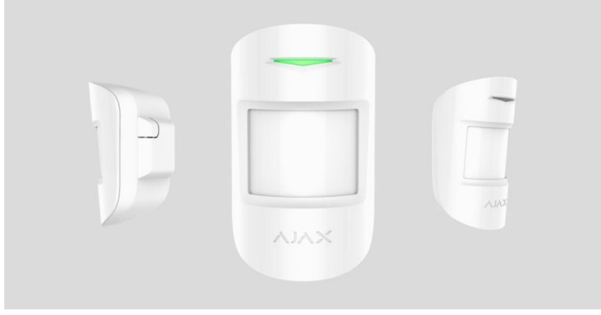
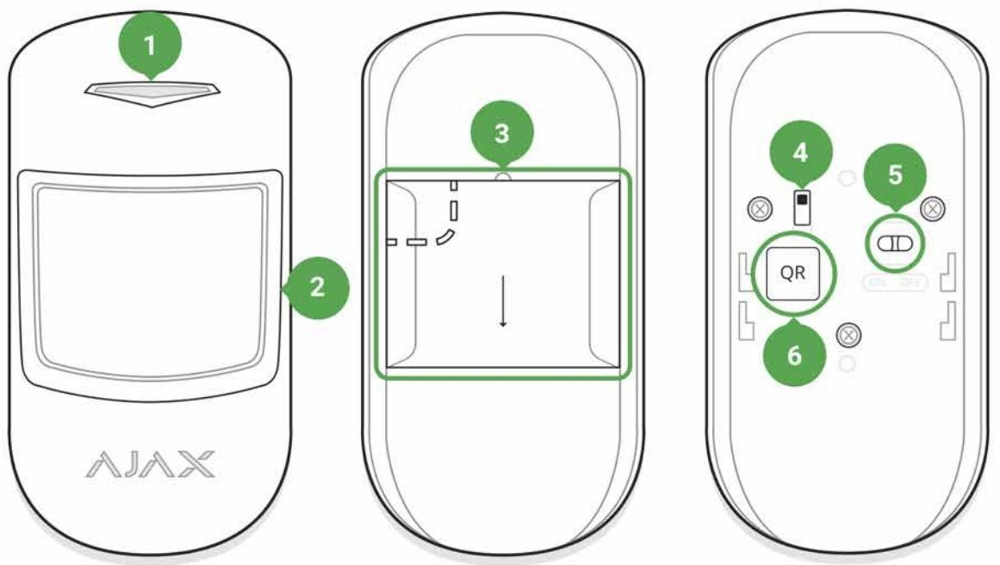
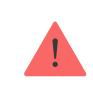
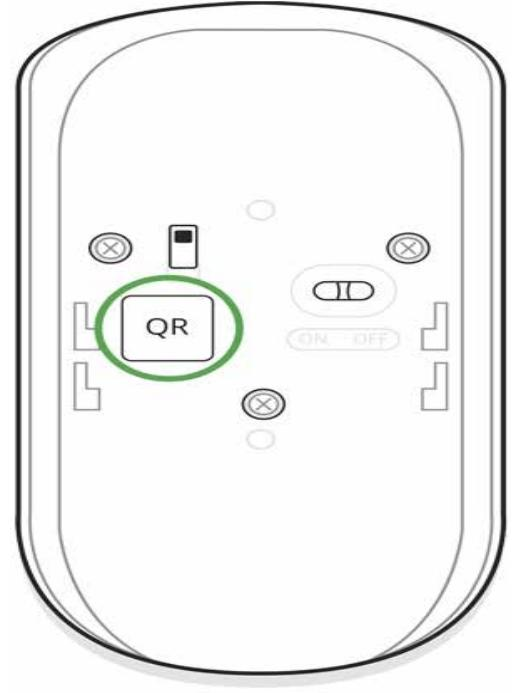
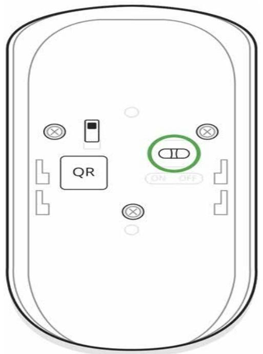
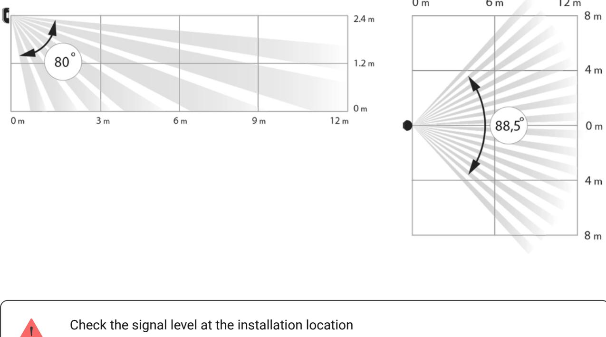
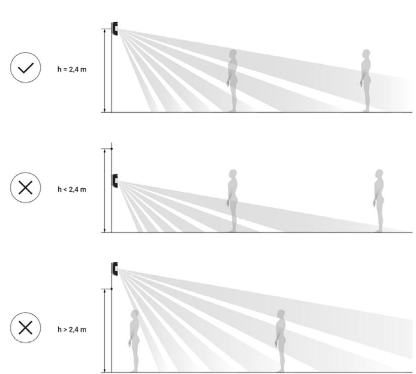
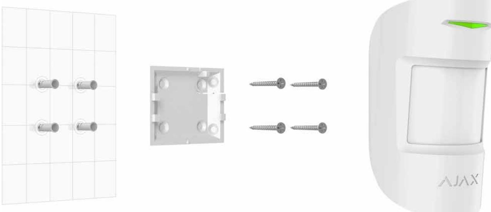
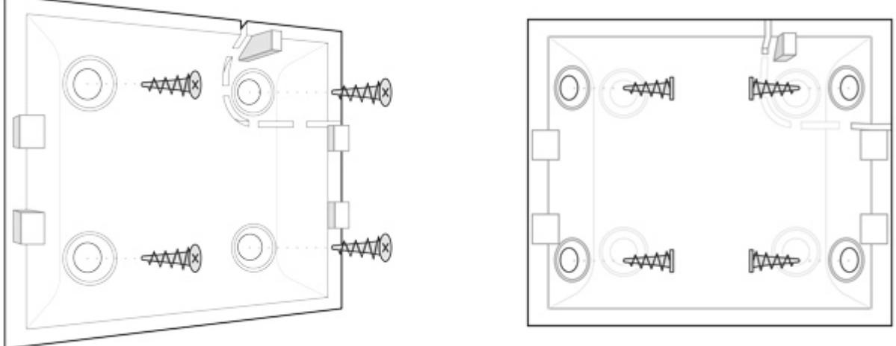

# MotionProtect / MotionProtect Plus User Manual

Updated December 6, 2021

**MotionProtect** is a wireless motion detector designed for indoor use. It can operate for up to 5 years from an in-built battery, and monitors the area within 12-meter radius. MotionProtect ignores animals, while recognizes a human from the first step.

**MotionProtect Plus** uses radio frequency scanning along with a thermal sensor, filtering interference from thermal radiation. Can operate up to 5 years from an in-built battery.

#### Buy motion detector with microwave sensor MotionProtect Plus

MotionProtect (MotionProtect Plus) operates within the Ajax security system, connected to the via the protected protocol. The communication range is up to 1700 (**MotionProtect Plus** up to 1200) meters in the line of sight. In addition, the detector can be used as a part of third-party security central units via the or integration modules. hub Jeweller Ajax uartBridge Ajax ocBridge Plus

The detector is set up via the for iOS, Android, macOS and Windows. The system notifies user of all events through push notifications, SMS and calls (if activated). Ajax app

The Ajax security system is self-sustaining, but the user can connect it to the central monitoring station of a security company.

### Buy motion detector MotionProtect

# Functional Elements

- **1.** LED indicator
- **2.** Motion detector lens
- **3.** SmartBracket attachment panel (perforated part is required for actuating the tamper in case of any attempt to dismantle the detector)
- **4.** Tamper button
- **5.** Device switch
- **6.** QR code

# Operating Principle

Thermal PIR sensor of MotionProtect detects intrusion into protected room by detecting moving objects whose temperature is close to the temperature of the human body. However, the detector can ignore domestic animals if the suitable sensitivity has been chosen in the settings.

When the **MotionProtect Plus** detects motion, it will additionally carry out radio frequency scanning of the room, preventing false actuation from thermal interferences: air flows from sun-heated curtains and louvre shutters, operating thermal air fans, fireplaces, air conditioning units, etc.

After actuation, the armed detector immediately transmits an alarm signal to the hub, activating the sirens and notifying the user and security company.

If before arming the system, the detector has detected motion, it will not arm immediately, but during the next inquiry by the hub.

# Connecting the Detector to the Ajax Security System

# Connecting the Detector to the hub

### **Before starting connection:**

- **1.** Following the hub manual recommendations, install the . Create an account, add the hub to the application, and create at least one room. Ajax application
- **2.** Switch on the hub and check the internet connection (via Ethernet and/or GSM network).
- **3.** Make sure that the hub is disarmed and does not update by checking its status in the app.

Only users with administrator rights can add the device to the hub

- **1.** Select the **Add Device** option in the Ajax application.
- **2.** Name the device, scan/write manually the **QR Code** (located on the body and packaging), and select the location room.

- **3.** Select **Add** the countdown will begin.
- **4.** Switch on the device.

For detection and pairing to occur, the detector should be located within the coverage of the wireless network of the hub (at a single protected object).

Request for connection to the hub is transmitted for a short time at the moment of switching on the device.

If the detector failed to connect to the hub, switch off the detector for 5 seconds and retry.

The connected detector will appear in the devices list in the application. Update of the detector statuses in the list depends on the device inquiry time set in the hub settings(default value is 36 seconds).

# Connecting the Detector to Third Party security systems

To connect the detector to a third party security central unit with the or integration module, follow the recommendations in the manuals of these devices. uartBridge ocBridge Plus

### States

- **1.** Devices
**2.** MotionProtect | **MotionProtect Plus**

| Parameter                | Value                                                                                           |  |
|--------------------------|-------------------------------------------------------------------------------------------------|--|
| Temperature              | Temperature of the Detector. Measured on the processor and changes gradually                 |  |
| Jeweller Signal Strength | Signal strength between the hub and the detector                                             |  |
| Connection               | Connection status between the hub and the detector                                           |  |
| Battery Charge           | Battery level of the device. Displayed as a percentage How battery charge is displayed in |  |
|                          | Ajax apps                                                                                       |  |
| Lid                      | The tamper mode of the detector, which reacts to the detachment of or damage of the body     |  |
| Delay When Entering, sec | Delay time when entering                                                                        |  |

| Delay When Leaving, sec | Delay time when exiting                                                                                                                                                                                                                                                                                                                                                                                                                                                                                                                                                                                                                                                         |  |
|-------------------------|---------------------------------------------------------------------------------------------------------------------------------------------------------------------------------------------------------------------------------------------------------------------------------------------------------------------------------------------------------------------------------------------------------------------------------------------------------------------------------------------------------------------------------------------------------------------------------------------------------------------------------------------------------------------------------|--|
| ReX                     | radio signal Displays the status of using a range extender                                                                                                                                                                                                                                                                                                                                                                                                                                                                                                                                                                                                                |  |
| Sensitivity             | Sensitivity level of the motion sensor                                                                                                                                                                                                                                                                                                                                                                                                                                                                                                                                                                                                                                          |  |
| Always Active           | If active, the motion detector is always in the armed mode                                                                                                                                                                                                                                                                                                                                                                                                                                                                                                                                                                                                                   |  |
| Temporary Deactivation  | Shows the status of the device temporary deactivation function: No — the device operates normally and transmits all events. Lid only — the hub administrator has disabled notifications about triggering on the device body. Entirely — the device is completely excluded from the system operation by the hub administrator. The device does not follow system commands and does not report alarms or other events. By number of alarms — the device is automatically disabled when the number of alarms is exceeded (specified in the settings for Devices Auto Deactivation). The feature is configured in the Ajax PRO app. |  |
| Firmware                | Detector firmware version                                                                                                                                                                                                                                                                                                                                                                                                                                                                                                                                                                                                                                                       |  |
| Device ID               | Device identifier                                                                                                                                                                                                                                                                                                                                                                                                                                                                                                                                                                                                                                                               |  |

### Settings

**1.** Devices

- **2.** MotionProtect | **MotionProtect Plus**
- **3.** Settings

| Setting     | Value                                             |  |
|-------------|---------------------------------------------------|--|
| First field | Detector name, can be edited                      |  |
| Room        | Selecting the virtual room to which the device is |  |

|                                       | assigned                                                                                                                                                                                                                  |  |
|---------------------------------------|---------------------------------------------------------------------------------------------------------------------------------------------------------------------------------------------------------------------------|--|
| Delay When Entering, sec              | Selecting delay time when entering                                                                                                                                                                                        |  |
| Delay When Leaving, sec               | Selecting delay time on exit                                                                                                                                                                                              |  |
| Delays in night mode                  | Delay turned on when using night mode                                                                                                                                                                                     |  |
| Arm in night mode                     | If active, the detector will switch to armed mode when using night mode                                                                                                                                                |  |
| Alarm LED indication                  | Allows you to disable the flashing of the LED indicator during an alarm. Available for devices with firmware version 5.55.0.0 or higher How to find the firmware version or the ID of the detector or device? |  |
|                                       | Choosing the sensitivity level of the motion sensor.                                                                                                                                                                   |  |
| Sensitivity                           | For MotionProtect:                                                                                                                                                                                                        |  |
|                                       | High — for premises with a minimum amount of obstacles, motion is detected as quickly as possible                                                                                                                   |  |
|                                       | Medium — for premises with potential obstacles (windows, air conditioner, heating element, etc)                                                                                                                     |  |
|                                       | Low — ignore pets weighing up to 20 kg and up to 50 cm tall                                                                                                                                                            |  |
|                                       | For MotionProtect Plus:                                                                                                                                                                                                   |  |
|                                       | High — the detector disregards cats (under 25 cm)                                                                                                                                                                      |  |
|                                       | Medium — disregards small dogs (under 35 cm)                                                                                                                                                                           |  |
|                                       | Low — disregards animals under 50 cm.                                                                                                                                                                                     |  |
|                                       | Why motion detectors react to animals and how to avoid it                                                                                                                                                              |  |
| Always active                         | If active, the detector always registers motion                                                                                                                                                                           |  |
| Alert with a siren if motion detected | sirens If active, added to the system are activated when the motion detected                                                                                                                                     |  |

| Jeweller Signal Strength Test | Switches the detector to the signal strength test mode                                                                                                                                                                                                                                                                                                                                                                                                                                                                                                                                                                    |  |
|-------------------------------|------------------------------------------------------------------------------------------------------------------------------------------------------------------------------------------------------------------------------------------------------------------------------------------------------------------------------------------------------------------------------------------------------------------------------------------------------------------------------------------------------------------------------------------------------------------------------------------------------------------------------|--|
| Detection Zone Test           | Switches the detector to the detection area test                                                                                                                                                                                                                                                                                                                                                                                                                                                                                                                                                                             |  |
| Attenuation Test              | Switches the detector to the signal attenuation test mode (available in detectors with firmware version 3.50 and later)                                                                                                                                                                                                                                                                                                                                                                                                                                                                                                |  |
| Temporary Deactivation        | Allows the user to disconnect the device without removing it from the system. Two options are available: Entirely — the device will not execute system commands or participate in automation scenarios, and the system will ignore device alarms and other notifications Lid only — the system will ignore only notifications about the triggering of the device tamper button Learn more about temporary deactivation of devices The system can also automatically disable devices when the set number of alarms is exceeded. Learn more about auto deactivation of devices |  |
| User Guide                    | Opens the User Guide                                                                                                                                                                                                                                                                                                                                                                                                                                                                                                                                                                                                         |  |
| Unpair Device                 | Disconnects the detector from the hub and deletes its settings                                                                                                                                                                                                                                                                                                                                                                                                                                                                                                                                                            |  |

Before using the detector as a part of the security system, set up the suitable sensitivity level.

Switch the **Always Active** if the detector is located in a room requiring 24-hour control. Regardless of whether the system is set in the armed mode, you will receive notices of any detected motion.

If any motion is detected, the detector activates the LED for 1 second and transmits an alarm signal to the hub and then to the user and central monitoring station (if it is connected).

### Detector operation indication

| Event                                                                        | Indication                                              | Note                                                                                        |
|------------------------------------------------------------------------------|---------------------------------------------------------|---------------------------------------------------------------------------------------------|
| Turning on the detector                                                      | Lights up green for about one second                 |                                                                                             |
| Detector connection to the hub ocBridge Plus , and uartBridge | Lights up continuously for a few seconds             |                                                                                             |
| Alarm / tamper activation                                                    | Lights up green for about one second                 | Alarm is sent once in 5 seconds                                                          |
| Battery needs replacing                                                      | During the alarm,slowly lights up and goes off green | Replacement of the detector battery is described in the Battery Replacement manual |

# Detector Testing

The Ajax security system allows conducting tests for checking the functionality of connected devices.

The tests do not start immediately but within a period of 36 seconds when using the standard settings. The time of the start depends on the settings of the detector polling period (the paragraph on **Jeweller** settings in the hub settings).

### Jeweller Signal Strength Test

Detection Zone Test

Attenuation test

### Device installation

### Selection of the Detector Location

The controlled area and the efficiency of the security system depends on the location of the detector.

Location of MotionProtect depends on the remoteness from the hub and presence of any obstacles between the devices hindering the radio signal transmission: walls, inserted floors, large-size objects located within the room.

If the signal level is at one bar, we cannot guarantee stable operation of the security system. Take all possible measures to improve the quality of the signal! As a minimum, move the device — even 20 cm shift can significantly improve the quality of reception.

If after moving the device still has a low or unstable signal strength, use a . radio signal range extender

> The direction of the detector lens should be perpendicular to the probable way of intrusion into the room

Make sure that any furniture, domestic plants, vases, decorative or glass structures do not block the field of view of the detector.

We recommend installing the detector at the height of 2,4 meters.

If the detector is not installed at the recommended height, this will reduce the area of the motion detection zone and impair the operation of the function of ignoring animals.

#### Why motion detectors react to animals and how to avoid it

# Installation of the Detector

Before installing the detector, make sure that you have selected the optimal location and it is in compliance with the guidelines contained in this manual

The Ajax MotionProtect detector (**MotionProtect Plus**) should be attached to a vertical surface or in the corner.

- **1.** Attach the SmartBracket panel to the surface using bundled screws, using at least two fixing points (one of them — above the tamper). After selecting other attachment screws, make sure that they do not damage or deform the panel.
The double-sided adhesive tape may only be used for temporary attachment of the detector. The tape will run dry in the course of time, which may result in the falling of the detector and actuation of the security system. Furthermore, hitting can damage the device.

- **2.** Put the detector on the attachment panel. When the detector is fixed in SmartBracket, it will blink with an LED — this will be a signal that the tamper on the detector is closed.
If the LED indicator of the detector is not actuated after installation in SmartBracket, check the status of the tamper in the and then the fixing tightness of the panel. Ajax Security System application

If the detector is torn off from the surface or removed from the attachment panel, you will receive the notification.

#### **Do not install the detector:**

- **1.** outside the premises (outdoors)
- **2.** in the direction of the window, when the detector lens is exposed to direct sunlight (you can install **MotionProtect Plus**)
- **3.** opposite any object with the rapidly changing temperature (e.g., electrical and gas heaters) (you can install **MotionProtect Plus**)
- **4.** opposite any moving objects with a temperature close to that of the human body (oscillating curtains above the radiator) (you can install **MotionProtect Plus**)
- **5.** at any places with fast air circulation (air fans, open windows or doors) (you can install **MotionProtect Plus**)
- **6.** nearby any metal objects or mirrors causing attenuation and screening of the signal
- **7.** within any premises with the temperature and humidity beyond the range of permissible limits
- **8.** closer than 1 m from the hub.

# Detector Maintenance

Check the operational capability of the Ajax MotionProtect detector on a regular basis.

Clean the detector body from dust, spider webs and other contaminants as they appear. Use soft dry napkin suitable for equipment maintenance.

Do not use any substances containing alcohol, acetone, gasoline and other active solvents for cleaning the detector. Wipe the lens very carefully and gently — any scratches on the plastic may cause reduction of the detector sensitivity.

The pre-installed battery ensures up to 5 years of autonomous operation (with the inquiry frequency by the hub of 3 minutes). If the detector battery is discharged, the security system will send respective notices and the LED will smoothly lights up and goes out, if the detector detects any motion or if the tamper is actuated.

#### How long Ajax devices operate on batteries, and what affects this

#### Battery Replacement

### Tech specs

|                                      | PIR sensor                                                                                                                                                    |
|--------------------------------------|---------------------------------------------------------------------------------------------------------------------------------------------------------------|
| Sensitive element                    | (Motion Protect Plus: PIR and microwave sensor)                                                                                                            |
| Motion detection distance            | Up to 12 m                                                                                                                                                    |
| Motion detector viewing angles (H/V) | 88,5° / 80°                                                                                                                                                   |
| Time for motion detection            | From 0.3 to 2 m/s                                                                                                                                             |
|                                      | Yes, height up to 50 cm, weight up to 20 kg                                                                                                                   |
| Pet immunity                         | Why motion detectors react to animals and how to avoid it >                                                                                                |
| Tamper protection                    | Yes                                                                                                                                                           |
| Radio communication protocol         | Jeweller Learn more                                                                                                                                        |
| Radio frequency band                 | 866.0 – 866.5 MHz 868.0 – 868.6 MHz 868.7 – 869.2 MHz 905.0 – 926.5 MHz 915.85 – 926.5 MHz 921.0 – 922.0 MHz Depends on the region of sale. |
| Compatibility                        | hubs radio signal Operates with all Ajax , range extenders ocBridge Plus , ,                                                             |

|                                | uartBridge                                                                                                                                                                                          |
|--------------------------------|-----------------------------------------------------------------------------------------------------------------------------------------------------------------------------------------------------|
| Maximum RF output power        | Up to 20 mW                                                                                                                                                                                         |
| Modulation of the radio signal | GFSK                                                                                                                                                                                                |
| Radio signal range             | Up to 1700 m (any obstacles absent) (Motion Protect Plus up to 1200 m) Learn more                                                                                                             |
| Power supply                   | 1 battery CR123A, 3 V                                                                                                                                                                               |
| Battery life                   | Up to 5 years                                                                                                                                                                                       |
| Installation method            | Indoors                                                                                                                                                                                             |
| Operating temperature range    | From -10°С to +40°С                                                                                                                                                                                 |
| Operating humidity             | Up to 75%                                                                                                                                                                                           |
| Overall dimensions             | 110 × 65 × 50 mm                                                                                                                                                                                    |
| Weight                         | 86 g (Motion Protect Plus – 96 g)                                                                                                                                                                   |
| Service life                   | 10 years                                                                                                                                                                                            |
| Certification                  | Security Grade 2, Environmental Class II in conformity with the requirements of EN 50131- 1, EN 50131-2-2, EN 50131-5-3 (Motion Protect Plus – EN 50131-1, EN 50131-2-4, EN 50131-5- 3) |

#### Compliance with standards

# Complete Set

- **1.** MotionProtect (**MotionProtect Plus**)
- **2.** SmartBracket mounting panel
- **3.** Battery CR123A (pre-installed)
- **4.** Installation kit
- **5.** Quick Start Guide

# Warranty

Warranty for the "AJAX SYSTEMS MANUFACTURING" LIMITED LIABILITY COMPANY products is valid for 2 years after the purchase and does not apply to the pre-installed battery.

If the device does not work correctly, you should first contact the support service — in half of the cases, technical issues can be solved remotely!

### The full text of the warranty

User Agreement

Technical support: support@ajax.systems