# MotionCam User Manual

Updated December 8, 2021

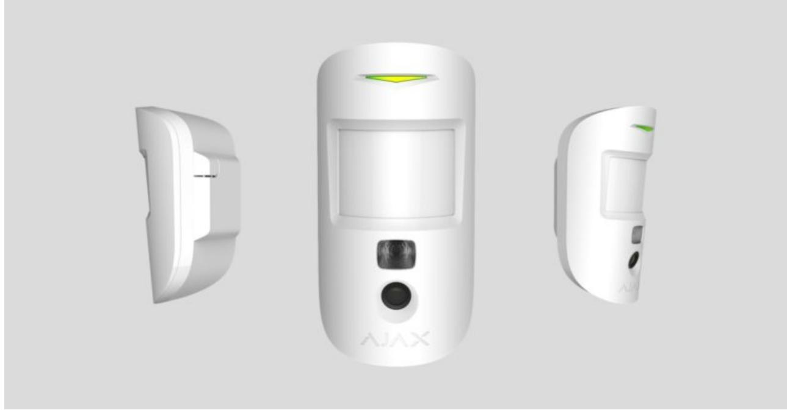

**MotionCam** is a wireless motion detector with visual alarm verification for indoor use. It operates for up to 4 years on bundled batteries, detects movement at up to 12 meters, ignores animals, but recognizes a human move instantly. MotionCam works within Ajax security systems, connecting to a hub through the two secure radio protocols. The detector uses to transmit alarms and events, and Wings to transmit photos. Wireless coverage may reach up 1,700 m line-of-sight. Jeweller

The detector is compatible only with control panels or and radio signal range extender . Connection to , , radio signal range extender, and integration modules is not supported! Hub 2 Hub 2 Plus ReX 2 Hub Hub Plus ReX ocBridge Plus uartBridge

The detector is configured via iOS, Android, macOS, and Windows-based . Users are alerted of all alarms and events via push notifications, SMS, and calls (if enabled). Ajax apps

The Ajax security system can be used for self-reliant monitoring, or can be connected to a security company's central monitoring station.

#### Buy MotionCam motion detector featuring visual alarm verification

## Functional Elements

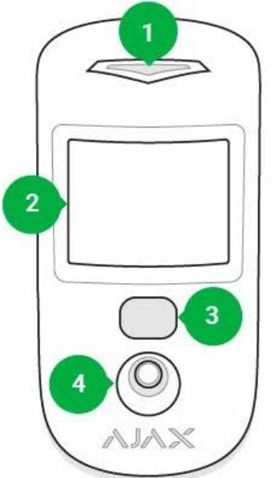

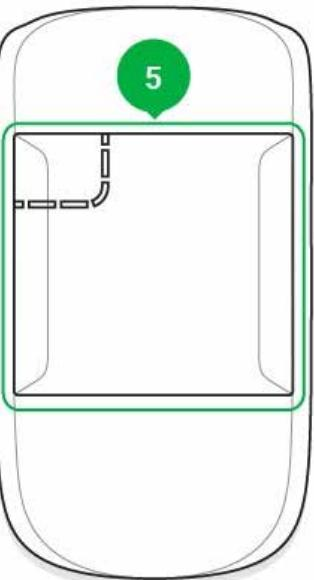

- **1.** LED indicator
- **2.** Motion detector lens
- **3.** Infrared illumination for shooting in the dark
- **4.** Camera
- **5.** SmartBracket mounting panel (the perforated part is necessary for tamper activation in case of an attempt to detach the detector from the surface)
- **6.** Tamper button
- **7.** Power button
- **8.** QR code

## Operating Principle

The infrared sensor of MotionCam detects intrusion into the secured premises by identifying moving objects with a temperature close to that of the human body. The function makes the detector effective temperature compensation

inside premises with temperature ranging from 0 to +40°C. If placed and adjusted properly, MotionCam ignores pets.

When movement is detected, the armed detector instantly transmits an alarm signal to the hub. The hub activates the connected sirens and notifies the user and the security company. MotionCam uses radio protocol to transmit alarms and events to the hub. Jeweller

The built-in MotionCam camera can take from 1 to 5 shots with the resolution of 320×240 and up to 3 shots with the resolution of 640×480 pixels. A series of photos is displayed in the app as an animation, so the user is able to evaluate the unfolding of the event over time. Photos are available both in Ajax apps and on the Central Monitoring Station software of the security company. MotionCam uses Wings radio protocol to transmit photos to the hub.

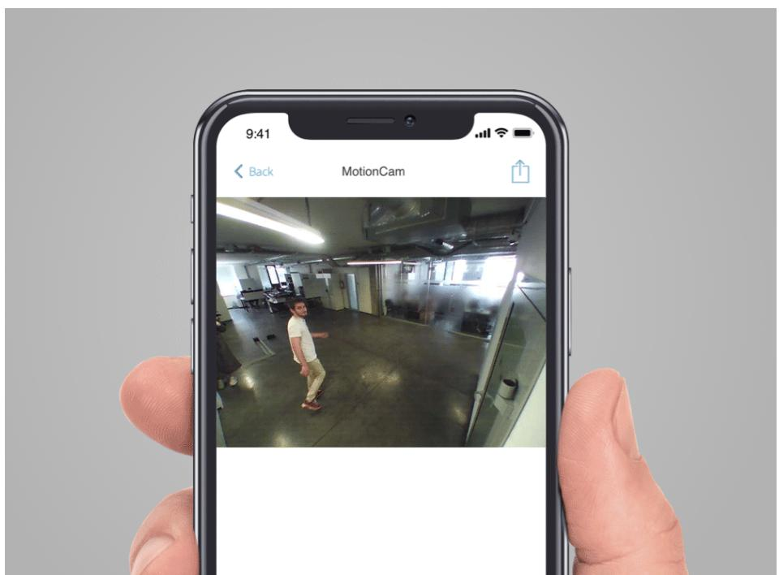

The detector features infrared illumination for shooting in the dark, which is activated only when triggering.

Photo delivery time in the Ajax apps depends on the resolution and the speed of your internet connection. The table shows the delivery time for one photo at a signal strength of 2-3 divisions between the hub and MotionCam and the hub connected via Ethernet.

| Photo resolution | Delivery time |
|------------------|---------------|
| 160 × 120        | up to 7 s     |
|                  |               |

| 320 × 240 (default setting) | up to 9 s  |
|-----------------------------|------------|
| 640 × 480                   | up to 20 s |

At the same time, an alarm is transmitted within 0.15 s.

## Pairing the Detector with the hub

## Before you start pairing the detector:

- **1.** Turn on the hub and check the Internet connection (via Ethernet cable and/or GSM network).
- **2.** Install the on your smartphone. Create an account, add the hub to the app, and create at least one room. Ajax app
- **3.** Check the status of the hub in the app to make sure it is disarmed and is not updating.

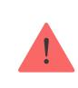

Please note that only a user with admin permissions can add devices to the hub.

## To connect the detector:

- **1.** In the Ajax mobile app, tap **Add Device**.
- **2.** Name the device, scan or enter manually the QR code (placed on the back of the detector body or its packaging), select the room for placement.
- **3.** Click **Add**. The countdown will start.
- **4.** Turn on the device by holding its power button for 3 seconds. Please note that the hub connection request is only sent for a short time while switching on the device.

MotionCam turns off automatically within 6 seconds after activation if it fails to connect to the hub. There is no need to turn off the device to retry.

If the device has already been paired with another hub, turn MotionCam off, and then follow the standard pairing procedure.

After pairing, the detector will appear on the app's hub device list. The frequency of the device status updates depends on the polling interval indicated in the hub's settings (36 seconds by default).

#### Statuses

You can view MotionCam states in the detector menu.

#### **1. Ajax app** → **Devices** → **MotionCam**

| Parameter                | Value                                                                                                                                                |
|--------------------------|------------------------------------------------------------------------------------------------------------------------------------------------------|
| Temperature              | Detector temperature. Measured on the processor and changes gradually                                                                             |
| Jeweller Signal Strength | The strength of the signal for transmitting alarms and events between the hub and the detector                                                 |
| Battery Charge           | Battery level of the device. Two states available: ОК Battery discharged How battery charge is displayed in Ajax apps                    |
| Lid                      | The status of the detector's tamper device that responds to the detachment and removal attempts.                                               |
| Delay When Entering, sec | Entry delay (alarm activation delay) is the time you have to disarm the security system after entering the room What is delay when entering |
|                          |                                                                                                                                                      |

| Delay When Leaving, sec | Delay time when exiting. Delay when exiting (alarm activation delay) is the time you have to exit the room after arming the security system                                                                                                                                                                                                                                                                                                                                                                                                                                                                                                                               |
|-------------------------|---------------------------------------------------------------------------------------------------------------------------------------------------------------------------------------------------------------------------------------------------------------------------------------------------------------------------------------------------------------------------------------------------------------------------------------------------------------------------------------------------------------------------------------------------------------------------------------------------------------------------------------------------------------------------------|
|                         | What is delay when leaving                                                                                                                                                                                                                                                                                                                                                                                                                                                                                                                                                                                                                                                      |
| Connection              | Connection status between the hub and the detector                                                                                                                                                                                                                                                                                                                                                                                                                                                                                                                                                                                                                           |
| Wings Signal Strength   | The strength of the signal for transmitting photos from the detector to the hub                                                                                                                                                                                                                                                                                                                                                                                                                                                                                                                                                                                              |
| Camera                  | Connection status between the hub and the detector's camera                                                                                                                                                                                                                                                                                                                                                                                                                                                                                                                                                                                                                  |
| Sensitivity             | Sensitivity level of the motion detector                                                                                                                                                                                                                                                                                                                                                                                                                                                                                                                                                                                                                                        |
| Always Active           | If active, the detector is always in the armed mode                                                                                                                                                                                                                                                                                                                                                                                                                                                                                                                                                                                                                          |
| Temporary Deactivation  | Shows the status of the device temporary deactivation function: No — the device operates normally and transmits all events. Lid only — the hub administrator has disabled notifications about triggering on the device body. Entirely — the device is completely excluded from the system operation by the hub administrator. The device does not follow system commands and does not report alarms or other events. By number of alarms — the device is automatically disabled when the number of alarms is exceeded (specified in the settings for Devices Auto Deactivation). The feature is configured in the Ajax PRO app. |
| Firmware                | Detector firmware version                                                                                                                                                                                                                                                                                                                                                                                                                                                                                                                                                                                                                                                       |
| ID                      | Device ID                                                                                                                                                                                                                                                                                                                                                                                                                                                                                                                                                                                                                                                                       |

## Settings

You can adjust the device parameters in the settings section:

| Settings                    | Value                                                                                                                                                                                                                                                                                                                                                                                                                               |
|-----------------------------|-------------------------------------------------------------------------------------------------------------------------------------------------------------------------------------------------------------------------------------------------------------------------------------------------------------------------------------------------------------------------------------------------------------------------------------|
| First field                 | Detector name (editable)                                                                                                                                                                                                                                                                                                                                                                                                            |
| Room                        | The virtual room to which the device can be assigned                                                                                                                                                                                                                                                                                                                                                                             |
| Sensitivity                 | MotionCam detector has three sensitivity levels: High — for rooms with a minimum amount of obstacles; in this mode, the movement is detected as quickly as possible. Normal — for rooms with potential obstacles: open windows, air conditioners, heaters, etc. Low — for rooms with a high amount of obstacles; in this mode, the detector ignores animals weighing under 20 kg and up to 50 cm tall |
| Always Active               | In Always Active mode, the detector always registers motion. Regardless of whether the system is armed, the detector will alert you about any motion. Activate this mode if the detector is installed in a room requires 24/7 monitoring.                                                                                                                                                                            |
| Image resolution            | MotionCam takes photos with the following resolutions: 160 × 120 320 × 240 640 × 480 The higher the resolution, the more detailed the image is, but it takes longer to transmit the photos to the hub                                                                                                                                                                                                          |
| Send photo in case of alarm | When triggered, the detector takes from 1 to 5 photos. If the No photo option is selected, the detector does not activate the camera when triggered.                                                                                                                                                                                                                                                                       |

| Alarms with photo verification           | MotionCam can take photos every time alarm is raised or only while first 1 to 10 activations. The limit is reset once the security system is disarmed                                                            |
|------------------------------------------|---------------------------------------------------------------------------------------------------------------------------------------------------------------------------------------------------------------------------|
| Delay When Entering, sec                 | Selecting delay time when entering. Delay when entering (alarm activation delay) is the time you have to disarm the security system after entering the room What is delay when entering                       |
| Delay When Leaving, sec                  | Selecting the delay time when exiting. Delay when exiting (alarm activation delay) is the time you have to exit the room after arming the security system What is delay when leaving                          |
| Delays in Night Mode                     | Activation of the delay when Night mode is enabled What is night mode                                                                                                                                               |
| Arm in Night Mode                        | If active, the detector switches to the armed mode when night mode is enabled What is night mode                                                                                                                    |
| Alarm LED indication                     | Allows you to disable the flashing of the LED indicator during an alarm. Available for devices with firmware version 5.55.0.0 or higher How to find the firmware version or the ID of the detector or device? |
| Alert with a siren if motion is detected | sirens If active, added to the system are activated when motion is detected.                                                                                                                                     |
| Jeweller Signal Strength Test            | Switches the detector to the Jeweller signal strength test mode. The test checks the signal strength between the hub and the detector, and helps to determine the optimum installation place                  |
|                                          | What is Signal Strength Test                                                                                                                                                                                              |

| Wings Signal Strength Test | Switches the detector to the Wings signal strength test mode. The test checks the signal strength between the hub and the detector, and helps to determine the optimum installation place                                                                                                                                                                                                                                                                                                                                                                                                                        |
|----------------------------|------------------------------------------------------------------------------------------------------------------------------------------------------------------------------------------------------------------------------------------------------------------------------------------------------------------------------------------------------------------------------------------------------------------------------------------------------------------------------------------------------------------------------------------------------------------------------------------------------------------------------|
| Detection Zone Test        | Switches the detector to the detection zone test mode. The test checks how the detector responds to motion and determines the optimum installation place What is Detection Zone Test                                                                                                                                                                                                                                                                                                                                                                                                                             |
| Attenuation Test           | Switches the detector into the signal attenuation test mode What is Attenuation Test                                                                                                                                                                                                                                                                                                                                                                                                                                                                                                                                   |
| Temporary Deactivation     | Allows the user to disconnect the device without removing it from the system. Two options are available: Entirely — the device will not execute system commands or participate in automation scenarios, and the system will ignore device alarms and other notifications Lid only — the system will ignore only notifications about the triggering of the device tamper button Learn more about temporary deactivation of devices The system can also automatically disable devices when the set number of alarms is exceeded. Learn more about auto deactivation of devices |
| User Guide                 | Opens the detector User Manual                                                                                                                                                                                                                                                                                                                                                                                                                                                                                                                                                                                               |
| Unpair Device              | Unpairs the detector, disconnects it from the hub, and deletes its settings                                                                                                                                                                                                                                                                                                                                                                                                                                                                                                                                               |

## Photo Verification of Alarms in Ajax apps

If the **Send photo in case of alarm** option is enabled in the MotionCam settings, detector alarms will be accompanied by photos or animations in Ajax apps.

To view photos, click on the alert notification in the events feed.

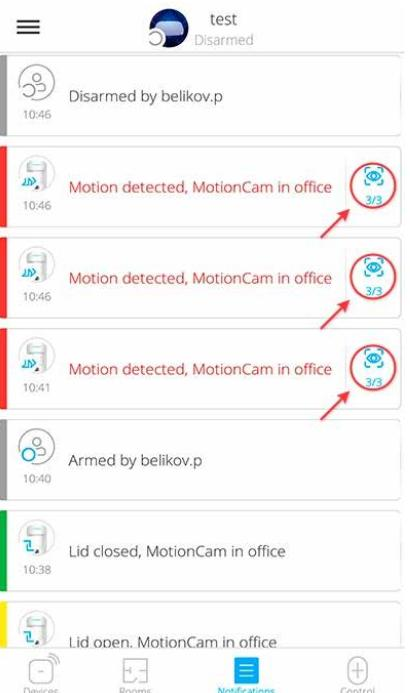

To save the photo, click on the appropriate button.

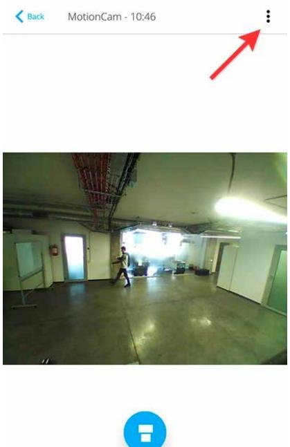

A series of photos is displayed in the app as an animation, so the user is able to evaluate the unfolding of the event over time.

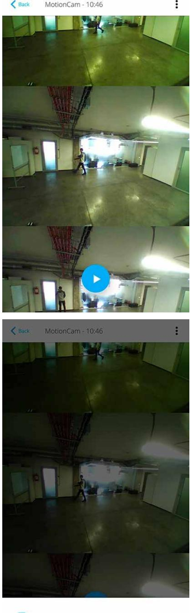

Each frame of a series of photos can be saved individually. The entire series can be saved at once or MP4 video.

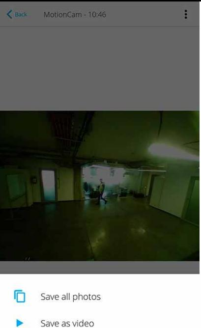

#### Features of alarm photo verification by MotionCam detectors

## Indication

The MotionCam LED indicator may turn red or green, depending on the status of the device.

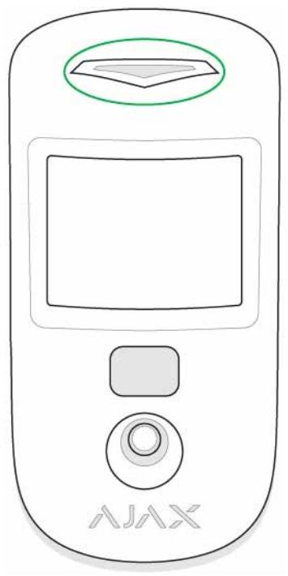

#### **Indication when pressing the power button**

| Event      | Indication                                     |
|------------|------------------------------------------------|
| Turning on | Lights up green while the device is turning on |

#### **Active detector indication**

| Event                                 | Indication                                                 | Note                                                                          |
|---------------------------------------|------------------------------------------------------------|-------------------------------------------------------------------------------|
| Connecting the detector to the hub | Lights up green for a few seconds                       |                                                                               |
| Hardware error                        | Flashes red                                                | The detector needs to be contact repaired, please Support Service    |
| Alarm or tamper activation            | Lights up green for about 1 second                      |                                                                               |
| Battery replacement needed            | Slowly lights up/goes out green when an alarm is raised | For battery replacement Battery procedure, see Replacement manual |

## Functionality Testing

Ajax security systems can run tests to verify the functionality of connected devices.

The tests do not start immediately but within 36 s under default settings. The test start delay depends on the detector polling period settings (see **Jeweller** settings section in hub settings).

The tests are available in the detector settings menu (**Ajax application** → **Devices** → **MotionCam** → **Settings** ) :

- Jeweller Signal Strength Test
- Wings Signal Strength Test
- Detection Zone Test
- Attenuation Test

If any interference is detected or the signal strength is too low to transmit images, the user will receive a push notification **"High interference at Wings frequencies"**.

### Detector Placement

The location of the detector directly affects the efficiency of the security system. The location of the MotionCam detector is determined by its distance from the hub and presence of any obstacles between the devices hindering the radio signal transmission: walls, intermediate floors, or large-size objects located in the room.

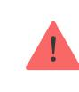

The device developed only for indoor use.

Choosing a location to install, consider the orientation of the lens, the viewing angles of the detector and the camera, and the presence of obstacles that obstruct the view. It is recommended to aim the detector lens perpendicular to the intended path of intrusion into the room. Make sure that furniture, house plants, vases, decorative or glass elements do not obstruct the field of view of the detector.

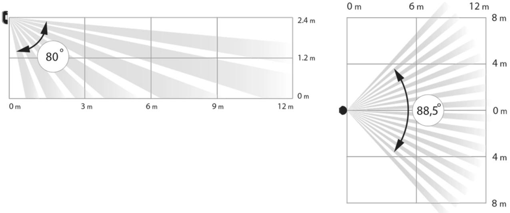

#### Horizontal and vertical viewing angles of the detector

The detector does not detect movement behind the glass. Therefore, do not install it in locations where glass objects can obstruct its field of view. For example, in places where an open window can obstruct the field of view of the detector.

> Remember to check the signal strength at the installation site. If the signal strength is low (a single bar), we do not guarantee a stable operation of the security system!

If the detector has low signal strength, take whatever action is possible to improve the quality of communication! At a minimum, relocate the device: repositioning by even 20 cm can significantly improve the reception quality.

## Detector Installation

Before installing the detector, make sure that you have chosen an appropriate location as indicated in this manual.

The recommended height of the installation is 2.4 m. If the detector is not installed at the recommended height, this will reduce the area of the motion detection zone and disrupt the operation of the pet immunity function.

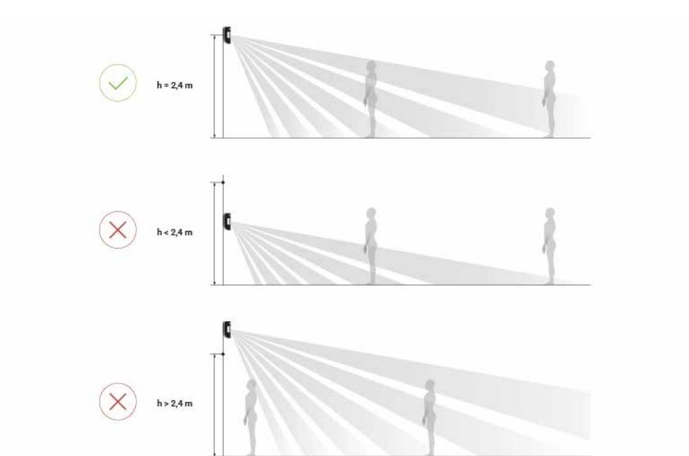

#### Why motion detectors react to animals and how to avoid it

Use the SmartBracket mounting panel to mount the MotionCam detector on a vertical surface or in a corner. SmartBracket has special recesses for fixing it with the bundled screws.

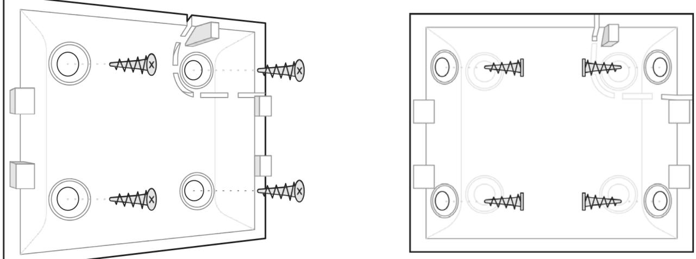

#### **To install the detector:**

- **1.** Attach the SmartBracket panel to the surface with bundled screws, using at least two fixing points. To make sure that tamper reacts to an attempt to dismantle the device, fix the perforated corner of the SmartBracket:
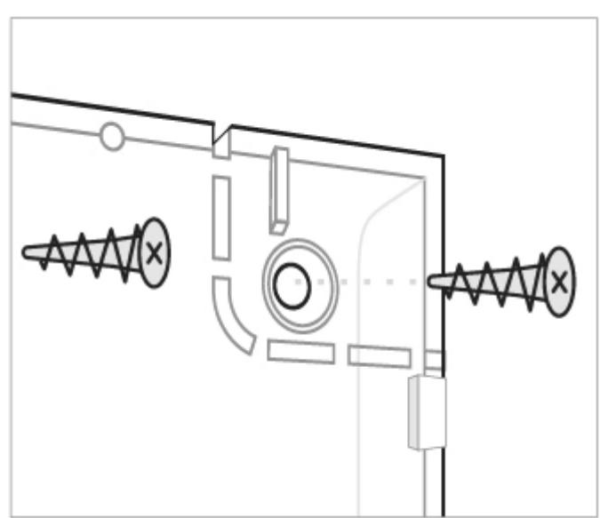

Double-sided adhesive tape should be used only for the temporary installation of the detector. The tape dries up over time, which may result in the falling of the detector and triggering of the security system. Moreover, the device may fail if hit.

- **2.** Attach the detector to the mounting panel. As soon the detector is fixed in SmartBracket, its LED blinks once to signal that the tamper on the detector has been triggered.
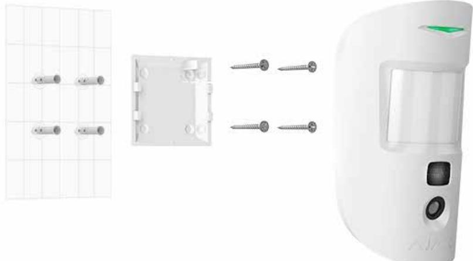

If the detector's LED doesn't light up after the device is attached to the SmartBracket, check the tamper status in the Ajax app and then check if it fits tightly onto the attachment panel.

#### **Do not install the detector:**

- outdoors;
- facing the window to avoid exposing the detector lens to direct sunlight;
- opposite any objects with the rapidly change temperature (e.g. opposite electric or gas heaters);
- opposite any moving objects with the temperature close to that of the human body (opposite swaying curtains above the heater);
- in places with fast air circulation (next to fans, open windows or doors);
- near metal objects and mirrors that cause the attenuation or interfere with radio signals;
- inside rooms with temperature and humidity beyond the permissible limits;
- closer than 1 meter to a hub.

#### Maintenance

Check the operability of the detector on a regular basis. Clean the detector body from dust, cobwebs, and other contaminants as they emerge. Use a soft dry

cloth suitable for equipment care.

Do not use substances that contain alcohol, acetone, gasoline or other active solvents to clean the detector. Wipe the lens very carefully — any scratches on the plastic may impair the detector sensitivity.

The pre-installed battery ensures up to 4 years of autonomous operation. If the detector battery is nearly depleted, the security system will send a notification, and the LED will smoothly light up and go out when the detector detects any motion or if the tamper is activated.

#### What is the MotionCam battery life and what does affect it

Battery Replacement

## Technical Specifications

| Sensitive element                              | PIR sensor                                     |
|------------------------------------------------|------------------------------------------------|
| Motion detection range                         | Up to 12 m                                     |
| Motion detector viewing angle (H/V)            | 88.5°/80°                                      |
| Time for motion detection                      | From 0.3 to 2 m/s                              |
| Image resolution                               | Up to 640 × 480 pixels                         |
| Number of photos taken when alarm is raised    | Up to 5 photos/single alarm                    |
| Infrared illumination for shooting in the dark | Yes                                            |
|                                                | Weight up to 20 kg, height up to 50 cm         |
|                                                |                                                |
|                                                |                                                |
| Pet immunity                                   | Why motion detectors react to                  |
|                                                | animals and how to avoid it >                  |
| Tamper protection                              | Yes                                            |
| Radio communication protocols with Ajax        | Jeweller — for transmitting events and alarms. |
| detectors and devices                          | Learn more                                     |
|                                                |                                                |
|                                                | Wings — for transmitting photos.               |

| Radio frequency band                            | 866.0 – 866.5 MHz 868.0 – 868.6 MHz 868.7 – 869.2 MHz 905.0 – 926.5 MHz 915.85 – 926.5 MHz 921.0 – 922.0 MHz Depends on the region of sale.                            |
|-------------------------------------------------|------------------------------------------------------------------------------------------------------------------------------------------------------------------------------------------|
| Compatibility with hubs                         | Hub 2 Hub 2 Plus Operates only with and                                                                                                                                         |
| Compatibility with radio signal range extenders | ReX 2                                                                                                                                                                                    |
| CMS compatibility                               | Motion alarms are transmitted to CMSs that support SIA (DC-09) and Contact ID protocols. CMS software supporting visual alarms verification                                     |
| Maximum RF output power                         | Up to 20 mW                                                                                                                                                                              |
| Radio signal modulation                         | GFSK                                                                                                                                                                                     |
| Radio signal range (line-of-sight)              | Up to 1,700 m Learn more                                                                                                                                                              |
|                                                 |                                                                                                                                                                                          |
| Power supply                                    | 2 CR123A batteries, 3 V                                                                                                                                                                  |
| Battery life                                    | Up to 4 years                                                                                                                                                                            |
| Installation                                    | Indoors                                                                                                                                                                                  |
| Operating temperature range                     | From 0°C to +40°C (manufacture date up to June 1, 2020) From -10°C to +40°C (manufacture date from June 1, 2020) How to find the manufacture date of a detector or device |
| Operating humidity                              | Up to 75%                                                                                                                                                                                |
| Overall dimensions                              | 135 × 70 × 60 mm                                                                                                                                                                         |
| Weight                                          | 167 g                                                                                                                                                                                    |

#### Compliance with standards

## Complete Set

- **1.** MotionCam
- **2.** SmartBracket mounting panel
- **3.** 2 CR123A batteries (pre-installed)
- **4.** Installation kit
- **5.** Quick Start Guide

## Warranty

Warranty for the AJAX SYSTEMS MANUFACTURING Limited Liability Company products is valid for 2 years after the purchase and does not extend to the bundled battery.

If the device does not function correctly, please contact the Support Service first. In half of the cases, technical issues can be solved remotely!

#### Warranty Obligations

User Agreement

Technical support: support@ajax.systems