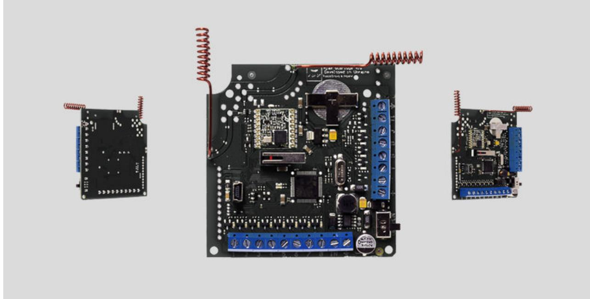
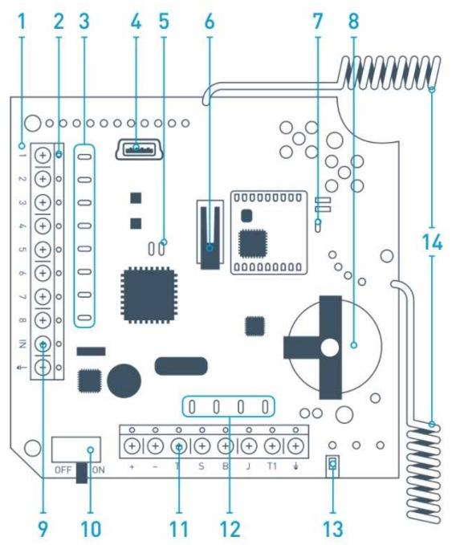
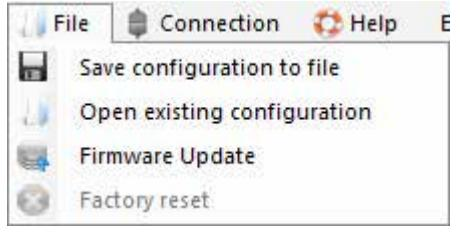
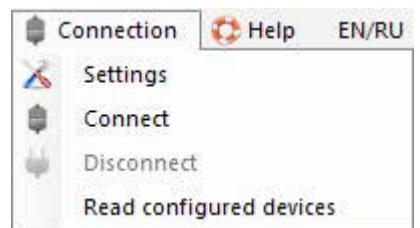
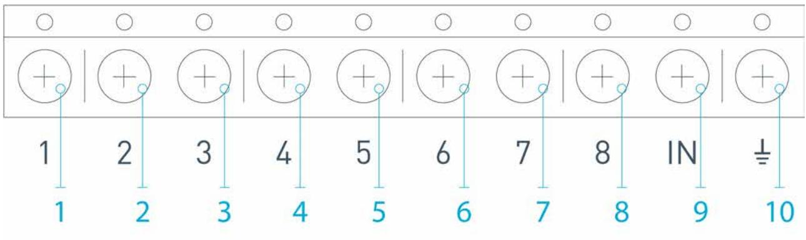
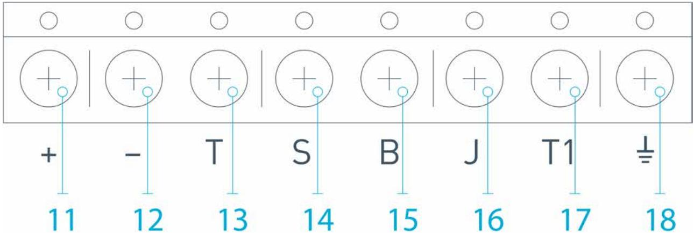
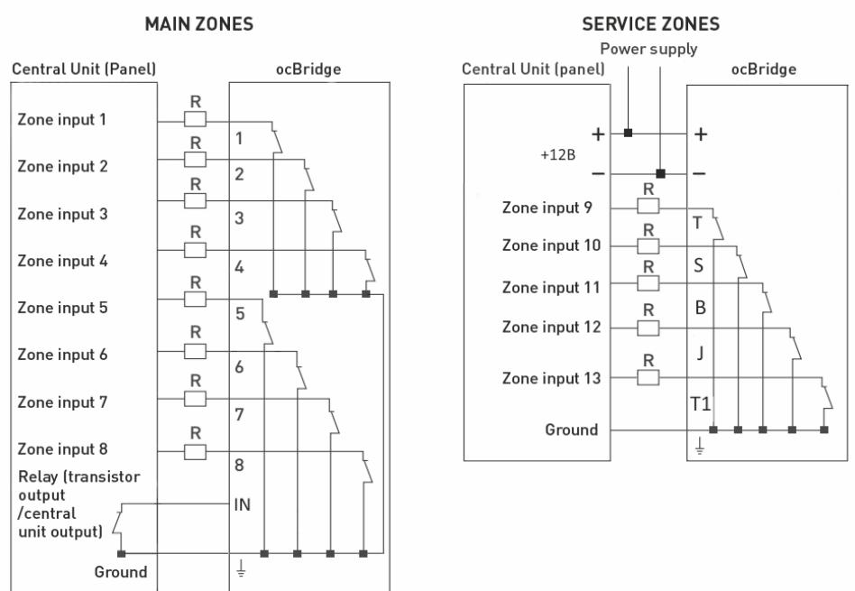

# ocBridge Plus User Manual

Updated November 18, 2021

Wireless sensors' receiver **ocBridge Plus** is designated for connecting compatible Ajax devices to any third party wired central unit (panel) with a help of NC/NO contacts. Ajax system has two-way connection with the sensors which enables it's functioning in two modes: active mode and passive mode. When the system is in passive mode, wireless sensors switch to power-saving mode, which makes it possible to extend significantly battery life.

> If the receiver ocBridge Plus is connected to the wire central unit, the digital input «IN» (wire input) MUST have connection with relay output or transistor output from the central unit, and this output must be inverted when the central unit is being armed or disarmed. Detailed description of connection to the central unit described in **Managing the central unit**.

#### Buy ocBridge Plus

### Functional Elements

Picture 1. ocBridge Plus wireless sensors receiver

- **1.**  ocBridge Plus main board
- **2.**  terminal strip for connection to the main zones of the central unit
- **3.**  8 red lights indicators of the main zones
- **4.**  mini USB connector
- **5.**  red and green light indicators (consult the table for the description)
- **6.**  «opening» tamper button
- **7.**  green power supply indicator
- **8.**  battery for backup saving
- **9.**  IN digital input
- **10.**  power supply switch
- **11.**  terminal strip for connection to the central unit service zones
- **12.**  4 green indicators of the service zones
- **13.**  «breakdown» tamper button (on the reverse of the main board)
- **14.**  antennas

## Sensors' handling

1. Connect the ocBridge Plus to the computer with a help of USB cable (type A– miniUSB) through connector «**4**» (Picture 1). Turn on the receiver with the switch «**10**» (Picture 1).

If it is the first connection, wait until the system identify new device and install the software drivers. If the drivers were not installed automatically, you will have to install the driver-program **vcpdriver_v1.3.1** manually. There are different versions of this program for x86 and x64 Windows platforms.

In the archive **vcpdriver_v1.3.1_setup.zip** on CD you can find two files: **VCP_V1.3.1_Setup.exe** for 32-bit Windows operating systems and **VCP_V1.3.1_Setup_x64.exe** — for 64-bit Windows operating systems on the CD. Please note that if you initially install an unsuitable driver and then install the correct one over it, ocBridge Plus will not work with the PC's configurator program!

If the wrong driver was installed, at first, it is necessary to uninstall it (through Windows programs uninstall), then reboot the computer and install the necessary software driver. Also, **.NET Framework 4** (or newer version) should be installed. After drivers installation, launch the program «**Ajax ocBridge Plus configurator**».

Consults **Using configuration software** of this manual provides the details about the program «Ajax ocBridge Plus configurator» functioning. In the program settings in «Ajax ocBridge Plus configurator» settings (menu «**Connection**» — «**Setting**»), select COM port that is chosen by the system for the receiver (Picture 2), click «**OK**» and then the «**Connect**» button. «Ajax ocBridge Plus configurator» is ready to work with the ocBridge Plus receiver.

| USB Connection settings |              |
|-------------------------|--------------|
| Port                    | COM3 COM3 |
| Ok                      | Cancel       |

Picture 2. Selecting the COM port for connecting the receiver to the computer

Light «**5**» (Picture 1) indication description:

| Indication | Description |
|------------|-------------|
|            |             |

| Green light is permanent, red light does not blink                                                                | ocBridge Plus is in configuration mode. In configuration, there are Pages "Radio zones" or «Events memory» are opened. During this period, the sensors do not receive the responses to the alarm signals and statuses |
|----------------------------------------------------------------------------------------------------------------------|-----------------------------------------------------------------------------------------------------------------------------------------------------------------------------------------------------------------------------------|
| Green — blinks once per second (before, the green light was permanent), and the red — blinks during 30 seconds | New radio set unit detection mode is on                                                                                                                                                                                           |
| The red blinks momentarily                                                                                           | A moment when the ocBridge Plus receiver register a new device                                                                                                                                                                 |
| The green — blinks for 10 minutes and the red is permanent; no red light                                       | Searching for all devices after the previously saved PC configuration is downloaded, system is armed; system is disarmed                                                                                                 |
| No green and red light                                                                                               | The receiver is in in the operating mode, the system is disarmed                                                                                                                                                               |
| Permanent red light                                                                                                  | The receiver is in operating mode, the system is armed                                                                                                                                                                         |
| Permanent green light, the red light is blinking very fast                                                        | Radio signal is tested in order to connected sensor or other device                                                                                                                                                            |
| Green light blinks momentarily                                                                                       | New detectors' polling period started, 36 seconds by default                                                                                                                                                                   |
| Red/green- blinks momentarily                                                                                        | Failure is detected                                                                                                                                                                                                               |

2. All devices that you want to connect to the ocBridge Plus must be registered with a help of «**Ajax ocBridge Plus configurator**». In order to register the sensors, it is necessary to create radio zones in the configurator in case of it had not been done before. To do this select the "**Radio zone**" and click «**Add zone**» button (Picture 3).

| Connection · Help File Radio zone Radio zone | EN/RU Events log (()) System's monitor Write Read 1-57 Add zone H | Connect                                                                                  |
|----------------------------------------------------------|-------------------------------------------------------------------------------------|------------------------------------------------------------------------------------------|
| Radio devices RangeExtenders                          | Zone # Zone name Zone type Initial state                                      | Service events control Tamper Adv. settings 7 Lost connection                   |
|                                                          | Adding zone Zone type Alam 10 Zone name Zone 1                       | Adv. settings Battery Adv. settings Adv. settings Jamming                    |
|                                                          | Advanced settings Ok Cancel                                                | Response penod 36 seconds The input "IN" configuration NO Amed state 1 |
|                                                          |                                                                                     |                                                                                          |

Picture 3. Adding a zone

Then, appropriate "Zone type" and settings is to be selected (consult **Managing the central unit** of the present manual). To add a device chose necessary zone and click "**Add a device**" button. Then, a "**Adding new device**" window appears and it is necessary enter sensor's identifier (ID) applied on it below QR code, then click the "**Search**" button (Picture 4).

When the search indicator bar begins to move, it is necessary to turn on the sensor. The registration request is sent only when the sensor is being switched on! In case of the registration fail, turn off the sensor for 5 seconds and then turn it on again. If the sensor is on and its light blinks once per second during one minute, it means that the sensor is not registered! The light blinks in the same way if the sensor is deleted from the ocBridge!

| Radio zone Radio zone Zone 1 (Alam) -4 ન્દ્રી | Events log (()) System's monitor Write Add Device | Read             |                              | Disconnect |                  |         |
|-----------------------------------------------------------|---------------------------------------------------------|------------------|------------------------------|------------|------------------|---------|
| Zone 2 (Alam) म Зона 3 (Alam)                       | Device name H                                        | Device type      |                              | Device ID  | Software version |         |
| Зона 4 (Automation) F                                  | DoorProtect                                             | Ajax DoorProtect |                              | 777000     | N/A              | િક ( |
| SpaceCor RangeExtend                                   | Device Ajax MotionProtect ID 005633 is detected         |                  | Choose from existing list |            | N                |         |
|                                                           |                                                         | OK               |                              |            |                  |         |

3. If the sensor was mistakenly registered in a wrong zone, click on its "**Properties**" button. The settings window will appear permitting to select a new zone for the sensor (Picture 5). You can also open the detector properties menu by clicking the corresponding button opposite the detector in the general list of the "Radio devices" tree.

| Device properties  |                      |     |  |
|--------------------|----------------------|-----|--|
| Device name:       | Motion Protect       |     |  |
| Device IID:        | 005633               |     |  |
| Device type        | Ajax MotionProtect   |     |  |
| Software version   | MotionProtect 3.29.0 |     |  |
| Additional input   | 3 4 5 6 വ      | 7   |  |
| Active in the zone | 0000000              |     |  |
| 24 h active        |                      |     |  |
| Sensitivity        |                      |     |  |
|                    |                      |     |  |
| min                | mid                  | max |  |
| Ok                 | Cancel               |     |  |

When an additional wire sensor is connected to the external digital input of the wireless sensor, in the properties activate the checkbox "**Additional input**" (Picture 5). If a sensor (for example, a LeaksProtect) is designed for working 24 h, activate in the checkbox properties "**24 h active**". 24 h sensors and normal sensors should not be placed in the same zone! If necessary, adjust the sensor's sensitivity.

4. When the sensors are successfully registered in the security system, click the button "**Write**" (Picture 4) to save sensors' configuration data in the ocBridge Plus receiver's memory. When ocBridge Plus connected to the PC, click the button "**Read**" (Picture 4) to read the pre-saved sensors' configuration from the ocBridge Plus memory.

Make sure that installation location of sensor, has a stable radio contact with the ocBridge Plus receiver! A maximum distance of 2000 m (6552 ft) between the sensor and the receiver is mentioned as a comparison with other devices. This distance was found is as a result of open area tests. Connection quality and distance between the sensor and the receiver can vary depending on installation location, walls, compartments, bridgings, as well as the thickness and constructional material. The signal loses a power passing through barriers. For example, distance between the detector and receiver that divided by two concrete walls is approximately 30 m (98.4 ft). Take into consideration, if you move the sensor even 10 cm (4 in), it is possible to improve significantly the quality radio signal between the sensor and the ocBridge Plus.

5. Select an appropriate place to install the sensors.

Please check the signal level of the connected devices! The radio signal test you can find on the page "**System's monitor**" of the configuration software. To start radio signal test press the button with antenna against the selected sensor (Picture 6) (only when the sensors are in the operating mode and there is no red light).

|   | Connection File 11 Radio zone | C. Help Events log | EN/RU  | System's monitor | Write Read        | 8            |                  |             | Disconnect |                   |  |  |
|---|----------------------------------------|-----------------------|--------|------------------|----------------------|--------------|------------------|-------------|------------|-------------------|--|--|
| # | Device name                            | Device type           | Zone # | Device ID        | Software version     | Signal level | Battery level | Temperature | 24 h       | Event             |  |  |
|   | MotionProtect                          | Ajax MotionPro        |        | 005633           | MotionProtect 3.29.0 | -31/10 dBm   | 3.2 V            | 26 ℃        |            | Movement detected |  |  |

Picture 6. "System monitor" page

| Radio signal test                              |      |                              |                    |      |      |      |  | × |
|------------------------------------------------|------|------------------------------|--------------------|------|------|------|--|---|
| Device name: Device type Device ID Er | D    | MotionProtect 005633 2 | Ajax MotionProtect |      |      |      |  |   |
| Loc RSSI                                       | -40  | 9B                           | Avg Loc RSSI       | -32  |      | AB @ |  |   |
| Rem RSSI                                       | -54  | 9B                           | Avg Rem RSSI       | -51  |      | AB O |  |   |
| Loc Noise                                      | -ਰਦ  | 9B                           | Avg Loc Noise      | -95  | 98   | ( )  |  |   |
| Rem Noise                                      | -105 | 9B                           | Avg Rem Noise      | -110 | AB O |      |  |   |
|                                                |      |                              | Start              |      |      | Stop |  |   |

Picture 7. Signal level

The results of the test are shown in the configuration software (Picture 7) as 3 indication bars, and by the sensor light. The test results can be the following:

| Receiver          | Sensor Light Emitting Diode                               | Description      |
|-------------------|-----------------------------------------------------------|------------------|
| 3 indication bars | Lights permanently, with short breaks each 1.5 seconds | Excellent signal |
| 2 indication bars | Blinks 5 times per second                                 | Medium signal    |
| 1 indication bar  | Blinks twice per second                                   | Low signal       |
| No bar            | Short flashes each 1.5 seconds                            | No signal        |

Please install the sensors in the places with the signal level of 3 or 2 bars. Otherwise, the sensor may function inconsistently.

6. The maximum number of devices that you can connect to the ocBridge Plus depends on the polling period.

| Sensors' Quantity | Polling Period      |
|-------------------|---------------------|
| 99                | 36 seconds and more |
| 79                | 24 seconds          |
| 39                | 12 seconds          |

7. List of supported wireless detectors and devices:

- DoorProtect
- MotionProtect
- GlassProtect
- LeaksProtect
- FireProtect
- CombiProtect
- SpaceControl
- MotionProtect Plus
- FireProtect Plus

## Using configuration software

- 1. "**File**" menu (Picture 8) allows to:
	- save active configuration of ocBridge Plus settings in file on PC (**Save configurations to file**);
	- upload to ocBridge Plus the settings' configuration saved on the computer (**Open the existing configuration**);
	- start the firmware upgrade (**Firmware update**);
	- clear all settings (**Factory reset**). All the data and previously saved settings will be deleted!

Picture 8. "File" menu

- 2. "**Connection**" menu (Picture 9) allows to:
	- select COM port for ocBridge Plus connection to the computer (**Settings**);
	- connect the ocBridge Plus to the computer (**Connection**);
	- disconnect ocBridge Plus from computer (**Disconnection**).

Picture 9. "Connection" menu

- 3. The "**Help**" menu (Picture 10) allows you to:
- find the information on the current software version;
- download the help file.

| Help     |  |
|----------|--|
| Firmware |  |
| Help     |  |

Picture. 10. "Help" menu

4. On page "**Radio zones**" (Picture 11) it is possible to create required the detection zones areas required and to add there sensors and devices (consult **Sensors' handling**) and also to set the additional parameters of sensors', devices' and zones functioning (consults **Managing the central unit**).

| (8) System's monitor Radio zone Events log Radio zone                                                                                   |        | Write Read Add zone |            |               | Disconnect |                                             |                      |
|--------------------------------------------------------------------------------------------------------------------------------------------------|--------|---------------------------|------------|---------------|------------|---------------------------------------------|----------------------|
| Zone 1 (Alam) Zone 2 (Alam)                                                                                                                   | Zone # | Zone name                 | Zone type  | Initial state |            | Service events control                      |                      |
| Зона 3 (Alam)                                                                                                                                    |        | Zone 1                    | Alam       | NC            | A (2    | V Tamper                                    | Adv. settings        |
| MotionProtect (MotionProtect) DoorProtect (DoorProtect)                                                                                       | 2      | Zone 2                    | Alam       | NC            | A          | > Lost connection                           | Adv. settings        |
| Зона 4 (Automation) ਸ                                                                                                                         | 3      | Зона 3                    | Alam       | NC            | 3 ん     | V Battery                                   | Adv. settings        |
| SpaceControl Btn.2 (SpaceControl)                                                                                                                | র্ব    | Зона 4                    | Automation | NC            | 15 3    |                                             |                      |
| Зона 5 (Am/disam) H                                                                                                                           | 5      | Зона 5                    | Am/disam   | NC            | A 3     | Jamming                                     | Adv. settings        |
| SpaceControl Btn. 1 Btn.3 (SpaceControl) Zone 6 (Alam) 4                                                                                   | 6      | Zone 6                    | Alam       | NC            | 6 3     |                                             |                      |
| Zone 7 (Alam) -1                                                                                                                              | 7      | Zone 7                    | Alam       | NC            | હિ A    | Response penod                              | રૂદિ seconds V |
| Radio devices Motion Protect 22 (Motion Protect) MotionProtect (MotionProtect) DoorProtect (DoorProtect) SpaceControl (SpaceControl) |        |                           |            |               |            | The input "IN" configuration Armed state | NO 14             |

Picture 11. Radio zones

5. The buttons "**Write**" and "**Read**" are used for saving data in ocBridge memory and for reading current configuration settings (**Sensors' handling**).

6. "**Events memory**" page stores information about alarming events (Picture 12), service events (Picture 13) and statistics tables (Picture 14). It is possible to renew information in data logs or to clear them with "**Log reset**" button. The logs contains up to 50 alarming events and 50 service events. With the button "**Save in file**", it is possible to save the events logs in xml format which can be opened with Excel.

| Configurator Ajax ocBridge 2.21.6                           |            |                                 |                                   |           |                   |  | × |
|-------------------------------------------------------------|------------|---------------------------------|-----------------------------------|-----------|-------------------|--|---|
| File 1                                                   | Connection | EN/RU · Help                 |                                   |           |                   |  |   |
| Radio zone                                                  |            | Events log                      | System's monitor Write Read | 8         | Disconnect        |  |   |
| Save to file 1 Alams Service events Sequence of |            | Refresh log Statistics table | Clear log                         |           |                   |  |   |
| events                                                      | Zone #     | Device name                     | Device type                       | Device ID | Event             |  |   |
|                                                             |            | Motion Protect                  | Ajax MotionProtect                | 005633    | Movement detected |  |   |
| 2                                                           | 1          | Motion Protect                  | Ajax MotionProtect                | 005633    | Movement detected |  |   |
|                                                             |            | MotionProtect                   | Ajax MotionProtect                | 002633    | Movement detected |  |   |

Picture 12. Alarming events log

Events in all logs are displayed chronologically, starting from the first one and ending with the last one. The event number 1 is the last event (the most recent event), the event number 50 is the oldest event.

| File                       | Configurator Ajax ocBridge 2.21.6 Connection | EN/RU · Help                 |                                   |           |                | 1 | × |
|----------------------------|-------------------------------------------------|---------------------------------|-----------------------------------|-----------|----------------|---|---|
| Radio zone                 |                                                 | Events log                      | Write System's monitor Read |           | Disconnect     |   |   |
| Save to file m Alams | Service events                                  | Refresh log Statistics table | clear log                         |           |                |   |   |
| Sequence of                | Zone #                                          | Device name                     | Device type                       | Device ID | Event          |   |   |
| events                     |                                                 | Ajax ocBridge                   |                                   |           | System anned   |   |   |
| 2                          |                                                 | Ajax oc Bridge                  |                                   |           | System disamed |   |   |
| 3                          |                                                 | MotionProtect                   | Ajax MotionProtect                | 005633    | Tamper opened  |   |   |

Picture 13. Service eventlog

With the statistics table (Picture 14) it is easy to handle important data from each sensor: sensor's location in specific zone and in general in the network; to observe the battery state in each sensor; to track the tamper buttons' state in all sensors; to see which sensor generated the alarm and how many times; to estimate the signal stability according to data on signal failures. In the same data chart, there the service data is displayed – sensor's name, device type, its ID, zone number / zone name.

| File |                          | Configurator Ajax ocBridge 2.21.6 EN/RU C. Help |                  |        |           |                  |                 |                     |            |                         |                        |  | × |
|------|--------------------------|-------------------------------------------------------|------------------|--------|-----------|------------------|-----------------|---------------------|------------|-------------------------|------------------------|--|---|
|      | Connection Radio zone | Events log                                            | System's monitor | Write  | Read 8 |                  |                 |                     | Disconnect |                         |                        |  |   |
|      | Save to file             | Refresh log                                           | 1831             | 105    |           |                  |                 |                     |            |                         |                        |  |   |
|      |                          |                                                       |                  |        |           |                  |                 |                     |            |                         |                        |  |   |
|      | Alams Service events     | Statistics table                                      |                  |        |           |                  |                 |                     |            |                         |                        |  |   |
| #    | Device name           | Device type                                           | ID device        | Zone # | Zone name | Battery state | ampers state | Connection state | Alams      | Low level batter, | Connection failures |  |   |

7. The page "**System's monitor**" is designated for sensors' state control and for tests of their radio connection. The sensor's current state is defined with its background lighting color (Picture 15):

- white background the sensor is connected;
- gray background the connected detector starts operation, ocBridge Plus waits for the detector to send its first status and will transmit the current system settings in response to it;
- light-green lighting (during 1 second) is turning on when the status is received from the sensor;
- orange lighting (during 1 second) is on when the alarm signal is received from the sensor;
- yellow lighting the sensor's battery is low (only the battery level is illuminated);
- red lighting the sensor is not connected, it is lost or not in working mode.

|   | Connection File    | Help           | EN/RU  |                     |                      |              |                  |                      |            |                   |                       |   |  |
|---|-----------------------|----------------|--------|---------------------|----------------------|--------------|------------------|----------------------|------------|-------------------|-----------------------|---|--|
|   | Radio zone            | Events log     |        | System's monitor    | Write Read        | V            |                  |                      | Disconnect |                   |                       |   |  |
| # | Device name           | Device type    | Zone # | Device ID           | Software version     | Signal level | Battery level | Temperature          | 24 F       | Event             |                       |   |  |
|   | Motion Protect        | Ajax MotionPro |        | 005633              | MotionProtect 3.29.0 |              |                  |                      |            | Movement detected |                       | 0 |  |
|   | ocBridge V3.27.0 COM3 |                |        | Noise lev. - 95 dBm |                      |              | SB               | Current state: Armed |            |                   | Polling period 21/ 36 |   |  |

Picture 15. The connected sensors are entering to working mode

8. In the bottom of "**System monitor**" (Picture 16) the information is displayed about:

- **1.** current connection to the computer;
- **2.** background noise level;
- **3.** alarm and service zones condition (active zones are highlighted);
- **4.** current alarm system state (**Activated/Deactivated**);
- **5.** countdown timer of the sensors' current poling period.

9. The detection area test (Picture 16) is required to make sure that the sensors are working efficient in their current position. In testing mode the sensor light is on permanently, switching off for 1 second while activation – it is very easy to observe. In contrast to radio signal test, the detection area test for several sensors simultaneously is possible. For this, choose the check-box against each device in the window "**Area detection test**", having opened previously the test window by pressing the button of magnifying glass against the selected sensor. The key fob does not support the detection area tests and radio signal tests. SpaceControl

| Detection area test |                  |           |                    |           |                   |     | ×        |
|---------------------|------------------|-----------|--------------------|-----------|-------------------|-----|----------|
| Device name         | Current state    | Zone name | Device type        | Device ID | Event             |     |          |
| MotionProtect       | test in progress | Zone 1    | Ajax MotionProtect | 005633    | Movement detected |     | ಷ        |
|                     |                  |           |                    |           |                   |     |          |
|                     |                  |           |                    |           |                   |     |          |
|                     |                  |           |                    |           |                   |     |          |
|                     |                  |           |                    |           |                   |     |          |
|                     |                  |           |                    |           |                   |     |          |
|                     |                  |           | Stop               |           | Select:           | All | None  |

Picture 16. Detection area test

## Managing the central unit

1. It is necessary to install the ocBridge Plus near the alarm system central unit (panel). Do not install the receiver in the metal box, it will worsen considerably the radio signal receiving from the wireless sensors. If installation in the metal box is indispensable, it is necessary to connect an external antenna. On the ocBridge Plus board, there are pads for installing SMA-sockets for external antennas.

> When connected to the central unit, the wires (especially the power wires) must not touch the antenna as they can worsen the connection quality. ocBridge Plus's radio antennas must be as far as possible from the alarm system GSM-module in case there is such a module.

2. With a help of ordinary wires, the receiver's outputs (PictureS 17, 18) are connected to the alarm system central unit inputs. Thus, the receiver's outputs are analogues of ordinary wire sensors for the central unit inputs. When the wireless sensor is activated, it sends the signal to ocBridge Plus. The ocBridge Plus receiver processes the signal and opens (by default, the output can be also set for closing) the wire output corresponding to the sensor.

The alarm system's central unit reads the output opening as the sensor's zone opening and sends an alarm signal. If it is mentioned that the central unit zone must have high resistance between the receiver's output and the central unit zone, the resistor with nominal required by the central unit must be placed with serial connection.

Observe the polarity while connecting the wires!

#### 3. The outputs with numbers 1–8 (Picture 17) correspond to 8 main nominal alarm zones.

Picture 17. Main outputs and input "IN" of the receiver

Other 5 outputs of ocBridge Plus are service zones and correspond to the service inputs of the alarm system central unit.

Picture 18. ocBridge Plus receiver's service outputs and power supply

The table provides the description for main and service zones' contacts:

| Output №  | Marking | Description                                                                                 |
|-----------|---------|---------------------------------------------------------------------------------------------|
| 1         | 1       | 1st zone output                                                                             |
| 2         | 2       | 2nd zone output                                                                             |
| 3         | 3       | 3rd zone output                                                                             |
| 4         | 4       | 4th zone output                                                                             |
| 5         | 5       | 5th zone output                                                                             |
| 6         | 6       | 6th zone output                                                                             |
| 7         | 7       | 7th zone output                                                                             |
| 8         | 8       | 8th zone output                                                                             |
| 9 (Input) | IN      | Wire input for connecting to the central unit output (for alarm system arming/disarming) |
| 10        |         | Ground for connection to the central unit                                                   |
| 11        | +       | Power supply plus                                                                           |
| 12        | –       | Power supply minus                                                                          |
| 13        | T       | "Tamper" service output                                                                     |
| 14        | S       | "Connection failure" service output                                                         |
| 15        | B       | "Battery" service output                                                                    |
| 16        | J       | "Jamming" service output                                                                    |
| 17        | T1      | "Tamper" service output                                                                     |
| 18        |         | Ground for connection to the central unit                                                   |

The receiver is connected to the central unit as explained by the scheme:

4. Zones are divided into 3 types: **alarm zones**, **automation zones** and **arm/disarm zones** (Picture 19). Zone type is selected when the zone is created, consult **Sensors' handling**.

|          | Alam                            |
|----------|---------------------------------|
|          | Arm/Disam Automation Alam |
|          |                                 |
| settings |                                 |
|          | Cancel                          |
|          | Advanced                        |

Picture 19. Selecting zone type

The alarm zone can be set (Picture 20) as NC (normally closed contacts) and as NO (normally opened contacts).

| Alarm zone (7)      |          |
|---------------------|----------|
| Zone name Zone 7 |          |
| Alam zone settings  |          |
| Impulse time        | 1        |
| Initial state       | NC       |
|                     | NO NC |
| Ok                  | Cancel   |

The alarm zone reacts to bistable detectors (e.g. DoorProtect and LeaksProtect) with opening/closing, depending on setting "**Initial state**" (**NC/NO**). The zone is in alarm mode until the bistable detectors state returns to its initial state. The zone reacts to impulse sensors (e.g. MotionProtect, GlassProtect) with opening/closing depending on setting "Initial state" (NC/NO) with the impulse, its duration can be adjusted by the setting "**Impulse time**" (Picture 20). By default, the "Impulse time" is 1 second, 254 seconds maximum. If alarm is raised, the zone's red light "**3**" is on (Picture 1).

Automation zone can be set as NC or NO (Picture 21). When the "**Impulse**" way to react is chosen, the zones reacts to all activations with opening/closing, depending on "**Initial state**" setting for the time set in the setting "**Impulse time**" — 1 second by default and 254 seconds maximum.

| Zone name                |           |
|--------------------------|-----------|
| Zone 4                   |           |
| Automation zone settings |           |
| Reaction mode            | Impulse > |
|                          | Trigger   |
| Impulse time             | mpulse    |
| Initial state            | NC        |

Picture 21. Automation zone settings

When the "**Trigger**" reaction mode is selected, the zone output changes its initial state to the opposite one with each new activation signal. The light indicates the automation zone's current state – with the activation signal, a red light turns on or turns off if the normal state is restored. With the "**Trigger**" reaction mode, "**Impulse time**" parameter is unavailable.

**The arming/disarming zone** is intended for connecting SpaceControl key fobs (Picture 22). Please note that KeyPad cannot be connected to the ocBridge Plus integration module.

In addition, arming/disarming inputs of third-party central panels can be connected to this zone to control its security modes.

| Zone 5                 |                    |
|------------------------|--------------------|
| Am/Disam zone settings |                    |
| Initial state          | NC V            |
| Reaction mode          | Trigger V          |
| Impulse time           | Trigger Impulse |

Picture 22. Arm/disarm zone settings

Arm/disarm zone can be set to initial state NC or NO. When the keyfob is registered, in arm/disarm zone two buttons are added simultaneously: button 1 — arming and button 3 — disarm. To arm, the zone reacts with closing/opening the output, depending on the setting "**Initial state**" (**NC/NO**). When this zone is activated, the red light corresponding to it turns on, and when it is deactivated, the light "**3**" (Picture 1) is off.

5. **The input "IN"** is designated for connecting transistor output or the central unit (panel) relay (Picture 1). If the "**IN**" input condition changes (**Closing/Opening**), the whole set of sensors connected to the receiver are set to "passive" mode (except for the sensors ticked as 24 h active), with the initial state restore — the sensors are set to "active", and the red light is on.

In case several groups of sensors are used independently on the central unit, the ocBridge Plus is to be set to the "**active**" mode even if only one group of central unit is in armed mode. Only when all groups on central unit are deactivated, is possible to set the ocBridge Plus and sensors to "passive". Use of "passive" mode of the sensors when system disarmed will significantly improve battery life of the sensors.

While connecting the key fob to the wireless sensors' receiver ocBridge, be careful in connecting the keyfob to the zones! Please, don't connect the keyfob to the zones with bistable sensors. Do not forget: the longer the polling period (Picture 22) of the sensors is (it varies from 12 to 300 seconds, 36 seconds set by default), the longer is wireless sensors' battery life! At the same time it is suggested not to use a long polling period in secure systems for places where delay can be critical (for example, in financial institutions). When the polling period is too long, the time span of statuses sending from the sensors is increasing, which influences secure system's reaction to service events (e.g. lost connection event). The system always reacts immediately to alarm events with any polling period.

6. **4 outputs (T, S, B, J)** correspond to service zones (Picture 18). Service zones are used for sending operation data to the central unit. Service outputs' functioning is adjustable (Picture 23), they can be impulse of bistable ones. It is possible to switch off service outputs, in case they are not used in security system's central unit (panel). To switch off untick the checkbox against an appropriate output's name in configuration software (Picture 22).

| Service events control       |               |  |
|------------------------------|---------------|--|
| Tamper                       | Adv. settings |  |
| Lost connection              | Adv. settings |  |
| V Battery                    | Adv. settings |  |
| Jamming                      | Adv. settings |  |
|                              |               |  |
| Response period              | 36 seconds |  |
| The input "IN" configuration |               |  |
| Armed state                  | NO            |  |
|                              |               |  |

Picture 23. Service outputs setting menu on page "Radio zones"

If the "**Impulse**" mode is selected for reaction, the zone reacts to all activations by closing/opening the output depending on "**Initial state**" setting (**NC/NO**) for the time set in "**Impulse time**" option (Picture 24). By default, the impulse time is 1 second and the maximal value is 254 seconds.

| Tamper zone settings (T) |          |
|--------------------------|----------|
| Tamper zone settings (T) |          |
| Reaction mode            | Impulse  |
| Impulse time             | 4 1 1 |
| Initial state            | NC       |
| Ok                       | Cance    |

When "**Bistable**" mode is chosen for reaction, service zone reacts by closing/opening the output depending on "**Initial state**" setting (**NC/NO**) until the zones returns to the initial state. When the initial state is changed, green light "**12**" of the appropriate service zone (Picture 1) turns on.

**Output T — "Tamper"**: if one of the sensors is opened or separated from the assembling surface, its tamper button is activated and the sensor sends the alarm signal of opening/breaking.

**Output S — "Lost connection"**: if one of the sensors does not send the status signal during check time, the sensor changes the output condition **S**. Service zone **S** will activate after the period of time equal to the parameter "**Polling period**" multiplied by the parameter "**Passes number**" (Picture 25). By default, if ocBridge Plus does not receive 40 heartbeats from sensor successfully, it generates an "Lost connection" alarm.

| Lost connection zone settings (S) |           |  |  |
|-----------------------------------|-----------|--|--|
| Lost connection zone settings (S) |           |  |  |
| Reaction mode                     | Impulse   |  |  |
| Impulse time                      | 1         |  |  |
| Passes number                     | 4 1 40 |  |  |
| Initial state                     | NC        |  |  |
| Ok                                | Cancel    |  |  |

Picture 25. Service output S properties menu

**Output B — "Battery"**. When the sensor the battery has run down, the sensor sends the signal about it. When the battery has run down, zone "**B**" does not function for a key fob SpaceControl, but the message about the battery running down can be found in service events log. On the keyfob, the discharged battery is shown by its light indication.

**Output J — "Jamming"**: in case it is found that the radio signal is being jammed, the receiver changes the output **J** condition. Indicator corresponding to the output **J** begins to light depending on the zone settings: the light is permanently on if the zone was defined as a bistable one; it turns on for the number of seconds specified (1-254 seconds) if the zone was defined as an impulse one.

7. **Output Т1** is responsible for the ocBridge Plus's tampers' state. When the receiver is installed in the box, tamper buttons are pressed, the output is permanently closed. When at least one tamper unpressed, the output is opening and the guard zone sends an alarm signal. It remains in alarm state until both tamper buttons are in normal state again and the output is closed.

## Firmware upgrade

It is possible to upgrade ocBridge Plus's firmware. Download latest version of software from the . site

Firmware is upgraded with a help of configuration software. If the ocBridge Plus is connected to configuration software, you should press "**Disconnect**" button without disconnecting the ocBridge Plus itself from PC. Then, in the menu "**Connection**", you should select a COM port where ocBridge Plus is connected. Then, it is necessary to select "**Firmware upgrade**" in drop-down menu and then, pressing the button "**Select file**", to show the file path to ***.aff** file with new firmware (Picture 26).

| Firmware update                 |             | × |
|---------------------------------|-------------|---|
|                                 | Select file |   |
|                                 |             |   |
| Switch OFF ocBridge to continue |             |   |

Picture 26. Firmware file selection

Then, it is necessary to power the receiver off with switch "**10**" (Picture 1) and turn the device on again. After switching on, the upgrade process begins automatically. In case the process was accomplished successfully, there is a message "**Software upgrade is accomplished**" and the receiver is ready for work.

If there is no message "**Software upgrade is accomplished**" or there were any failures during the software upgrade, you should upgrade the software again.

## Configuration transfer

It is possible to use the sensors' configuration transfer to the other device ocBridge Plus without having to register the sensors again. For the transfer, it is necessary to save the current configuration from "**File**" menu with "**Save configuration to file**" button (Picture 8). Then, it is necessary to disconnect the previous receiver and to connect a new one to the configurator. Then, it is necessary to upload there a configuration saved on the computer using the button "**Open the existing configuration**" and then to press the button "**Write down**". After this, the window of sensors' search will appear (Picture 27) on ocBridge Plus and the green light indicator will blink for 10 minutes.

| Device name     | Current state | Zone name                                                             | Device type        | Device ID |
|-----------------|---------------|-----------------------------------------------------------------------|--------------------|-----------|
| MotionProtect22 | Found         | Zone 2                                                                | Ajax MotionProtect | 2A0004    |
|                 |               | × Configurator Ajax ocBridge All devices are successfully found |                    |           |
|                 |               |                                                                       |                    |           |

Picture 27. Saved configuration devices search

In order to save the sensors in the memory of new receiver, it is necessary to switch off the power switch on all the sensors alternately, to wait for some seconds for the capacitor of the sensors to discharge, and then to turn the sensors on again. When the sensors' search is accomplished, the configuration will be fully copied to new ocBridge. Switching off power supply of the sensors is necessary in order to prevent the security system sabotage. If while sensors' search you didn't reload all sensors, the sensors' search can be relaunched again in the menu "**Connection**" — "**Read configured devices**".

### Maintenance

Once in 6 months, the receiver must be cleared of dust by aeration. The dust accumulated on the device can in certain conditions become current conductive and provoke the receiver's breakdown or interfere with its functioning.

## Specifications

| Type                                                                   | Wireless                                                                                                                                                      |
|------------------------------------------------------------------------|---------------------------------------------------------------------------------------------------------------------------------------------------------------|
| Uses                                                                   | Indoors                                                                                                                                                       |
| Effective radiated power                                               | 8.01 dBm / 6.32 mW (limit 25 mW)                                                                                                                              |
| Radio communication protocol with Ajax devices and detectors        | Jeweller Learn more                                                                                                                                        |
| Radio frequency band                                                   | 866.0 – 866.5 MHz 868.0 – 868.6 MHz 868.7 – 869.2 MHz 905.0 – 926.5 MHz 915.85 – 926.5 MHz 921.0 – 922.0 MHz Depends on the region of sale. |
| Maximum distance between wireless sensor and receiver ocBridge Plus | 2000 m (open area) (6552 ft)                                                                                                                                  |
| Maximum number of connected devices                                    | 99                                                                                                                                                            |
| Radio channel jamming detection                                        | Available                                                                                                                                                     |
| Sensor efficiency control                                              | Available                                                                                                                                                     |
| Alerts and events logs                                                 | Available                                                                                                                                                     |
| External antenna connection                                            | Available                                                                                                                                                     |
| Firmware update                                                        | Available                                                                                                                                                     |
| Tamper protection                                                      | Available (opening + detaching)                                                                                                                               |
| Number of wireless inputs/outputs                                      | 13 (8+4+1)/1                                                                                                                                                  |
| Power supply                                                           | USB (only for system setup); (digital input) +/ground                                                                                                      |
| Power supply voltage                                                   | DC 8 – 14 V; USB 5V (only for system setup)                                                                                                                   |
| Operation temperatures range                                           | From -20°С to +50°С                                                                                                                                           |
| Operation humidity                                                     | Up to 90%                                                                                                                                                     |
| Dimensions                                                             | 95 × 92 × 18 mm (with antennas)                                                                                                                               |
| Service life                                                           | 10 years                                                                                                                                                      |

#### Compliance with standards

#### Components

- **1.** Receiver for wireless detectors 1 pcs
- **2.** CR2032 battery 1 pcs
- **3.** User manual 1 pcs
- **4.** Packing 1 pcs

## Warranty

Warranty for the "AJAX SYSTEMS MANUFACTURING" LIMITED LIABILITY COMPANY products is valid for 2 years after the purchase and does not apply to the pre-installed battery.

If the device does not work correctly, you should first contact the support service — in half of the cases, technical issues can be solved remotely!

#### The full text of the warranty

#### User Agreement

Technical support: support@ajax.systems