# GlassProtect User manual

Posted on December 7, 2021

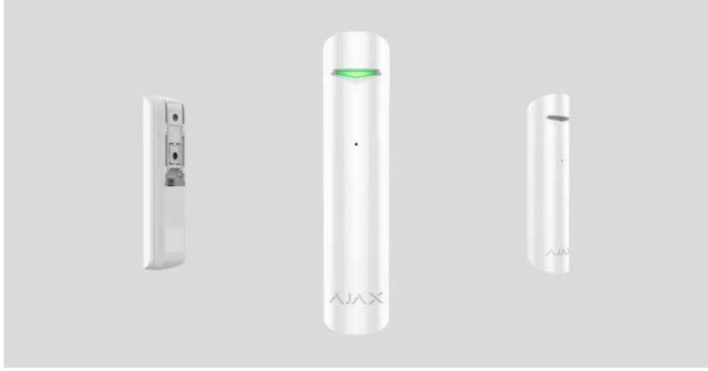

**GlassProtect** is a wireless indoor glass break detector recognizing the sound of shattering the glass at a distance of up to 9 meters. GlassProtect can operate up to 7 years from a pre-installed battery and has a socket for connecting a third-party wired detector.

GlassProtect connects to the Ajax security system via the protected radio protocol. The communication range is up to 1,000 meters in line of sight. Also, GlassProtect can be connected to third-party security systems using the or integration modules. Jeweller Ajax uartBridge Ajax ocBridge Plus

Users can configure GlassProtect via the for macOS, Windows, iOS, or Android. The system notifies users of all events through push notifications, SMS, and calls (if activated). Ajax app

The user can connect the Ajax security system to the central monitoring station of a security company.

#### Buy breakage detector GlassProtect

### Functional elements

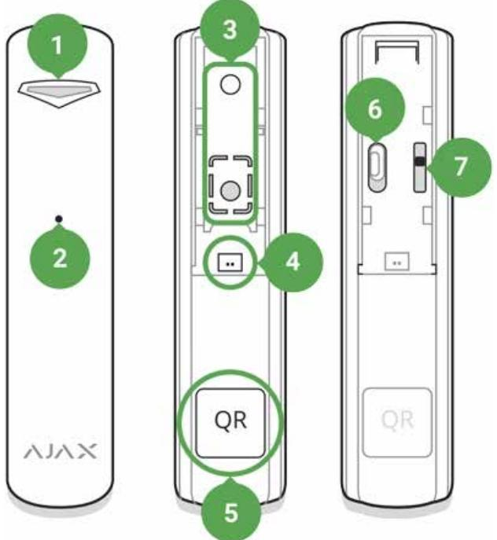

- **1.** LED indicator
- **2.** Microphone hole
- **3.** SmartBracket attachment panel (perforated part is required for actuating the tamper in case of any attempt to dismantle the detector. Don't break it out!)
- **4.** External detector connection socket
- **5.** QR code
- **6.** Device switch
- **7.** Tamper button

# Operating Principle

GlassProtect uses a sensitive electret microphone to detect the sound of glass breaking, consisting of a low-frequency hit sound and high-frequency crashing sound of glass shatters. Such two-stage glass break detection decreases the risk of false triggering.

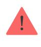

such kind of glass, we recommend using the wireless opening detector with shock and tilt sensors. DoorProtect Plus

If triggered, GlassProtect immediately transmits the alarm signal to the , activating the (if connected) and notifying the user and security company. hub sirens

#### Connecting

#### Detector Connection to hub

#### **Before starting connection:**

- **1.** Following the hub user guide, install the . Create the account, add the hub, and create at least one room. Ajax app
- **2.** Switch on the hub and check the internet connection (via Ethernet cable and/or GSM network).
- **3.** Make sure that the hub is disarmed and does not update by checking its status in the Ajax app.

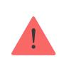

Only users with administrator rights can add the device to the hub.

#### **Pairing the detector with hub:**

- **1.** Select **Add Device** in the Ajax app.
- **2.** Name the device, scan or type the **QR code** (located on the detector body and packaging), and select the location room.

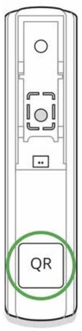

- **3.** Tap **Add** the countdown will start.
- **4.** Switch on the device.

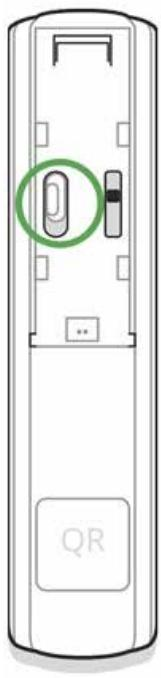

For detection and pairing to occur, the detector should be located within the coverage area of the wireless network of the hub (at a single protected object). The connection request is transmitted for a short time: at the moment of switching on the device.

If the device failed to pair (LED blinks once per second), switch it off for 5 seconds and retry. The detector connected to the hub appears in the list of devices in the app. The update of the detector statuses in the list depends on the device ping interval set in the hub settings (the default value is 36 seconds).

### Connecting to Third-Party Systems

To connect the detector to a third-party central unit using the or integration module, follow the recommendations in the user manual of the respective device. uartBridge ocBridge Plus

#### States

The states screen contains information about the device and its current parameters. Find the GlassProtect states in the Ajax app:

- **1.** Go to the **Devices** tab.
- **2.** Select GlassProtect from the list.

| Parameter                | Value                                                                                            |
|--------------------------|--------------------------------------------------------------------------------------------------|
| Temperature              | Temperature of the detector, measured on the processor and changes gradually.                 |
|                          | Acceptable error between the value in the app and temperature at the installation site: 2–4°C |
| Jeweller Signal Strength | Signal strength between the hub/range extender and the opening detector.                      |
|                          | We recommend installing the detector in places where the signal strength is 2–3 bars          |
| Connection               | Connection status between the hub/range extender and the detector:                            |
|                          | Online — the detector is connected with the hub/range extender                                |
|                          | Offl ine — the detector has lost connection with the hub/range extender                    |
| ReX range extender name  | radio signal Displays the status of using a range extender                                 |
| Battery Charge           | Battery level of the device. Displayed as a percentage                                        |

|                                     | How battery charge is displayed in Ajax apps                                                                                                                                                                                                                                |
|-------------------------------------|--------------------------------------------------------------------------------------------------------------------------------------------------------------------------------------------------------------------------------------------------------------------------------|
| Lid                                 | The tamper state, which reacts to the detachment of or damage to the detector body                                                                                                                                                                                          |
| Delay When Entering, sec            | Entry delay (alarm activation delay) is the time you have to disarm the security system after entering the room. Functions for the connected wired detector only. What is delay when entering                                                                   |
| Delay When Leaving, sec             | Delay time when exiting. Delay when exiting (alarm activation delay) is the time you have to exit the room after arming the security system. Functions for the connected wired detector only. What is delay when leaving                                        |
| Night Mode Delay When Entering, sec | The time of Delay When Entering in the Night mode. Delay when entering (alarm activation delay) is the time you have to disarm the security system after entering the premises. Functions for the connected wired detector only. What is delay when entering |
| Night Mode Delay When Leaving, sec  | The time of Delay When Leaving in the Night mode. Delay when leaving (alarm activation delay) is the time you have to exit the premises after the security system is armed. Functions for the connected wired detector only. What is delay when leaving      |
| Sensitivity                         | Selecting the sensitivity level of the microphone:                                                                                                                                                                                                                          |

|                        | Low                                                                                                                                                                                                                                    |
|------------------------|----------------------------------------------------------------------------------------------------------------------------------------------------------------------------------------------------------------------------------------|
|                        | Normal                                                                                                                                                                                                                                 |
|                        | High                                                                                                                                                                                                                                   |
|                        | The sensitivity level is selected based on the detection zone test results of the                                                                                                                                                |
| External contact       | Status of the external detector connection to GlassProtect                                                                                                                                                                          |
|                        | If the option is active, the detector is always in armed mode and notifies about alarms                                                                                                                                             |
| Always Active          | Learn more                                                                                                                                                                                                                             |
| Chime                  | When enabled, a siren notifies about opening detectors triggering in the Disarmed system mode                                                                                                                                    |
|                        | What is chime and how it works                                                                                                                                                                                                         |
| Temporary Deactivation | Shows the status of the device temporary deactivation function:                                                                                                                                                                     |
|                        | No — the device operates normally and transmits all events                                                                                                                                                                          |
|                        | Lid only — the hub administrator has disabled notifications about triggering on the device body                                                                                                                                  |
|                        | Entirely — the device is completely excluded from the system operation by the hub administrator. The device does not follow system commands and does not report alarms or other events                                     |
|                        | By number of alarms — the device is automatically disabled by the system when the number of alarms is exceeded (specified in the settings for Devices Auto Deactivation). The feature is configured in the Ajax PRO app |
|                        | By timer — the device is automatically disabled by the system when the recovery timer expires (specified in the settings for Devices Auto Deactivation). The feature is configured in the Ajax PRO app                     |

| Firmware   | Detector firmware version        |
|------------|----------------------------------|
| Device ID  | Device identifier                |
| Device No. | Number of the device loop (zone) |

### Settings

To change the detector settings in the Ajax app:

- **1.** Select the hub if you have several of them or if you are using the PRO app.
- **2.** Go to the **Devices** tab.
- **3.** Select **GlassProtect** from the list.
- **4.** Go to **Settings** by clicking on the .
- **5.** Set the required parameters.
- **6.** Click **Back** to save the new settings.

| Setting                  | Value                                                                                                                                                                                                       |
|--------------------------|-------------------------------------------------------------------------------------------------------------------------------------------------------------------------------------------------------------|
| First field              | Detector name that can be changed. The name is displayed in the text of SMS and notifications in the event feed. The name can contain up to 12 Cyrillic characters or up to 24 Latin characters |
| Room                     | Selecting the virtual room to which GlassProtect is assigned. The name of the room is displayed in the text of SMS and notifications in the event feed                                             |
| Delay When Entering, sec | Selecting delay time when entering. Delay when entering (alarm activation delay) is the time you have to disarm the security system after entering the room.                                       |
|                          | Functions for the connected wired detector only. What is delay when entering                                                                                                                          |

| Delay When Leaving, sec             | Selecting the delay time when exiting. Delay when exiting (alarm activation delay) is the time you have to exit the room after arming the security system. Functions for the connected wired detector |
|-------------------------------------|-------------------------------------------------------------------------------------------------------------------------------------------------------------------------------------------------------------------|
|                                     | only. What is delay when leaving                                                                                                                                                                               |
| Arm in night mode                   | If active, the detector will switch to armed mode when using Night mode                                                                                                                                        |
| Night Mode Delay When Entering, sec | The time of Delay When Entering in the Night mode. Delay when entering (alarm activation delay) is the time you have to disarm the security system after entering the premises.                          |
|                                     | Functions for the connected wired detector only.                                                                                                                                                               |
|                                     | What is delay when entering                                                                                                                                                                                       |
| Night Mode Delay When Leaving, sec  | The time of Delay When Leaving in the Night mode. Delay when leaving (alarm activation delay) is the time you have to exit the premises after the security system is armed.                              |
|                                     | Functions for the connected wired detector only.                                                                                                                                                               |
|                                     | What is delay when leaving                                                                                                                                                                                        |
| Alarm LED indication                | Allows you to disable the flashing of the LED indicator during an alarm. Available for devices with firmware version 5.55.0.0 or higher                                                                     |
|                                     | How to find the firmware version or the ID of the detector or device?                                                                                                                                          |
|                                     |                                                                                                                                                                                                                   |
| Sensitivity                         | Selecting the sensitivity level of the microphone:                                                                                                                                                             |
|                                     | Low                                                                                                                                                                                                               |
|                                     | Normal                                                                                                                                                                                                            |
|                                     | High                                                                                                                                                                                                              |

|                                                   | The sensitivity level is selected based on the detection zone test results of the                                                                                                                                                                |
|---------------------------------------------------|--------------------------------------------------------------------------------------------------------------------------------------------------------------------------------------------------------------------------------------------------------|
| External contact                                  | If active, GlassProtect registers external detector alarms                                                                                                                                                                                          |
| Always Active                                     | If the option is active, the detector is always in armed mode and notifies about alarms Learn more                                                                                                                                               |
| Alert with a siren if an external contact is open | sirens If active, added to the system are activated in case of an external detector alarm                                                                                                                                                     |
| Alert with a siren if glass break detected        | sirens If active, added to the system are activated  when the glass break detected                                                                                                                                                            |
| Chime settings                                    | Opens the settings of Chime. How to set Chime What is Chime                                                                                                                                                                                      |
| Jeweller Signal Strength Test                     | Switches the detector to the Jeweller signal strength test mode. The test allows you to check the signal strength between the hub and GlassProtect and determine the optimal installation site What is Jeweller Signal Strength Test |
| Detection Zone Test                               | Switches the detector to the detection area test What is Detection Zone Test                                                                                                                                                                        |
| Signal Attenuation Test                           | Switches the detector to the signal fade test mode (available in detectors with firmware version 3.50 and later) What is Attenuation Test                                                                                                     |
| User Guide                                        | Opens GlassProtect User Guide in the Ajax app                                                                                                                                                                                                          |
| Temporary Deactivation                            | Allows the user to disconnect the device without removing it from the system.                                                                                                                                                                       |

|               | Three options are available:                                                                                                                                             |
|---------------|--------------------------------------------------------------------------------------------------------------------------------------------------------------------------|
|               | No — the device operates normally and transmits all alarms and events                                                                                                 |
|               | Entirely — the device will not execute system commands or participate in automation scenarios, and the system will ignore device alarms and other notifications |
|               | Lid only — the system will ignore only notifications about the triggering of the device tamper button                                                              |
|               | Learn more about temporary                                                                                                                                               |
|               | deactivation of devices                                                                                                                                                  |
|               | The system can also automatically deactivate devices when the set number of alarms is exceeded or when the recovery timer expires.                                 |
|               | Learn more about auto deactivation                                                                                                                                       |
|               | of devices                                                                                                                                                               |
| Unpair Device | Disconnects the detector from the hub and deletes its settings                                                                                                        |

# How to set Chime

Chime is a sound signal that indicates the triggering of the opening detectors when the system is disarmed. The feature is used, for example, in stores, to notify employees that someone has entered the building.

Notifications are configured in two stages: setting up opening detectors and setting up sirens.

#### Learn more about Chime

#### **GlassProtect settings**

Before configuring the chime, make sure that a wired opening detector is connected to GlassProtect and that the **External contact** option is enabled in the GlassProtect settings in the Ajax app.

- **1.** Go to the **Devices** menu.
- **2.** Select the GlassProtect detector.
- **3.** Go to its settings by clicking the gear icon in the upper right corner.
- **4.** Go to the **Chime Settings** menu.
- **5.** Select the siren notification for the event **If external contact is open** (available if the **External contact** option is enabled).
- **6.** Select the chime sound (siren tone): 1 to 4 short beeps. Once selected, the Ajax app will play the sound.
- **7.** Click **Back** to save the settings.
- **8.** Set up the required siren.

#### How to set up a siren for Chime

# Indication

| Event                                                                        | Indication                                                            | Note                                                                                        |
|------------------------------------------------------------------------------|-----------------------------------------------------------------------|---------------------------------------------------------------------------------------------|
| Turning on the detector                                                      | Lights up green for about one second                               |                                                                                             |
| Detector connection to the hub ocBridge Plus , and uartBridge | Lights up continuously for a few seconds                           |                                                                                             |
| Alarm / tamper activation                                                    | Lights up green for about one second                               | Alarm is sent once in 5 seconds                                                          |
| Battery needs replacing                                                      | During the alarm, it slowly lights up green and slowly goes out | Replacement of the detector battery is described in the Battery Replacement manual |

# Functionality testing

The Ajax security system allows conducting tests for checking the functionality of connected devices.

The tests do not start immediately but within a period of 36 seconds when using standard settings. The test time start depends on the settings of the detector ping interval (the paragraph on "**Jeweller**" settings in hub settings).

#### Jeweller Signal Strength Test

Detection Zone Test

Attenuation Test

### Detector functionality testing

Having defined the location of the detector and having fixed the device with the bundled adhesive tape, test the detection zone.

GlassProtect does not react to clapping!

### Testing the detector

Hit the glass with your fist without breaking it. If the detector catches a lowfrequency sound, the LED blinks. Simulate a high-frequency glass shattering sound for 1.5 seconds after the first hit with a special tool or hitting a glass with a metal object. After recognizing the sound, the detector switches off the LED indicator for a second.

> To be triggered when the system is armed, the detector needs to recognize sounds in the following order: low-frequency sound (hit) firstly, then high-frequency sound (glass shattering, shards). Otherwise, the alarm will not go off.

Switch on/off all the appliances that usually operate in the room: generators, air conditioners, etc. If this triggers the detector, try to change the sensitivity or relocate GlassProtect.

Use the sensitivity level, at which the detector correctly passes both test stages and does not respond to any devices operating in the room.

#### Installing the device

### Selecting the Location

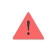

In some cases, the household activity can cause false alarms

The location of GlassProtect depends on its remoteness from the hub, and obstacles hindering the radio signal transmission: walls, floors, large objects inside the room.

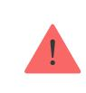

The device developed only for indoor use.

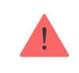

Check the Jeweller signal level at the installation location

If the signal level is low (one bar), we cannot guarantee the stable operation of the detector. Take all possible measures to improve the quality of the signal. At least, move the detector: even a 20 cm shift can significantly improve the quality of signal reception.

If after moving the device still has a low or unstable signal strength, use a . radio signal range extender

#### **Do not install the detector:**

- **1.** outside the premises (outdoors);
- **2.** nearby sirens and speakers;
- **3.** nearby any metal objects or mirrors causing attenuation or screening of the signal;
- **4.** at any places with fast air circulation (air fans, open windows or doors);
- **5.** inside premises with the temperature and humidity beyond the range of permissible limits;
- **6.** closer than 1 m to the hub.

GlassProtect recognizes glass break at a distance of up to 9 meters. Its microphone should be positioned no more than 90 degrees relative to the window(s).

Make sure that any curtains, plants, furniture, or other objects do not overcover the microphone opening.

If there are curtains on the window, place the detector between them and the window, for instance, at the window side jamb. Otherwise, curtains can mute the glass break sound, and the detector will not be triggered.

### Detector installation procedure

Before installing the detector, make sure that you have selected the optimal location that follows the guidelines of this manual!

- **1.** Fix the SmartBracket attachment panel using bundled screws. If you use any other attachment tools, make sure that they do not damage or deform the attachment panel.
Use double-side adhesive tape only for temporary attachment of the detector. The tape runs dry with time, which can cause falling, false triggering, and detector malfunction.

- **2.** Put the detector on the attachment panel. When the detector is fixed in SmartBracket, it blinks with LED, signaling that the tamper is closed.
If LED doesn't blink after fixing in SmartBracket, check the status of the tamper in the Ajax app and then the fixing tightness of the panel.

If someone detaches the detector from the surface or takes it off the attachment panel, the security system notifies you.

### Connecting a Wired Detector

A wired detector with an NC (normally closed) contact type can be connected to GlassProtect using the in-built terminal clamp.

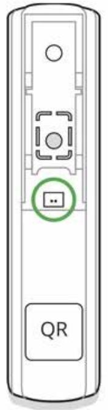

We recommend installing the wired detector at a distance no longer than 1 meter to GlassProtect. Longer wire length increases the risk of its damage and reduces the quality of communication between the detectors.

To put out the wire from the detector body, break out the plug:

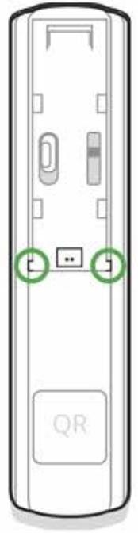

If the connected wired detector is triggered, you receive the notification.

#### Maintenance

Check the operational capability of the detector regularly.

Clean the detector body from dust, spider web, and other contaminants as they appear. Use soft dry napkin suitable for tech equipment.

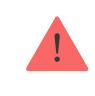

Do not use any substances containing alcohol, acetone, gasoline, and other active solvents to clean the detector.

The pre-installed battery ensures up to 7 years of autonomous operation (with the 5 minutes ping interval by the hub). If the detector battery is low, the system notifies the user, and the LED indicator smoothly lights up and goes off if a glass break is detected or the tamper is triggered.

#### How long Ajax devices operate on batteries, and what affects this

#### Battery Replacement

#### Tech specs

| Sensitive element              | Electret microphone                                                                                                                                           |
|--------------------------------|---------------------------------------------------------------------------------------------------------------------------------------------------------------|
| Glass break detection distance | Up to 9 m                                                                                                                                                     |
| Microphone coverage angle      | 180°                                                                                                                                                          |
| Tamper protection              | Yes                                                                                                                                                           |
| Radio communication protocol   | Jeweller                                                                                                                                                      |
|                                | Learn more                                                                                                                                                    |
| Radio frequency band           | 866.0 – 866.5 MHz 868.0 – 868.6 MHz 868.7 – 869.2 MHz 905.0 – 926.5 MHz 915.85 – 926.5 MHz 921.0 – 922.0 MHz Depends on the region of sale. |
| Compatibility                  |                                                                                                                                                               |

|                                      | hubs radio signal Operates with all Ajax , range extenders ocBridge Plus , , uartBridge                |
|--------------------------------------|--------------------------------------------------------------------------------------------------------------------------------|
| Maximum RF output power              | Up to 20 mW                                                                                                                    |
| Radio signal modulation              | GFSK                                                                                                                           |
| Radio signal range                   | Up to 1,000 m (any obstacles absent)                                                                                           |
| Socket for connecting wire detectors | Yes, NC                                                                                                                        |
| Power supply                         | 1 battery CR123A, 3 V                                                                                                          |
| Battery life                         | Up to 7 years                                                                                                                  |
| Installation method                  | Indoors                                                                                                                        |
| Operating temperature range          | From -10°С to +40°С                                                                                                            |
| Operating humidity                   | Up to 75%                                                                                                                      |
| Overall dimensions                   | Ø 20 × 90 mm                                                                                                                   |
| Weight                               | 30 g                                                                                                                           |
| Service life                         | 10 years                                                                                                                       |
| Certification                        | Security Grade 2, Environmental Class II in conformity with the requirements of EN 50131-1, EN 50131-2-7-1, EN 50131-5-3 |

#### Compliance with standards

### Complete Set

- **1.** GlassProtect
- **2.** SmartBracket mounting panel
- **3.** Battery CR123A (pre-installed)
- **4.** Outside-mounted terminal clamp
- **5.** Installation kit
- **6.** Quick Start Guide

#### Warranty

Warranty for the "AJAX SYSTEMS MANUFACTURING" LIMITED LIABILITY COMPANY products is valid for 2 years after the purchase and does not apply to the pre-installed battery.

If the device does not work correctly, you should first contact the support service — in half of the cases, technical issues can be solved remotely!

#### The full text of the warranty

User Agreement

Technical support: support@ajax.systems