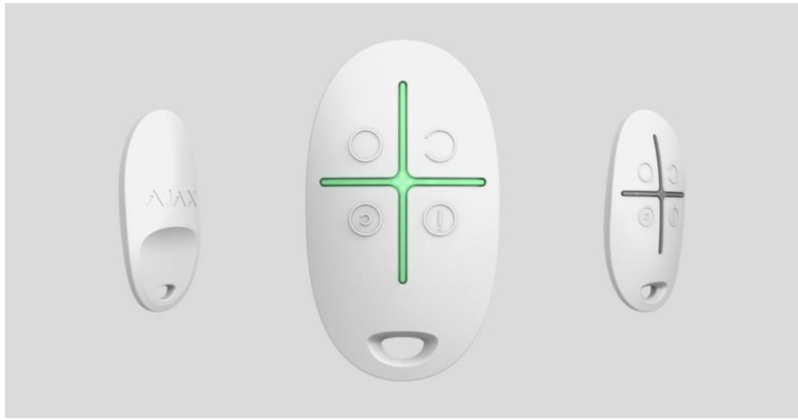
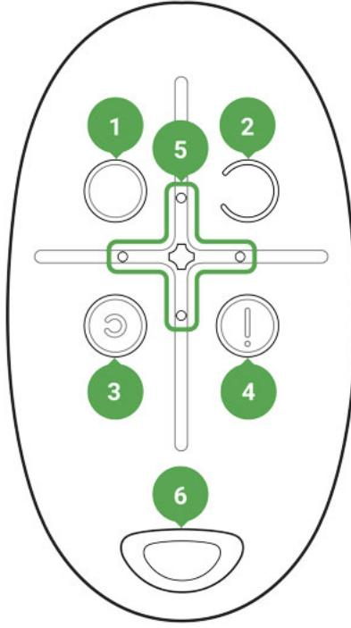

# SpaceControl User Manual

Updated December 6, 2021

**SpaceControl** is a miniature key fob with accidental click protection. It allows to set the Ajax security system in the armed, night or disarmed mode, as well as switch on an alarm.

As it is the two-way communication, you will know whether the system has received the SpaceControl command.

Operating as part of the Ajax security system, the key fob is connected to the via the protected protocol. In addition, the key fob can be used to control any third party security central unit through the or integration module. hub Jeweller uartBridge ocBridge Plus

The key fob is set up through the iOS and Android-based . mobile app for smartphones

Buy key fob SpaceControl

### Functional elements

- **1.** System arming button
- **2.** System disarming button
- **3.** Night mode button
- **4.** Panic button (activates the alarm)
- **5.** Light indicators
- **6.** The hole for attaching the key fob

Buttons can be assigned when using a key fob with hub and Ajax uartBridge. At the moment, the feature of modification of commands (and deactivation) of the key fob buttons when using with the Ajax hub is not available.

# Using the key fob

Maximum connection distance between the key fob and the hub — 1,300 meters. This distance is reduced by walls, inserted floors and any objects hindering the signal transmission.

SpaceControl operates only with one security system (Ajaх or third-party system via the integration module). If you connect the key fob to a new security system, it will cease to interact with the previous system. However, the key fob will not be automatically deleted from the list of devices of the hub.

**The key fob can:**

- **Arm the system** press the button once
- **Turn on the night mode** press the button once
- **Disarm the system** press the button once
- **Switch on an alarm** press the button once

To turn off the actuated security system (siren), press the disarming mode button on the keyfob.

Accidental click protection is available on the SpaceControl with **firmware version 5.54.1.0 and higher**.

### Operational Indication

The key fob reports its status only after any button is pressed.

Type and color of indication of the key fob display depends on the firmware version of the device. You can find out the firmware version in the **Ajax application** → **Devices** → **key fob**. Information about the firmware version is displayed at the very bottom.

| Indication                                                                                                                                                                         | Event                                                                                                          |
|------------------------------------------------------------------------------------------------------------------------------------------------------------------------------------|----------------------------------------------------------------------------------------------------------------|
| 4 green key fob LEDs blink 6 times                                                                                                                                                 | The key fob is not registered with any security system                                                      |
| Two green LEDs next to the pressed button light up once                                                                                                                         | The key fob command has been sent over to the security system                                               |
| Firmware version 3.16 and lower The LEDs next to the pressed button quickly blink green 4 times Firmware version 3.18 and higher The central LED lights up red briefly | The command has not been delivered as the security system is too far away and cannot receive the command |
| Two LEDs next to the button light up green                                                                                                                                         | The key fob has been removed from the                                                                          |

| twice. Then 4 key fob LEDs blink green 6 times                                                                                                                                                              | security system devices                                                                                                                  |
|-------------------------------------------------------------------------------------------------------------------------------------------------------------------------------------------------------------|------------------------------------------------------------------------------------------------------------------------------------------|
| The central LED lights up green for a few seconds                                                                                                                                                        | Linking a key fob to the security system                                                                                                 |
| Firmware version 3.18 and higher                                                                                                                                                                            |                                                                                                                                          |
| The central LED lights up green for approximately half a second                                                                                                                                          | The system has executed the key fob command                                                                                              |
| Firmware version 3.18 and higher The central LED lights up red for approximately                                                                                                                         | The system has not executed the key fob command — integrity verification is enabled in the system and one of the devices is faulty |
| half a second                                                                                                                                                                                               | What is system integrity check?                                                                                                          |
| Firmware version 3.16 and lower                                                                                                                                                                             |                                                                                                                                          |
| After the main indication, the central LED lights up green once and gradually goes out                                                                                                                   | The key fob battery needs replacement. In this case, the key fob commands are delivered to the security system.                    |
| Firmware version 3.18 and higher                                                                                                                                                                            |                                                                                                                                          |
| After the main indication, the central LED lights                                                                                                                                                           | Battery replacement                                                                                                                      |
| up red once and goes out gradually                                                                                                                                                                          |                                                                                                                                          |
| Firmware version 3.16 and lower                                                                                                                                                                             |                                                                                                                                          |
| Continuous short flashes of green light                                                                                                                                                                     |                                                                                                                                          |
| Firmware version from 3.18 to 3.52                                                                                                                                                                          | The battery charge level is unacceptably low. The battery needs replacement.                                                          |
| Continuous short flashes of red when a key fob with firmware version from 3.18 to 3.52 is used.                                                                                                          | In this operation mode, the key fob commands are not delivered to the security system.                                                |
| Key fobs with firmware version 3.53 and latest do not function when the battery charge level is unacceptably low, do not communicate commands to the hub, and do not notify with LED indication | Battery replacement                                                                                                                      |

Connecting the key fob to the Ajax Security System

### **Connection to hub**

#### **Before starting connection:**

- **1.** Following the hub instruction recommendations, install the on your smartphone. Create an account, add the hub to the application, and create at least one room. Ajax application
- **2.** Go to the Ajax application.
- **3.** Switch on the hub and check the internet connection (via Ethernet cable and/or GSM network).
- **4.** Ensure that the hub is disarmed and does not start updates by checking its status in the mobile application.

#### How to connect key fob to hub:

- **1.** Select the **Add Device** option in the Ajax application.
- **2.** Name the device, scan/write manually the **QR Code** (located inside the body, on the battery fixture and packaging), and select the location room.
- **3.** Select **Add** the countdown will begin.
- **4.** Simultaneously press the button for armed mode and the panic button — the key fob will blink with the central LED. For the detection and interfacing to occur, the key fob should be located within the coverage area of the wireless network of the hub (at a single protected object).

Request for connection to the hub is transmitted for a short time at the time of switching on the device.

The key fob connected to the hub will appear in the list of devices of the hub in the application.

### Connecting the key fob to Third Party Security Systems

To connect the key fob to a third party security central unit using the or integration module, follow the recommendations in the manual of the respective device. Ajax uartBridge Ajax ocBridge Plus

#### States

- **1.** Devices
- **2.** SpaceControl

| Parameter                                                   | Value                                                                                                                                                                                       |
|-------------------------------------------------------------|---------------------------------------------------------------------------------------------------------------------------------------------------------------------------------------------|
| Battery Charge                                              | Battery level of the device. Two states available: ОК Battery discharged How battery charge is displayed in Ajax apps                                                           |
| Accidental click protection                                 | Indicates the method of protection against accidental clicks: Off Long press Double click The function is available on key fobs with firmware version 5.54.1.0 and higher |
| The status of the connection with the ReX range extender | Displayed if the key fob is working through a radio signal range extender                                                                                                                |
| Panic                                                       | Panic button status                                                                                                                                                                         |
| Temporary Deactivation                                      | Displays the status of the device: active or completely disabled by the user                                                                                                             |
| Firmware                                                    | Firmware version of the key fob. It is not possible to change the firmware                                                                                                               |
| Device ID                                                   | Device identifier                                                                                                                                                                           |

### Setting Up the key fob

**1.** Devices

**2.** SpaceControl

**3.** Settings

| Setting                     | Value                                                                                                                                                                                                                                                                                                                                                                        |
|-----------------------------|------------------------------------------------------------------------------------------------------------------------------------------------------------------------------------------------------------------------------------------------------------------------------------------------------------------------------------------------------------------------------|
| First field                 | Device name, can be edited                                                                                                                                                                                                                                                                                                                                                   |
| Room                        | Selecting the virtual room to which the device is assigned                                                                                                                                                                                                                                                                                                                |
| Arming/Disarming Permission | Selection of a security group that the key fob manages. You can select All groups or a single group. 👆 Configuration is available only after group mode activation                                                                                                                                                                                            |
| User                        | Selection key fob user. Key fob is unassigned: Key fob events are sent to Ajax apps under the key fob name. Security mode management rights are determined by key fob settings. Key fob is assigned to user: Key fob events are sent to Ajax apps under the user's name. The key fob has the same security mode management rights as the user. |
| Panic                       | Turning on/off the panic button                                                                                                                                                                                                                                                                                                                                              |
| Accidental click protection | Choosing the method of protection against accidental clicks:                                                                                                                                                                                                                                                                                                              |
|                             | Off — protection is turned off                                                                                                                                                                                                                                                                                                                                               |
|                             | Long press — in order for the key fob to transmit the command to the hub, you                                                                                                                                                                                                                                                                                             |

|                                               | should hold the button down for more than 1.5 seconds                                                                                                                                                                          |
|-----------------------------------------------|-----------------------------------------------------------------------------------------------------------------------------------------------------------------------------------------------------------------------------------|
|                                               | Double press — in order for the key fob to transmit the command to the hub, you should double-press on the button with a pause of no more than 0.5 seconds                                                               |
|                                               | The function is available on key fobs with firmware version 5.54.1.0 and higher                                                                                                                                                |
| Alert with a siren if panic button is pressed | Ajax sirens If active, are activated after panic button pressing                                                                                                                                                         |
| User Guide                                    | Opens the device User Manual                                                                                                                                                                                                      |
| Temporary Deactivation                        | Allows a user to deactivate the device without deleting it from the system. The device will not execute system commands and participate in automation scenarios. The panic button of a deactivated device is disabled |
|                                               | Learn more about device temporary                                                                                                                                                                                                 |
|                                               | deactivation                                                                                                                                                                                                                      |
| Unpair Device                                 | Disconnects the device from the hub and deletes its settings                                                                                                                                                                   |

# Key fob Maintenance and Battery Replacement

When cleaning the key fob body use any means suitable for equipment maintenance.

Do not use for cleaning SpaceControl any substances containing alcohol, acetone, gasoline and other active solvents.

The pre-installed battery provides up to 5 years of operation of the key fob during normal use (one arming and disarming of the security system per day). More frequent use can reduce battery life. You can check battery level at any time in the Ajax app.

Keep new and used batteries away from children. Do not ingest battery, Chemical Burn Hazard.

The pre-installed battery is sensitive to low temperatures and if the key fob is significantly cooled, the battery level indicator in the app may show incorrect values until the key fob gets warm.

The value of the battery level is not updated regularly, but only after pressing one of the buttons at the key fob.

When the battery is discharged, the user will receive a notification in the Ajax app, and the key fob LED will slowly light up and go out red each time the button is pressed (key fobs with **firmware version 3.16 and lower** light up green).

#### How long Ajax devices operate on batteries, and what affects this

Battery replacement

## Tech Specs

| Number of buttons            | 4                                                                                                                                                                   |
|------------------------------|---------------------------------------------------------------------------------------------------------------------------------------------------------------------|
| Panic button                 | Yes                                                                                                                                                                 |
| Accidental click protection  | Available with the firmware version 5.54.1.0 and higher. Manufacture date from March 19, 2020 How to find out the manufacture date of a detector or device |
| Radio communication protocol | Jeweller Learn more                                                                                                                                              |
| Radio frequency band         | 866.0 – 866.5 MHz 868.0 – 868.6 MHz 868.7 – 869.2 MHz 905.0 – 926.5 MHz 915.85 – 926.5 MHz 921.0 – 922.0 MHz Depends on the region of sale.       |
| Compatibility                | hubs radio signal Operates with all Ajax ,                                                                                                                 |

|                               | range extenders ocBridge Plus , ,                                                                                   |
|-------------------------------|------------------------------------------------------------------------------------------------------------------------------|
|                               | uartBridge                                                                                                                   |
| Effective radiated power      | 6.01 dBm / 3.99 mW (limit 20 mW)                                                                                             |
| Modulation of the radiosignal | GFSK                                                                                                                         |
| Radio signal range            | Up to 1,300 m (any obstacles absent)                                                                                         |
| Power supply                  | 1 battery CR2032A, 3 V                                                                                                       |
| Service life from the battery | Up to 5 years (depending on the usage frequency)                                                                          |
| Operating temperature range   | From -25°С to +50°С                                                                                                          |
| Operating humidity            | Up to 95%                                                                                                                    |
| Overall dimensions            | 65 × 37 × 10 mm                                                                                                              |
| Weight                        | 13 g                                                                                                                         |
| Service life                  | 10 years                                                                                                                     |
| Certification                 | Security Grade 2, Environmental Class III in conformity with the requirements of EN 50131- 1, EN 50131-3, EN 50131-5-3 |

#### Compliance with standards

### Complete Set

- **1.** SpaceControl
- **2.** Battery CR2032 (pre-installed)
- **3.** Quick Start Guide

### Warranty

Warranty for the "AJAX SYSTEMS MANUFACTURING" LIMITED LIABILITY COMPANY products is valid for 2 years after the purchase and does not apply to the pre-installed battery.

If the device does not work correctly, you should first contact the support service — in half of the cases, technical issues can be solved remotely!

The full text of the warranty

User Agreement

Technical support: support@ajax.systems