# Hub 2 Plus User Manual

Updated December 10, 2021

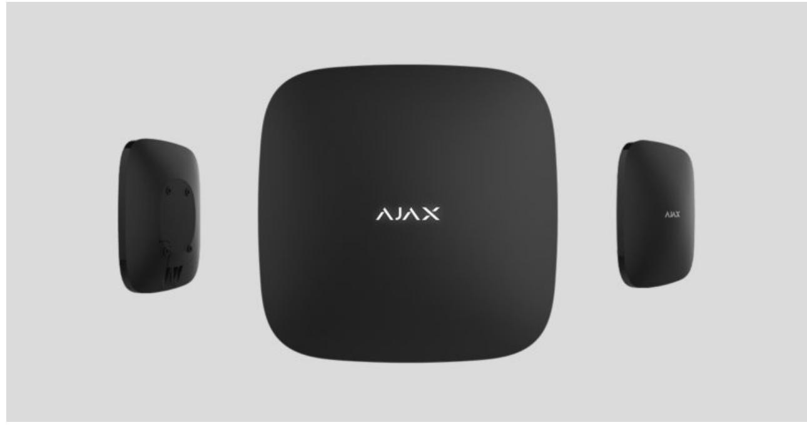

**Hub 2 Plus** is a central device in the Ajax security system, which controls the operation of all connected devices and interacts with the user and the security company.

The hub reports the opening of doors, breaking of windows, threat of fire or flood, and automates routine actions using scenarios. If outsiders enter the secure room, Hub 2 Plus will send photos from / motion detectors and notify a security company patrol. MotionCam MotionCam Outdoor

Hub 2 Plus needs Internet access to connect to the Ajax Cloud service. The central unit is connected to the Internet via Ethernet, Wi-Fi, and two SIM cards (2G/3G/4G).

Connecting to Ajax Cloud is necessary for configuring and managing the system through Ajax apps, transmitting notifications about alarms and events, as well as for updating . All data on Ajax Cloud is stored under multilevel protection, information is exchanged with the hub via an encrypted channel. OS Malevich

> Connect all communication channels to ensure a more reliable connection with Ajax Cloud and to secure against interruptions in the work of telecom operators.

You can manage the security system and quickly respond to alarms and notifications through for iOS, Android, macOS, and Windows. The system allows you to choose of what events and how to notify the user: by push notifications, SMS, or calls. apps

- How to set up push notifications on iOS
- How to set up push notifications on Android

If the system is connected to a security company, events and alarms will be transmitted to the monitoring station — . directly and/or through Ajax Cloud

Buy Hub 2 Plus central unit

# Functional elements

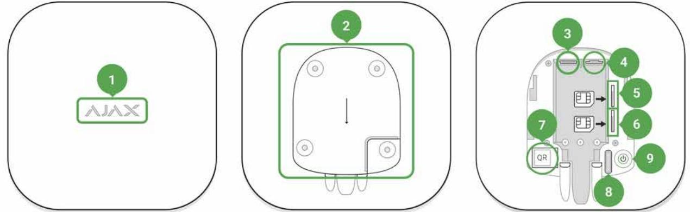

- **1.** Ajax logo featuring LED indicator
- **2.** SmartBracket mounting panel. Slide it down with force to open

Perforated part is required for actuating the tamper in case of any attempt to

- **3.** Power cable socket
- **4.** Ethernet cable socket
- **5.** Slot for micro SIM 2
- **6.** Slot for micro SIM 1
- **7.** QR Code
- **8.** Tamper button
- **9.** Power button

# Operating principle

The hub monitors the security system operation by communicating with connected devices via the . The communication range is up to 2000 m without obstacles (for example, walls, doors, inter-floor constructions). If the detector is triggered, the system raises the alarm in 0.15 seconds, activates the sirens, and notifies the central monitoring station of the security organization and the users. Jeweller encrypted protocol

If there is interference at the operating frequencies or when jamming is attempted, Ajax switches to a free radio frequency and sends notifications to the central monitoring station of the security organization and to system users.

# What jamming of a wireless security system is and how to resist it

Hub 2 Plus supports up to 200 Ajax devices connected, which protect against intrusion, fire, and flooding, as well as control electrical appliances automatically according to scenarios or manually from an app.

To send photos from / motion detector, a separate Wings radio protocol and a dedicated antenna are used. This ensures the delivery of visual alarm verification even with an unstable signal level and interruptions in communication. MotionCam MotionCam Outdoor

### All Ajax devices

Hub 2 Plus is running under a real-time operating system OS Malevich. Similar OS control spacecraft systems, ballistic missiles, and car brakes. OS Malevich expands the capabilities of the security system, by air without user intervention. automatically updating

 to automate the security system and decrease the number of routine actions. Set up the security schedule, program actions of automation devices ( , , or ) in response to an alarm, pressing of the or by schedule. A scenario can be created remotely in the Ajax app. Use scenarios Relay WallSwitch Socket Button

### How to create and configure a scenario in the Ajax security system

# LED indication

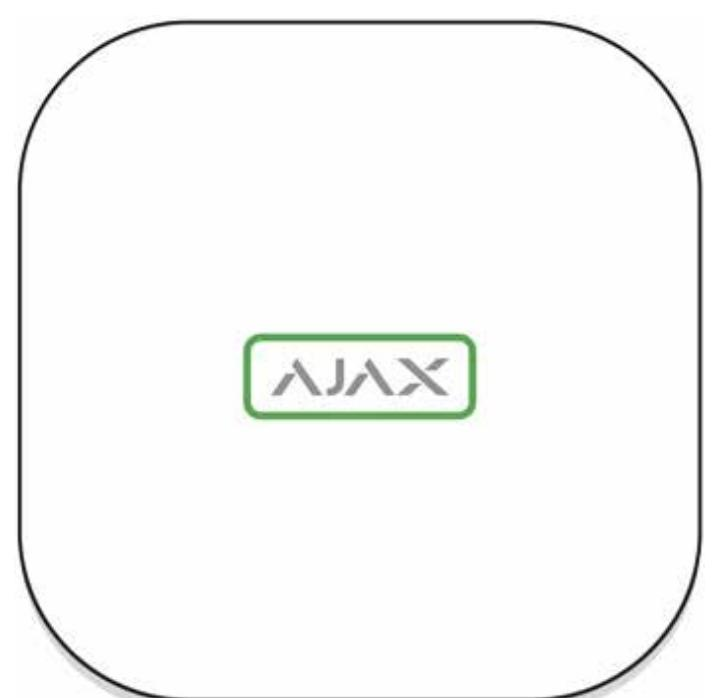

The Ajax logo on the hub front lights up red, white, or green depending on the status of the power supply and Internet connection.

| Event                                                                                 | LED indicator   |
|---------------------------------------------------------------------------------------|-----------------|
| At least two communication channels — Wi-Fi, Ethernet, or SIM card — are connected | Lights up white |
| A single communication channel is connected                                           | Lights up green |
| The hub is not connected to the Internet or there                                     | Lights up red   |

| is no connection with the Ajax Cloud server |                                                                                                                                                          |
|---------------------------------------------|----------------------------------------------------------------------------------------------------------------------------------------------------------|
| No power                                    | Lights up for 3 minutes, then blinks every 10 seconds. The color of the indicator depends on the number of the connected communication channels |

# Ajax account

The security system is configured and controlled through . Ajax applications are available to professionals and users on iOS, Android, macOS, and Windows. Ajax apps

The settings of Ajax security system users and the parameters of connected devices are stored locally on the hub and are inextricably linked with it. Changing the hub administrator does not reset the settings of the connected devices.

To configure the system, install the Ajax app and . One phone number and email address may be used to create only one Ajax account! There is no need to create a new account for each hub — one account can manage multiple hubs. create an account

> Your account can combine two roles: the administrator of one hub and the user of another hub.

# Security requirements

When installing and using Hub 2 Plus, strictly adhere to the general electrical safety regulations for using electrical appliances, as well as the requirements of regulatory legal acts on electrical safety.

It is strictly forbidden to disassemble the device under voltage! Also, do not use the device with a damaged power cable.

# Connecting to the network

- **1.** Remove the SmartBracket mounting panel by sliding it down with force. Avoid damaging the perforated part — it's essential for the tamper activation
in case of hub dismantling!

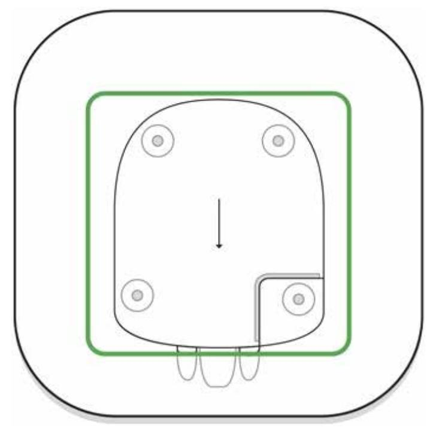

- **2.** Connect the power supply and Ethernet cables to the appropriate sockets, install SIM cards.
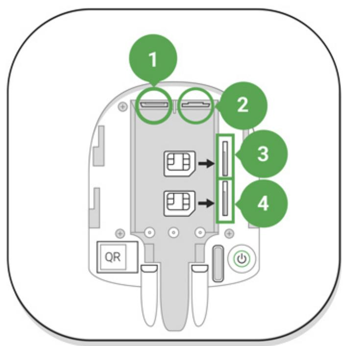

- 1 Power socket
- 2 Ethernet socket
- 3, 4 Slots for installing micro-SIM cards
- **3.** Press and hold the power button for 3 seconds until the Ajax logo lights up. It takes about 2 minutes for the hub to upgrade to the latest firmware and

connect to the Internet. The green or white logo color indicates that the hub is running and connected to Ajax Cloud.

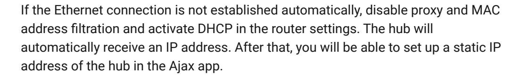

- **4.** To connect to the cellular network, you need a micro SIM card with a disabled PIN code request (you can disable it using a mobile phone) and a sufficient amount on your account to pay for the services at your operator's rates. If the hub does not connect to the cellular network, use Ethernet to configure the network parameters: roaming, APN access point, username, and password. Contact your telecom operator for support to find out these options.
# Adding a hub to the Ajax app

- **1.** Turn on the hub and wait until the logo lights up green or white.
- **2.** Open the Ajax app. Give access to the requested system functions to fully use the capabilities of the Ajax app **and not to miss alerts about alarms or events**.
	- How to set up notifications on iOS
	- How to set up notifications on Android
- **3.** Open the **Add hub** menu Select the way of registering: manually or step-by-step guidance. If you are setting the system up for the first time, use step-by-step guidance.
- **4.** Specify the name of the hub and scan the QR code located under the SmartBracket mounting panel or enter it manually.
- **5.** Wait until the hub is added. The linked hub will be displayed in the **Devices** tab .

After adding a hub to your account, you become the administrator of the device. Administrators can invite other users to the security system and determine their rights. Hub 2 Plus central unit can have up to 200 users.

Changing or removing the administrator does not reset the settings of the hub or connected devices.

#### Ajax security system user rights

# Hub statuses

# Icons

Icons display some of Hub 2 Plus statuses. You can see them in the Ajax app, in the **Devices** menu .

| Icons | Meaning                                                                                                                |
|-------|------------------------------------------------------------------------------------------------------------------------|
|       | 2G connected                                                                                                           |
|       | 3G connected                                                                                                           |
|       | LTE connected                                                                                                          |
|       | SIM card is not installed                                                                                              |
|       | The SIM-card is defective or has a PIN-code on it                                                                      |
|       | Hub 2 Plus battery charge level. Displayed in 5% increments                                                            |
|       | Hub 2 Plus malfunction is detected. The list is available in hub states list                                           |
|       | The hub is directly connected to the central monitoring station of the security organization                        |
|       | The hub have lost connection with the central monitoring station of the security organization via direct connection |

# States

States can be found in the : Ajax app

- **1.** Go to the **Devices** tab .
- **2.** Select Hub 2 Plus from the list.

| Parameter   | Meaning                                                  |
|-------------|----------------------------------------------------------|
| Malfunction | Click to open the list of Hub 2 Plus malfunctions. |

|                          | The field appears only if a malfunction is detected                                                                                                                                                                                                                             |
|--------------------------|------------------------------------------------------------------------------------------------------------------------------------------------------------------------------------------------------------------------------------------------------------------------------------|
| Cellular Signal Strength | Shows the signal strength of the mobile network for the active SIM card. We recommend installing the hub in places with the signal strength of 2-3 bars. If the signal strength is weak, the hub will not be able to dial-up or send an SMS about an event or alarm |
| Battery Charge           | Battery level of the device. Displayed as a percentage How battery charge is displayed in Ajax apps                                                                                                                                                                       |
| Lid                      | Status of the tamper that responds to hub dismantling: Closed — the hub lid is closed Opened — the hub removed from SmartBracket holder What is a tamper?                                                                                                           |
| External power           | External power supply connection status: Connected — the hub is connected to external power supply Disconnected — no external power supply                                                                                                                                |
| Connection               | Connection status between the hub and Ajax Cloud: Online — the hub is connected to Ajax Cloud Offl ine — the hub is not connected to Ajax Cloud                                                                                                                     |
| Cellular Data            | The hub connection status to the mobile Internet: Connected — the hub is connected to Ajax Cloud via mobile Internet Disconnected — the hub is not connected to Ajax Cloud via mobile Internet                                                                      |

|                     | If the hub has enough funds on the account or has bonus SMS/calls, it will be able to make calls and send SMS messages even if the Not connected status is displayed in this field                                                                                                                                                                                                                                                                       |
|---------------------|-------------------------------------------------------------------------------------------------------------------------------------------------------------------------------------------------------------------------------------------------------------------------------------------------------------------------------------------------------------------------------------------------------------------------------------------------------------------|
| Active SIM          | Displays the active SIM card: SIM card 1 or SIM card 2                                                                                                                                                                                                                                                                                                                                                                                                         |
| SIM 1               | The number of the SIM card installed in the first slot. Copy the number by clicking it                                                                                                                                                                                                                                                                                                                                                                         |
| SIM 2               | The number of the SIM card installed in the second slot. Copy the number by clicking it                                                                                                                                                                                                                                                                                                                                                                        |
|                     | Internet connection status of the hub via Wi-Fi.                                                                                                                                                                                                                                                                                                                                                                                                                  |
| Wi-Fi               | For greater reliability, it is recommended to install the hub in places with the signal strength of 2-3 bars                                                                                                                                                                                                                                                                                                                                                |
| Ethernet            | Internet connection status of the hub via Ethernet: Connected — the hub is connected to Ajax Cloud via Ethernet Disconnected — the hub is not connected to Ajax Cloud via Ethernet                                                                                                                                                                                                                                                                 |
| Average Noise (dBm) | Noise power level at the hub installation site. The first two values show the level at Jeweller frequencies, and the third — at Wings frequencies. The acceptable value is -80 dBm or lower                                                                                                                                                                                                                                                           |
| Monitoring Station  | The status of direct connection of the hub to the central monitoring station of the security organization: Connected — the hub is directly connected to the central monitoring station of the security organization Disconnected — the hub is not directly connected to the central monitoring station of the security organization If this field is displayed, the security company uses a direct connection to receive events and |

|                  | security system alarms                                                                                                               |  |
|------------------|--------------------------------------------------------------------------------------------------------------------------------------|--|
|                  | What is a direct connection?                                                                                                         |  |
| Hub model        | Hub model name                                                                                                                       |  |
| Hardware version | Hardware version. Unable to update                                                                                                   |  |
| Firmware         | Firmware version. Can be updated remotely                                                                                            |  |
| ID               | ID/serial number. Also located on the device box, on the device circuit board, and on the QR code under the SmartBracket panel |  |

# Rooms

Prior to linking a detector or device to a hub, create at least one room. Rooms are used to group detectors and devices, as well as to increase the information content of notifications. The name of the device and room will be displayed in the text of the event or alarm of the security system.

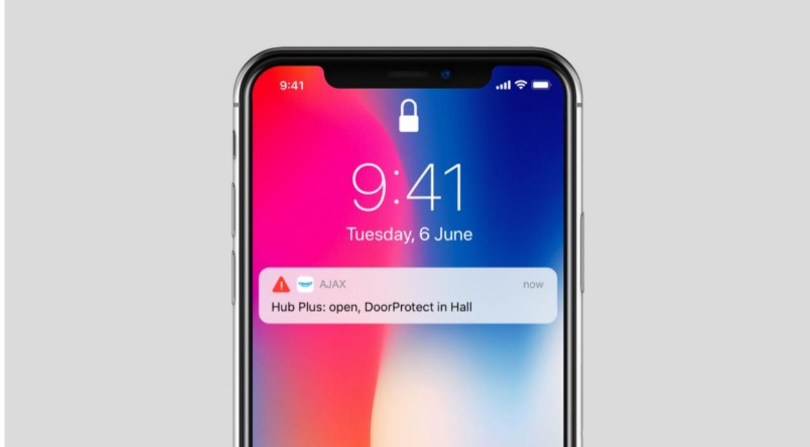

# **To create a room in the Ajax app:**

- **1.** Go to the **Rooms** tab .
- **2.** Click **Add Room**.
- **3.** Assign a name for the room, and optionally attach or take a photo: it helps to find the needed room in the list quickly.

- **4.** Click **Save**.
To delete the room or change its avatar or name, go to **Room settings** by pressing .

# Connection of detectors and devices

The hub doesn't support and integration modules. uartBridge ocBridge Plus

When adding a hub to your account using the step-by-step guidance, you will be prompted to connect devices to the hub. However, you can refuse and return to this step later.

#### **To add a device to the hub, in the Ajax app:**

- **1.** Open the room and select **Add device**.
- **2.** Name the device, scan its QR code (or enter it manually), select a group (if group mode is enabled).
- **3.** Click **Add** the countdown for adding a device will begin.
- **4.** Follow the instructions in the app to connect the device.

Please note that in order to link to the hub, the device must be located within the hub's radio communication range (at the same protected object).

# Hub settings

Settings can be changed in the : Ajax app

- **1.** Go to the **Devices** tab .
- **2.** Select Hub 2 Plus from the list.
- **3.** Go to **Settings** by clicking on the icon .

**Avatar** is a customized title image for Ajax security system. It is displayed in the hub selection menu and helps to identify the required object.

To change or set an avatar, click on the camera icon and set up the desired picture.

**Hub name**. Is displayed in the SMS and push notification text. The name can contain up to 12 Cyrillic characters or up to 24 Latin characters.

To change it, click on the pencil icon and enter the desired hub name.

**Users** — user settings for a security system: what rights are granted to users and how the security system notifies them of events and alarms.

To change the user settings, click on opposite the user name.

### How the Ajax security system notifies users of alerts

How to add new users to the hub

**Ethernet** — settings for wired Internet connection.

- Ethernet allows you to enable and disable Ethernet on the hub
- DHCP / Static selection of the type of the hub IP address to receive: dynamic or static
- IP Address hub IP Address
- Subnet mask subnet mask in which the hub operates
- Router gateway used by the hub
- DNS DNS of the hub

**Wi-Fi** — settings for Wi-Fi Internet connection. The general list displays all networks available to the hub.

- Wi-Fi allows you to enable and disable Wi-Fi on the hub. After pressing the [i] button, the network settings are opened:
	- DHCP / Static selection of the type of the hub IP address to receive: dynamic or static
	- IP Address hub IP Address
	- Subnet mask subnet mask in which the hub operates
	- Router gateway used by the hub
	- DNS DNS of the hub
	- Forget this network after pressing, the hub deletes the network settings and no longer connects to it

**Cellular** — enabling/disabling cellular communication, configuring connections, and checking account.

- Cellular Data disables and enables SIM cards on the hub
- Roaming if it is activated, the SIM cards installed in the hub can work in roaming
- Ignore Network Registration Error when this setting is activated, the hub ignores errors when trying to connect via a SIM card. Activate this

option if the SIM card cannot connect to the network

- Disable communication check with operator when this setting is activated, the hub ignores operator communication errors. Activate this option if the SIM card cannot connect to the network
- SIM card 1 displays the number of the SIM card installed. Click on the field to go to the SIM card settings
- SIM card 2 displays the number of the SIM card installed. Click on the field to go to the SIM card settings

# SIM card settings

Connection settings

- **APN**, **User name**, and **Password** settings for connecting to the Internet via a SIM card. To find out the settings of your cellular operator, contact your provider's support service.
How to set or change APN settings in the hub

# **Mobile data usage**

- **Incoming** the amount of data received by the hub. Displayed in KB or MB.
- **Outgoing** the amount of data sent by the hub. Displayed in KB or MB.

**Reset statistics** — resets statistics on incoming and outgoing traffic.

# **Check balance**

- **USSD code** enter the code that is used to check the balance in this field. For example, *111#. After that, click **Check balance** to send a request. The result will be displayed under the button.
**Geofence** — configuring reminders for arming/disarming the security system when crossing a specified area. The user location is determined using the smartphone GPS module.

#### What geofences are and how they function

**Groups** — group mode configuration. This allows you to:

- Manage the security modes for separate premises or groups of detectors. For example, the office is armed while the cleaner works in the kitchen.
- Delimit access to control of security modes. For example, the marketing department employees do not have access to the law office.

How to enable and configure group mode in the Ajax security system

**Security Schedule** — arming/disarming the security system by the schedule.

How to create and configure a scenario in the Ajax security system

**Detection Zone Test** — running the detection zone test for the connected detectors. The test determines the sufficient distance for the detectors to register alarms.

What is Detection Zone Test

**Jeweller** — configuring the hub-detector ping interval. The settings determine how frequently the hub communicates with devices and how quickly the loss of connection is detected.

### Learn more

- **Detector Ping Interval** the frequency of connected devices polling by the hub is setting in the range of 12 to 300 s (36 s by default)
- **Number of undelivered packets to determine connection failure** a counter of undelivered packets (8 packets by default).

**The time before raising the alarm by the communication loss between hub and device is calculated with the following formula:**

Ping interval * (number of undelivered packets + 1 correction packet).

The shorter ping interval (in seconds) means faster delivery of the events between the hub and the connected devices; however, a short ping interval reduces the battery life. At the same time, alarms are transmitted immediately regardless of the ping interval.

**We do not recommend reducing the default settings of the ping period and interval.**

Note that the interval limits the maximum number of connected devices:

| Interval | Connection limit |
|----------|------------------|
| 12 s     | 39 devices       |

| 24 s | 79 devices  |
|------|-------------|
| 36 s | 119 devices |
| 48 s | 159 devices |
| 72 s | 200 devices |

Regardless of settings, the hub supports 10 connected sirens maximum!

**Service** is a group of hub service settings. These are divided into 2 groups: general settings and advanced settings.

General settings

Time Zone

Selecting the time zone in which the hub operates. It is used for scenarios by schedule. Therefore, before creating scenarios, set the correct time zone.

#### Learn more about scenarios

#### LED Brightness

Adjustment of the hub logo LED backlight brightness . Set in the range of 1 to 10. The default value is 10.

### Firmware Auto-Update

Configuring automatic OS Malevich firmware updates.

- **If enabled**, the firmware is automatically updated when a new version is available, when the system is not armed, and external power is connected.
- **If disabled**, the system does not update automatically. If a new firmware version is available, the app will offer to update the OS Malevich.
How OS Malevich updates

#### Hub System Logging

Logs are files containing information about system operation. They can help sort out the problem in case of errors or failures.

The setting allows you to select the transmission channel for the hub logs or disable their recording:

- Ethernet
- Wi-Fi
- No logging is disabled

We do not recommend disabling logs as this information may be helpful in the event of errors in the operation of the system!

#### How to send an error report

#### **Advanced settings**

The list of advanced hub settings depends on the type of application: standard or PRO.

| Ajax Security System    | Ajax PRO                |
|-------------------------|-------------------------|
| Server connection       | PD 6662 Setting Wizard  |
| Sirens settings         | Server Connection       |
| Fire detectors settings | Sirens settings         |
| System integrity check  | Fire detectors settings |
|                         | System Integrity Check  |
|                         | Alarm Confirmation      |

### PD 6662 Setting Wizard

Opens a step-by-step guide on how to set up your system to comply with the British security standard PD 6662:2017.

### Learn more about PD 6662:2017

# How to configure the system to comply with PD 6662:2017

### Server Connection

The menu contains settings for communication between the hub and the Ajax Cloud:

- **Hub-Server Polling Interval, sec.** Frequency of sending pings from the hub to Ajax Cloud server. It is set in the range of 10 to 300 s. The recommended default value is 60 s.
- **Deley of Server Connection Failure Alarm, sec.** It is a delay to reduce the risk of a false alarm associated with the Ajax Cloud server connection loss. It is activated after 3 unsuccessful hub-server polls. The delay is set in the range of 30 to 600 s. The recommended default value is 300 s.

The time to generate a message regarding the loss of communication between the hub and the Ajax Cloud server is calculated using the following formula:

> (Ping interval * 4) + Time filter

With the default settings, Ajax Cloud reports the hub loss in 9 minutes:

$$(60\text{ s}^{\star}\text{ 4}) + 300\text{ s} = 9\text{ min}^{\star}$$

- **Receive events of server connection loss without alarm**. Ajax apps can notify about the hub-server communication loss in two ways: with a standard push notification signal or with a siren sound (enabled by
default). When the option is active, the notification comes with a standard push notification signal.

- **Notify of connection loss over channels**. Ajax security system can notify both the users and the security company about the loss of connection even via one of the connection channels.
In this menu, you can choose the connection loss of which channels will be reported by the system, as well as the delay for sending such notifications:

- Ethernet
- Cellular
- Wi-Fi
- **Loss Notification Delay, min** time of the delay before sending the notification about loss of connection via one of the communication channels. Set in the range from 3 to 30 minutes.

The time of sending a notification about the loss of connection via one of the communication channels is calculated with the formula:

> (Polling interval * 4) + Time filter + Loss Notification delay

# Sirens settings

The menu contains two groups of siren settings: siren activation parameters and siren after-alarm indication.

# Siren activation parameters

**If the hub or detector lid is open**. If enabled, the hub activates the connected if the body of the hub, detector, or any other Ajax device is open. sirens

**If in-app panic button is pressed**. When the function is active, the hub activates the connected sirens if the panic button was pressed in the Ajax app.

You can disable the sirens reaction when pressing the panic button on the SpaceControl key fob in the key fob settings (Devices → SpaceContol → Settings

### Settings of siren after-alarm indication

This setting is only available in PRO Ajax apps

The siren can inform about triggering in armed system by means of LED indication. Thanks to this feature, system users and passing security companies patrols can see that the system was triggered.

### Feature implementation in HomeSiren

Feature implementation in StreetSiren

Feature implementation in StreetSiren DoubleDeck

#### Fire detectors settings

Settings menu of FireProtect and FireProtect Plus fire detectors. Allows configuring interconnected FireProtect alarms of fire detectors.

The feature is recommended by European fire standards, which require, in the event of a fire, a warning signal power of at least 85 dB at 3 meters from the sound source. Such sound power wakes up even a soundly sleeping person during a fire. And you can quickly disable triggered fire detectors using the Ajax app, Button, or KeyPad/KeyPad Plus.

#### Learn more

#### System Integrity Check

The **System integrity check** is a parameter that is responsible for checking the status of all security detectors and devices before arming. Checking is disabled by default.

#### Learn more

### Alarm Confirmation

This setting is only available in PRO Ajax apps

**Alarm confirmation** is a special event that the hub sends to the CMS and system users if several certain devices have triggered within a specified period of time. By responding to confirmed alarms only, the security company and the police reduce the number of visits on false alarms.

Learn more

### Restoration After Alarm

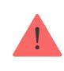

This setting is only available in PRO Ajax apps

The feature does not allow arming the system if an alarm has been registered previously. For arming, the system should be restored by an authorized user or PRO user. The types of alarms that require system restore are defined when configuring the function.

The function eliminates situations when the user arms the system with detectors that generate false alarms.

Learn more

Arming/Disarming Process

The menu allows to enable arming in two stages, as well as set Alarm Transmission Delay for security system disarming process.

What is Two-Stage Arming and why is it needed

What is Alarm Transmission Delay and why is it needed

Devices Auto Deactivation

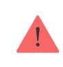

This setting is only available in PRO Ajax apps

The Ajax security system can ignore alarms or other events of devices without removing them from the system. Under certain settings, notifications about events of a specific device will not be sent to the CMS and security system users.

There are two types of **Devices Auto Deactivation**: by the timer and by the number of alarms.

What is Devices Auto Deactivation

It is also possible to manually disable a specific device. Learn more about deactivating devices manually . here

Clear notifications history

Clicking the button deletes all notifications in the hub events feed.

**Monitoring Station** — the settings for direct connection to the security company's central monitoring station. Parameters are set by security company engineers. Keep in mind that events and alarms can be sent to the central monitoring station of the security company even without these settings.

#### "Monitoring Station" tab: what is it?

- **Protocol** the choice of the protocol used by the hub to send alarms to the central monitoring station of the security company via a direct connection. Available protocols: Ajax Translator (Contact-ID) and SIA.
- **Connect on demand**. Enable this option if you need to connect to the CMS (Central Monitoring Station) only when transmitting an event. If the option is disabled, the connection is maintained continuously. The option is available only for the SIA protocol.
- **Object number** the number of an object in the monitoring station (hub).

#### **Primary IP address**

- **IP address** and **Port** are settings of the primary IP address and port of the security company server to which events and alarms are sent.
### **Secondary IP address**

- **IP address** and **Port** are settings of the secondary IP address and port of the security company server to which events and alarms are sent.
#### **Alarm sending channels**

In this menu, channels for sending alarms and events to the central monitoring station of the security company are selected. Hub 2 Plus can send alarms and events to the central monitoring station via **Ethernet**, **UMTS/LTE**, and **Wi-Fi**. We recommend that you use all communication channels at once — this will increase the transmission reliability and secure against failures on the telecom operators' side.

- **Ethernet** enables event and alarm transmission via Ethernet.
- **GSM** enables event and alarm transmission via the mobile Internet.
- **Wi-Fi** enables event and alarm transmission via Wi-Fi.
- **Periodic Test Report** if enabled, the hub sends test reports with a given period to the CMS (Central Monitoring Station) for additional monitoring of object connection.

- **Monitoring Station Ping Interval** sets the period for sending test messages: from 1 minute to 24 hours.
# **Encryption**

Event transmission encryption settings in the SIA protocol. AES 128-bit encryption is used.

- **Encryption** if enabled, events and alarms transmitted to the central monitoring station in SIA format are encrypted.
- **Encryption key** encryption key of transmitted events and alarms. Must match the value on the Central Monitoring Station.

# **Panic button coordinates**

- **Send coordinates** if enabled, the pressing of a panic button in the app sends the coordinates of the device on which the app is installed and panic button is pressed, to the central monitoring station.
### **Alarm Restore on ARC**

The setting allows you to select when the alarm restore event will be sent to the CMS: immediately/upon detector restore (by default) or upon disarming.

### Learn more

**Installers** — PRO users settings (installers and representatives of security companies) of the security system. Determine who has access to your security system, the rights that are granted to PRO users, and how the security system notifies them about the events.

How to add PRO to the hub

**Security companies** — a list of security companies in your area. The region is determined by the GPS data or the regional settings of your smartphone.

**User Guide** — opens the Hub 2 Plus user guide.

**Data Import** — a menu for automatical transferring devices and settings from another hub. **Keep in mind that you are in the settings of the hub on which you want to import data.**

Learn more about data import

**Unpair hub** — removes your account from the hub. Regardless of this, all the settings and connected detectors remain saved.

# Settings reset

Resetting the hub to the factory settings:

- **1.** Turn on the hub if it is off.
- **2.** Remove all users and installers from the hub.
- **3.** Hold the power button for 30 s the Ajax logo on the hub will start blinking red.
- **4.** Remove the hub from your account.

# Events and alarms notifications

The Ajax security system informs the user about alarms and events in three ways: push notifications, SMS, and phone calls. The notification settings can be changed only for registered users.

Hub 2 Plus does not support calls and SMS transmission using VoLTE (Voice over LTE) technology. Before buying a SIM card, please make sure that it only supports the GSM standard.

| Types of events  | Purpose                                                                                                                                    | Types of notifications             |
|------------------|--------------------------------------------------------------------------------------------------------------------------------------------|------------------------------------|
| Malfunctions     | Loss of connection between the device and the hub Jamming Low battery charge in device or hub Masking Tampering alarm | Push notifications SMS          |
| Alarm            | Intrusion Fire Flood Loss of connection between the hub and the Ajax Cloud server                                           | Calls Push notifications SMS |
| Events           | Activation of WallSwitch, , Relay Socket                                                                                          | Push notifications SMS          |
| Arming/Disarming | Arming/Disarming entire object or group                                                                                                 | Push notifications SMS          |

The hub does not notify users of opening detectors triggering in the Disarmed mode when the Chime feature is enabled and configured. Only the sirens connected to the system notify about the opening.

What is Chime

### How Ajax notifies users of alerts

# Video surveillance

00:00 00:10

You can connect third-party cameras to the security system: seamless integration with Dahua, Hikvision, and Safire IP cameras and video recorders has been implemented. You can also connect third-party cameras supporting RTSP protocol. You can connect up to 100 video surveillance devices to the system.

How to add a camera to the Ajax security system

# Connecting to a security company

The list of companies that accept the system to the central monitoring station is in the **Security companies** menu (**Devices** → **Hub → Settings** → **Security companies**):

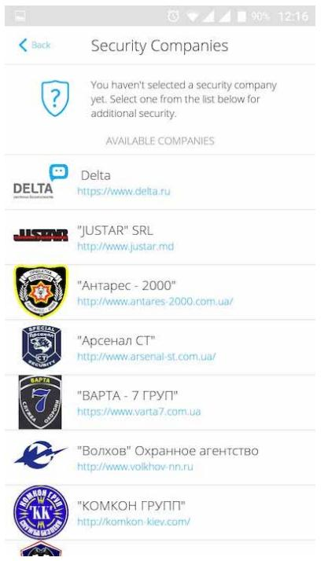

Select a security company and click **Send Monitoring Request**. After that, the security company will contact you and discuss the connection conditions. Or you can contact them yourself (contacts are available in the app) to agree upon a connection.

Connection to the Central Monitoring Station (CMS) is implemented via the Contact ID or SIA protocol.

# Installation

Prior to installing the hub, make sure that you have selected the optimal location and that it complies with the requirements of this manual! It is desirable that the hub be hidden from direct view.

Make sure that the communication between the hub and all connected devices is stable. If the signal strength is low (a single bar), we cannot guarantee a stable operation of the security system. Implement all potential measures to improve the signal quality! At the very least, relocate the hub as even repositioning by 20 cm can significantly improve the signal reception.

If the device has a low or unstable signal strength, use a . radio signal range extender

When installing and using the device, follow the general electrical safety regulations for using electrical appliances, as well as the requirements of regulatory legal acts on electrical safety. It is strictly forbidden to disassemble the device under voltage! Do not use the device with a damaged power cable.

# **Hub installation:**

- **1.** Fix the SmartBracket mounting panel with bundled screws. When using other fasteners, make sure they do not damage or deform the panel.
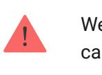

We do not recommend using double-sided adhesive tape for installation: it can cause a hub to fall in case of an impact.

- **2.** Attach the hub to the mounting panel. After installation, check the tamper status in the Ajax app and then the quality of the panel fixation. You will receive a notification if an attempt is made to tear the hub off the surface or remove it from the mounting panel.
- **3.** Fix the hub on the SmartBracket panel with bundled screws.

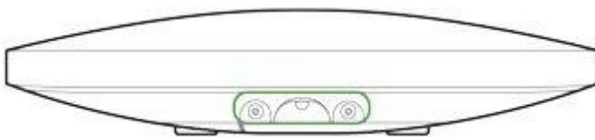

Do not flip the hub when attaching vertically (for example, on a wall). When properly fixed, the Ajax logo can be read horizontally.

**Do not place the hub:**

- Outside the premises (outdoors).
- Nearby or inside any metal objects or mirrors causing attenuation and screening of the signal.
- In places with high radio interference level.
- Close to radio interference sources: less than 1 meter from the router and power cables.
- Inside any premises with the temperature and humidity beyond the range of permissible limits.

# Maintenance

Check the operational capability of the Ajax security system on a regular basis. Clean the hub body from dust, spider webs and other contaminants as they appear. Use soft dry napkin suitable for equipment maintenance.

Do not use any substances containing alcohol, acetone, gasoline and other active solvents for cleaning the hub.

# How to replace hub battery

# The package includes

- **1.** Hub 2 Plus
- **2.** SmartBracket mounting panel
- **3.** Power cable
- **4.** Ethernet cable
- **5.** Installation kit
- **6.** Starter pack not available in all countries
- **7.** Quick Start Guide

# Technical Specifications

| Classification                                                   | Security system control panel with Ethernet, Wi Fi, and dual SIM card support                               |  |
|------------------------------------------------------------------|----------------------------------------------------------------------------------------------------------------|--|
| Support of detectors with photo verification of alarms        | Available                                                                                                      |  |
| Number of connected devices                                      | Up to 200                                                                                                      |  |
| Number of connected ReX                                          | Up to 5                                                                                                        |  |
| Number of connected sirens                                       | up to 10                                                                                                       |  |
| Number of security groups                                        | Up to 25                                                                                                       |  |
| Number of users                                                  | Up to 200                                                                                                      |  |
| Video surveillance                                               | Up to 100 cameras or DVRs                                                                                      |  |
| Number of rooms                                                  | Up to 50                                                                                                       |  |
|                                                                  | Up to 64                                                                                                       |  |
| Number of scenarios                                              | Learn more                                                                                                     |  |
| Central Monitoring Station communication protocols            | Contact ID, SIA (DC-09) CMS software supporting visual alarms verification                               |  |
| Power supply                                                     | 110-240 V with pre-installed battery 6V PSU 6 V with alternative power supply                         |  |
| Built-in back-up battery                                         | Li-Ion 3 А·h Ensures up to 15 hours of operation when using SIM card only                                |  |
| Energy consumption from the grid                                 | Up to 10 W                                                                                                     |  |
| Tamper proof                                                     | Available, tamper                                                                                              |  |
| Radio communication protocols with Ajax detectors and devices | Jeweller — for transmitting events and alarms. Learn more Wings — for transmitting photos. Learn more |  |
| Radio frequency band                                             | 866.0 – 866.5 MHz 868.0 – 868.6 MHz 868.7 – 869.2 MHz                                                    |  |

|                             | 905.0 – 926.5 MHz 915.85 – 926.5 MHz 921.0 – 922.0 MHz Depends on the region of sale.                                                           |
|-----------------------------|----------------------------------------------------------------------------------------------------------------------------------------------------------|
| RF output power             | 10.4 mW (max 25 mW)                                                                                                                                      |
| Radio signal range          | Up to 2000 m                                                                                                                                             |
| Communication channels      | 2 SIM cards 2G (GSM900/DCS1800 (B3/B8)) 3G (WCDMA 850/900/2100 (B1/B5/B8)) LTE (FDD B1/B3/B5/B7/B8/B20/B28) Wi-Fi (802.11 b/g/n) Ethernet |
| Operating temperature range | From –10°C to +40°C                                                                                                                                      |
| Operating humidity          | Up to 75%                                                                                                                                                |
| Size                        | 163 × 163 × 36 mm                                                                                                                                        |
| Weight                      | 367 g                                                                                                                                                    |
| Service life                | 10 years                                                                                                                                                 |

# Compliance with standards

# Warranty

The warranty for the "AJAX SYSTEMS MANUFACTURING" LIMITED LIABILITY COMPANY products is valid for 2 years after the purchase and does not apply to the bundled rechargeable battery.

If the device does not function properly, we recommend that you first contact the support service as technical issues can be resolved remotely in half of the cases!

### Warranty obligations

User agreement

Technical support: support@ajax.systems