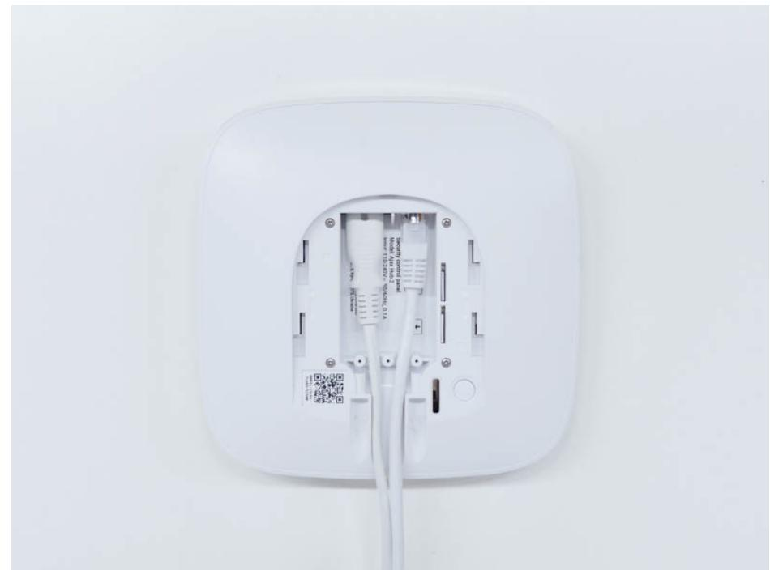
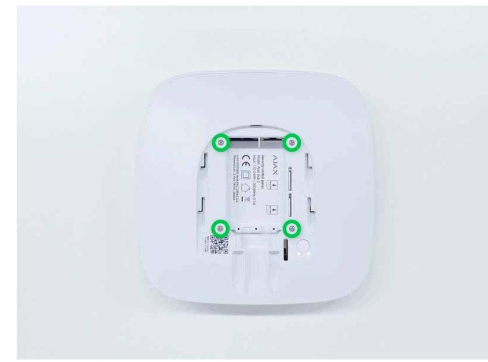
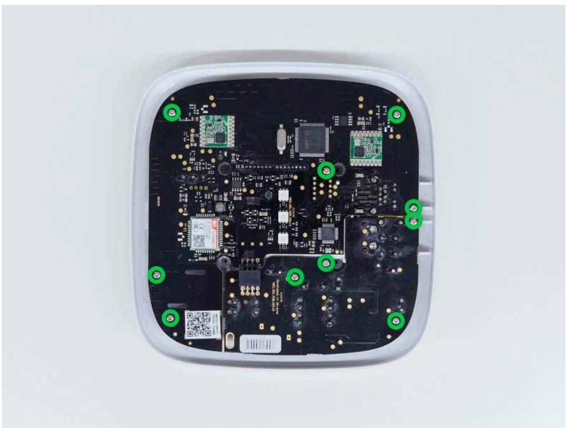
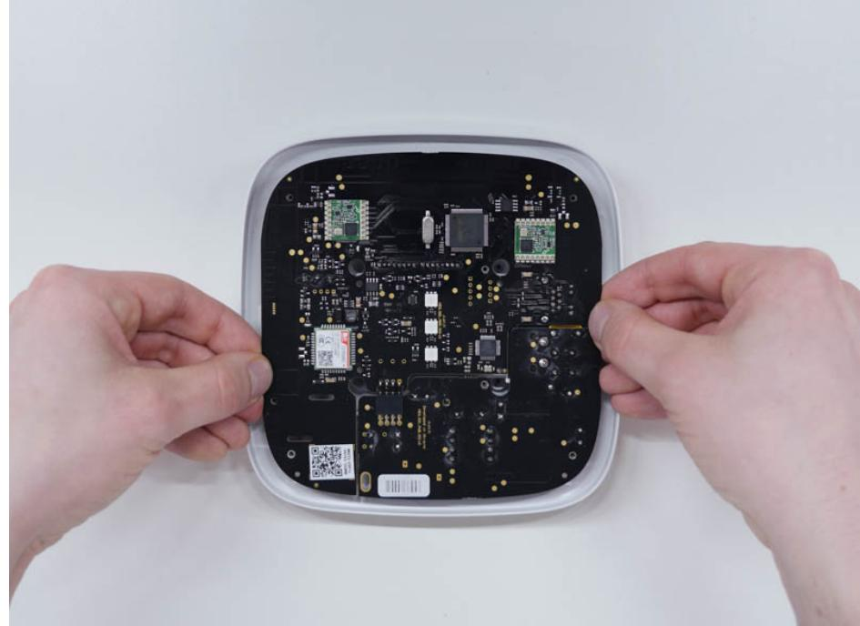
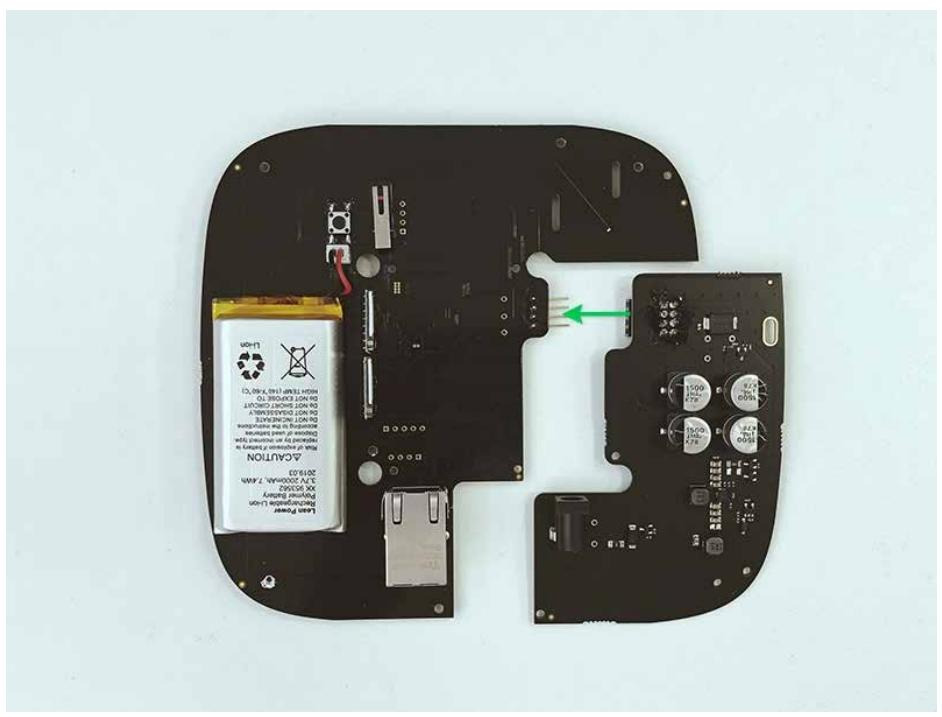
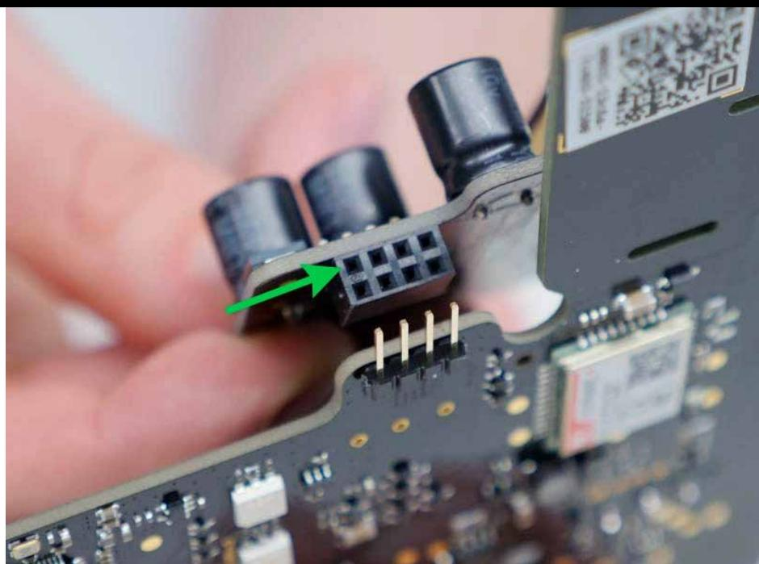

# 6V PSU for Hub 2/Hub 2 Plus/ReX 2 User manual

Updated March 15, 2023

**6V PSU for Hub 2/Hub 2 Plus/ReX 2** is a power supply unit, connecting Hub 2/Hub 2 Plus control panels or ReX 2 range extender to 6 V⎓ sources. This is an electronic board, replacing the standard 110/230 V~ power supply unit in the body of the device.

- How to calculate Hub 2 or Hub 2 Plus operation time from the portable battery when connecting via 6V PSU
Buy 6V PSU

## Installing

Before installing the power supply, make sure that the device is disconnected from the mains.

When installing the 6V PSU for Hub 2/Hub 2 Plus/ReX 2, follow the general electrical safety rules, as well as the requirements of electrical safety regulatory acts. Never disassemble the device while it is under voltage!

Installation process:

- **1.** Remove the screws and take off the device from the SmartBracket mounting panel, shifting it down with force. If the hub or range extender is installed on a surface, move it upwards.

- **2.** Switch off the device holding the power button for 2 seconds.
- **3.** Disconnect power and Ethernet cables.

- **4.** Remove four screws of the back lid and take it off.

- **5.** Remove the screws attaching the boards to the device body.

- **6.** Carefully remove both boards, keeping them in the same plane and not disconnecting them. There is a connector between boards: do not break it.

- **7.** Disconnect the power supply unit (smaller board) from the mainboard.
- **8.** Connect 6V PSU for Hub 2/Hub 2 Plus/ReX 2 to the mainboard using the eight-pin connector between them. Do not warp or bend the antennas while replacing the board: this can cause the device to malfunction.

Please note: the board contacts should be plugged in the bottom row of the connector (closest to the board). When connected correctly, the boards are on the same level.

- **9.** Reassemble the boards and the device body then tighten the screws.
Check that the battery and its cables are not clamped. When installed properly, the boards stand firmly on all guides and do not stagger. Holding the boards together with the back lid, turn the device over. The SIM card slots, power, and Ethernet sockets should match accurately and fit the corresponding sockets, and the power button should not be stuck.

Check the information about input voltage on the device body to avoid incorrect power connections in the future. Use the special bundled sticker with the instruction.

- **10.** Connect the power (and Ethernet cable) to the appropriate sockets.
- **11.** Switch on the 6 V⎓ power source.

- **12.** Switch on the device by holding the power button for 2 seconds.
- **13.** Install the hub or range extender on the SmartBracket mounting panel. Fix the device.

Switch on the device, wait until loading, and check the external power status in the Ajax app. If there is no power, and you are using a terminal adapter, check the polarity of the power cable. If there is no power even after reconnecting, please . **contact the Support Service**

> We recommend using zinc-air alkaline batteries for long-term autonomous operation. Before connecting such a battery, make sure that all the stickers have been removed, and valves capping the air access are open. If possible, leave the battery with access to air for up to 2 hours. This will start a chemical reaction inside and ensure proper functioning.

List of recommended batteries

### Maintenance

The device does not require technical maintenance.

## Technical specifications

|                   | Control panels  |
|-------------------|-----------------|
| Compatibility     | Hub 2 (2G)      |
|                   | Hub 2 (4G)      |
|                   | Hub 2 Plus      |
|                   | Range extenders |
|                   | ReX 2           |
|                   |                 |
| Input voltage     | 4.2-10 V⎓       |
| Output voltage    | 4.8 V⎓ ± 5%     |
| Switch on voltage | 4.2 V⎓ ± 2.5%   |
|                   |                 |

| Max input current   | 2,2 А on 4,2 V⎓; 0,8 А on 10 V⎓          |
|---------------------|------------------------------------------|
| Max output current  | 1,5 A                                    |
| Temperature range   | from -10°C to +40°C                      |
| Humidity            | Up to 75%                                |
| Connection to mains | Socket: 6.5 × 2 mm Plug: 5.5 × 2,1 mm |
| Dimensions          | 98 × 70 × 17 mm                          |
| Weight              | 26 g                                     |

#### Compliance with standards

### Complete Set

- **1.** 6V PSU for Hub 2/Hub 2 Plus/ReX 2
- **2.** Terminal adapter
- **3.** Quick start guide

### Warranty

Warranty for the Limited Liability Company "Ajax Systems Manufacturing" products is valid for 2 years after the purchase.

If the device does not function correctly, please contact the Support Service first. In half of the cases, technical issues can be solved remotely!

|  | Warranty Obligations |
|--|----------------------|
|  |                      |

User Agreement

#### **Contact Technical Support:**

- **email**
- **Telegram**

- Phone number: **0 (800) 331 911**
