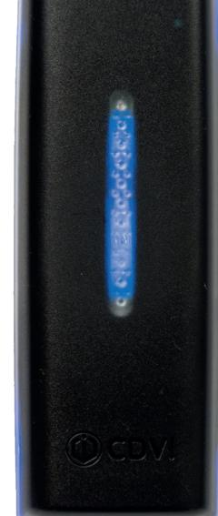

# **Produktblad**

## **Läsare - K4**

### **Produktbeskrivning**

### **Funktioner**

- Tillverkad i polykarbonat
- Tydlig ljud- och ljusindikering
- Kan läsa mobila nycklar
- Lästeknik Mifare och DESFire EV2
- OSDP-protokoll för hög säkerhet

*-25°C till +70°C IK10 IP65*

### **Teknisk information**

**Material:** Polykarbonat **Montering:** Utanpåliggande **Bakgrundsbelysning:** Ja **Ljus- och ljudindikering:** Ja **Funktioner:** Kort, kod och mobila nycklar **Lästeknik:** Mifare Classic, DESFire EV2 och bluetooth **Läsavstånd:** Upp till 10 cm **Kodlängd:** 4-8 siffror **Protokoll:** RS485 (OSDP) **Mått (H x B x D ):** 127 x 47 x 21,5mm **Spänningsmatning:** 12Vdc **Strömförbrukning:** 200mA **Kapslingsklass:** IP65 **Temperaturområde:** -25°C till +70°C **Miljötestad:** Saltspray **Vibrationssäkrad:** Ja **Slagtestad:** IK10 (20 Joule)

