# **Serie8®** – trycken och beslag för dörrar utomhus

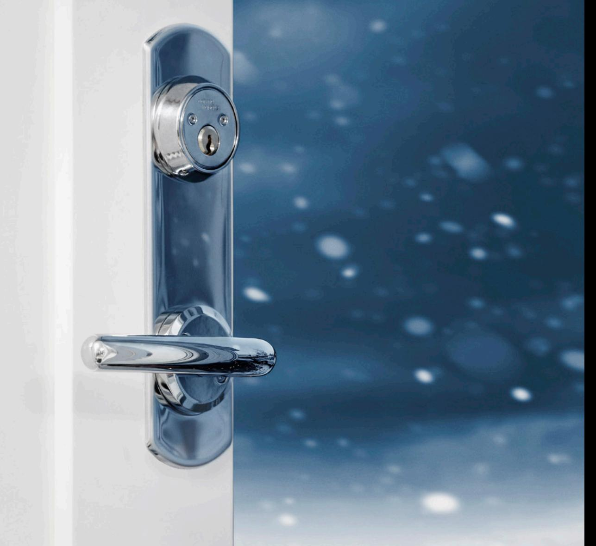

Dörrbeslag **dormakaba Serie8®** – ett tryggt val

**dormakaba Serie8®** är en serie utvalda trycken och beslag för dörrar i utomhusbruk och andra krävande miljöer

## **Materialval och ytbehandling**

Samtliga trycken i dormakaba Serie8® är tillverkade i rostfritt stål och belagda med PVD-ytbehandling.

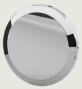

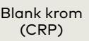

2

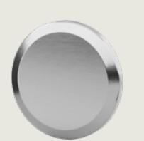

Mattborstad krom (CRS)

**Serie8® – med slitstark ytbehandling i PVD (Physical Vapor Deposition)**

Produkterna i Serie8® har en kärna i rostfritt stål som sedan är ytbehandlad med PVD-teknik. Detta innebär att ytbeläggning först förångas, kondenserar och sedan stelnar på produktens yta. Kombinationen av rostfritt stål och PVD-teknik gör produkterna i Serie8® inte bara är snygga, utan också robusta och tåliga.

Frågor? Kontakta din dormakaba representant.

Serie8® och Serie7® är våra mest hållbara trycken och beslag någonsin. När vi utvecklade båda serierna hade vi en tydlig vision: att uppfylla marknadens krav – utan några kompromisser.

 Resultatet blev stilrent designade trycken och beslag för inne- och utomhusbruk, byggda för tuff, frekvent användning varje dag.

#### **Serie8® – trycken och beslag för utomhusbruk**

dormakaba Serie8® är en omfattande serie av trycken och beslag i hög kvalitet, utvecklade specifikt för att motsvara marknadens krav på dörrar för utomhusbruk och andra krävande miljöer. Med Serie8® erbjuder dormakaba trycken och beslag med en modern design som går hand i hand med dormakabas övriga produktsortiment och samtidigt enkelt passar in i olika interiörer och för olika behov.

#### **Korrosionsbeständighet**

En serie framtagen för det nordiska utomhusklimatet behöver stå emot väder och vind och ha ett bra skydd mot korrosion. Därför är produkterna i Serie8® testade mot korrosion enligt standard EN 1670 där de klarar det tuffaste testet, grade 5, vilket innebär 480 timmar i konstant saltvattendimma. Detta uppnås genom att produkterna i Serie8® har en kärna i rostfritt stål som sedan är ytbehandlade med PVD-teknik.

dormakaba Serie8® och inomhusserien Serie7® kan enkelt kombineras utan att det enhetliga estetiska intrycket förändras. Ett formspråk, massor med möjligheter.

#### **Serie8® i korthet:**

- Sortiment för utomhusbruk och andra krävande miljöer
- Rostfritt stål, ytbehandlat med PVD
- Uppfyller högsta korrosionsklass enligt EN 1670, grade 5, 480 timmar
- Uppfyller de tuffaste kraven enligt beslagstandard EN 1906, 200 000 cykler, grade 4
- Produkten uppfyller EUs nickeldirektiv 94/27/EG
- Bedömt hos Byggvarubedömningen

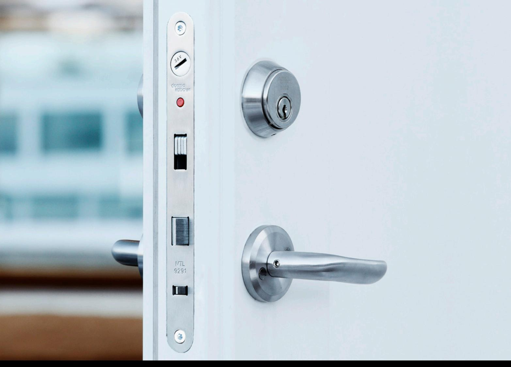

# **Trycken med returfjäder**

Dubbelverkande returfjäder för lång livslängd. Passar i dörrar med hög öppningsfrekvens. Genomgående skruvfastsättning M5. För dörrtjocklekar mellan 35 och 95 mm. Passar till skandinaviska låshus med 50 eller 70 mm dorndjup.

- EN 1906: 200 000 cykler, grade 4
- Bedömt hos Byggvarubedömningen
- Uppfyller EUs nickeldirektiv
- Certifierade för branddörrar

# **Dörrtrycke DH 8020**

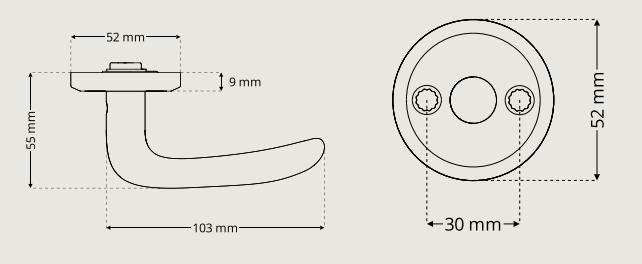

**Dörrtrycke DH 8021**

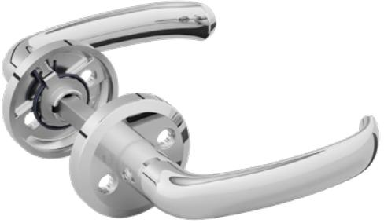

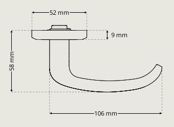

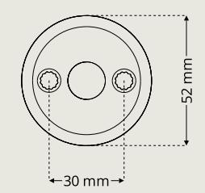

**Dörrtrycke DH 8060**

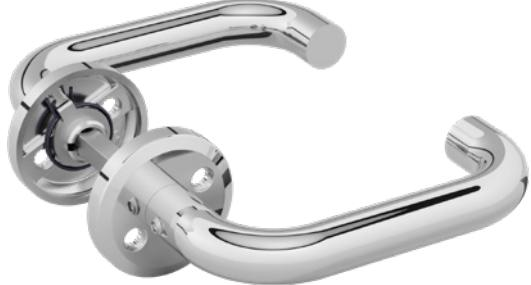

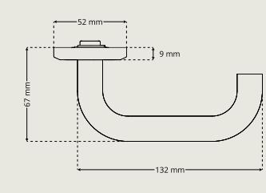

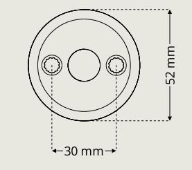

**Dörrtrycke DH 8061**

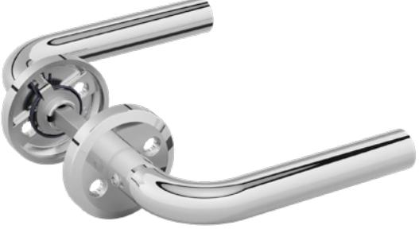

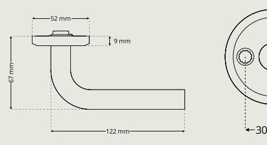

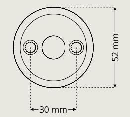

#### **Dörrtrycke DH 8062**

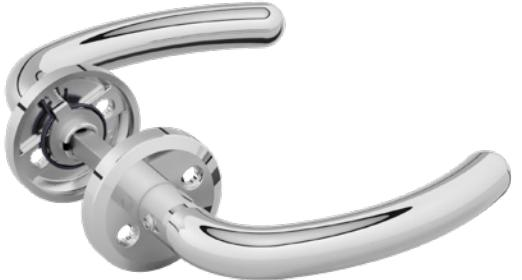

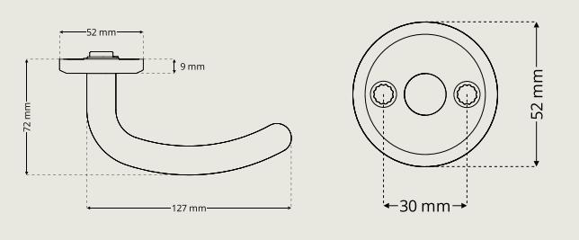

## **Vred**

**Vred DP 8704**

I Serie8® återfinns greppvänliga vred och vredskyltar för låshus i skandinavisk standard med 50 eller 70 mm dorndjup. I sortimentet finns också särskilt designade vred för enkel frångänglighet.

- Bedömt hos Byggvarubedömningen
- Uppfyller EUs nickeldirektiv
- Certifierade för branddörrar

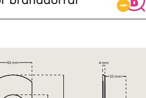

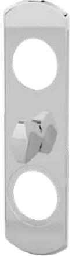

**Vred DP 8709**

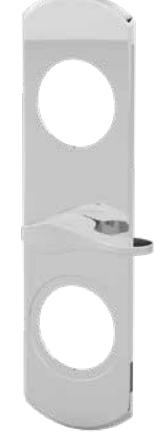

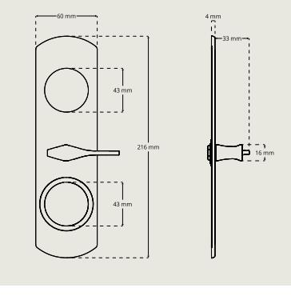

Vred för enkel frångänglighet

**Täckplatta DP 8774**

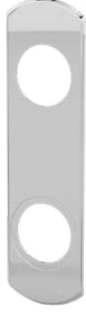

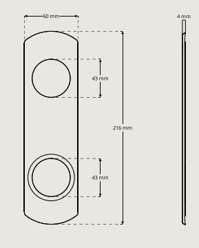

**Vred DA 8200**

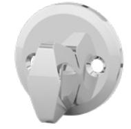

**Vred DA 8209**

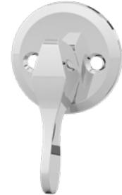

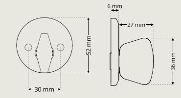

Vred för enkel frångänglighet

# **Cylinderbehör**

Serie8® innehåller ett brett utbud av cylinderbehör av olika typer i ett flertal olika höjder. Passar till alla dörrar utomhus med låshus av skandinavisk standard med 50 eller 70 mm dorndjup.

- Bedömt hos Byggvarubedömningen
- Uppfyller EUs nickeldirektiv
- Certifierade för branddörrar

### **Cylinderringar** För ovala cylindrar **Cylinderringar** För runda cylindrar

#### **Cylinderring DR 8320**

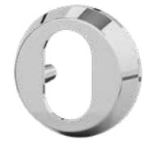

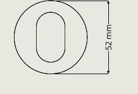

Cylinderring DR 8320 finns i höjder 6-21 mm. Ej Dynamic.

#### **Cylinderring DR 8330**

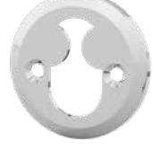

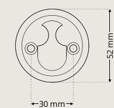

Cylinderring DR 8330 finns i höjder 6-21 mm. Ej Dynamic.

#### **Cylinderring DR 8340**

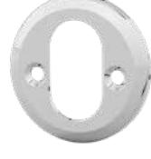

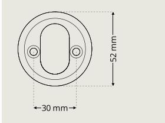

Cylinderring DR 8340 finns i höjder 6-21 mm. Ej Dynamic.

## **Övriga cylinderbehör**

#### **Täckskyltbehör DA 8100**

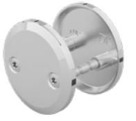

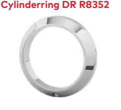

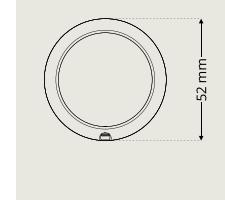

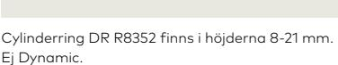

#### **Cylinderring DR R8354**

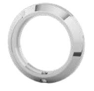

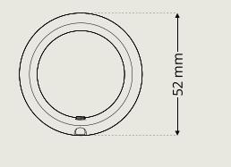

Cylinderring med gängor. Cylinderring DR R8354 finns i höjderna 8-21 mm. Ej Dynamic.

## **Toalettbehör**

Toalettbehören i dormakaba Serie8® följer seriens moderna designspråk. Passar till skandinaviska låshus med 50 eller 70 mm dorndjup. I sortimentet finns toalettbehör med greppvänliga vred, samt särskilt designade vred för enkel frångänglighet.

- Uppfyller EUs nickeldirektiv
- Certifierade för branddörrar

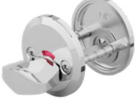

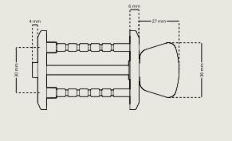

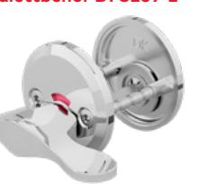

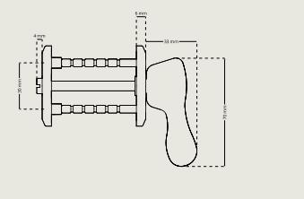

Vred för enkel frångänglighet

## **Kompletterande produkter**

## **Återfjädrande vredcylindrar**

Vredcylindrar med återfjädrande funktion för att monteras på låshus i skandinavisk standard med 360° nyckelvridning. I sortimentet finns ovala vredcylindrar som passar t ex smalprofillås samt runda vredcylindrar för skandinaviska låshus med 50 eller 70 mm dorndjup.

– Uppfyller EUs nickeldirektiv

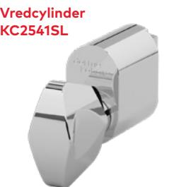

**Vredcylinder KC2542SL**

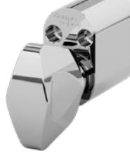

**Vredcylinder KC2549SL**

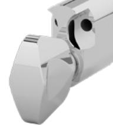

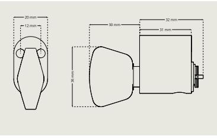

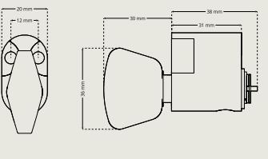

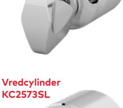

**Vredcylinder KC2572SL**

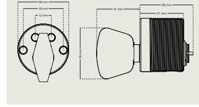

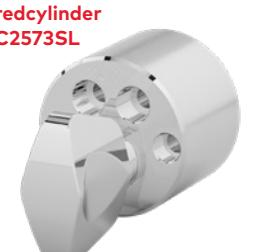

9

#### **dormakaba Sverige AB**

T: 031-355 20 00 info.se@dormakaba.com www.dormakaba.se