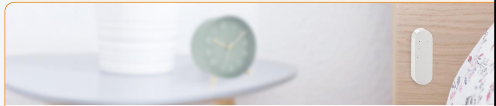
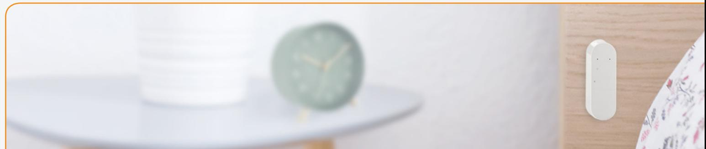

## **Vibration Sensor Detect vibration to gain insights for care and security purposes**

The Zigbee-based Vibration Sensor detects and reports vibrations making it ideal for use in home care, smart security, and building management solutions.

Home and business owners can have the peace of mind that they will be notified of any shattered windows or glass counters, helping them prevent break-ins and burglaries.

Home care solutions can keep an eye on their patients' health by placing the sensor on furniture at home. Placed underneath a bed, the Vibration sensor can monitor how long patients are in bed and how well they sleep, giving insights into their well-being and recognizing potential illnesses. Similarly, the Vibration Sensor can be installed on chairs and appliances to monitor activity.

Building managers can use the Vibration Sensor to keep an eye on hard-to-reach piping, helping them detect vibration in pipings. This way, they can quickly identify blockages, abnormal water pressure, among other issues.

Key features are:

- Dual output Alarm vibration/movement
- 15 pre-defined sensitivity levels
- Temperature detection
- Zigbee 3.0

## **Secure detection of vibration on different sensitivity levels**

The Vibration Sensor detects vibrations via its internal 3-axis accelerometer. With 15 different pre-defined vibration sensitivity levels, the Vibration Sensor allows you to define how reactive to vibrations and movement you want it to be. This way, the sensor is triggered by the exact force and intensity of vibration you want to detect - such as windows being shattered or intruders breaking in.

## **Vibration Sensor - Technical specifications**

**Model number: WISZB-137**

| General                |                                                               |
|------------------------|---------------------------------------------------------------|
| Dimensions (W x H x D) | 76 x 26 x 17 mm / 3 x 1 x 0.67 inches                         |
| Weight                 | 50 g / 1.76 oz (with packaging: 80 g / 2.82 oz)               |
| Color                  | White                                                         |
| Power supply           | Battery: 2 x AAA, exchangeable                                |
|                        | Battery life: 2 years (normal usage)                          |
|                        | Battery level and low battery warning can be reported         |
| Radio                  | Sensitivity: -100 dBm                                         |
|                        | Output power: +10 dBm (EU) and +19 dBm (US)                   |
| Environment            | IP class: IP40                                                |
|                        | Operation temperature 0 to +50°C / 32 - 122°F                 |
|                        | Relative humidity 5% - 85%, non condensing                    |
| Functions              |                                                               |
| Temperature sensor     | Range: 0 to +50°C / 32 - 122°F                                |
|                        | Resolution: 0.1°C / 0.18°F (accuracy Typ ±0.5°C / 1°F and Max |
|                        | ±2°C / 4°F)                                                   |
| Vibration              | 15 sensitivity levels based on duration, g-force, and sample  |
|                        | rate                                                          |
| Accelerometer          | 3-axis, 16-bit resolution                                     |
| Communication          |                                                               |
| Wireless protocol      | Zigbee 3.0, Zigbee end device                                 |
| Certifications         | Conforming to CE, FCC, IC, ISED, RED, RoHS and REACH          |
|                        | directives                                                    |
|                        | Alarm EN50131                                                 |
|                        | Zigbee 3.0 certified                                          |

Version 1.4