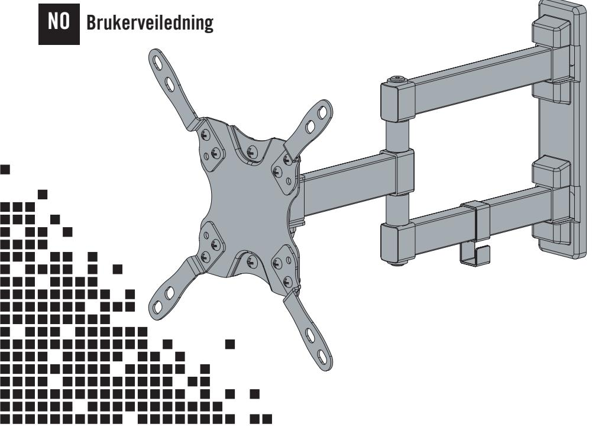
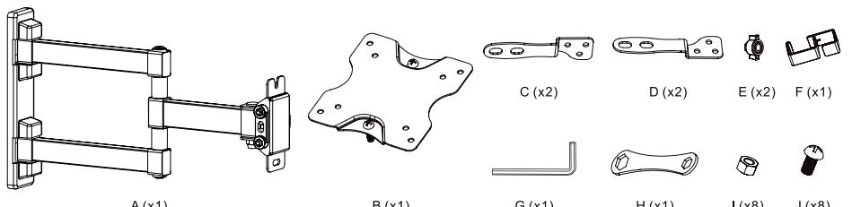
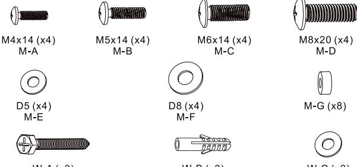
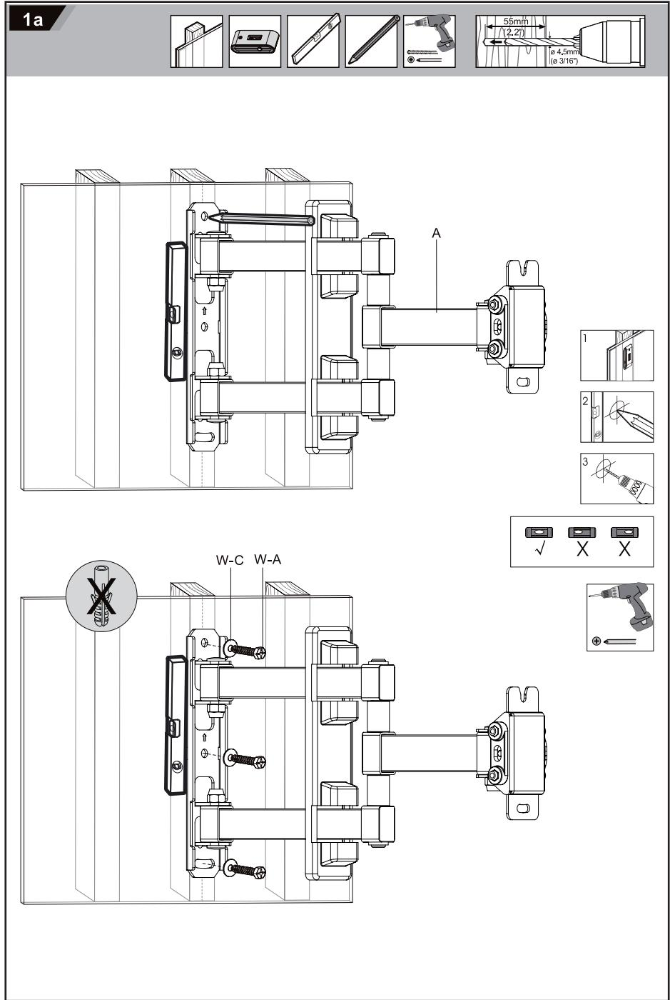
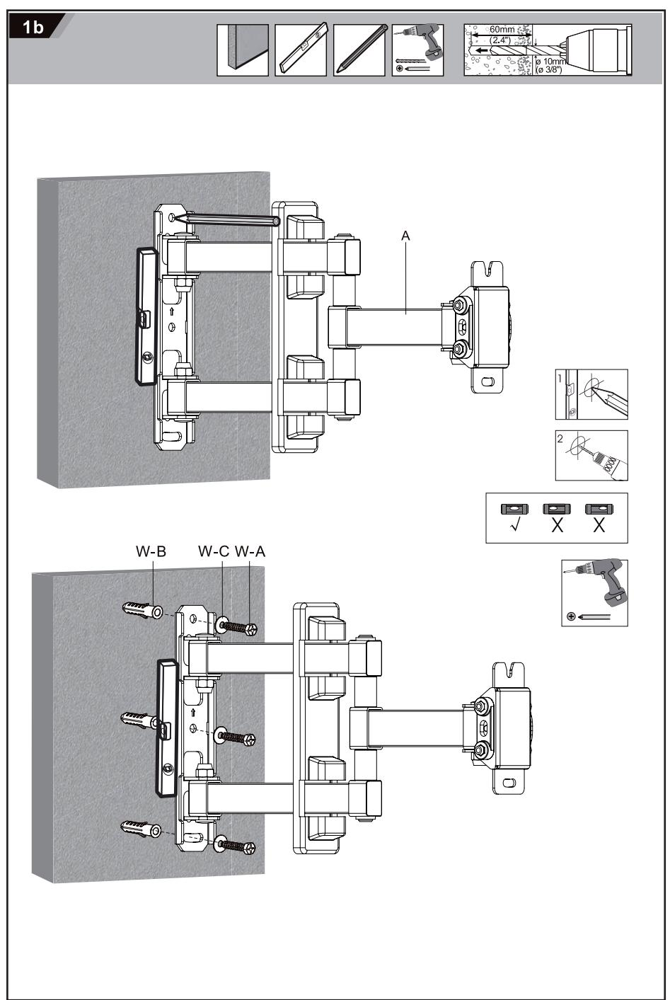
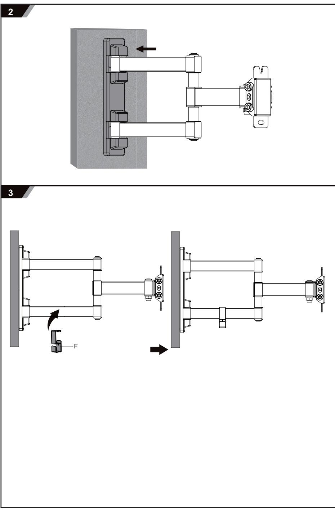
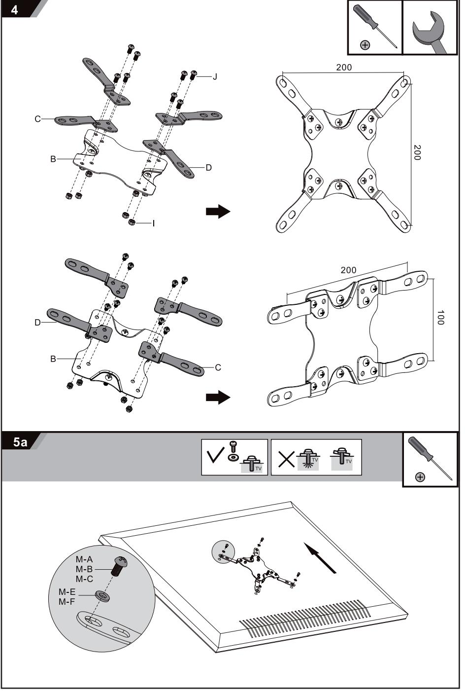

ARM-459

# 15"-40" display Wall mount

- EN User Manual
	- SE Användarhandledning
- FI Käyttöohje
- DK Brugervejledning

### EN – User Manual

You have bought a wall mount for a flat panel display up to 20kg. For mounting on concrete, brick and wooden walls, please use the included screws and plugs. For mounting on other type of walls, please use intended screws and plug´s (not included). Please follow the step by step guide on how to mount your flat panel display together with the wall mount on the wall.

# Important before you start

Do not begin the installation until you have read and understood all the instructions and warnings contained in this installation sheet.

Read the entire instruction manual before you start installation and assembly.

Verify that the supporting surface will safely support the combined weight of the screen, hardware and components.

If mounting on a wood stud wall make sure that the mounting screws are anchored into the center of the studs. The use of a stud finder is highly recommended.

Use an assistant or mechanical lifting equipment to safely lift and position the screen.

Tighten all screws, but do not overtight.

This product is for indoor use only.

#### Support

If you experience any problem installing or using this product, don't hesitate to contact us. We appreciate it if you have the information regarding your environment at hand; The DELTACO product number, type of flat panel, screws and wall type.

Contact us by email: help@deltaco.eu. More product and support information can be found at www.deltaco.eu.

### FI – Käyttöohje

Olet ostanut seinäkiinnikkeen max. 20 kilon televisiolle/näytölle. Asennus betoni-, tiili- tai puuseinään tapahtuu mukana tulevilla ruuveilla sekä tulpilla. Jos teline asennetaan muuntyyppisille seinille, tarvitaan toisen tyyppiset kiinnitystarvikkeet (ei mukana). Noudata tämän käyttöohjeen neuvoja kohta kohdalta asentaessasi televisiota/näyttöä seinälle.

#### Tärkeää huomata ennen aloittamista

Lue koko käyttöohje ennen kuin aloitat asennuksen ja kokoamisen.

Älä aloita asentamista ennen kuin olet lukenut ja ymmärrät kaikki ohjeet ja varoitukset ohjelehtisessä.

Tarkista, että asennuspinta kestää näytön, telineen ja komponenttien kokonaispainon.

Jos asennus tehdään seinälle, jossa on puiset koolaukset, ruuvaa asennusruuvit keskelle puukoolinkia. Suosittelemme rakenneilmaisimen käyttämistä.

SE – Användarhandledning

Du har köpt ett väggfäste för en TV/skärm på upp till 20kg. För montering på betong-, tegeleller träväggar, använd de medföljande skruvarna och pluggarna. För montering på andra typer av väggar behövs det andra typer av beslag(medföljer ej). Följ den här steg för steg guiden för att enkelt kunna montera din TV/skärm på väggen.

Viktigt innan du börjar Läs hela instruktionsbeskrivningen innan du påbörjar installation och montering.

Börja inte installationen förrän du har läst och förstått alla instruktioner och varningar i det här instruktionsbladet.

Kontrollera att installationsytan klarar skärmens, hårdvarans och komponenternas samlade vikt.

Om montering görs på en vägg med träreglar, se till att monteringsskruvarna förankras centralt på reglarna. En regelsökare rekommenderas starkt.

Ta hjälp av en assistent eller en mekanisk lyftanordning för att lyfta och positionera skärmen på ett säkert sätt.

Skruva åt alla skruvar, men inte för hårt.

Den här produkten är endast avsedd för inomhusbruk.

# Användarstöd

Om du har problem med att installera eller använda din produkt skall du inte tveka att ta kontakt med oss! Vi uppskattar om du har så mycket information om din miljö som möjligt tillgänglig; vilken produkt från DELTACO det gäller, TV-/skärm-modell, beslag och underlag/ vägg.

I Sverige når du oss på 0200-877771 vardagar 09:00-17:00, eller via e-post till help@deltaco. se. Mer information om produkt och användarstöd finns på www.deltaco.eu.

Asenna kaksin tai käytä mekaanista nostoapua nostaaksesi ja asettaaksesi näytön turvallisesti toivomaasi paikkaan.

Ruuvaa kaikki ruuvit, mutta ei liian tiukalle.

Tuote on tarkoitettu ainoastaan sisäkäyttöön.

# **Tuotetuki**

Ota yhteyttä, jos sinulla on ongelmia tuotteen käytössä tai käyttöönotossa. Mitä enemmän sinulla on tietoa tuotteesta, sitä paremmin pystymme neuvomaan. Vianmääritystä helpottavat esim. tuotenumero, näytön malli ja seinän tyyppi.

Tavoitat meidät puhelimella numerosta 020 712 0390 tai sähköpostilla osoitteesta info@ deltaco.fi. Tuotteesta löytyy lisätietoja osoitteesta www.deltaco.fi.

Du har købt et vægbeslag til en fladskærm på op til 20kg. For montering på beton-, mursteneller trævægge, anvend de medfølgende skruer og stik. For montering på andre typer vægge skal der bruges andre typer af monteringsmaterialer(medfølger ikke). Følg denne trin-for-trin guide for at nemmest at kunne montere din fladskærm på væggen.

Vigtigt! inden du begynder Læs hele brugervejledningen inden du påbegynder installation og montering.

Begynd ikke med installation før du har læst og forstået alle instruktioner og advarsler i denne brugervejledning.

Kontrollér at vægfladen den skal monteres på kan klare skærmens, hardwarens og komponenternes samlede vægt.

Hvis monteringen skal foretages i en væg med trækonstruktion(bagvedliggende) så sørg for at fastgøre skruerne midt på bræderne. Brug af en stud finder(sensor) anbefales kraftigt.

Benyt dig af hjælp fra en assistent eller mekanisk lift for at hæve og positionere skærmen på en sikker måde.

Skru alle skruerne i, dog ikke alt for hårdt.

Dette produkt er kun til indendørs brug.

### Support

Hvis du oplever problemer med at installere eller anvende dette produkt, tøv da ikke med at kontakte os! Vi sætter pris på, hvis du har så mange nødvendige oplysninger som muligt tilgængelige; hvilket produkt fra DELTACO det omhandler, TV-/skærm-model, beslag og underlag/væg.

I Danmark kontaktes vi på: help@deltaco.dk. Mere produkt- og supportinformation findes på www.deltaco.eu.

#### NO – Brukerveiledning

Du har kjøpt et veggfeste for en TV/skjerm på opp til 20kg. For montering på betong-, mursteineller trevegger, bruk de medfølgende skruene og pluggene. For montering på andre typer av vegger trengs det andre typer av beslag(medfølger ikke). Følg denne trinn for trinn guiden for å enkelt kunne montere din TV/skjerm på veggen.

# Viktigt innan du börjar

Les hele instruksjons manualen før du beginner installasjon og montering.

Ikke begynn installering før du har lest og forstått alle instruksjoner og advarsler i denne installasjonsmanualen.

Sørk for at monteringsflaten kan trygt håndtere skjermens, materialet og komponentenes kombinerte vekt.

Om montering skjer på en vegg med trelister, sørg for at monteringsskruene er midt på listene.

Bruk en assistent eller mekanisk løfteutstyr for å trygt løfte og stille inn skjermen.

Stram alle skruer, men ikke overstram.

Dette produktet er kun for innendørsbruk

#### Brukerstøtte

Om du har problemer med å installere eller bruke ditt produkt skal du ikke nøle med å ta kontakt med oss! Vi setter pris på at du har så mye informasjon om din miljø som mulig tilgjengelig; hvilket produkt fra DELTACO det gjelder, TV-/skjerm-modell, beslag og underlag/ vegg.

I Norge når du oss på 22 830 906 hverdager 08:00-17:00, eller via e-post til help@deltaco.no. Mer informasjon om produkt och brukerstøtte fins på www.deltaco.eu.

- EN: help@deltaco.eu
- SE: help@deltaco.se 0200-877771
- FI: info@deltaco.fi 020 712 0390
- DK: help@deltaco.dk
- NO: help@deltaco.no

