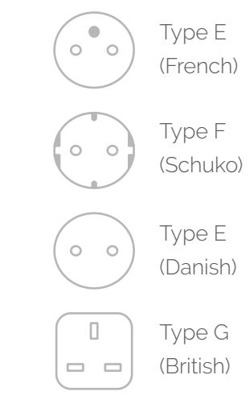
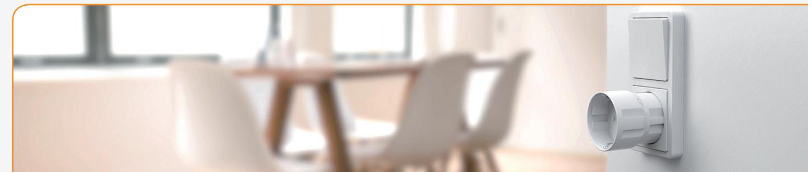
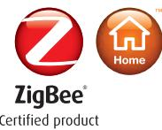

## **Smart Plug Mini Monitor and control electronics remotely**

Develco Products' Smart Plug Mini is an intelligent remotely controlled adapter. The Smart Plug Mini monitors power consumption and enables the user to control electrical equipment remotely.

Key features are:

- Accurate power consumption measurement
- Remote on/off control
- ZigBee Home Automation 1.2 certified

## **Small and smart**

The Smart Plug Mini allows the user to instantly turn any device on and off - from anywhere. The undemanding interface ensures an easy and intuitive way of adding the smart plug to any IoT solution.

## **World's smallest smart plug Secure communication Easy installation**

The Smart Plug Mini is based on ZigBee communication and can easily be integrated with other ZigBee products or smart control solutions. The Smart Plug Mini is OTA upgradeable, which greatly increases the longevity of the product.

## **Smart Plug Mini - Technical Specifications**

| General            |                                                        |                    |
|--------------------|--------------------------------------------------------|--------------------|
| Dimensions (Ø x H) | Ø41 X 45 mm (Type G 48 X 48 X 32 mm)                   |                    |
| Color              | White                                                  |                    |
| Plug types         | Schuko, Danish, French, British                        |                    |
| Power supply       | 230V +/-10%                                            |                    |
| Power consumption  | 0.4 W                                                  |                    |
| Radio              | Sensitivity: -101 dBm @ 1% PER Output power: +8 dBm |                    |
|                    |                                                        |                    |
| Environment        | Operation temperature 0 to +40°C IP class: IP40     |                    |
|                    |                                                        |                    |
| Functions          |                                                        |                    |
| Power meter        | Voltage range:                                         | 207 to 253 VAC     |
|                    | Accuracy:                                              | Typ +/- 2 %        |
|                    | Reported resolution:                                   | 1W                 |
| Remote control     | Max. switch voltage:                                   | 250 VAC            |
|                    | Max. load:                                             | 16 A               |
|                    | Max. continuous load:                                  | 10 A (Type G 13 A) |
|                    | Overload and over temperature protection               |                    |
| Communication      |                                                        |                    |
| Wireless protocol  | ZigBee Home Automation 1.2 ZigBee router            |                    |
|                    |                                                        |                    |
| Certifications     | Conforming to CE, RoHS and REACH directives            |                    |
|                    | ZigBee Home Automation 1.2 certified                   |                    |

Version 3.1