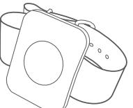
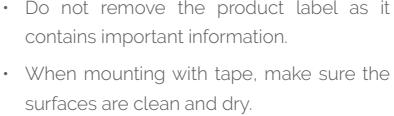
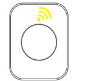
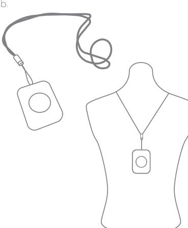
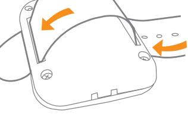
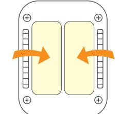

### **Panic Button**

### Version 2.7 **INSTALLATION MANUAL**

### **Product description**

The Panic Button enables you to call for help in emergencies. It can be mounted in multiple ways.. If a necklace or strap is included, you can wear the Panic Button around your neck or on your arm. Alternatively, you can use it hand-held as a remote control or mount it on the wall or door with tape.

### **Disclaimers**

### **CAUTION:**

- Choking hazard! Keep away from children. Contains small parts.
- Please follow the guidelines thoroughly. The Panic Button is a preventive, informing device, not a guarantee or insurance that sufficient warning or protection will be provided, or that no property damage, theft, injury, or any similar situation will take place. Develco Products cannot be held responsible in case any of the abovementioned situations occur.

- When mounting with tape, the room temperature should ideally be between 21° C and 38° C and minimum 16° C.
- Avoid mounting with tape on rough, porous or fibered materials such as wood or cement, as they reduce the tape bond

#### **Connecting**

a.

**Precautions**

- Press the button to activate search for network. The Panic Button will start searching (up to 15 minutes) for a Zigbee network to join.
- Make sure that the Zigbee network is open for joining devices and will accept the Panic Button.
- While the device is searching for a Zigbee network to join, the yellow LED flashes.

- When the LED stops flashing, the device has successfully joined the Zigbee network.
- If the scanning has timed out, a short press on the button will restart it.

### **Mounting and use**

- If your product includes a necklace, the necklace is already attached to the Panic Button and ready to wear around your neck. If you do not wish to use the necklace, simply cut it off.

- If your product includes a strap for the wrist, you can attach the button to the strap and wear it on your arm.
c.

d.

# **Resetting**

**Alarm**

e.

alarm is activated.

LED will stop flashing.

- 1. Press and hold the button for 10 seconds. Release the button immediately when the LED flashes green. You now have 60 seconds to reset the device.
To activate the alarm, press the button. The red LED will then start flashing, signaling that the

To disable the alarm, press the button for 3 seconds. When the alarm is disabled, the red

- 2. Press the button again and hold it.
- 3. While you are holding the button down, the LED flashes yellow once, then two times in a row, and finally numerous times in a row.
- 4. Release the button while the LED is flashing numerous times in a row.
- 5. After you release the button, the LED shows one long flash, and the reset is completed.

As an alternative option, you can reset the device by removing the screws in the back of the device and open the casing (note that you need a T6 Torx screwdriver to install and remove these screws). Remove the battery and insert it again. You now have 60 seconds to reset the device. Press the button inside the device and follow steps 3-5.

#### **Fault finding and cleaning**

- In case of a bad or weak wireless signal, change the location of the Panic Button. Otherwise you can relocate your gateway or strengthen the signal with a smart plug.
- If the search for a gateway has timed out, a short press on the button will restart it.

### **Battery replacement**

The device will flash twice every minute when the battery is low.

#### **CAUTION:**

- Do not ingest battery, Chemical Burn Hazard.
- This product contains a coin cell battery. If the cell battery is swallowed, it can cause severe internal burns in just 2 hours and can lead to death.
- Keep new and used batteries away from children.
- If the battery compartments does not close securely, stop using the product and keep it away from children.
- If you think batteries might have been swallowed or placed inside any part of the body, seek immediate medical attention. Do not attempt to recharge or open the batteries.
- Risk of explosion if batteries are replaced by an incorrect type.
- Dispose of a battery into fire or a hot oven, or mechanically crushing or cutting of a battery can result in an explosion
- Leaving a battery in an extremely high temperature surrounding environment can result in an explosion or the leakage of flammable liquid or gas.
- A battery subjected to extremely low air pressure may result in an explosion or the leakage of flammable liquid or gas
- Maximum operation temperature is 50°C / 122°F
- If you experience leakage from the batteries, immediately wash your hands and/or any affected area of your body thoroughly!

**CAUTION:** When removing cover for battery change - Electrostatic Discharge (ESD) can harm electronic components inside.

To replace the battery, remove the screws in the back of the device and open the casing (note that you need a T6 Torx screwdriver to install and remove these screws). Replace the battery (CR2450) respecting the polarities. Close the casing and install the screws in the back of the device.

- If you want to mount the Panic Button on the wall, you can use the included tape. Put the double adhesive tape on the back of the device and press firmly on the device with the tape to make it stick to the wall.

#### **Disposal**

Dispose the product and batteries properly at the end of their lives. This is electronic waste which should be recycled.

#### **FCC statement**

Changes or modifications to the equipment not expressly approved by the party responsible for compliance could void the user's authority to operate the equipment.

**NOTE:** This equipment has been tested and found to comply with the limits for a Class B digital device, pursuant to Part 15 of the FCC Rules. These limits are designed to provide reasonable protection against harmful interference in a residential installation. This equipment generates, uses and can radiate radio frequency energy and, if not installed and used in accordance with the instructions, may cause harmful interference to radio communications. However, there is no guarantee that interference will not occur in a particular installation.

If this equipment does cause harmful interference to radio or television reception, which can be determined by turning the equipment off and on, the user is encouraged to try to correct the interference by one or more of the following measures:

- Reorient or relocate the receiving antenna.
- Increase the separation between the equipment and receiver.
- Connect the equipment into an outlet on a circuit different from that to which the receiver is connected.
- Consult the dealer or an experienced radio/ TV technician for help.

This device complies with FCC RF radiation exposure limits set forth for an uncontrolled environment. Must not be co-located or operating in conjunction with any other antenna or transmitter.

This device complies with part 15 of the FCC Rules. Operation is subject to the following two conditions:

- 1. This device may not cause harmful interference, and
- 2. this device must accept any interference

received, including interference that may cause undesired operation.

### **IC statement English**

This device contains licence-exempt transmitter(s)/receiver(s) that comply with Innovation, Science and Economic Development Canada's licence-exempt RSS(s). Operation is subject to the following two conditions:

- 1. This device may not cause interference.
- 2. This device must accept any interference, including interference that may cause undesired operation of the device.

This equipment complies with IC RSS-102 radiation exposure limits set forth for an uncontrolled environment.

#### **Français**

L'émetteur/récepteur exempt de licence contenu dans le présent appareil est conforme aux CNR d'Innovation, Sciences et Développement économique Canada applicables aux appareils radio exempts de licence. L'exploitation est autorisée aux deux conditions suivantes :

- 1. L'appareil ne doit pas produire de brouillage; 2. L'appareil doit accepter tout brouillage
- radioélectrique subi, même si le brouillage est susceptible d'en compromettre le fonctionnement.

Cet équipement est conforme aux limites d'exposition aux radiations IC CNR-102 établies pour un environnement non contrôlé.

## **FCC/IC SAR statement**

**English**

This equipment has been tested and meets applicable limits for radio frequency (RF) exposure.

Specific Absorption Rate (SAR) refers to the rate at which the body absorbs RF energy. The SAR limit is 1.6 watts per kilogram in countries that set the limit averaged over 1 gram of tissue. During testing, device radios are set to their highest transmission levels and placed in positions that simulate use near the body, with 0 mm separation.

Cases with metal parts may change the RF performance of the device, including its compliance with RF exposure guidelines, in a manner that has not been tested or certified.

#### **Français**

Cet équipement a été testé et respecte les limites applicables d'exposition aux radiofréquences (RF).

Le débit d'absorption spécifique est la vitesse à laquelle le corps absorbe l'énergie radiofréquence. La limite du débit d'absorption spécifique est de 1,6 watt par kilogramme dans les pays où la moyenne a été établie sur un gramme de tissu. Pendant l'essai, les radios de appareil sont réglées sur le niveau de transmission maximal et sont placées dans des positions simulant une utilisation à proximité du corps, avec une séparation de 0 mm.

Les étuis dotés de pièces métalliques peuvent modifier les performances des radiofréquences de l'appareil, y compris sa conformité aux directives d'exposition aux radiofréquences, d'une façon qui n'a pas été testée ou certifiée.

#### **ISED statement ISED statement**

Innovation, Science and Economic Development Canada ICES-003 Compliance Label: CAN ICES-3 (B)/NMB-3(B).

#### **CE certification**

The CE mark affixed to this product confirms its compliance with the European Directives which apply to the product and, in particular, its compliance with the harmonized standards and specifications.

#### **IN ACCORDANCE WITH THE DIRECTIVES**

- Radio Equipment Directive (RED) 2014/53/EU
- RoHS Directive 2015/863/EU amending 2011/65/EU
	- REACH 1907/2006/EU + 2016/1688

#### **Other certifications**

Zigbee 3.0 certified

#### **All rights reserved.**

Develco Products assumes no responsibility for any errors, which may appear in this manual. Furthermore, Develco Products reserves the right to alter the hardware, software, and/or specifications detailed herein at any time without notice, and Develco Products does not make any commitment to update the information contained herein. All the trademarks listed herein are owned by their respective owners.

Distributed by Develco Products A/S Tangen 6 8200 Aarhus Denmark

Copyright © Develco Products A/S