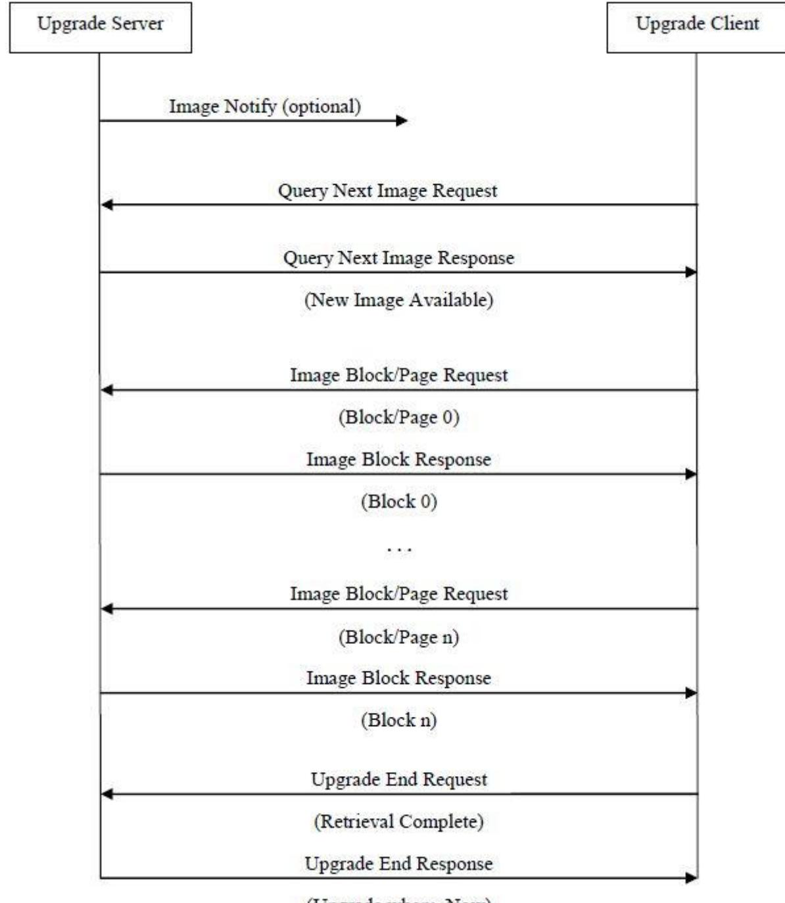
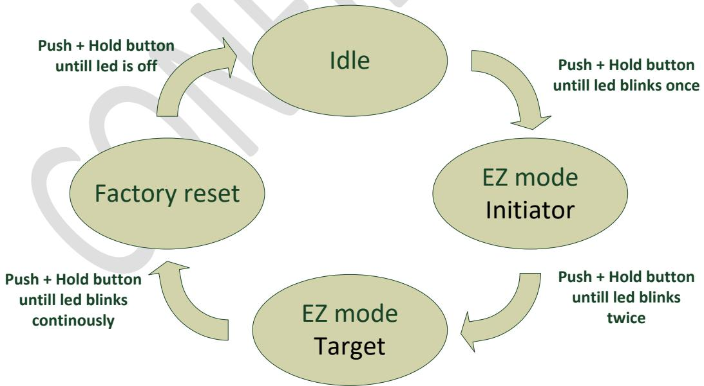

# **Panic Button - PBTZB-110**

# **Technical manual**

Revised 29.07.2021

| 1   | Cautionary notes 5                                 |  |
|-----|----------------------------------------------------|--|
| 2   | Features  6                                        |  |
| 2.1 | Panic Button - PBTZB-110 6                         |  |
| 2.2 | IAS Zone 6                                         |  |
| 2.3 | Key features  6                                    |  |
| 3   | Endpoints7                                         |  |
| 3.1 | ZigBee Device Object (ZDO)7                        |  |
| 3.2 | IAS Zone7                                          |  |
| 3.3 | Develco Utility7                                   |  |
| 4   | Supported Clusters 8                               |  |
| 4.1 | Common clusters for each end point  8              |  |
|     | 4.1.1 Basic – Cluster id 0x0000 8               |  |
|     | 4.1.1.1 Attribute 8                             |  |
|     | 4.1.2 Identify – Cluster id 0x0003 8            |  |
|     | 4.1.2.1 Attribute 8                             |  |
|     | 4.1.2.2 Commands 8                              |  |
| 4.2 | IAS Zone Device – EP 0x239                         |  |
|     | 4.2.1 IAS Zone - Cluster id 0x05009             |  |
|     | 4.2.1.1 Attribute9                              |  |
|     | 4.2.1.2 Commands 10                             |  |
|     | Note: How to clear a alarm in the "Zone status" 10 |  |
|     | 4.2.2 Power Configuration - Cluster id 0x000111 |  |
|     | 4.2.2.1 Attribute11                             |  |
|     | 4.2.3 Poll Control - Cluster id 0x002011        |  |
|     | 4.2.3.1 Attribute11                             |  |
|     | 4.2.4 OTA Upgrade – Cluster id 0x001912         |  |
|     | 4.2.4.1 Attributes 12                           |  |
|     | 4.2.4.2 Commands12                              |  |
|     | 4.2.4.3 OTA Upgrade Messages Diagram 13         |  |
|     |                                                    |  |

|     | 4.2.5   | Time – Cluster id 0x000A 14           |  |
|-----|---------|---------------------------------------|--|
|     | 4.2.5.1 | Attribute 14                          |  |
| 5   |         | MMI user guide 15                     |  |
| 5.1 |         | Accessing and re-enabling MMI menu 15 |  |
| 5.2 |         | Push Button Menu 15                   |  |
|     | 5.2.1   | EZ mode - Initiator 16                |  |
|     | 5.2.2   | EZ mode - Target 16                   |  |
|     | 5.2.3   | Factory reset 16                      |  |
| 5.3 |         | Action on Power On 16                 |  |
| 6   |         | General network behaviour  18         |  |
| 6.1 |         | Installation  18                      |  |
| 6.2 |         | Low battery 18                        |  |
| 7   |         | Specifications  19                    |  |
| 8   |         | Contact Information 20                |  |

Copyright © Develco Products A/S

All rights reserved.

Develco Products assumes no responsibility for any errors, which may appear in this manual. Furthermore, Develco Products reserves the right to alter the hardware, software, and/or specifications detailed herein at any time without notice, and Develco Products does not make any commitment to update the information contained herein.

All the trademarks listed herein are owned by their respective owners.

# **1 Cautionary notes**

Develco Products A/S reserves the right to make changes to any product to improve reliability without further notice. Develco Products A/S does not assume any liability arising out of the application or use of any product or circuit described herein; neither does it convey any license under patent rights or the rights of third parties.

# **2 Features**

# **2.1 Panic Button - PBTZB-110**

The Panic Button is a programmable, Zigbee-based button that can be used for multiple purposes. For example, the Panic Button can be used as a safety button for emergencies, as a door lock button, or as a switch for lights or "all on/off" functionality that enables the user to switch multiple home appliances on or off in the press of a single button. You can program the button to fit the requirements of your solution.

You can program the wireless button as an alarm button for elderly or disabled, enabling them to easily alert friends and family or healthcare professionals, if an emergency occurs.

Being more vulnerable to all kinds of dangers, elderly and disabled can benefit from an easy way to call for help in case of an emergency. With the Panic Button, they can simply press a button to alert others if they need help. The Panic Button can help elderly and disabled gain more independence and security, and it can give friends and relatives peace of mind and reassurance that their loved one is safe.

### **2.2 IAS Zone**

The Panic Button is implemented as a IAS Zone ZigBee end point according to ZigBee Home Automation profile "IAS Zone".

### **2.3 Key features**

- Alarm sensor IAS Zone
- ZigBee OTA cluster for firmware upgrades
- ZigBee 3.0 stack supported
- Water repellent
- RoHS compliant according to the EU Directive 2002/95/EC
- Standard ZigBee Home Automation security and stack settings are used

# **3 Endpoints**

The device implements the following standard HA devices on different end points.

# **3.1 ZigBee Device Object (ZDO)**

- End point number 0x00
- Application profile Id 0x0000
- Application device Id 0x0000
- Supports all mandatory clusters

# **3.2 IAS Zone**

- End point number 0x23
- Application profile Id 0x0104 (Home Automation)
- Application device Id 0x0402

# **3.3 Develco Utility**

- Application profile Id 0xC0C9 (Develco Products private profile)
- Application device Id 0x0001
- Manufactor code for Develco Products is 0x1015
- Private profile for internal Develco Products use only.

### **Reference documents:**

053474r18ZB_CSG-ZigBee-Specification.pdf 075123r03ZB_AFG-ZigBee_Cluster_Library_Specification.pdf 053520r27ZB_HA_PTG-Home-Automation-Profile.pdf 075356r15ZB_ZSE-ZSE-AMI_Profile_Specification.pdf

They can all be downloaded from :

<http://www.zigbee.org/Products/DownloadZigBeeTechnicalDocuments.aspx>

# **4 Supported Clusters**

### **4.1 Common clusters for each end point**

The ZCL "General Function Domain" clusters in this section are implemented as server clusters. Refer to ZigBee Cluster Library Specification. <http://www.zigbee.org/Specifications.aspx>

### **4.1.1 Basic – Cluster id 0x0000**

Only the first set has mandatory attributes, also the optional attributes that can be relevant to a Develco device are all in set 0x000.

#### **4.1.1.1 Attribute**

| Id# | Name             | Type       | Range      | Man/Opt | Relevance and ref. |
|-----|------------------|------------|------------|---------|--------------------|
| 0x0 | ZCLVersion       | Uint8      | Type range | M       |                    |
| 0x4 | ManufacturerName | String     | 0-32 byte  | O       | 4.1.1.1.1          |
| 0x5 | ModelIdentifier  | String     | 0-32 byte  | O       | 4.1.1.1.2          |
| 0x6 | DateCode         | String     | 0-32 byte  | O       |                    |
| 0x7 | PowerSource      | 8 bit enum | Type range | M       |                    |

#### **4.1.1.1.1 ManufacturerName**

"Develco Products A/S"

#### **4.1.1.1.2 ModelIdentifier**

"PBTZB-110"

# **4.1.2 Identify – Cluster id 0x0003**

### **4.1.2.1 Attribute**

| Id#    | Name         | Type   | Range      | Man/Opt | Relevance and ref. |
|--------|--------------|--------|------------|---------|--------------------|
| 0x0000 | IdentifyTime | Uint16 | Type range | M       |                    |

#### **4.1.2.2 Commands**

The identify cluster has 2 commands as server.

| Id#  | Name     | Payload                          | Man/Opt | Relevance and ref. |
|------|----------|----------------------------------|---------|--------------------|
| 0x00 | Identify | Uint16 - Identify Time (seconds) | M       | 0x00               |

| 0x01 | Identify Query | none | M | 0x01 |
|------|----------------|------|---|------|

The identify cluster has 1 command as client.

| Id#  | Name                    | Payload                          | Man/Opt | Relevance and ref. |
|------|-------------------------|----------------------------------|---------|--------------------|
| 0x00 | Identify Query Response | Uint16 - Identify Time (seconds) | M       | 0x00               |

### **4.2 IAS Zone Device – EP 0x23**

### **4.2.1 IAS Zone - Cluster id 0x0500**

The IAS Zone cluster is described in ZigBee Cluster Library Specification.

#### **4.2.1.1 Attribute**

| Id#    | Name            | Type                         | Man/Opt | Relevance and ref.              |  |  |
|--------|-----------------|------------------------------|---------|---------------------------------|--|--|
| 0x0000 |                 | 8-bit                        | M       |                                 |  |  |
|        | Zone State      | Enumeration                  |         |                                 |  |  |
| 0x0001 | Zone Type       | 16-bit                       | M       | Hard coded to                   |  |  |
|        |                 | Enumeration                  |         | Personal emergency device       |  |  |
| 0x0002 | Zone Status     | Uint16                       | M       | The following bits are |  |  |
|        |                 |                              |         | supported:                      |  |  |
|        |                 |                              |         | Bit1: Alarm 2                   |  |  |
|        |                 |                              |         | Bit3: Battery                   |  |  |
|        |                 |                              |         | Bit4: Supervision reports       |  |  |
|        |                 |                              |         | Bit5: Restore reports           |  |  |
| 0x0010 | IAS CIE Address | Valid 64-bit IEEE address | M       |                                 |  |  |
| 0x0011 | ZoneID          | Uint8                        | M       |                                 |  |  |

#### **4.2.1.1.1 Zone State**

The device will automatically start to scan the network for an IAS Zone client in a predefine interval. When the client is found it will automatically attempt to enrol. When it has successfully enrolled the Zone Status command is send to the IAS Zone client.

The attribute value will change from not enrolled (0x00) to Enrolled (0x01).

#### **4.2.1.1.2 IAS CIE Address**

Attribute specifies the address that commands generated by the server shall be sent to. To un-enrol the device the back end system has to write a new address into this attribute. Any value is valid. If the back end system writes an IEEE address then it will try to enrol to this devices represented by the IEEE address.

Develco Products A/S Tangen 6 http://develcoproducts.com DK-8200 Aarhus N info@develcoproducts.com

#### **4.2.1.1.3 ZoneID**

A unique reference number allocated by the CIE at zone enrolment time.

Used by IAS devices to reference specific zones when communicating with the CIE. The *ZoneID* of each zone stays fixed until that zone is un-enrolled.

#### **4.2.1.2 Commands**

The IAS Zone cluster has 2 commands as server.

| Id#  | Name                               | Payload           |             |              | Man/Opt | Relevance and ref. |
|------|------------------------------------|-------------------|-------------|--------------|---------|--------------------|
| 0x00 | Zone Status Change Notification | Uint16 – bit mask |             |              | M       |                    |
| 0x01 | Zone Enroll Request                | Bits              | 16          | 16           |         |                    |
|      |                                    | Data type         | 16 bit enum | UINT16       | M       |                    |
|      |                                    | Field             | Zone        | Manufacturer |         |                    |
|      |                                    | name              | type        | code         |         |                    |

Init sequence – when the device has join the network it start to scan for an IAS zone client cluster. If a client is found a Zone enroll request command is send and a Zone Enroll response is expected. If it doesn't receive a response it will wait for 15 minutes and try again.

The following bits are supported in Zone status:

Bit1: Alarm 2

Bit3: Battery

Bit4: Supervision reports

Bit5: Restore reports

#### Bit0, Alarm

Note: How to clear a alarm in the "Zone status"

The sensor requests ZCL Default Response on the Zone Status Change notification, if any new Alarm bit has been set. Until the IAS CIE has acknowledged the received alarm by sending the mandated Default Response, the Alarm bits are not cleared – even if there is no longer an alarm situation. When the Default Response is received, a new Zone Status Change notification is sent with the Alarm bits cleared, if the alarm situation has disappeared since sending the Zone Status message with alarm set.

Bit3: When the battery is below 2.2 VDC. Battery bit is set high and "Zone Status" is transmitted to the coordinator.

# **4.2.2 Power Configuration - Cluster id 0x0001**

The power configuration cluster is described in ZigBee Cluster Library Specification

#### **4.2.2.1 Attribute**

| Id#    | Name           | Type  | Range       | Man/Opt | Relevance and ref.         |
|--------|----------------|-------|-------------|---------|----------------------------|
| 0x0020 | BatteryVoltage | Uint8 | 0x00 - 0xFF | O       | ZCL configure reporting is |
|        |                |       |             |         | supported                  |

Note: The attribute "*BatteryVoltage*" is measuring the battery voltage, in units of 100mV.

### **4.2.3 Poll Control - Cluster id 0x0020**

The poll control cluster is described in ZigBee Cluster Library Specification

This cluster provides a mechanism for the management of an end device's MAC Data Request rate. For the purposes of this cluster, the term "poll" always refers to the sending of a MAC Data Request from the end device to the end device's parent.

This cluster can be used for instance by a configuration device to make an end device responsive for a certain period of time so that the device can be managed by the controller.

#### **4.2.3.1 Attribute**

| Id#    | Name              | Type   | Range       | Man/Opt | Relevance and ref.            |
|--------|-------------------|--------|-------------|---------|-------------------------------|
| 0x0000 | Check-inInterval  | Uint32 | 0x00 - 0xFF | M       | Default value is 1 hour       |
| 0x0001 | LongPoll Interval | Uint32 |             | M       | Default value is disabled     |
| 0x0002 | ShortPollInterval | Uint16 |             | M       | Default value is 3 seconds |
| 0x0003 | FastPollTimeout   | Uint16 |             | M       | Default value is 5 minutes    |

Start up, auto scan for client poll control cluster on the coordinator. If it is support on the coordinator an auto bind is created and the smoke sensor will send a check-in command in the interval specified in attribute "CheckinInterval. The coordinator has to reply with a check-in response. The sensor supports the following commands send from the client (Typically the coordinator).

- 0x00 Check-in Response,
- 0x01 Fast Poll Stop,

- 0x02 Set Long Poll Interval,
- 0x03 Set Short Poll Interval,

If it doesn't find a poll client it will search again periodically.

# **4.2.4 OTA Upgrade – Cluster id 0x0019**

The cluster provides a ZigBee standard way to upgrade devices in the network via OTA messages. The devices support the client side of the cluster.

When the devices has joined a network it will automatically auto scan for a OTA upgrade server in the network. If it finds a server an auto bind is created and ones every 24 hour it will automatically send its "current file version" to the OTA upgrade server. It is the server that initiate the firmware upgrade process.

| Id#    | Name                         | Type    | Range        | Man/Opt | Relevance and ref. |
|--------|------------------------------|---------|--------------|---------|--------------------|
| 0x0000 | UpgradeServerID              | IEEE    | -            | M       |                    |
|        |                              | Address |              |         |                    |
| 0x0001 | FileOffset                   | Uint32  | Type range   | O       |                    |
| 0x0002 | CurrentFileVersion           | Uint32  | Type range   | O       |                    |
| 0x0003 | CurrentZigBeeStackVersion    | Uint16  | Type range   | O       |                    |
| 0x0004 | DownloadedFileVersion        | Uint32  | Type range   | O       |                    |
| 0x0005 | DownloadedZigBeeStackVersion | Uint16  | Type range   | M       |                    |
| 0x0006 | ImageUpgradeStatus           | 8 bit   | 0x00 to 0xFF | O       |                    |
|        |                              | enum    |              |         |                    |
| 0x0007 | Manufacturer ID              | Uint16  | Type range   | O       |                    |
| 0x0008 | Image Type ID                | Uint16  | Type range   | O       |                    |
| 0x0009 | MinimumBlockRequestDelay     | Uint16  | Type range   | O       |                    |

Above attribute description is to be found in section 6.7 "OTA Cluster Attributes" in ZigBee document – "zigbeeota-upgrade-cluster-specification" provided by the ZigBee alliance.

### **4.2.4.2 Commands**

The OTA Client cluster can send the following commands

| Id#  | Name                     | Man/Op t |             | Relevance and ref. |         |         |
|------|--------------------------|-------------|-------------|--------------------|---------|---------|
| 0x01 | Query Next Image request | M           | 6.10.1      | OTA                | Cluster | Command |
|      |                          |             | Identifiers |                    |         |         |
| 0x03 | Image Block Request      | M           | 6.10.1      | OTA                | Cluster | Command |
|      |                          |             | Identifiers |                    |         |         |
| 0x06 | Upgrade End Request      | M           | 6.10.1      | OTA                | Cluster | Command |
|      |                          |             | Identifiers |                    |         |         |

#### **4.2.4.3 OTA Upgrade Messages Diagram**

### **4.2.5 Time – Cluster id 0x000A**

The Time cluster is a general cluster for time it is based on a UTC time in seconds since 0 hrs 0 mins 0 sec on 1st January 2000. Refer to [Z2] for ZigBee specification of the time cluster.

The device will use this clusters as a client – provided that a suitable Time Server is available on the network (most likely on the Gateway).

#### **4.2.5.1 Attribute**

| Id#    | Name       | type         | Range      | Man/Opt | Relevance and ref.            |
|--------|------------|--------------|------------|---------|-------------------------------|
| 0x0000 | Time       | UTCTime      | Type range | M       | The module will         |
|        |            | (Uint32)     |            |         | periodically update its |
|        |            |              |            |         | clock by synchronizing  |
|        |            |              |            |         | through this cluster          |
| 0x0001 | TimeStatus | 8 bit bitmap | 00000xxx   | M       |                               |

# **5 MMI user guide**

The MMI menu allows the user to perform various operations on the device. Its use is explained in section [5.2](#page--1-0) [Push](#page--1-0)  [Button Menu](#page--1-0)

# **5.1 Accessing and re-enabling MMI menu**

The MMI menu is accessible while the device is initially scanning for a network. When the device joins a network, the MMI menu is accessible for an additional 60 seconds. After this point, the MMI menu is inaccessible. To reenable the MMI menu, use one of the two methods below.

WARNING: Using method 1 will temporarily put the device into alarm state until the MMI menu becomes active. If this is of concern, method 2 can be used instead.

Method 1:

• Press and hold the button for 10 seconds. When the LED flashes green, release the button immediately Method 2:

- Remove the battery, wait 10 seconds and re-insert it into the device
# **5.2 Push Button Menu**

When MMI menu is active the user can push the button and select the different menus described below. Pushing the button for longer (push, hold for a few seconds, and release) allows the user to set the device into a desired mode. A mode change happens at 5 second interval. Below, these modes are illustrated in a state chart. 

When cycling through the menu modes, the state is indicated by a number of 100ms blinks on the LED. The device is supporting the ZigBee standardized EZ- mode Commissioning.

Develco Products A/S Tangen 6 http://develcoproducts.com DK-8200 Aarhus N info@develcoproducts.com

### **5.2.1 EZ mode - Initiator**

If the devices is not on the network EZ-Mode Network Steering is invoked when the user enter this menu. The led blinks once every 1 sec until the devices has joined the network. If the device was already on the network it will broadcast the PermitJoin messages. It is the trust center policy that decides if the device is allowed to join the network.

When the device has joined the network EZ-Mode Finding and Binding is invoked and the device start to blink every 3 sec until a cluster match is found. When a match is found or the cluster examine is finished the blinking stops and the device sends a messages to the target device to stop the identify time.

The following clusters are support in EZ-mode finding and binding:

- Power configuration cluster
The EZ-mode time is hard coded to 3 minutes. This is the Minimum and recommended PermitJoin time broadcast for EZ-Mode Network Steering and minimum IdentifyTime set for EZ-Mode Finding and Binding. If the user enters the menu again another 3 minutes is started.

# **5.2.2 EZ mode - Target**

If the devices is not on the network EZ-Mode Network Steering is invoked when the user enter this menu. The led blinks twice every 1 sec until the devices has joined the network. If the device was already on the network it will broadcast the PermitJoin messages. It is the trust center policy that decides if the device is allowed to join the network.

When the device has joined the network identify mode is invoke and the device start to blink twice every 3 sec until identify mode is stopped or after the EZ-mode time has expired. If the user enters the menu again another 3 minutes is started.

# **5.2.3 Factory reset**

To allow a device to join a network, one either has to power up a device that has not previously joined a network or push the button until the Reset To Factory default mode is indicated – and subsequently release the button. This will cause the device to reset to its factory default state and scan for a suitable coordinator.

# **5.3 Action on Power On**

As a general rule, all end devices and routers that have not previously joined a network (or have been reset to factory default) will start up and search for a network with join permit open. In this mode, the Yellow LED will flash while searching for a network to join

Once the device has joined the network, is will start scanning for an OTA server, Time server, Poll control client and an IAS Zone client.

If a device has joined a network and is powered down, it will attempt to rejoin this network upon power up. For the first 30 seconds hereafter, the device will be available for communication. This time can be expanded using the poll control cluster functionality.

# **6 General network behaviour**

# **6.1 Installation**

When the device is virgin and powered for the first time it will start looking for a ZigBee PAN Coordinator or router to join. The device will scan each ZigBee channel starting from 11 to 24. The LED will flash once every second until it joins a device.

| #Scan mode - 1     | #factory storage mode - 2  |  |  |
|--------------------|----------------------------|--|--|
| Scan all 16 ZigBee | MCU is in sleep mode       |  |  |
| channel until join | (Radio off)                |  |  |
| network or 3       | Press button to reactivate |  |  |
| minutes            | scan mode                  |  |  |

Scan mode 1 will only be activated when the user presses the panic button. It the devices doesn't join a ZigBee network it will go back to factory storage mode. Press panic button again to reactivate scan mode

If the user invokes EZ-mode it will start scanning the next 3 minutes

In section 5 "MMI" it is explained how to put the device into a join or leave network mode.

Network settings are stored in NV-memory are after a power cycle the device re-join the same network.

If the device has to join a new PAN coordinator the MMI menu supports a "**Reset To Factory Fresh Settings**" mode. This will erase all current network information.

# **6.2 Low battery**

The current battery voltage can be read from the power configuration cluster described in section 4.3.1. The attribute "*BatteryVoltage"* is measuring the battery voltage, in units of 100mV.

Low batt LED indication – RED LED will blink twice every 60 second

# **7 Specifications**

| General                |                                                     |  |  |  |
|------------------------|-----------------------------------------------------|--|--|--|
| Dimensions (L x B x H) | 40 x 53 x 10,8 mm                                   |  |  |  |
| Colour                 | White – Optional Orange marking on the button       |  |  |  |
| Battery                | Battery: CR2450 (Coin Cell)                         |  |  |  |
| Battery life           | Up to 5 year                                        |  |  |  |
|                        |                                                     |  |  |  |
| Radio                  | Sensitivity: -100 dBm                               |  |  |  |
|                        | Output power: +10 dBm                               |  |  |  |
|                        |                                                     |  |  |  |
| Environment            | Water-resistant when used in the bathtub and shower |  |  |  |
|                        | Operation temperature 0 to +50°C                    |  |  |  |
|                        |                                                     |  |  |  |
| Function               |                                                     |  |  |  |
| Button                 | Panic alarm                                         |  |  |  |
|                        |                                                     |  |  |  |
| Communication          |                                                     |  |  |  |
| Wireless protocol      | ZigBee Home Automation compliant                    |  |  |  |
|                        | ZigBee end-device                                   |  |  |  |
|                        |                                                     |  |  |  |
| Certifications         |                                                     |  |  |  |
|                        | Conforming to CE, RoHS and REACH directives         |  |  |  |
|                        |                                                     |  |  |  |

# **8 Contact Information**

**Technical support:** Please contact Develco Products for support. [products@develcoproducts.com](mailto:products@develcoproducts.com)

**Sales:** Please contact Develco Products for information on prices, availability, and lead time.

[info@develcoproducts.com](mailto:info@develcoproducts.com)

Develco Products A/S Tangen 6 http://develcoproducts.com DK-8200 Aarhus N info@develcoproducts.com