# **Heat Alarm**

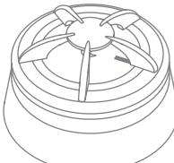

## **INSTALLATION MANUAL** Version 1.4

# **Product description**

The Heat Alarm can be installed where smoke or fumes are part of the atmosphere to prevent false alarms.

The Heat Alarm is specifically useful in environments where a traditional optical smoke sensor can cause false detections. The Heat Alarm is designed for installation in private homes or garages with risk for smoky, dusty, or humid environment.

## **Precautions**

- Do not remove the product label as it contains important information.
- Do not paint the alarm.

# **Getting started**

- 1. Pull out the battery isolation strip as shown.
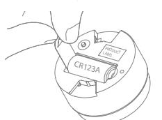

- 2. The Heat Alarm will now start searching (up to 15 minutes) for a ZigBee network to join.
- 3. Make sure that the ZigBee network is open for joining devices and will accept this Heat Alarm.
- 4. While searching for a ZigBee network to join, the LED button flashes red.

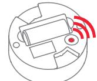

- 5. When the LED button stops flashing, the Heat Alarm has successfully joined the Zig-Bee network.
## **Placement**

- Place the alarm indoors at a temperature between 0-50°C.
- The distance between the Heat Alarm and walls, ventilation or other obstacles, should be at least 50 cm.
- Place the Heat Alarm at least 4 meters from a fireplace or stove.
- Place the Heat Alarm within reach for battery testing and maintenance.

## **RECOMMENDED LOCATION**

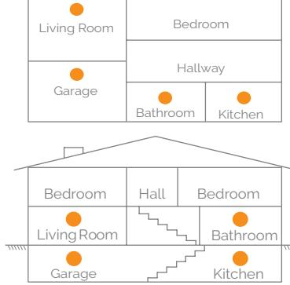

## **CEILING PLACEMENT**

The Heat Alarm should be a minimum of 50 cm from the wall.

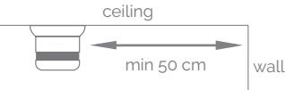

# **WALL PLACEMENT**

The Heat Alarm should be placed between 30 and 50 cm from the ceiling.

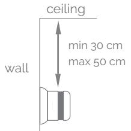

# **Mounting**

- 1. Detach the alarm from the mounting base by twisting counterclockwise.
- 2. Use the mounting base ring to mark the screw holes on the ceiling or on the wall.

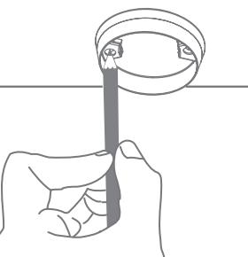

3. Use enclosed screws and plugs to install the mounting base on the marked place.

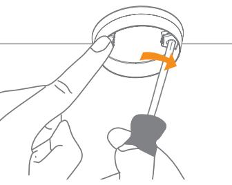

- 4. Attach the alarm by twisting clockwise until it clicks. If the battery is missing or inserted incorrectly, it will be impossible to click the alarm in the mounting base.
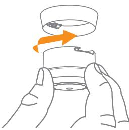

## **Testing**

- Always test the working order of the Heat Alarm after installation or battery change.
- When pressing the alarm button, the alarm sound should be heard.
- A network alarm test can be performed by holding down the alarm button for at least 6.5 seconds (count 2 sets of 3 sound sweeps).
- A test message will be sent over the ZigBee network.
- Test all of your alarms once per week to ensure they are functioning correctly.

## **Resetting**

Resetting is needed if you want to connect your Heat Alarm to another gateway or if you need to perform a factory reset to eliminate abnormal behavior.

## **STEPS FOR RESETTING**

- 1. Detach the alarm from the mounting base by twisting it counterclockwise.
- 2. Press and hold the LED button until it flashes continuously.
- 3. Release the button.

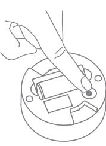

- 4. The resetting process is complete when the LED starts to flash.
# **Modes**

#### **SEARCHING GATEWAY MODE**

Red LED light in the back of the device is flashing every second (up to 15 minutes).

## **NORMAL MODE**

Front LED is flashing every 45 seconds, means that the battery should be replaced.

## **ALARM MODE**

The simultaneous flashing of the front red LED and sounding of intermittent audible signal. When heat is detected, the alarm will sound, press the "button/top" of the Alarm to acknowledge and stop the siren. The following 10 minutes, it will block alarms, allowing time to address the heat..

## **LOW BATTERY MODE**

Simultaneous audible signals and front LED flashes every 45 seconds, means that the battery should be replaced.

## **REPLACE DEVICE MODE**

NOT simultaneous audible signals and front LED flashes every 45 seconds, means that the device should be replaced. The life expectancy of heat alarms is generally 10 years, after which point their sensors begin to lose sensitivity.

## **Fault finding**

- If the Heat Alarm does not work when the test button is pushed, the probable cause is a faulty battery. Replace the battery if it is worn out.
- In case of a bad or weak signal, change the location of the Heat Alarm. Otherwise you can relocate your gateway or strengthen the signal with a smart plug.
- If the search for a gateway has timed out, a short press on the LED button will restart it.

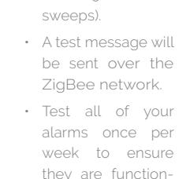

#### **Battery replacement**

CAUTION: RISK OF EXPLOSION IF BATTERIES ARE REPLACED BY AN INCORRECT TYPE. DISPOSE OF THE BATTERIES IN ACCORD - ANCE WITH INSTRUCTIONS.

**CAUTION:** When removing cover for battery change - Electrostatic Discharge (ESD) can harm electronic components inside

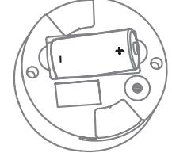

- 1. To replace the battery, detach the Heat Alarm from the mounting base by twisting counterclockwise.
- 2. Replace the battery respecting the polarities. The Heat Alarm uses 1xCR123 battery.
- 3. Attach the alarm in the mounting base by twisting clockwise until it clicks, and test the alarm.

#### **Disposal**

Dispose the product and battery properly at the end of life. This is electronic waste which should be recycled.

#### **CE certification**

The CE mark affixed to this product confirms its compliance with the European Directives which apply to the product and, in particular, its compliance with the harmonized standards and specifications.

#### **IN ACCORDANCE WITH THE DIRECTIVES**

- Radio & Telecommunications Terminal Equipment Directive 2014/53/EU
- EMC Directive 2014/30/EU
- RoHS Directive 2011/65/EU

#### **Other certifications**

- ZigBee Home Automation 1.2 certified

Distributed by Develco Products A/S Olof Palmes Allé 40 8200 Aarhus N Denmark www.develcoproducts.com

#### **All rights reserved.**

Develco Products assumes no responsibility for any errors, which may appear in this manual. Furthermore, Develco Products reserves the right to alter the hardware, software, and/or specifications detailed herein at any time without notice, and Develco Products does not make any commitment to update the information contained herein. All the trademarks listed herein are owned by their respective owners.

Copyright © Develco Products A/S

Quelle: http://www.barcode-generator.de