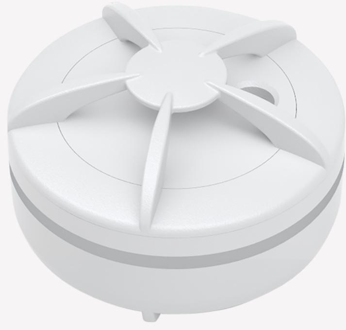
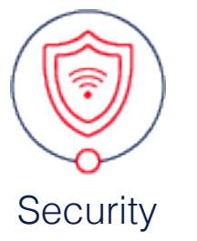

#### Safe4 Security Group AS © 2020. All rights reserved. | Policy

Tags: **[SECURITY](https://onestiproducts.io/tag/security/)**

## **Flood Alarm**

Early warning of water leakage

Download flood alarm product sheet !

### **Key Features**

- Flood sensor
- ZigBee HA 1.2 certified

#### **Additional Services**

- Monitoring and Alarm Receiving Services from certified ARC
- App alerts and app push notification
- Manned security services if offered by your service provider

**Water leak detection and temperature monitoring for optimal safety**

Water damage is one of the most frequent and expensive insurance claims. In order to prevent or reduce potential damage, the Flood Alarm provides you with an early warning.

For days, weeks, or months, leaks can go undetected. The Flood Alarm is designed for early leakage detection in private homes, camping trailers, caravans and garages. Unfortunately, leaks also often occur in humid environments such as kitchens and bathrooms.

The overflow alarm can be connected with other ZigBee based products. Also, you can easily integrate the Flood Alarm into smart home solutions.

The Flood Alarm has a built-in 85 dB siren giving an alarm soud when water is detected.

#### **Area of use**

Use the Flood alarm in your home or holiday home. Furthermore, this flood alarm is also an excellent choice in garages or businesses where you may experience leaking roofs, pipes, or appliances. Push notifications in your app will report heavy rainfall, overland flooding, or rapidly melting snow or ice.

Of course, the Flood Alarm is Included in the safe4 eco system.

Download flood alarm product sheet !

!OR GO BACK TO ALL PRODUCTS

# **Flood Alarm**

OVERVIEW HOMEGATE AIO **PRODUCTS** ABOUT CONTACT