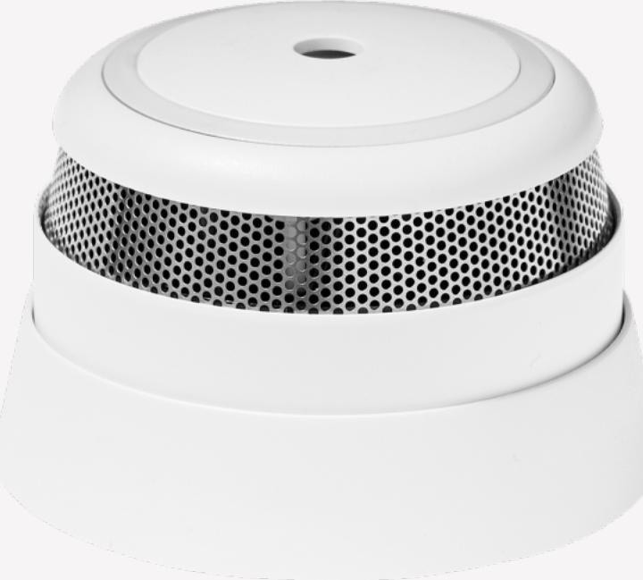

Tags: **[SECURITY](https://onestiproducts.io/tag/security/)**

## **Smoke Alarm**

For optimal fire detection

Download smoke alarm product sheet !

#### **Key Features**

- Smoke sensor
- Temperature sensor
- ZigBee Home Automation certified

### **Additional Services**

- Monitoring and Alarm Receiving Services from certified ARC
- App push notifications and alerts
- Manned security services if offered by your service provider

**Smoke and temperature monitoring for optimal fire detection**

With this Smoke Alarm, you will never again have to worry about fire or smoke in your home. While at home, the Smoke Alarm will warn you about smoke, using a loud sound. While away, you will be instantly notified through an internet connected gateway. Moreover, the Smoke Alarm will report the status and temperature every two minutes via your smart home system.

The wireless Smoke Alarm is battery powered and easily mounted to the ceiling with the included screws.

#### **Area of use**

Homes and holiday homes, on every floor and in bedroom areas, garages etc.

Included in the safe4 eco system.

### Download smoke alarm product sheet !

!OR GO BACK TO ALL PRODUCTS

# **Smoke Alarm**

OVERVIEW HOMEGATE AIO **PRODUCTS** ABOUT CONTACT