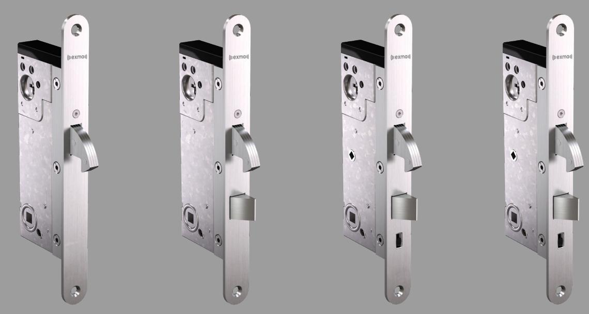

# Protector Protector HD

Motorlås. Anslutningsoch monteringsanvisningar för 909ML, 919ML, 9192ML, 9197ML

Version 202203 Svenska

# Innehållsförteckning

| Om dokumentet3                                       |
|------------------------------------------------------|
| Motorlås Protector 4                                 |
| Tekniska data Protector5                             |
| Inkopplingsschema Protector6                         |
| Motorlås Protector HD  10                            |
| Tekniska data Protector HD 11                        |
| Inkopplingsschema Protector HD  12                   |
| Inkopplingsschema Protector HD med A1D  13           |
| Inkoppling av Protector HD mot Exma Miniread 16      |
| Driftsättning av Protector HD 18                     |
| Protector magnetslutbleck  19                        |
| Monteringsanvisning 909ML20                          |
| Monteringsanvisning 919ML 22                         |
| Monteringsanvisning 9192ML 24                        |
| Monteringsanvisning 9197ML 26                        |
| Dokument för egenkontroll enligt maskindirektivet 29 |

# Om dokumentet

### Syfte med dokumentet

Detta dokument ger nödvändiga instruktioner för montering och anslutning av Exma Protector och Protector HD. Dokumentet är avsett för kvalificerad fackpersonal och servicepersonal.

### Målgrupper

Produktansvariga, projektledare, installatörer och servicepersonal.

### Säkerhet vid installation

Innan produkten testas och tas i drift bör användare och andra personer informeras. Vidta nödvändiga åtgärder med tanke på att paniksituationer kan uppstå vid test av produkten. Informera personer som eventuellt övervakar system som påverkas av larm som löser ut vid ett test.

Ändringar i system eller av produkt kan orsaka fel på produkten. Skriftliga avtal/beskrivningar bör utfärdas om ändringar eller kompletteringar ska utföras på produkten. Se även till att gällande regler och föreskrifter följs.

# Försiktighet

Personer som ansvarar för arbete kopplat till installation av produkten ska ha läst och förstått den här manualen, särskilt produktens användningsområde och syfte, innan arbetet påbörjas.

# Varning

Produktens säkerhetsfunktioner är avgörande för att kraven i SSF 3522 och EN 14846, ska vara uppfyllda. Det är inte tillåtet att göra ändringar eller modifieringar av produkten annat än de som beskrivs i denna manual.

# Garanti

Produkten har 1 års garanti om inte annat har avtalats. Om produkten inte monteras i enlighet med manualen upphör garantin att gälla.

# Viktigt

Innan Exma Protector eller Exma Protector HD monteras i ett dörrblad bör funktionen i dörrmiljön kontrolleras. Kontrollera följande för att se till att produkten fungerar optimalt: att dörren går fritt och inte griper i karm eller tröskel. Kontrollera avståndet mellan dörrblad och karm i enlighet med standarden NS 3156 (+3 mm till -1mm).

Hakregeln ska kunna röra sig obehindrat och inte träffa kanterna på slutblecket. Om hakregeln hindras kan det leda till att låset inte fungerar som det ska. Det kan leda till att byggnaden inte låses och säkras som den ska. Kontrollera att fallregeln griper tag i slutblecket.

# Montering i brand- eller rökavskiljande dörrar

Kontrollera inför montering i brand- eller rökavskiljande dörrar att certifikatet för dörren tillåter användning av elektrisk låsning.

# Övriga kontroller

Kontrollera att eventuella packningar i dörrmiljön inte kommer i konflikt med låsets funktion. Kontrollera vid montering i pardörrar att låset upprätthåller korrekt dörrfunktion. Vid montering av Exma Protector eller Exma Protector HD i självstängande pardörrar med överfals är det viktigt att dörrkoordinering monteras med dörrarna, för att säkerställa att dörrarna stängs i rätt ordningsföljd i enlighet med SS-EN 1158. Kontrollera att låset inte stör korrekt dörrfunktion. Detta är särskilt viktigt i brand- och rökavskiljande dörrar.

# OBS

Denna manual måste följas vid installationen. Efter slutförd montering och funktionstest ska en kopia av manualen, med instruktioner om underhåll, överlämnas till fastighetsägaren.

# Motorlås Protector

# Användningsområde

Motorlåsen används för invändiga och utvändiga dörrar, där styrning med passerkontroll eller annan fjärrkontroll önskas.

# Funktion

Exma Protector och Protector HD motorlås: Hakregeln drivs av en elmotor. Hakregeln kan även manövreras med nyckel eller vred, oberoende av motorn. Fallregeln manövreras med trycke.

Öppnings- och stängningstiden är mindre än en sekund. Öppningstiden är fem sekunder om dörren inte öppnas. Vid passering låses den två sekunder efter att dörren har stängts. Vid blockering gör låset tre försök att låsa. Det måste då få en ny startimpuls för att försöka igen.

Låset är utrustat med en mekanisk frikoppling v id blockering så att inte motor/växel ska kunna skadas. Vid användning av nödutrustning ska vred med returfjäder användas.

Exma Protector behöver ingen egen styrenhet, eftersom den kontrolleras direkt med driftspänning, startimpuls och återkoppling.

# Utförande

Hakregellås certifierat i enlighet med SSF 3522 utgåva 2 och EN 14846. Både Protector och Protector HD uppfyller kraven

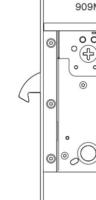

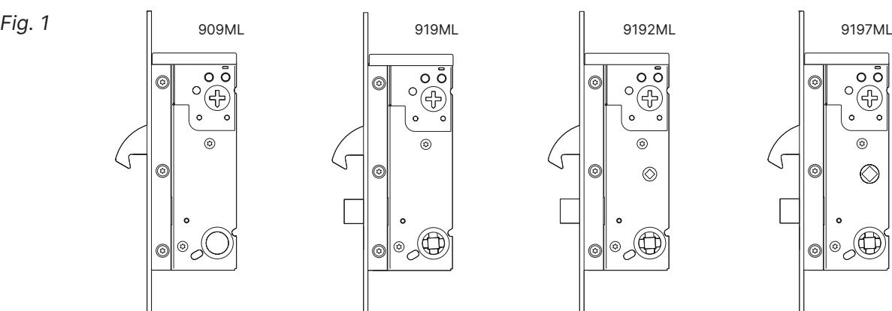

som komponent i en låsenhet för fast montering SSF 3522 och EN 14846, utgåva 2 i klassning enligt nedan Klass 3

Exma Protector HD: 909ML, 919ML, 9192ML (förutsätter bortasäkert läge eller dubbelcylinder)

# Klass 2A

Exma Protector: 909ML, 919ML, 9192ML Klass 2B

Exma Protector: 9197ML (förutsätter utrymningsbehör). Exma Protector HD: 9197ML (förutsätter utrymningsbehör).

Låsurtag i enlighet med SS 81 73 83, NS 3155, SFS 5208. Mått: låsstolpe 225 mm × 22 mm. Låsdjup: 74 mm. Dorndjup: 50 mm. Material: stållegeringar 75 %, zinklegering 18 %, nylon 7 %.

# Produktversioner

Protector-serien består av fyra olika låshus: 909ML med hakregel, 919ML med fall- och hakregel, 9192ML fall- och hakregel med mittvred, 9197ML för utrymning. Fig. 1

Notera för att låset 9192ML ska uppfylla SSF 3522, utgåva 2, klass 3 måste bortasäkert läge aktiveras.

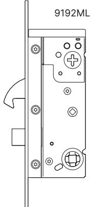

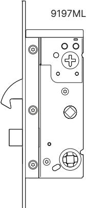

# Tekniska data Protector

#### Teknisk data

#### SPECIFIKATIONER FÖR PROTECTOR-SERIEN

| 24-30 V DC +-10% Filtrerad och stabiliserad likspänning. |
|-------------------------------------------------------------|
| max 300 mA                                                  |
| -20 °C – +60 °C                                             |
| Spänningsimpuls 20–30 V DC                                  |
| under 0,5 s.                                                |
| Max 50 m (0,6 m2 och ingen elektrisk störning)           |
|                                                             |

#### Information

Exma motorlås Protector:

Vid användning av vred och nödutrustning ska alltid vred med automatisk positionering användas. Detta för att säkerställa att cylindervred/tryckesroddare alltid står i rätt position.

# OBS

Motorlåsen kan monteras i trä-, stål-/aluminium- eller plastdörrar. Använd skruvar som är avsedda för dörrmaterialet. Läs även underhållsrekommendationerna som anges i kapitlet Rekommenderat underhåll.

#### Rekommenderat underhåll

Allt underhåll bör utföras minst två gånger per år. Rengör med en ren bomullstrasa. Kontrollera och dra åt vid behov. Applicera ett tunt lager fett – gäller ENDAST fallregel.

Undvik övermålning av låshus och dess delar. Underhåll och reparationer bör endast utföras av kvalificerad servicepersonal.

### Certifieringar

Motorlåsen har certifierats i enlighet med:

- SSF 3522, utgåva 2 (Inbrottsskyddande låsenheter för fast montering) SS-EN 14846:2008 (Elektromekaniskt manövrerade lås)
Notera övriga delar i den monterad låsenhet, såsom exempelvis låscylinder, måste uppfylla kraven för önskad klassning för att låsningen ska vara godkänd.

# Fig. 2 Certifieringsdekaler

### Fig. 2

| Typ: Protector 909ML  |                                        | liexma    |
|-----------------------|----------------------------------------|-----------|
| S/N: A1000            | EN 14846:2008                          |           |
| 2391-CPR-18-404       |                                        |           |
| SSF 3522-22-7         | 3 X 9 F 0 M 5 1 1 3                    |           |
| www.exma.se           | 2391                                   | 22        |
|                       | Exma AB Filargatan 6 632 29 Eskilstuna |           |
| Typ: Protector 919ML  |                                        | (liexmail |
| S/N: B1000            | EN 14846:2008                          |           |
| 2391-CPR-18-404       |                                        |           |
| SSF 3522-22-7         | 3 X 9 F 0 M 5 1 1 3                    |           |
| www.exma.se           | 2391                                   | 22        |
|                       | Exma AB Filargatan 6 632 29 Eskilstuna |           |
|                       |                                        |           |
| Typ: Protector 9192ML |                                        | ((rexma)) |
| S/N: C1000            | EN 14846:2008                          |           |
| 2391-CPR-18-404       |                                        |           |
| SSF 3522-22-7         | 3 X 9 F 0 M 5 1 3                      |           |
| www.exma.se           | 2391                                   | 22        |
|                       | Exma AB Filargatan 6 632 29 Eskilstuna |           |
| Typ: Protector 9197ML |                                        | (liexmai) |
| S/N: G1000            | EN 14846:2008                          |           |
| 2391-CPR-18-404       |                                        |           |
| SSF 3522-21-518       | 3 X 9 F 0 M 5 1 1 3                    |           |
| www.exma.se           | 2391                                   | 22        |

# Inkopplingsschema Protector

#### Fig. 3. Inkopplingsschema EXEMPEL 1

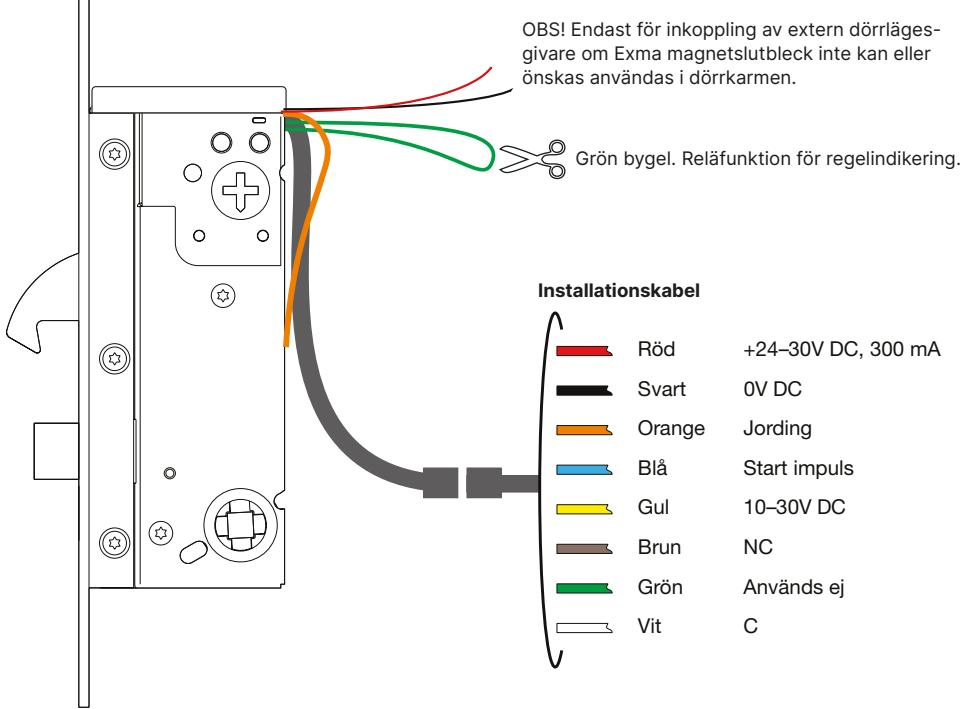

Fig. 4. Öppning med potentialfri slutning. Fig. 5. Reläfunktion

Brun

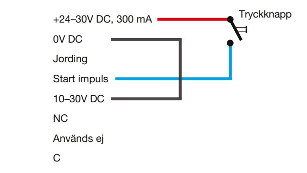

Brun

Brun

NC C

NC C

Vit

EXEMPEL 2

Vit

Brun

Start impuls 10-30VDC

Vit

NC C

Brun

NC C

Vit

Vit

Vit

Orange Jording Blå Start impuls

Röd +24–30V DC, 300 mA

Svart 0V DC

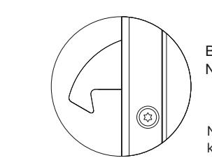

EXEMPEL 1

Tryckknapp

Tryckknapp

Röd +24–30V DC, 300 mA

Röd +24–30V DC, 300 mA

Brun

NC C

Vit

Start impuls 10-30VDC

Svart 0V DC Orange Jording Blå Start impuls Gul 10–30V DC

Brun NC

Vit C

Grön Används ej

Brun

NC C

Vit

Tryckknapp

Svart 0V DC Orange Jording Blå Start impuls Gul 10–30V DC

Brun NC

Vit C

Grön Används ej

EXEMPEL 2 När man klipper den gröna kabeln (bygeln) så kommer reläet att istället sluta vid regel ute (låst).

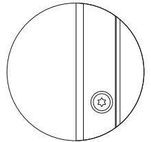

Röd +24–30V DC, 300 mA

Brun

Brun

NC C

Brun

NC C

Vit

Start impuls 10-30VDC

Vit

NC C

Vit

Svart 0V DC Orange Jording Blå Start impuls Gul 10–30V DC

Röd +24–30V DC, 300 mA

Svart 0V DC Orange Jording Blå Start impuls Gul 10–30V DC

Brun NC

Vit C

Grön Används ej

Brun NC

Vit C

Grön Används ej

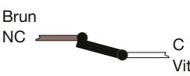

Fabriksinställning (ej klippt grön bygel), reläet sluter vid regel inne (öppet). Kan användas till dörrautomatiksignal.

Start impuls 10-30VDC

Röd +24–30V DC, 300 mA

Brun

NC C

Svart 0V DC Orange Jording Blå Start impuls Gul 10–30V DC

Brun NC

Vit C

Grön Används ej

Brun

NC C

EXEMPEL 2

EXEMPEL 1

Brun

NC C

Vit

Vit

Röd +24–30V DC, 300 mA

Svart 0V DC Orange Jording Blå Start impuls Gul 10–30V DC

Brun NC

Grön Används ej

Tryckknapp

Vit

EXEMPEL 1

NC C

Brun

#### Fig. 6. Öppnasignal med spänning. EXEMPEL 2 Gul 10–30V DC

Röd +24–30V DC, 300 mA

Svart 0V DC Orange Jording Blå Start impuls

Brun NC

Brun

NC C

EXEMPEL 2

EXEMPEL 1

Brun

NC C

Vit

Vit

Brun

NC C

Tryckknapp

EXEMPEL 1

Vit

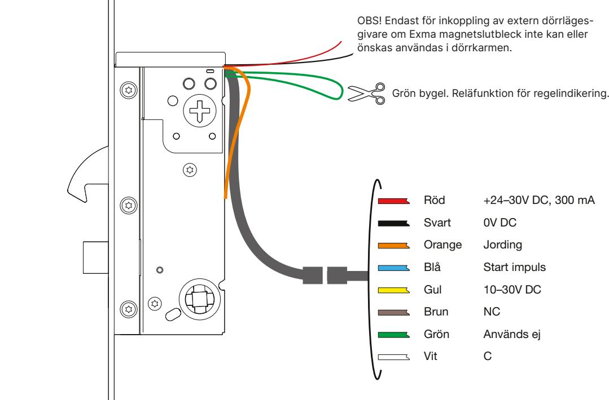

Fig. 7. Öppning med spänning. Fig. 8. Reläfunktion

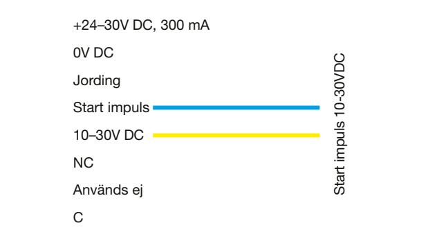

Brun

Notera

Protector motorlås kan även direktstyras via elblecksutgången på Exma MiniRead väggläsare.

NC C

Brun

Vit

Brun

NC C

EXEMPEL 2

Brun

NC C

Vit

Vit

Vit

Orange Jording Blå Start impuls

Röd +24–30V DC, 300 mA

Svart 0V DC

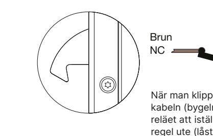

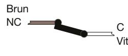

Start impuls 10-30VDC

Tryckknapp

Röd +24–30V DC, 300 mA

Brun

NC C

Vit

Tryckknapp

Svart 0V DC Orange Jording Blå Start impuls Gul 10–30V DC

Brun NC

Vit C

Grön Används ej

EXEMPEL 2 När man klipper den gröna kabeln (bygeln) så kommer reläet att istället sluta vid regel ute (låst).

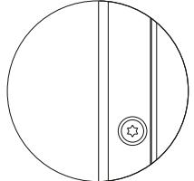

Röd +24–30V DC, 300 mA

Brun

NC C

Brun

Vit

Start impuls 10-30VDC

Vit

NC C

Svart 0V DC Orange Jording Blå Start impuls Gul 10–30V DC

Brun NC

Vit C

Grön Används ej

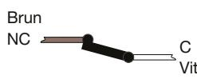

Fabriksinställning (ej klippt grön bygel), reläet sluter vid regel inne (öppet). Kan användas till dörrautomatiksignal.

Röd +24–30V DC, 300 mA

Brun

NC C

Vit

Start impuls 10-30VDC

Svart 0V DC Orange Jording Blå Start impuls Gul 10–30V DC

Brun NC

Vit C

Grön Används ej

Fig. 9. Protector med dörrautomatik

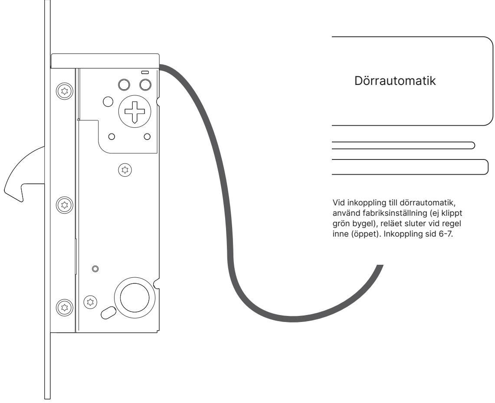

#### Funktion

Exma Protector tillsammans med dörrautomatik. Motorlåset får sin strömförsörjning från automatiken. En fördröjd start ska programmeras för dörrautomatiken, så att den inte startar innan motorlåsets regel har kommit ända in. Återkopplingen från låset kan användas fritt för att indikera status på stängd/låst dörr.

# Förklaring

När man ger startimpuls till dörrautomatiken så aktiverar den först motorlåset. Själva automatiken öppnar när tidsfördröjningen har löpt ut. När dörren är stängd registrerar motorlåset magneten i slutblecket så att motorlåset låser automatiskt. Man MÅSTE programmera en fördröjd start på minst 0,8 sekunder för automatiken för att säkerställa att regeln har kommit ända in i låshuset innan automatiken startar.

Parametern för detta är fördröjd start:

- 8 = 0,8 sekunders fördröjning.
- 9 = 0,9 sekunders fördröjning.

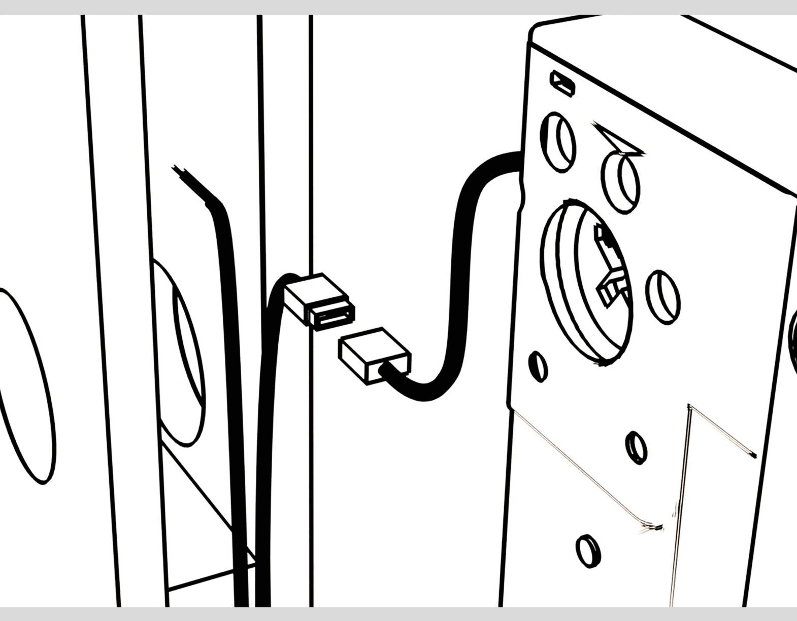

# Motorlås Protector HD

# Användningsområde

Motorlåsen används för invändiga och utvändiga dörrar, där styrning med passerkontroll eller annan fjärrkontroll önskas.

# Funktion

Exma Protector och Protector HD motorlås: Hakregeln drivs av en elmotor. Hakregeln kan även manövreras med nyckel eller vred, oberoende av motorn. Fallregeln manövreras med trycke.

Öppnings- och stängningstiden är mindre än en sekund. Öppningstiden är fem sekunder om dörren inte öppnas. Vid passering låses den två sekunder efter att dörren har stängts. Vid blockering gör låset tre försök att låsa. Det måste då få en ny startimpuls för att försöka igen.

Låset är utrustat med en mekanisk frikoppling v id blockering så att inte motor/växel ska kunna skadas. Vid användning av nödutrustning ska vred med returfjäder användas.

# Kommunikation

Exma Protector HD har skyddad kommunikation genom LON-Works integritetskontroller och autentisering. Detta med 48-bitars symmetrisk proprietärkryptografi

# Utförande

Hakregellås certifierat i enlighet med SSF 3522

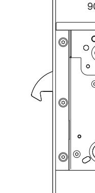

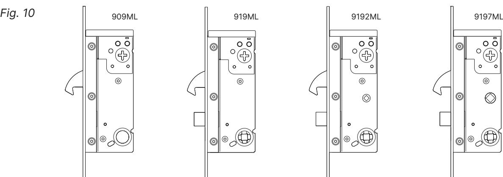

utgåva 2 och EN 14846. Både Protector och Protector HD uppfyller kraven som komponent i en låsenhet för fast montering SSF 3522 och EN 14846, utgåva 2 i klassning enligt nedan Klass 3

Exma Protector HD: 909ML, 919ML, 9192ML (förutsätter bortasäkert läge eller dubbelcylinder)

# Klass 2A

Exma Protector: 909ML, 919ML, 9192ML Klass 2B

Exma Protector: 9197ML (förutsätter utrymningsbehör). Exma Protector HD: 9197ML (förutsätter utrymningsbehör).

Låsurtag i enlighet med SS 81 73 83, NS 3155, SFS 5208. Mått: låsstolpe 225 mm × 22 mm. Låsdjup: 74 mm. Dorndjup: 50 mm. Material: stållegeringar 75 %, zinklegering 18 %, nylon 7 %.

# Produktversioner

Protector-serien består av fyra olika låshus: 909ML med hakregel, 919ML med fall- och hakregel, 9192ML fall- och hakregel med mittvred, 9197ML för utrymning. Fig. 1

Notera för att låset 9192ML ska uppfylla SSF 3522, utgåva 2, klass 3 måste bortasäkert läge aktiveras.

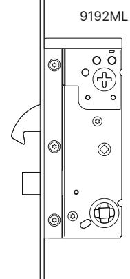

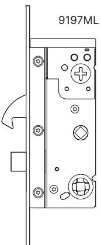

# Tekniska data Protector HD

### Teknisk data

SPECIFIKATIONER FÖR PROTECTOR-SERIEN

| Drivspänning       | 24-30 V DC +-10% Filtrerad och stabiliserad likspänning.              |
|--------------------|--------------------------------------------------------------------------|
| Strömförbrukning   | Vila 135 mA under drift 350 mA, motorstart 550 mA i 50 mS             |
| Temperaturområde   | -20 °C – +60 °C                                                          |
| Öppningshastighet  | vid ≥18 V – 30 V DC ca 0,5 s.                                            |
| Reläutgång         | 125 V AC 0,3 A resistiv belastning, 30 V DC 1,0 A resistiv belastning |
| Öppningssignal A1D | 2 st. polaritetsfria ingångar 10–30 V DC, 1 st. potentialfri ingång   |

# Information

Exma motorlås Protector HD:

Vid användning av vred och nödutrustning ska alltid vred med automatisk positionering användas. Detta för att säkerställa att cylindervred/ tryckesroddare alltid står i rätt position.

# OBS

Motorlåsen kan monteras i trä-, stål-/aluminium eller plastdörrar. Använd skruvar som är avsedda för dörrmaterialet. Läs även underhållsrekommendationerna som anges i kapitlet Rekommenderat underhåll.

# Rekommenderat underhåll

Allt underhåll bör utföras minst två gånger per år. Rengör med en ren bomullstrasa. Kontrollera och dra åt vid behov. Applicera ett tunt lager fett – gäller ENDAST fallregel. Kontrollera och dra åt skruvar.

Undvik övermålning av låshus och dess delar. Underhåll och reparationer bör endast utföras av kvalificerad servicepersonal.

# Certifieringar

Motorlåsen har certifierats i enlighet med:

- SSF 3522, utgåva 2 (Inbrottsskyddande låsenheter för fast montering) SS-EN 14846:2008 (Elektromekaniskt manövrerade lås)
Notera övriga delar i den monterad låsenhet, såsom exempelvis låscylinder, måste uppfylla kraven för önskad klassning för att låsningen ska vara godkänd.

# Fig. 11 Certifieringsdekaler

# Fig. 11

|                 | Typ: Protector HD 909ML (LeXMA          |
|-----------------|-----------------------------------------|
| S/N: D1000      | EN 14846:2008                           |
| 2391-CPR-18-404 |                                         |
| SSF 3522-21-519 | 3 X 9 F 0 M 5 1 3                       |
| www.exma.se     | 22 F 2391                            |
|                 | Exma AB Fillargatan 6 632 29 Eskilstuna |
|                 | Typ: Protector HD 919ML ((( exMQ1))     |
| S/N: E1000      | EN 14846:2008                           |
| 2391-CPR-18-404 |                                         |
| SSF 3522-21-519 | 3 X 9 F 0 M 5 1 3                       |
| www.exma.se     | 22 2391                              |
|                 | Exma AB Fillargatan 6 632 29 Eskilstuna |
|                 |                                         |
|                 | Typ: Protector HD 9192ML (((eXMA))      |
| S/N: F1000      | EN 14846:2008                           |
| 2391-CPR-18-404 |                                         |
| SSF 3522-21-519 | 3 X 9 F 0 M 5 1 3                       |
| www.exma.se     | 22 2391                              |
|                 | Exma AB Fillargatan 6 632 29 Eskilstuna |
|                 |                                         |
|                 | Typ: Protector HD 9197ML (((eXMA))      |
| S/N: H1000      | EN 14846:2008                           |
| 2391-CPR-18-404 |                                         |
| SSF 3522-21-518 | 3 X 9 F 0 M 5 1 3                       |
| www.exma.se     | 2391 22                              |

# Inkopplingsschema Protector HD

Fig. 12. Inkopplingsschema för Protector HD

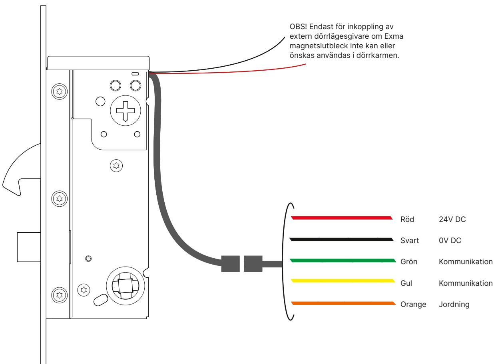

# Kopplingsschema

| Driftspänning:                            |                |  |  |
|-------------------------------------------|----------------|--|--|
| Röd                                       | +24 V DC +-10% |  |  |
| Svart                                     | 0 V DC         |  |  |
| Jordning:                                 |                |  |  |
| Orange                                    | Jordning       |  |  |
| Orange                                    | Jordning       |  |  |
| Kommunikation mellan låshus och styrenhet |                |  |  |
| A1D                                       |                |  |  |
| Grön                                      | Kommunikation  |  |  |
| Gul                                       | Kommunikation  |  |  |

# OBS

Kabeln till Protector HD är en kontakterad specialkabel med rätt specifikationer. Användning av annan kabel som inte ursprungligen tillhör Exma Protector HD rekommenderas inte, eftersom kommunikationen genom kabeln är krypterad.

#### Exma MiniRead

Det går även bra att koppla in direkt mot Exma MiniRead.

# Inkopplingsschema Protector HD med styrenhet A1D

Fig. 13. Inkopplingsschema för Protector HD med styrenhet A1D

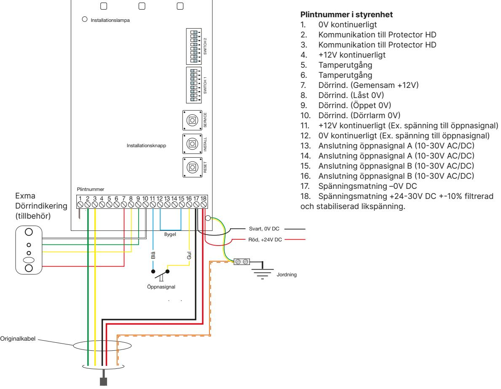

# Tamper

I installationer där styrenheten behöver skyddas mot angrepp kan "tamperlarm" erhållas på plint 5 och 6. Två tamperkontakter finns inbyggda i produkten. En av kontakterna hålls intryckt mot vägg och skyddar produkten mot nedmontering, den andra ligger an mot lock som därmed inte kan avlägsnas utan att tamperlarmet aktiveras. Båda kontakterna ska hållas intryckta vid normaldrift. Installationsknapp och installationslampa Användes vid installation av slutblecket enligt anvisning sid 18.

Protector HD

På

1 min

1 min

10 sek

2 min

2 min

20 sek

Av

SWITCH 2

30 sek

1 min 2 min

20 sek

5 sek

15 sek

10 sek

3 sek

SWITCH 1 Av På

# Fig. 14. Inkopplingsschema för Protector HD med styrenhet A1D

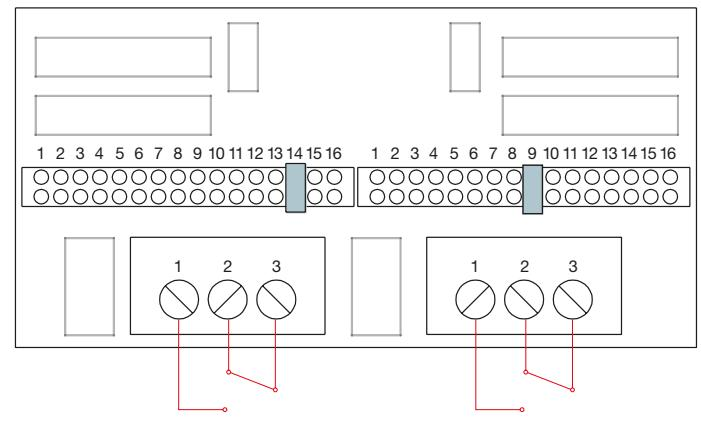

Relä 1 byglat på 14 = Låst Relä 2 byglat på 9 = öppnastyrning till dörrautomatik.

Styrenheten har två programmerbara växlande reläer som vart och ett kan programmeras med byglar enligt specifikation. Det finns plats för två reläkort i en styrenhet. Som standard levereras styrenheten med ett reläkort.

#### Plintnummer i reläkortet

- 1. Ingen funktion.
- 2. Ingen funktion.
- 3. Systemövervakning. Relä växlar efter 15 sekunder om styrenheten tappar kontakt med Protector HD motorlås. Valbart aktiv/inaktiv via brytare 4 i Switch 1.
- 4. "Dörr öppen för länge". Reläet växlar då dörren varit öppen för länge. Det vill säga efter den tid som ställts in på brytare 5 och 6 i Switch 2.
- 5. Ingen funktion.
- 6. Ingen funktion.
- 7. Ingen funktion.
- 8. Ingen funktion.
- 9. Öppnastyrning till dörrautomatik. Relä växlar 5 sekunder när låset når öppet.
- 10. Dörrstatus reläet växlar då dörr är stängd. 11. Regelstatus. Reläet växlar då låsets
- regel är på plats.
- 12. Öppet. Reläet växlar då låset är öppet. (hakregel infälld).
- 13. "Olåst för länge" Reläet växlar då dörren varit olåst för länge. Det vill säga efter den tid som ställts in på brytare 2 och 3 på Switch
- 14. Låst. Reläet växlar då Protector HD är i låst läge (hakregel utfälld) och dörren är stängd.
- 15. Öppet. Reläet växlar då låset är öppet. (hakregel infälld).
- 16. Ingen funktion.

2 min

På

1 min

Av

30 sek

1 2 3

15 sek

6 7 8 SWITCH 2

SWITCH 2

På

1 min

1 min

10 sek

1 2 3 4 5 6 7 8 9 10 1112 13 1415 16

1 2 3 4 5 6 7 8 9 10 1112 13 1415 16

1 2 3 1 2 3

1 2 3 1 2 3

1 2 3 4 5 6 7 8 9 10 1112 13 1415 16

1 2 3 4 5 6 7 8 9 10 1112 13 1415 16

1 2 3 4 5 6 7 8 9 10 1112 13 1415 16

1 2 3 1 2 3

1 2 3 4 5 6 7 8 9 10 1112 13 1415 16

2 min

2 min

20 sek

Av

SWITCH 2

30 sek

1 min 2 min

20 sek

5 sek

15 sek

10 sek

3 sek

#### Fig. 15. Inkopplingsschema för Protector HD med styrenhet A1D 8 8 4 5

SWITCH 1 Av På

SWITCH 1 Av På

SWITCH 1 Av På

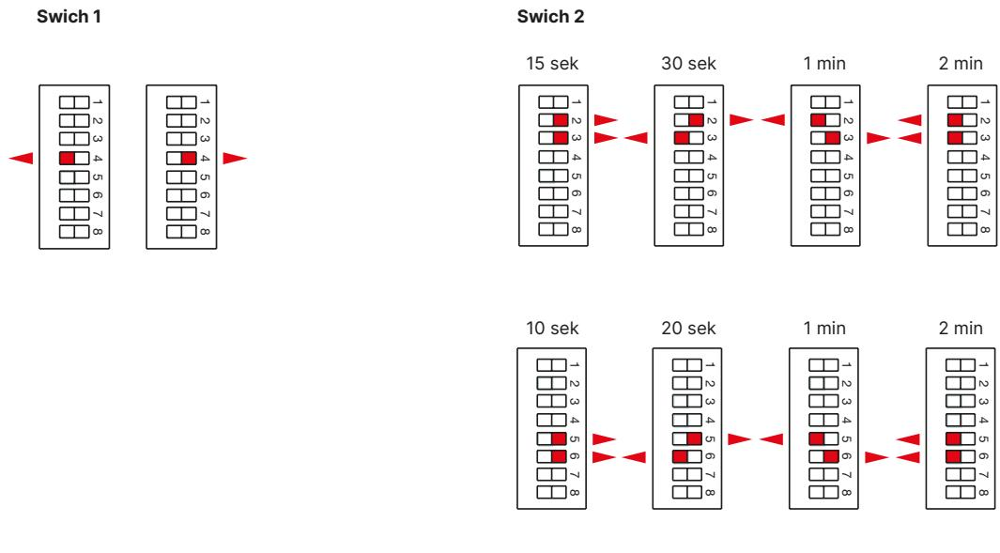

#### Inställningar av tider och funktioner

7 8

Med hjälp av brytare, så kallad dipswitch, går det att ändra funktioner och inställningar. Förändringar kan även utföras vid driftsatt anläggning. I styrenheten finns två dipswitch-block för detta ändamål, benämnda Switch 1 och Switch 2.

7 8

#### Switch 1

4 Systemövervakning. Används för övervakning av kommunikationen mellan Protector HD motorlås och styrenhet A1D. Kan erhållas som reläslutning i reläkortet (position 3 ). Relä växlar efter 15 sekunder om styrenheten tappar kontakt med motorlåset.

#### Switch 2

3

10 sek

3 sek

20 sek

5 sek

3

2–3 Tidsinställning "olåst för länge" Kan efter inställd tid aktivera reläslutning när dörren varit olåst för länge (position 13 i reläkort.) 1 2 1 2 1 2 1 2 3 sek 5 sek 10 sek 20 sek

> 3

1 min

10 sek

2 min

20 sek

3

5–6 Tidsinställning "dörr öppen för länge" Aktiverar efter inställd tid ett akustiskt larm i dörrindikering (tillbehör) och/eller reläslutning när dörren varit öppen för länge. Signalen är aktiv i en eller två minuter varefter ett "huvudlarm" kan erhållas som reläslutning (position 4 i reläkort). 4 5 6 7 8 45 6 7 8 4 5 6 7 8 4 5 6 7 8

# Inkoppling av Protector HD mot Exma Miniread

Fig. 16. Inkopplingsschema Exma MiniRead NFC

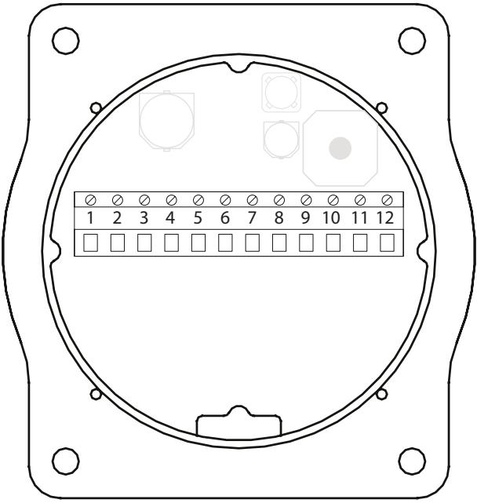

# Plintnummer Exma MiniRead

- 1. Spänningsingång +24VDC (stabiliserad och filtrerad)
- 2. Spänningsingång 0VDC
- 3. Spänningsutgång +24VDC elslutbleck (max 500mA)
- 4. Spänningsutgång dörrautomatik alt. larmstyrning (max 500mA)
- 5. Förlarmsutgång (max 500mA)
- 6. Ingång öppnaknapp (optoisolerad)
- 7. Ingång öppnaknapp (optoisolerad)
- 8. LON kommunikation
- 9. LON kommunikation
- 10. Får ej anslutas
- 11. Får ej anslutas
- 12. Skyddsjord

### Installation

För att installera läsaren med Prorector HD, se installationsmanualen för MiniRead.

Fig. 17. Inkopplingsschema mellan Exma Miniread och Protector HD

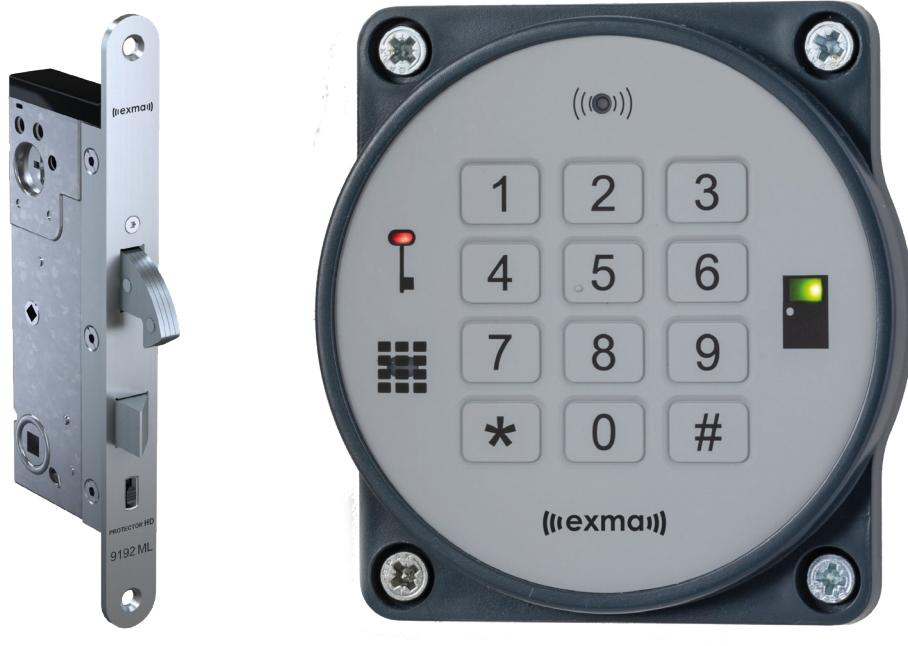

# Plintnummer i Exma MiniRead

- 1. Röd +18-24V DC (stabiliserad och filtrerad)
- 2. Svart –18-24V DC (stabiliserad och filtrerad)
- 3.
- 4.
- 5.
- 6.
- 7.
- 8. Grön. Kommunikation med Protector HD.
- 9. Gul. Kommunikation med Protector HD.
- 10.
- 11.
- 12. Orange, ev skyddsjord.

# Plintnummer i A1D mot Protector HD

- 1. Svart –18-24V DC (stabiliserad och filtrerad)
- 2. Grön. Kommunikation.
- 3. Gul. Kommunikation.
- 4. Röd +18-24V DC
	- (stabiliserad och filtrerad)
- 5.
- 6.

#### Orange ev skyddsjord

# Driftsättning av Protector HD

# Anslutning

Använd alltid originalkabel mellan Exma Protector HD och styrenhet A1D. Detta är viktigt eftersom kommunikationen mellan enheterna är krypterad.

# Driftsättning och initiering

A1D och Protector HD motorlås måste alltid paras ihop. A1D är utrustad med ett självinstallerande program. Detta leder till att varje installation får en unik, krypterad överföring mellan A1D och motorlås.

Tryck på "Install"-knappen i A1D. En röd lysdiod (vänster LED) lyser konstant i A1D. Håll en magnet framför Exma-loggan på låsstolpen på motorlåset. Den röda lysdioden som har lyst konstant börjar blinka efter ett par sekunder.

Fig. 18

Håll magneten framför Exma-loggan för att starta konfigurationen mot styrenheten A1D

Dörrlägesgivare ska ha kontakt med magneten i Protector Magnetslutbleck

# Problem vid driftsättning "Install"-lampan i A1D börjar inte blinka

Om "Install"-lampan inte blinkar vid driftsättningen inom 20 sekunder måste man vända magneten (polaritet) och hålla den framför Exma-loggan igen. Magnetens polaritet måste vara korrekt!

Kontrollera kommunikationskablarna till både motorlåset och A1D. Kontrollera strömförsörjningen för A1D och motorlås. Har motorlåset korrekt spänning och är polariteten korrekt? Motorlåsets reläindikering ändras när man drar i dörren: Avståndet mellan dörr och karm är för stort.

# Motorlåset låser inte

Kontrollera att magnetkontakten är korrekt monterad, samt att avståndet mellan kontakt och magnet inte är mer än 10 mm. Kontrollera så att inte öppnasignalen är aktiv.

# Motorlåset öppnar inte

Kontrollera att öppningssignal har anslutits på korrekt sätt. Försök eventuellt att konfigurera om låset.

# Motorlåset försöker låsa men vänder och öppnar igen

Försöket upprepas tre gånger. Kontrollera att motorlåsets hakregel kan röra sig fritt i karmens slutbleck.

# Exma MiniRead

Det går även bra att koppla in direkt mot Exma MiniRead. Då fungerar Miniread som styrenhet till Protector HD.

# Protector Magnetslutbleck

Fig. 19. Magnetslutbleck till Protector och Protector HD

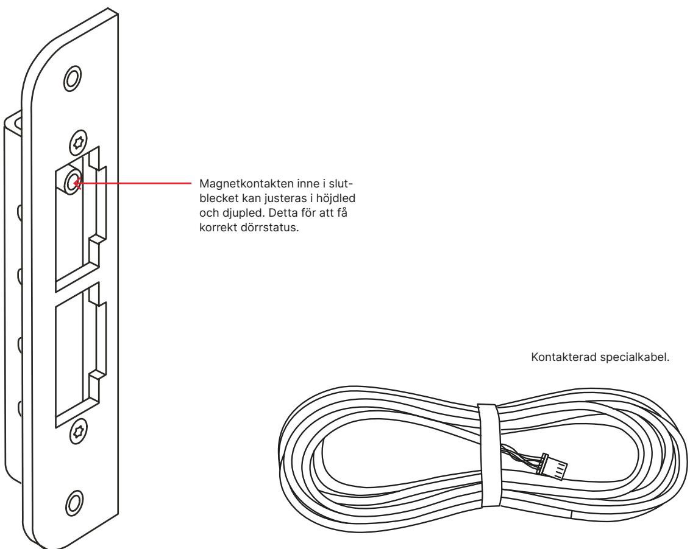

# Magnetslutbleck till Protector och Protector HD

Vårt magnetslutbleck underlättar installationen av Protector och Protector HD. För mer info se Exma produktkatalog.

Standardkabel 6 meter.

22 20

# Monteringsanvisning låshus 909ML

# Fig. 20-24. Monteringsanvisning Exma Protector-serien låshus 909ML

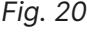

| Urtagsritning Protector 909ML och Protector HD 909ML | MÅTT LÅSHUS PROTECTOR 909ML |
|------------------------------------------------------|-----------------------------|
|                                                      | & PROTECTOR HD 909ML        |

| Djup (inkl stolpe) | 65mm  |
|--------------------|-------|
| Dorndjup           | 50mm  |
| Höjd               | 158mm |
| Bredd              | 20mm  |
| Djup stolpe        | 3mm   |
| Höjd stolpe        | 225mm |
| Bredd stolpe       | 22mm  |

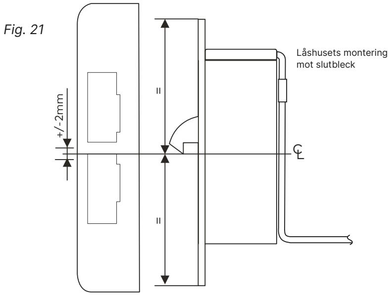

Monteringsanvisning låshus 909ML

# Monteringsanvisning låshus 919ML

# Fig. 25-29. Monteringsanvisning Exma Protector-serien låshus 919ML

- Fig. 25 Urtagsritning Protector 919ML och Protector HD 919ML
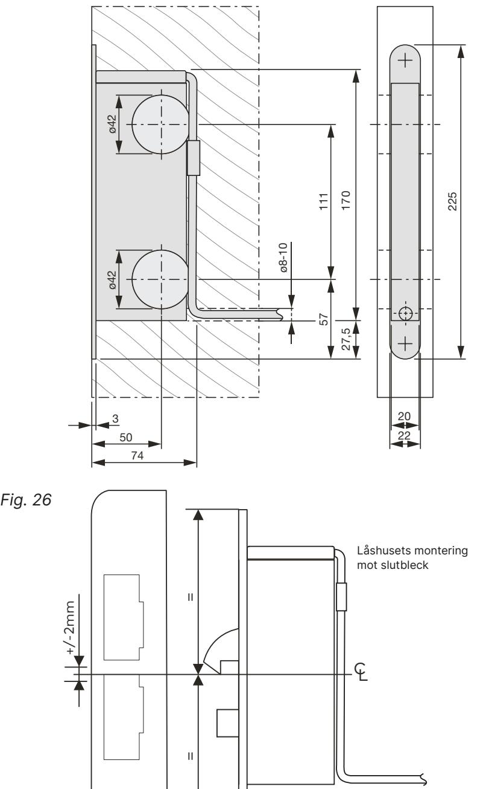

MÅTT LÅSHUS PROTECTOR 919ML & PROTECTOR HD 919ML

| Djup (inkl stolpe) | 65mm  |
|--------------------|-------|
| Dorndjup           | 50mm  |
| Höjd               | 158mm |
| Bredd              | 20mm  |
| Djup stolpe        | 3mm   |
| Höjd stolpe        | 225mm |
| Bredd stolpe       | 22mm  |

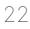

Monteringsanvisning låshus 919ML

23

13 913

# Monteringsanvisning låshus 9192ML

# Fig. 30-34. Monteringsanvisning Exma Protector-serien låshus 9192ML

Fig. 30 Urtagsritning Protector 9192ML och Protector HD 9192ML

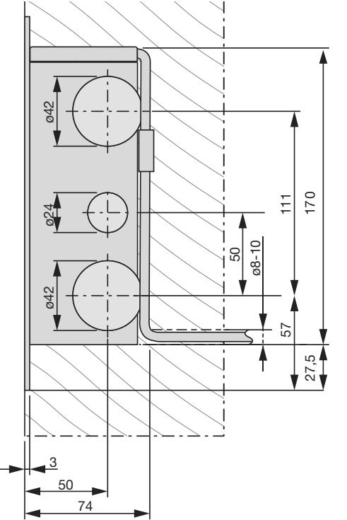

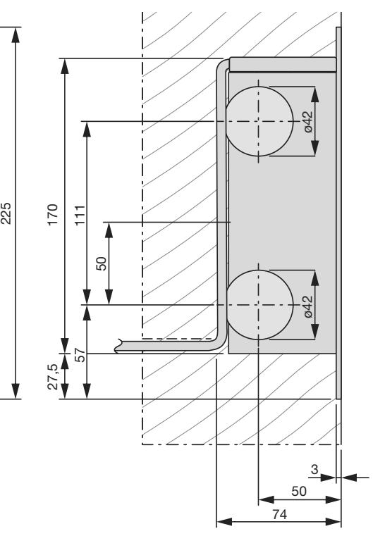

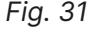

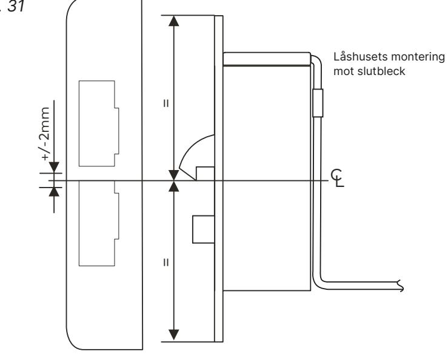

|                     | MÅTT LÅSHUS PROTECTOR 9192 |  |
|---------------------|----------------------------|--|
| & PROTECTOR HD 9192 |                            |  |

| Djup (inkl stolpe) | 65mm  |
|--------------------|-------|
| Dorndjup           | 50mm  |
| Höjd               | 158mm |
| Bredd              | 20mm  |
| Djup stolpe        | 3mm   |
| Höjd stolpe        | 225mm |
| Bredd stolpe       | 22mm  |

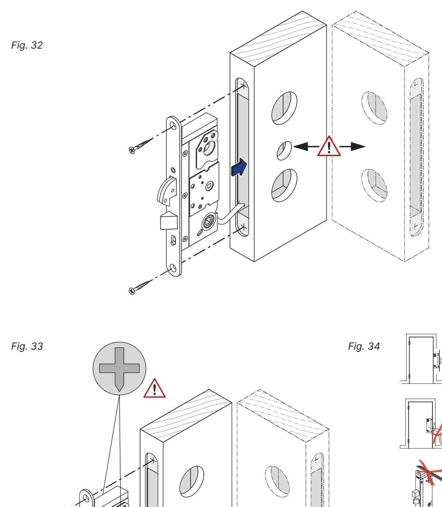

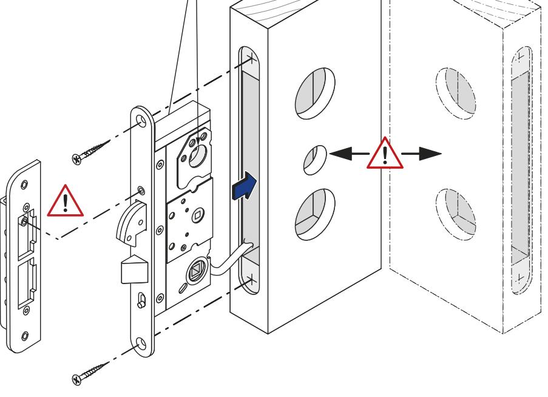

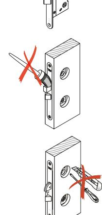

# Monteringsanvisning låshus 9197ML

# Fig. 35-39. Monteringsanvisning Exma Protector-serien låshus 9197ML

IN OUT Urtagsritning Protector 9197ML och Protector HD 9197ML

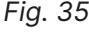

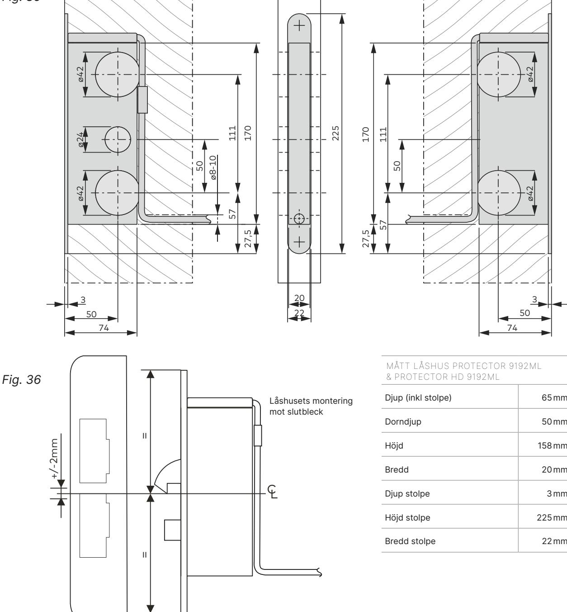

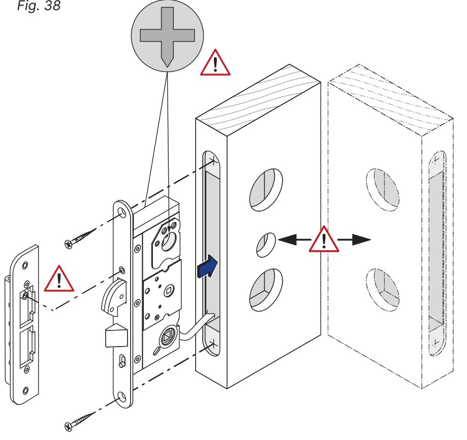

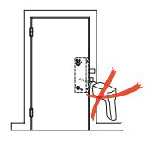

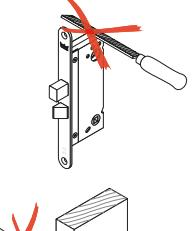

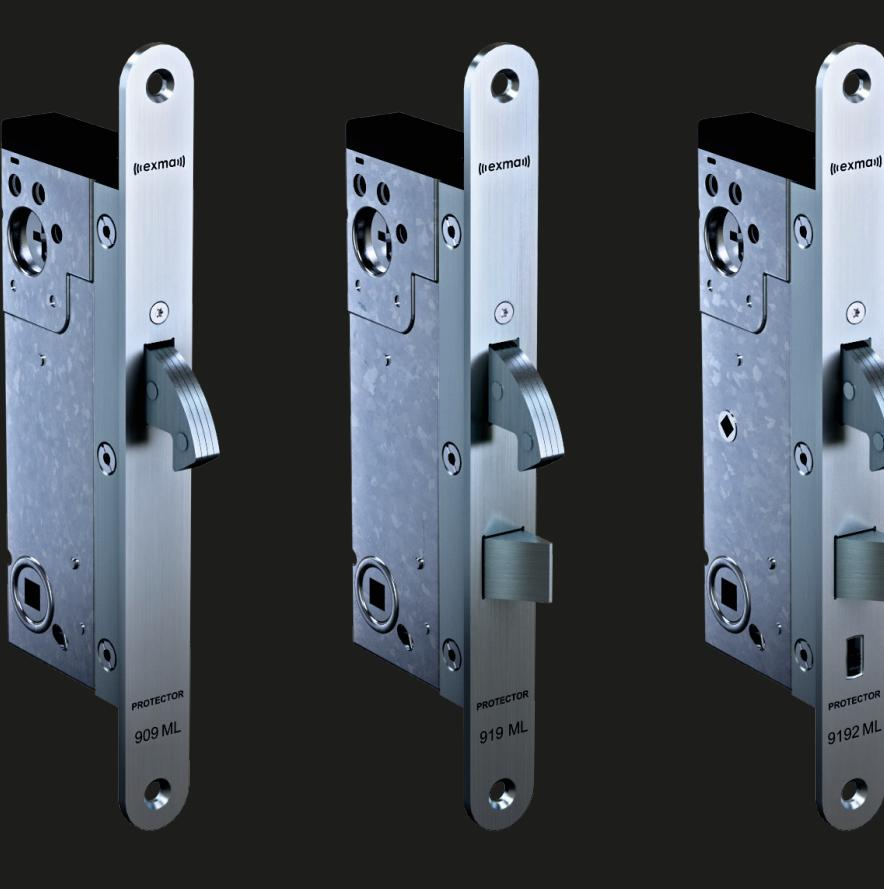

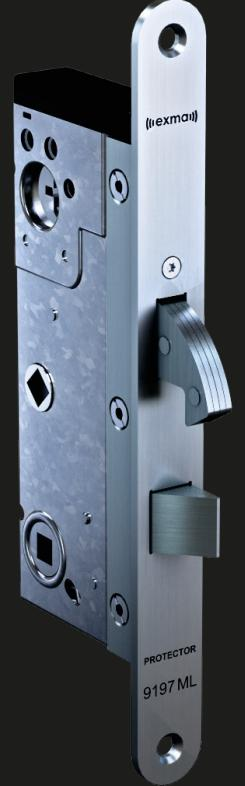

# Dokument för egenkontroll

| Objektnamn   | Utförd av: företag  |
|--------------|---------------------|
| Objektnummer | Utförd av: tekniker |
| Adress       |                     |
| Enhet / dörr | Datum               |

| Produkt | Notering | Åtgärd |
|---------|----------|--------|
|         |          |        |
|         |          |        |
|         |          |        |
|         |          |        |
|         |          |        |
|         |          |        |
|         |          |        |
|         |          |        |
|         |          |        |
|         |          |        |

| Underskrift |  |  |
|-------------|--|--|

# Anteckningar

# Tack

Vi på Exma Säkerhetssystem AB vill tacka dig för att du valt oss och hälsa dig välkommen som kund. Du är nu ägare av ett motorlås av absolut högsta kvalitet.

EXMA SÄKERHETSSYSTEM AB +46 16-14 16 80 | kontakt@exma.se Filargatan 6 | SE-632 29 Eskilstuna