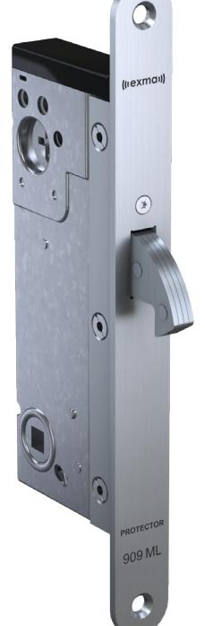
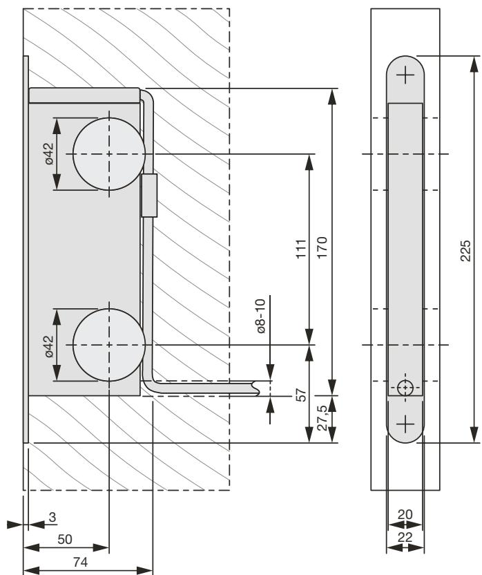

## Exma Protector 909ML & Protector HD 909ML

Motorlås med hakregel

Med motorlås ur Protector-serien fås en mycket säker och kontrollerad låsning och enkelt val av kommunikationsnivå.

- Prisvärd
- Klarar 360 graders nyckelvridning

Motorlåsen i Protector-serien är framtagna för bekväm motoriserad låsning tillsammans med tidur, kodlås eller integrerat i ett passagesystem. Motorlåsen i Protector-serien passar bra som natt- och säkerhetslås i verksamheter med höga säkerhetskrav.

Genom att välja motorlås i utförande Protector eller Protector HD väljs den typ av kommunikation som önskas. Exma Protector har okrypterad kommunikation där ingen egen styrenhet är nödvändig, då den kontrolleras direkt med driftspänning, startimpuls och återkoppling. Protector passar därför bra som exempelvis nattlås i flerbostadens entréer och till kontor. Exma Protector HD har skyddad kommunikation genom LonWorks integritetskontroller och autentisering.

Detta med 48-bitars symmetrisk proprietärkryptografi. Med krypterad kommunikation i Protector HD tillsammans med Exma styrenhet A1D har du stor valmöjlighet vad gäller styrning av dörrpassagen, exempelvis i anslutning med dörrautomatik och passagesystem. Protector HD tillsammans med Styrenhet A1D ger en krypterad kommunikation som höjer säkerheten. Alla motorlås i Protector-serien kan styras direkt via MiniRead.

Protector och Protector HD är försedd med hakregel i härdat stål förstärkt med härdade stift. Öppning och låsning sker på mindre än 0,5 sekunder. Motorlåset kan också hanteras helt manuellt med nyckel utan inverkan på motorenheten. Motorlåset klarar 360 graders nyckelvridning.

Certifikat

enligt nedan

Hakregellås certifierat i enlighet med SSF 3522 utgåva 2. Både Protector och Protector HD uppfyller kraven som komponent i en låsenhet för fast montering SSF 3522, utgåva 2 i klassning

Klass 3 Exma Protector HD: 909ML Klass 2A Exma Protector: 909ML

Hög mekanisk säkerhet i kombination med snabb motoriserad låsning ger en mycket säker dörr. Hakregeln i alla fyra låshusmodeller i Protector-serien drivs av en elmotor.

Alla motorlås i Protector-serien är utrustade med en mekanisk frikoppling vid blockering så att inte motorn ska kunna skadas. Vid användning av nödutrustning ska vred med returfjäder användas.

Protector och Protector HD är prisvärda och säkra motorlås där du endast betalar för det du behöver.

SPECIFIKATIONER FÖR PROTECTOR 919ML

| Drivspänning        | 22-30 V DC +-10% Filtrerad och stabiliserad likspänning. |
|---------------------|-------------------------------------------------------------|
| Strömförbrukning    | max 300 mA                                                  |
| Temperaturområde    | -20 °C – +60 °C                                             |
| Startimpulser       | Spänningsimpuls 20–30 V DC                                  |
| Öppningshastighet   | under 0,5 s.                                                |
| Kabellängd till lås | Max 50 m (0,6 m2 och ingen elektrisk störning)           |

SPECIFIKATIONER FÖR PROTECTOR HD 919ML

| Drivspänning       | 22-30 V DC +-10% Filtrerad och stabiliserad likspänning.              |
|--------------------|--------------------------------------------------------------------------|
| Strömförbrukning   | Vila 135 mA under drift 350 mA, motorstart 550 mA i 50 mS             |
| Temperaturområde   | -20 °C – +60 °C                                                          |
| Öppningshastighet  | vid ≥18 V – 30 V DC ca 0,3 s.                                            |
| Reläutgång         | 125 V AC 0,3 A resistiv belastning, 30 V DC 1,0 A resistiv belastning |
| Öppningssignal A1D | 2 st. polaritetsfria ingångar 10–30 V DC, 1 st. potentialfri ingång   |

Urtagsritning Protector 909 och Protector HD 909

MÅTT LÅSHUS PROTECTOR 909ML & PROTECTOR HD 909ML

| Djup (inkl stolpe) | 65mm  |
|--------------------|-------|
| Dorndjup           | 50mm  |
| Höjd               | 158mm |
| Bredd              | 20mm  |
| Djup stolpe        | 3mm   |
| Höjd stolpe        | 225mm |
| Bredd stolpe       | 22mm  |
|                    |       |

## Låshusmodell 909ML

225

Låshus med hakregel. Används med fördel för nattlåsning.

Notera övriga delar i den monterad låsenhet, såsom exempelvis låscylinder, måste uppfylla kraven för önskad klassning för att låsningen ska vara godkänd.