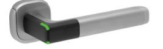
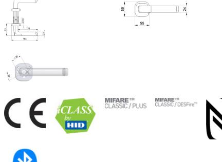

## H100 SCAND

Dörrhandtag med passerkontroll För dörrlås med skandinavisk-profil – för användning inomhus

## **Produktbeskrivning**

- Trådlöst Aperio® dörrhandtag som kan integreras i alla passersystem via AADP protokollintegration eller Aperio Wiegand-hubb
- Kan användas med de flesta vanligt förekommande skandinaviska (SIS) instickslås i trä-, stål- och rörramsdörrar (samt glasdörrar med låshus av standardtyp)
- Online-/offline-läge väljs i programvaran när produkten installeras (tillbehören PAP-programvara och radiodongel eller kabel krävs)
- I online-läge kommunicerar hubben med online-passersystemet (adresserbart) beslut om tillträde tas via passersystemet
- Alla funktioner och elektroniska komponenter sitter i den yttre delen av handtaget
- Utsidans trycke är frikopplat insidans trycke är alltid inkopplat
- LED för statusindikering
- Diskret handtag med minimal energiförbrukning och modern design

## **Leveransomfattning**

- 1 par handtag med batteri (Lithium CR123A) och installationsanvisning
- Kapbara fästskruvar
- Tryckespinne 8 mm
- Tillbehörspaket

## **Tekniska data - Dörrhandtag med passerkontroll**

| Autentisering                         | En autentiseringsnivå – endast KORT                                                                 |
|---------------------------------------|-----------------------------------------------------------------------------------------------------|
| Godkännanden                          | CE, EN1906: 26-B010B                                                                                |
| Mått                                  | 56 x 55 x 13,5 mm (handtagsfattning H x B x D)                                                      |
| Version                               | Innerdörrar                                                                                         |
| Trycke                                | L-form, U-form med adapter (tillbehör)                                                              |
| Yta                                   | Matt krom                                                                                           |
| Avstånd                               | Tryckespinne 8 mm                                                                                   |
| Dörrtjocklek                          | 35–80 mm, men passar även tunnare dörrar om en 10-millimeters distansbricka (tillbehör) används. |
| Batteri                               | 1 x Lithium CR123A                                                                                  |
| Batterilivslängd                      | High Frequency Multiclass: 30 öppningar per dag i 50 månader                                     |
| Radiostandard                         | IEEE 802.15.4 (2.4 GHz)                                                                             |
| Kryptering (radiokommunikation)    | AES 128 bits                                                                                        |
| Avstånd mellan RFID-läsare och hub | Upp till 25 m beroende på byggnadsmiljö                                                             |
| Skyddsklass                           | IP42                                                                                                |
| Drifttemperaturområde                 | 0°C till 55°C                                                                                       |
| Luftfuktighet                         | < 85 % (icke-kondenserande)                                                                         |
| Status                                | LED (röd/grön/orange)                                                                               |
| RFID-avläsning                        | UID /sektor/block eller applikation/fil                                                             |
| Avläsningsavstånd                     | < 4 cm                                                                                              |
| Kommunikationsgränssnitt              | Kommunikation via radio (USB-dongel) eller via USB typ B-adapter (tillbehör)                     |
| OSS Standard Offline                  | Aperio® Online; Aperio® Offline; Standard OSS Offline                                            |

[Powered by TCPDF (www.tcpdf.org)](http://www.tcpdf.org)