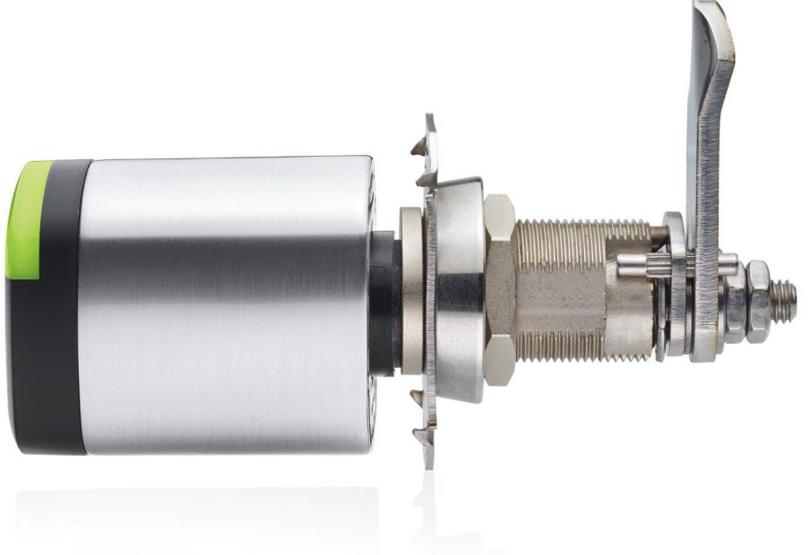
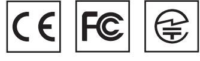
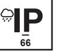
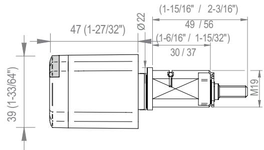
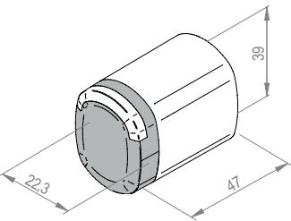

# PRODUKTBLAD

# SALTO NEO INDUSTRICYLINDER

Fullt integrerad med SALTO SPACE och SALTO KS plattformarna, är SALTO Neo en mångsidig, kostnadseffektiv elektronisk cylinder med en kompakt storlek som möjliggör en enkel installation och ger ditt SALTO passersystem den senaste tekniken.

www.saltosystems.com

TEKNISKA SPECIFIKATIONER: SALTO NEO INDUSTRICYLINDER NxCL

Publications of SALTO SYSTEMS S.L. are protected by copyright and all rights are reserved. SALTO SYSTEMS publications may not be reproduced in any form or by any means without written permission from the copyright owner.

# TEKNISK INFORMATION: TEKNISK RITNING:

| Mått:                         | 39mm x 47mm x 22,3mm                  |
|-------------------------------|---------------------------------------|
| IP Klassning:                 | Inomhusmodell.                        |
|                               | utomhusmodlel IP66 (valbar).          |
| Certifikat:                   | CE, FCC/IC, RCM, MIC,                 |
| Strömförsörjning:             | 4 LR1 alkaline batterier              |
| Antal öppningar:              | Upp till 130.000                      |
| Maximalt antal logghändelser: | Upp till 2.2001 (non-volatile memory) |
| Arbetstemperatur              | -20ºC / +55ºC                         |
| (utan kondens)                |                                       |

# ÖPPNINGSSÄTT:

| Standard:                        | • |
|----------------------------------|---|
| Kontorsfunktion:                 | • |
| Tidstyd kontorsfunktion:         | • |
| Automatisk öppen:                | • |
| Automatiskt öppen + kontorsfunk. | • |
| Toggle:                          | • |
| Tidstyd Toggle:                  | • |
| Amok:                            | — |
| Återinrymning:                   | — |
| Pin / gruppkod:                  | — |
|                                  |   |

# ALTERNATIV:

## LÄSARFÄRG:

| Svart: | • |
|--------|---|
| Vit:   | • |

# YTBEHANDLING:

| Matt krom            | • |
|----------------------|---|
| Polerad krom         | • |
| PVD polerad mässing  | • |
| PVD matt mässing     | • |
| Svart Matt krom      | • |
| BioCote® (matt krom) | • |

# LÄSTEKNIKER:

| MIFARE:*          | • |
|-------------------|---|
| BLE Smart:        | • |
| NFC:              | • |
| Legic:**          | — |
| HID iCLASS® Seos: | • |
| Picopass:         | — |
| i-Button:         | — |
|                   |   |

* MIFARE® (DESFire EV2, Plus, Ultralight C, Classic - ISO/IEC 14443) ** Legic Prime och Legic Advant

## TEKNOLOGIPLATTFORMAR:

#### SALTO SPACE:

| Smile - Selfprogrammable          | — |
|-----------------------------------|---|
| ROM:                              | — |
| SVN data-on-card:                 | • |
| SALTO Wireless RFnet förberedd:   | — |
| SALTO Wireless BLUEnet förberedd: | • |

#### SALTO KS:

SALTO KS: •

## SALTO SALLIS:

SALLIS: —

