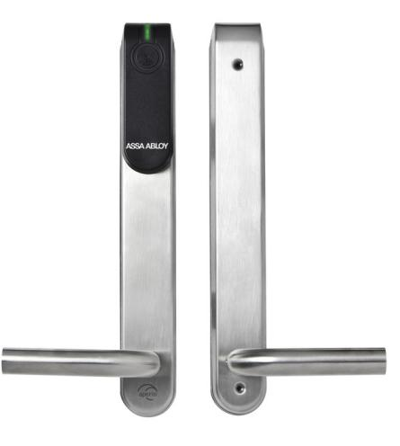
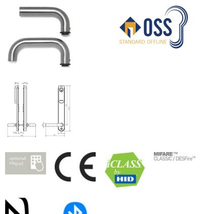

# E100 SCAND

utan cylinder, utan vred Skandinavisk profil

# **Produktbeskrivning**

- Trådlös Aperio Escutcheon som kan integreras i valfritt kontrollsystem via AADP-protokollintegration eller via Aperio Wiegand Hub.
	- Kan användas med alla skandinaviska instickslås i trä-, stål- och rörramsdörrar
- Huvudelektronik (RFID + radio + BLE) utanpå säkerhetsrelevant elektronik inuti
- Utsidans trycke är frikopplat insidans trycke är alltid inkopplat
- LED för statusindikering

### **Leveransomfattning**

- 1 dörrbladsläsare med batteri (Lithium CR123A) och installationsanvisning
- Skruvar, borrmall och verktyg (för kabelinföring)

#### **Tips**

- * Observera att besvärliga yttre miljöfaktorer kan påverka produktens funktion (hög luftfuktighet, salt, extrema temperaturer)
## **Tekniska data - utan cylinder, utan vred**

|  | Autentisering                         | Tre autentiseringsnivåer (endast PIN, endast KORT, både PIN och KORT)                         |
|--|---------------------------------------|--------------------------------------------------------------------------------------------------|
|  | Code                                  | PIN-kod – 4 till 8 siffror                                                                       |
|  | Godkännanden                          | CE                                                                                               |
|  | Mått                                  | 312 x 41 x 10/20 mm (H x W x D)                                                                  |
|  | Version                               | Standard = Inner- och ytterdörrar upp till klass 2                                               |
|  | Trycke                                | L-form, U-form                                                                                   |
|  | Yta                                   | Borstat rostfritt stål (ST)                                                                      |
|  | Avstånd                               | 105 mm med spindel 8 mm                                                                          |
|  | Dörrtjocklek                          | 35–95 mm tjockt dörrblad, i steg om 10 mm                                                        |
|  | Nyckelhålsavstånd                     | > 40 mm                                                                                          |
|  | Monteringsplatta                      | 45 mm                                                                                            |
|  | Batteri                               | 1 x Lithium CR123A                                                                               |
|  | Batterilivslängd                      | > 40 000 cykler (max. 3 år)                                                                      |
|  | Radiostandard                         | IEEE 802.15.4 (2.4 GHz)                                                                          |
|  | Kryptering (radiokommunikation)    | AES 128 bits                                                                                     |
|  | Avstånd mellan RFID-läsare och hub | Upp till 25 m beroende på byggnadsmiljö                                                          |
|  | Skyddsklass                           | IP 52*                                                                                           |
|  | Drifttemperaturområde                 | 0–60 °C                                                                                          |
|  | Luftfuktighet                         | < 85 % (icke-kondenserande)                                                                      |
|  | Status                                | LED (röd/grön/orange)                                                                            |
|  | RFID-teknologi                        | Hög frekvens: iCLASS® / ISO 14443B; iCLASS Seos; MIFARE Classic® / MIFARE® DESFire® EV1 & EV2 |
|  | RFID-avläsning                        | UID / Sektor / Block / Application / File / LEGIC® Segment Data                               |
|  | Avläsningsavstånd                     | < 4 cm                                                                                           |

# E100 SCAND utan cylinder, utan vred Skandinavisk profil

**Kommunikationsgränssnitt** Kommunikation via radio (USB-dongel) eller Micro-USB-adapter (tillbehör)

**OSS Standard Offline** Aperio® Online; Aperio® Offline; Standard OSS Offline

ASSA ABLOY Scandinavia Förmansvägen 11 117 43 Stockholm www.assaoem.se/aperio

[Powered by TCPDF (www.tcpdf.org)](http://www.tcpdf.org)