# 05/21 **UniScan**

Testbar närvarodetektor för montage på automatiserade slagdörrar/portar

**308257H**

# **Allmänt**

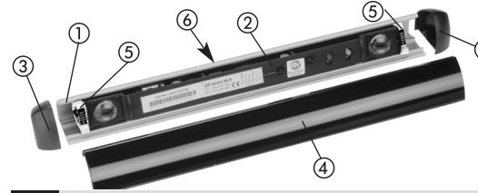

- - Aluminiumprofil Optikenhet (US beam) Ändstycke 2x Frontkåpa Fäste för optikenhet 2x
- Stickbar skruvplint för kabel -
- anslutning (syns ej på bilden)

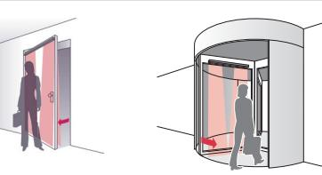

• Tänk alltid på hela applikationens säkerhetsfunktion, inte bara på en viss del av syste-

• Signalgivaren får endast manövreras från ett lågspänningssystem (SELV) med säker elektrisk isolering enligt SS-EN 61558. Ledningarna måste skyddas mot mekaniska

# **1 Säkerhetsföreskrifter**

- Läs denna skötselanvisning noggrant innan du tar enheten i drift och behåll den för senare bruk.
- Denna produkt är avsedd för montering ovanför en gångdörr.
- Använd inte denna produkt på annat sätt än för den specifika applikationen.
- Endast utbildad och kvalificerad personal får installera och initiera enheten.
- Endast auktoriserad fabrikspersonal får utföra ändringar av maskinvara/programvara eller reparera produkten.
- Om de här säkerhetsföreskrifterna ignoreras kan det leda till skador på signalgivarna eller föremål, allvarliga personskador eller dödsfall.
- Detär installatörens ansvar att göra en riskbedömning och installera systemet i enlighet med gällande nationella och internationella bestämmelser och säkerhetsnormer samt, om tillämpligt, i enlighet med maskindirektiv 2006/42/EG.

-

### **Idrifttagande 2**

**Rekommenderad procedur för idrifttagande:** I. Montering av aluminiumprofil, II. Anslutning, III. Montering av sensor och kabel, IV. Vinkelinställning, V. Initialisering Följande procedur för idrifttagande täcker nästan alla typer av användning. Det är dock möjligt att en särskild inställning måste göras, som inte beskrivs här. Se i så fall dokumentationen till systemet och tabellen i kapitel 3 i denna bruksanvisning. Konsultera din produktspecialist vid behov.

met.

skador.

# **2.1 Montering av aluminiumprofil**

- 1. Gör hål för montering på baksidan av aluminiumprofilen - om sådana saknas. Montera profilen vågrätt (använd vattenpass). Obs! Aluminiumprofilen måste ligga **plant** mot monteringsytan **Montering av aluminiumprofil I**
- 2. Om frontkåpan kommer i metervara, ska den **läggas på ett rent och plant underlag** och försiktigt kapas **med en fintandad metallsåg, bågfil eller dremel** (med lämpligt skärverktyg). Montera frontkåpan efter idrifttagandet:

1. Dra av skyddsfolien, 2. Häkta i frontkåpan i överdelen på aluminiumprofilen. 3. Tryck fast frontkåpan i aluminiumprofilens nederkant.

- 3. Sätt fast ändkåporna genom att trycka fast dem. Alternativt: För starkare infästning använd de medföljande skruvarna för att fästa gavlarna. (Gör först hål vid markeringen)
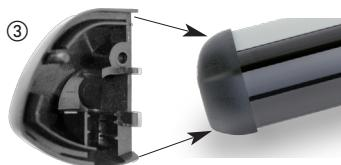

### **2.2 Elektrisk anslutning**

**Anslutning**

**II**

## **Kopplingsschema enskilda detektorer**

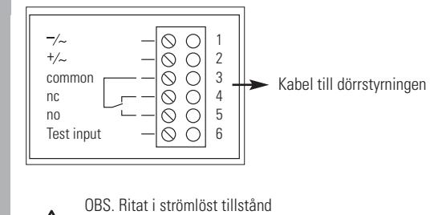

Som standard är reläutgången strömsatt (passiv). Använd därför anslutning 5 som NC.

# **Anvisningar för kabeldragning:** Koppla in enligt kraven för dörrautomatiken

**2.**

• Risk för splitter om frontkåpan går sönder

• Sensorns delar kan bli uppvärmda under drift.

• Sensorn får endast användas med den avsedda aluminiumprofilen

• Undvik alltid att vidröra elektroniska och optiska komponenter.

- 1. Dra (eller tryck underifrån) ur skruvklämman ur optikenheten, som ska anslutas till dörrstyrningen (= masterenhet).
2. Anslut kabeln enligt kraven för dörrstyrningen 3. Sätt tillbaka skruvklämman i sensorn

### Inkoppling av Master/Slav

En optikenhet (Master) ansluts till dörrautomatiken och upp till max 3st optikenheter ansluts som slavar i sensorn med bifogade flatkablar.

**1.**

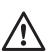

Vid matning med växelspänning kan inte slav-enheter anslutas utan bara en optikenhet per sensor får användas. För anslutningskabeln rekommen- derar vi trådarea 0,25mm2 med hylsor.

Då sensorer monteras på bägge dörrsidor förenklas inkopplingen om man använder en förgreningsplint (Y-adapter art.nr. 288879).

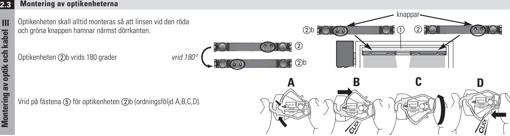

- 1. Kläm fast optikenheterna och b i aluminiumprofilen -. För in den övre klacken på fästet i övre spåret på profilen och kläm fast.
- 2. Kabeln får plats mellan fästet och profilen -
- 3. Använd bandkabel för att ansluta de enskilda sensorerna och b (observera de smala och breda spåren, använda inte våld för att sätta i kabeln).

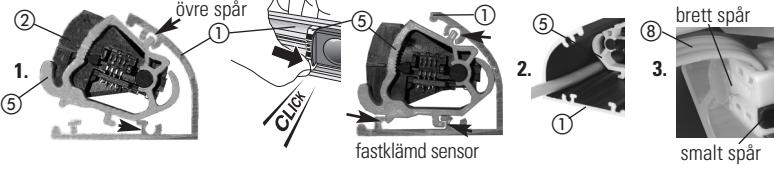

# **2.4 Vinkelinställning**

För att enheten ska kunna fungera korrekt måste **vinkeln på höger och vänster sida av optikenheten vara lika**

- Avkänningsfältet är beroende av läget på US beam i aluminiumprofilen.
**Skjut optikenheterna så nära åt profilens höger- och vänsterkant som möjligt för att säkra vid dörrkanterna.**

Vinkeln för varje sensor ska väljas så att dörren stannar **FÖRE** beröring.

Värdena på vinkeln som anges här intill täcker 90% av alla användningar. Se systemets dokumentation för särskilda tillämpningar.

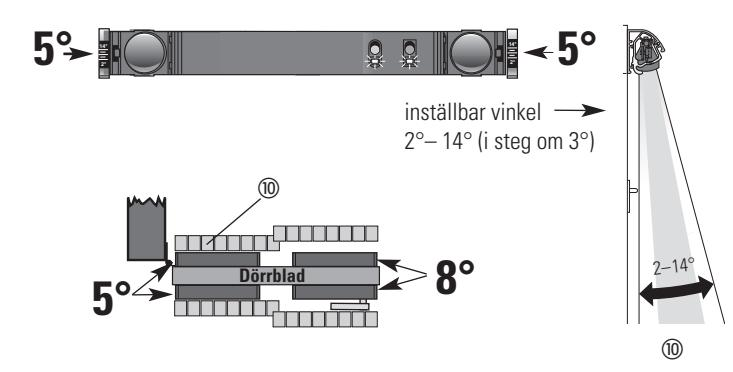

## **2.5 Idrifttagande**

**Vinkelinställning**

**IV**

### **Initialiseringen av en sensor ska vid idrifttagande göras på masterenheten (förstagångsinitialisering).**

Anvisningar om initialisering vid speciella bakgrunder:

Lägg en bit kartong på golvet vid speciella bakgrunder (t.ex. galler), för att uppnå en korrekt initialisering (se tabellen i kapitel 5 parametern bakgrundens beskaffenhet).

### **InitialisierIng Idrifttagande med den gröna knappen** Knapp «grön» Knapp «röd» 1. Om båda lysdioderna «röd» och «grön» blinkar Tryck **5 sekunder** på knappen «**grön**» och aktivera initialiseringen. Idrifttagandet startas alltid på den optikenhet som är ansluten till dörrautomatiken (på mastern). **V**

- 
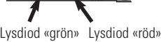

 betyder det att initialiseringen aktiverats. Låt avkänningsfältet vara ostört under 6 sekunder.

- 2. Blinkar den röda lysdioden betyder det att initialisering pågår. Beträd **inte** avkänningsfältet. 3. Se Felavhjälpning i kapitel 4 om lysdioderna
- blinkar som förut. 4. Om båda lysdioderna är släckta har
- initialiseringen avslutats.

### **Idrifttagande med fjärrkontroll (RegloBeam 2):**

### Initialisering:

ges: **F + 3 + 8**

- 1. Tryck på knappen **«G»**
- 2. Aktivera initialiseringen med knapparna **F + 3 + 6**
- 3. När du är färdig, gå ur konfigurations lä get så kan inga ofrivilliga kommando

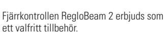

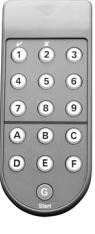

**Efter initialiseringen är detektorn klar för drift. Kontrollera detekteringsegenskaperna. Om de inte motsvarar anläggningens krav kan man ställa in olika detaljkonfigurationer med detektorns knappar eller med fjärrkontrollen (se nästa kapitel).**

### **Inställning av parametrar och värden 3**

### **Exempel på inställning av känslighet**

- 1.Tryck 1 sekund på knapparna «röd» och «grön»,
- -> Enheten befinner sig vid parametern 1 «Testingång»
- 2.Tryck 3 gånger på knappen «röd» -> Enheten befinner sig vid parametern 4 «Känslighet» och indikerar värdet 3 genom tre gröna blinkningar (20 cm)
- 3.Tryck 2 gånger på knappen «grön» -> Enheten indikerar värdet 5 genom fem gröna blinkningar (40 cm).
- 4.Alternativ: Gå ur inställningsläget genom att trycka 1 sekund på knapparna «röd» och «grön».

### **Anvisningar till inställningar:**

- **Underlagets beskaffenhet (golv/mark):**
- Tre olika inställningar kan väljas beroende på golvets beskaffenhet: – Standard
- Mycket mörkt eller reflekterande golv
- Gallerdurk -> lägg någonting över gallret under initialiseringen (känsligheten ställs då in på >= 50 cm)

### Valet av speciella underlag stänger av detektorns självtest mot underlaget och vid gallerdurk stängs även den automatiska underlagsanpassningen av.

## **Synkronisering:**

- Synkroniseringen är som standard aktiverad och säkerställer att sensorerna fungerar felfritt även vid fältöverlappning.
– Varning: Används en US beam (grön etikett) eller R3 (gul etikett) med äldre optikenhet i samma profil, måste synkroniseringen kopplas från och överlappningen undvikas manuellt (olika lutningsvinklar, stäng av de överlappande strålarna vid behov)

## **Inställning med knapparna «röd» och «grön» Inställning med fjärrkontroll (RegloBeam 2):**

- 1. Tryck på knappen «G» på fjärrkontrollen (t.ex. lyser «3» för enheten med adressen 3) 2. Tryck på knappen «D», knappen «3» tänds, dvs. det tidigare värdet 3 (20 cm)
- 3. Tryck på knappen «5», värdet 5 (4 0 cm) har ställts in (knappen » 5» tänds)
- Observera:

Om knapparna blinkar har värdet inte registrerats -> gör ett nytt försök, aktivera konfigurationsläget vid behov: tryck snabbt på en knapp på optikenheten, koppla från och till matningen eller ange behörighetskod på fjärrkontrollen.

## **Känslighet:**

- Känsligheten ska väljas enligt krav på platsen (t.ex. DIN 18650, EN 16005) – Värdena som anges är riktvärden och gäller objekthöjden som kan kännas av.
- Denna varierar beroende av bakgrundens beskaffenhet och måste kontrolleras på plats. **Initialisering:**
- Vid initialiseringen lärs sensorernas monteringshöjd in.
- Respektive höjd sparas under parametern 8 med värdena 1-4 (värde 1 = ca. 1,4–1,7m, 2 = ca. 1,7–2m, 3 = ca. 2,0 –2,4m, 4 = ca. 2,4–3,0m)

### **Fabriksåterställning:**

- **Tryck på de båda knapparna «röd» och «grön» under 5 sekunder, tills den röda lysdioden blinkar snabbt, släpp sedan knapparna.**
### **Snabbval**

Standardläget ställer in alla värden till fabriksinställning och kopplar in alla ljusstrålar. Strömsparläget ställer in alla värden till fabriksinställning och kopplar från ljusstrålarna 2,4 och 6.

| Inställningar via knappar och fjärrkontroll: |  |
|----------------------------------------------|--|
|                                              |  |
|                                              |  |
|                                              |  |
|                                              |  |
|                                              |  |
|                                              |  |

# **Observera: Genomför alltid en initialisering på respektive optikenhet när parametrar ändras.**

| Anmärkningar: |                                                                                                                                        | Varje värde tilldelas ett nummer.                | Efter värde 9 tillbaka till värde 1   |                                             |                        |                                                 |                                    |                                      |           | Reläets frånslagnings- fördröjning | Enhetsadress efter initialise- ring: Master=3 Slav=4 -7 | - Tänk på säkerheten Galler är känslighe Vid inställningen ten låst på >= 50 cm, | bara som indikering Värde 1-4 används              | Av vid kombination av RS-beams (Revoscan) USbeam med äldre | Snabbval = Parametrar fabriksinställning återgår till |                                                                                                                                                                                                                    | Fabriksinställning |                                       | Strömsparmönster                          |                                        |               |                                       |   |
|---------------|----------------------------------------------------------------------------------------------------------------------------------------|-----------------------------------------------------|------------------------------------------|---------------------------------------------|------------------------|-------------------------------------------------|------------------------------------|--------------------------------------|-----------|---------------------------------------|------------------------------------------------------------|----------------------------------------------------------------------------------------------|-------------------------------------------------------|------------------------------------------------------------------|-------------------------------------------------------------|--------------------------------------------------------------------------------------------------------------------------------------------------------------------------------------------------------------------|--------------------|---------------------------------------|-------------------------------------------|----------------------------------------|---------------|---------------------------------------|---|
| Värde 9:      | 9                                                                                                                                      | blinkar 9 ggr %                                  |  Tryck 1 g. på                        |                                             | –                      |                                                 | –                                  | –                                    |           | –                                     | –                                                          | –                                                                                            |                                                       | –                                                                | –                                                           | För parameter 2 skiljer sig inställningarna mellan fjärrkontrollen och sensorknapparna. Med fjärrkontrollen kan enskilda strålar kopplas på eller av. Med röd och grön knapp ställer man in ett ljusstrålemönster. | Värde 9            | Alla strålar på B + 9:             |                                           |                                        | Värde 9       |  Tryck 1 gång på                   |   |
| Värde 8:      | 8                                                                                                                                      | blinkar 8 ggr %                                  |  Tryck 1 g. på                        |                                             | –                      |                                                 | SW-version                         | –                                    |           | 10 s                                  | –                                                          | –                                                                                            | Konfig. läge av                                       | –                                                                | –                                                           | Om ljusstrålar kopplas på eller av måste ny höjdinlärning göras med funktionen "initialisering". Vid känslighetsstegen 6 & 7 har sensorn bara 7 ljusstrålar, stråle 8 är deaktiverad                               | Värde 8            | B + 8: Stråle 8                    | Knapp 1 = på Knapp 2 = av              |                                        | Värde 8       |  Tryck 1 gång på                   |   |
| Värde 7:      | 7                                                                                                                                      | blinkar 7 ggr %                                  |  Tryck 1 g. på                        |                                             | –                      |                                                 | ny start                           | 70 cm                                |           | 6 s                                   | 7                                                          | –                                                                                            | Lysdiodtest                                           | –                                                                | –                                                           |                                                                                                                                                                                                                    | Värde 7            | B + 7: Stråle 7                    | Knapp 1 = på Knapp 2 = av              |                                        | Värde 7       |  Tryck 1 gång på                   |   |
| Värde 6:      | 6                                                                                                                                      | blinkar 6 ggr %                                  |  Tryck 1 g. på                        |                                             | –                      | Alla inställningar se tabeller nederst på sidan | –                                  | 50 cm                                | DIN 18650 | 3 s                                   | 6                                                          | –                                                                                            | Masterinitiali eller «grön» knapp 5 s sering | –                                                                | –                                                           |                                                                                                                                                                                                                    | Värde 6            | B + 6: Stråle 6                    | Knapp 1 = på Knapp 2 = av              |                                        |               |  Tryck 1 gång på                   |   |
| Värde 5:      | 5                                                                                                                                      | blinkar 5 ggr %                                  |  Tryck 1 g. på                        |                                             | *Av                    |                                                 | –                                  | 40 cm *                           | DIN 18650 | 1 s                                   | 5                                                          | –                                                                                            | Höjdinlärning eller «röd» knapp 1 s             | –                                                                | –                                                           |                                                                                                                                                                                                                    |                    |                                       |                                           |                                        | Värde 6       |                                       |   |
| Värde 4:      | 4                                                                                                                                      | blinkar 4 ggr %                                  |  Tryck 1 g. på                        |                                             | Pull down Låg aktiv | DIN 18650                                       | –                                  | 30 cm                                | DIN 18650 | *500 ms                               | 4                                                          | –                                                                                            | Monteringshöjd ca 2.4–3.0m                         | –                                                                | –                                                           |                                                                                                                                                                                                                    | Värde 5            | B + 5: Stråle 5                    | Knapp 1 = på Knapp 2 = av              |                                        | Värde 5       | Tryck 1 gång på                    |   |
| Värde 3:      | 3                                                                                                                                      | blinkar 3 ggr %                                  |  Tryck 1 g. på                        |                                             | Låg aktiv Pull up   | DIN 18650                                       | –                                  | 20 cm                                | DIN 18650 | 200 ms                                | *3                                                         | (täck över vid inställning) Galler                                                     | Monteringshöjd ca 2.0 –2.4m                        | *Standby & synch                                              |                                                             |                                                                                                                                                                                                                    | Värde 4            | B + 4: Stråle 4                    | Knapp 1 = på Knapp 2 = av              |                                        | Värde 4       | Tryck 1 gång på                    |   |
| Värde 2:      | 2                                                                                                                                      | blinkar 2 ggr %                                  |  Tryck 1 g. på                        |                                             | Pull down Hög aktiv | DIN 18650                                       | *Relä passiv omkoppling         | 15 cm                                | DIN 18650 | 50 ms                                 | 2                                                          | reflekterande mörk/ DIN 18650 *                                                     | Monteringshöjd ca 1.7–2m                           | Av                                                               | Strömspar läge *                                      |                                                                                                                                                                                                                    | Värde 3            | B + 3: Stråle 3                       | Knapp 1 = på Knapp 2 = av              |                                        | Värde 3       | Tryck 1 gång på                       |   |
| Värde 1:      | 1                                                                                                                                      | blink. 1 gång %                                  |                                          |                                             | Hög aktiv Pull up   | DIN 18650                                       | omkoppling Relä aktiv           | 10 cm                                | DIN 18650 | 0 ms                                  | 1                                                          | standard DIN 18650                                                                        | Monteringshöjd ca 1.4–1.7m                         | * synch                                                          | Standard- läge                                           |                                                                                                                                                                                                                    | Värde 2            | B + 2: Stråle 2                       | Knapp 1 = på Knapp 2 = av              |                                        | Värde 2       |  Tryck 1 gång på                   |   |
|               | kontroll Fjärr                                                                                                                      | Knappar                                             | på sensorn                               |                                             |                        |                                                 | 1 g                                |                                      |           |                                       | 1 g                                                        | 1 g                                                                                          | 1 g                                                   | 1 g                                                              |                                                             |                                                                                                                                                                                                                    |                    | B + 1: Stråle 1                       | Knapp 1 = på Knapp 2 = av              |                                        |               |                                       |   |
|               | Ställ in 2.                                                                                                                         | värde                                               |                                          | Knappar på sensorn                       | blinkar 1 gång 4 | 4blinkar 2 ggr Tryck på  1 g                 | blinkar 3 ggr  Tryck på 4 | blinkar 4 ggr Tryck på  1 g. 4 |           | 4 blinkar 5 ggr 1 g. Tryck på   | blinkar 6 ggr  Tryck på 4                         | blinkar 7 ggr  Tryck på 4                                                           | blinkar 8 ggr  Tryck på 4                    | blinkar 9 ggr  Tryck på 4                               | –                                                           |                                                                                                                                                                                                                    | Värde 1            |                                       |                                           |                                        | Värde 1       |                                       |   |
|               |                                                                                                                                        | Val av 1.                                        | parameter                                | kontroll Fjärr                           | A                      |                                                 | C                                  | D                                    |           | E                                     | F + 1                                                      | F + 2                                                                                        | F + 3                                                 | F + 4                                                            | F + 8                                                       |                                                                                                                                                                                                                    | Fjärrkontroll      | Indikering och val B + Nr.: Stråle | med knapp 1 & 2 som «på» eller «av» |                                        | Sensorknappar | Efter parameter 1. tryck 1 gång på |   |
|               |                                                                                                                                        |                                                     |                                          |                                             |                        |                                           |                                    |                                      |           |                                       | 4 5                                                     |                                                                                              |                                                       |                                                                  |                                                             |                                                                                                                                                                                                                    |                    |                                       |                                     |                                        |               |                                       |   |
|               |                                                                                                                                        |                                                     | Teckenförklaring, knappar och lysdioder: | = Grön knapp = Röd knapp           |                        |                                              |                                    |                                      |           |                                       | 6 3                                                     |                                                                                              | Start                                                 |                                                                  |                                                             |                                                                                                                                                                                                                    |                    |                                       |                                        |                                        |               |                                       |   |
|               |                                                                                                                                        |                                                     |                                          |                                             |                        |                                                 |                                    |                                      |           |                                       |                                                            |                                                                                              |                                                       |                                                                  |                                                             |                                                                                                                                                                                                                    |                    |                                       |                                           |                                        |               |                                       |   |
|               | Gå ur genom att hålla röd och grön knapp nere i 1 Håll röd och grön knapp intryck i minst 1 sekund Inställningsläge med knappar: | Inställningsläge med fjärrkontroll: Tryck sekund | på knappen «G»                           | = Grön lysdiod, = Röd lysdiod, 4 % | Testingång             | Ljusstrålar                                     | Utgång                             | Känslighet                           |           | Relähålltid                           | Enhetsadress                                               | beskaffenhet Bakgrundens (golv)                                                        | Initialisering                                        | Synkronise- ringsläge                                         | fjärrkontroll) (endast via Snabbval                   | Parameter 2 ljusstrålar: Parameter 2 med fjärrkontroll                                                                                                                                                          |                    | Ljusstrålar                           |                                           | Parameter 2 med «röd» och «grön» knapp |               | Ljusstråle-                           |   |
|               |                                                                                                                                        |                                                     |                                          |                                             | 1                      | 2                                               | 3                                  | 4                                    |           | 5                                     | 6                                                          | 7                                                                                            | 8                                                     | 9                                                                |                                                             |                                                                                                                                                                                                                    |                    | 2                                     |                                           |                                        |               |                                       | 2 |

Uppfyller DIN 18650 som medåkande sensor DIN 18650 Fabriksinställning *Levererat skickstand

 

 mönster

4

blinkar 2 ggr

% blinkar 1 gång

 

 

 

 

 

 

 

Visar specialutförande

 Strömsparmönster

% blinkar 2 ggr

% blinkar 3 ggr

%

blinkar 3 ggr

% blinkar 5 ggr

% blinkar 6 ggr

% blinkar 7 ggr

% blinkar 8 ggr

% blinkar 9 ggr

Fabriksinställning

| Felavhjälpning                                                                      |                                                                                                                                                                                                                                               |                                                                                                                                                                                                                                                                                                                                    |  |  |  |  |  |  |  |  |  |
|-------------------------------------------------------------------------------------|-----------------------------------------------------------------------------------------------------------------------------------------------------------------------------------------------------------------------------------------------|------------------------------------------------------------------------------------------------------------------------------------------------------------------------------------------------------------------------------------------------------------------------------------------------------------------------------------|--|--|--|--|--|--|--|--|--|
| Symtom                                                                              | Möjlig orsak                                                                                                                                                                                                                                  | Åtgärd                                                                                                                                                                                                                                                                                                                             |  |  |  |  |  |  |  |  |  |
| Den röda lysdioden blinkar 8 gånger efter initialiseringen                       | - Avkänningsfältet var inte fritt under initialiseringen - Optikfästena sitter inte rätt i profilen - Optikenheten sitter inte med samma vinkel i vänster och höger fäste - Reflekterande bakgrund eller galler                      | - Gör en ny initialisering - Kläm fast optikfästena ordentligt i profilen - Ställ in samma lutningsvinkel i bägge optikfästena - Välj en annan bakgrundsinställning                                                                                                                                                       |  |  |  |  |  |  |  |  |  |
| Den röda lysdioden blinkar hela tiden                                               | - Flatkabeln defekt                                                                                                                                                                                                                           | - Byt ut flatkabeln                                                                                                                                                                                                                                                                                                                |  |  |  |  |  |  |  |  |  |
| Den röda lysdioden blinkar 2 gånger                                                 | - Mörkt eller reflekterande golv - Högt objekt i avkänningsfältet                                                                                                                                                                          | - Sätt parameter 7 på «mörk» eller «reflekterande» - Ta bort för höga objekt från avkänningsfältet                                                                                                                                                                                                                              |  |  |  |  |  |  |  |  |  |
| Dörren öppnar eller stänger inte, även om inget detekteras                       | - Testingången har inte aktiverats eller en felaktig variant har aktiverats                                                                                                                                                                | - Säkerställ att testingången är aktiverad - Ställ om reläutgången så att den passar dörrautomatiken (se avsnitt 3, sida 1)                                                                                                                                                                                                  |  |  |  |  |  |  |  |  |  |
| Masterinitialiseringen fungerar inte, röd lysdiod blinkar 4 gånger               | - AC-spänning används                                                                                                                                                                                                                         | - Ändra optikenheternas matning till DC-matning                                                                                                                                                                                                                                                                                    |  |  |  |  |  |  |  |  |  |
| Under masterinitialiseringen reagerar inte alla optikenheter                     | - AC-spänning används - Avbrott på flatkabeln                                                                                                                                                                                              | - Ändra optikenheternas matning till DC-matning - Anslut flatkabeln ordentligt eller byt ut                                                                                                                                                                                                                                     |  |  |  |  |  |  |  |  |  |
| Dörrarna reagerar inte, detektering sker dock                                    | - Initialiseringen skedde på en optikenhet som inte är direkt ansluten till dörrstyrningen eller kabelförgreningen (Y-adaptern)                                                                                                            | - Gör en initialisering på optikenheten som är direkt ansluten till dörrstyrningen                                                                                                                                                                                                                                              |  |  |  |  |  |  |  |  |  |
| Sensorn fungerar utan frontkåpa, men inte med frontkåpa                          | - Optikfästenas vinkel är fel - Frontkåpan dålig (stora repor på frontkåpan) - Känsligheten för hög (detekterar för nära golv)                                                                                                          | - Kontrollera optikfästenas vinkel - Byt frontkåpan - Minska känsligheten (Välj en större detekteringshöjd)                                                                                                                                                                                                                  |  |  |  |  |  |  |  |  |  |
| Den röda lysdioden blinkar 4,5,6 eller 7 gånger                                  | - AC-spänning används - Konfigurationsfel (Optikenheterna har flyttats om efter masterinitialiseringen) - Optikenheterna har inte initialiserats eller initialiserats felaktigt - Självtestet har gått fel, ofrivillig aktivering | - Ändra sensorernas matning till DC-matning - Gör en ny initialisering - Gör initialisering på mastern (ansluten till styrningen) - Gör en ny initialisering                                                                                                                                                              |  |  |  |  |  |  |  |  |  |
| Båda lysdioderna (röd och grön) lyser permanent                                  | - Matarspänningen inte tillräckligt stabil - För låg matarspänning - Spänningsavbrott                                                                                                                                                   | - Koppla från matningen till detektorn - Kontrollera spänningsförsörjningen - Koppla in matningen igen                                                                                                                                                                                                                       |  |  |  |  |  |  |  |  |  |
| Avkänning sker ibland när dörrvingen rör sig                                     | - Mycket ojämn mark och dörrörelser kan leda till avkänning - Fel bakgrundsparameter har valts                                                                                                                                             | - Minska känsligheten - Välj korrekt bakgrundsparameter - Ställ in annan vinkel (tänk på säkerheten)                                                                                                                                                                                                                         |  |  |  |  |  |  |  |  |  |
| Orimligt förhållande på kaskad med flera enheter, röd lysdiod blinkar en gång | - Sensorer från olika releaser används (Release 2, Release 3 och US beam)                                                                                                                                                                  | - Använd endast US beam-sensorer och/eller Release 3-sensorer - På US beam- eller Release 3-sensorer: stäng av synkro- niseringen och förhindra överlappning manuellt                                                                                                                                                        |  |  |  |  |  |  |  |  |  |
| Den röda lysdioden blinkar 10 gånger                                                | - Spänningsförlust under parametersättningen (lagringsfel)                                                                                                                                                                                    | - Gör initialisering på mastern (ansluten till automatiken)                                                                                                                                                                                                                                                                        |  |  |  |  |  |  |  |  |  |
| Grön LED på slavmodulen lyser varaktigt                                          | - Master-enheten är i standbymodus men inte slaven. Bara slaven återaktivers.                                                                                                                                                              | - Återaktivera optikenheten som är master (ansluten till styrningen) genom att aktivera dörren. - Gör ny initialisering på masterenheten. - Kontrollera testingångens inställning (parameter 1). - Aktivera synkronisering på alla optikenheter (parameter 9). - Byt ev. ut flatkabeln mellan master och slavenhet. |  |  |  |  |  |  |  |  |  |

Observera: En detektor återställs via masterinitialiseringen eller genom att driftspänningen slås av/på

# **5 Tekniska data**

| Teknik                     | Aktivt infrarött (triangulering)                   | Inkopplingsström                | < 500 mA                                   |  |  |  |
|----------------------------|----------------------------------------------------|---------------------------------|--------------------------------------------|--|--|--|
| Våglängd                   | 880 nm                                             | Testingång                      | 4 varianter (hög/låg aktiv)                |  |  |  |
| Antal IR-strålar           | 8, enskilt in/frånkopplingsbara och synkroniserade | Utgång                          | Växlande relä, max. 40 V DC / 40 V AC, 1 A |  |  |  |
| Mått för en IR-stråle      | 30 mm x 60 mm vid 2.2 m monteringshöjd             | Hålltider                       | 0 – 10 s (inställbart)                     |  |  |  |
| Omfångszon, mått           | 471 mm x 60 mm vid 2.2 m monteringshöjd            | Driftstemperatur                | -20 °C till 60 °C                          |  |  |  |
| Reaktionstid               | < 50 ms                                            | Skyddsklass                     | IP54                                       |  |  |  |
| Monteringshöjd             | 1.7 – 3.0 m, beroende på bakgrund                  | Fjärrkontrollens räckvidd       | 5 m                                        |  |  |  |
| Vinkelinställning          | 2° – 14° , i 3° steg                               | Antal ihopkopplade optikenheter | 4 stycken synkroniserat                    |  |  |  |
| Monteringslängd i profilen | 300 mm inkl.lagerklämmor                           |                                 |                                            |  |  |  |
|                            | 15 – 37 V DC                                       | Användningsområde               | Närvarodetektering stationär/medåkande     |  |  |  |
| Driftspänning              | 15 – 26 V AC, 50/60 Hz                             | Funktionell säkerhet            | EN ISO 13849-1: PLd                        |  |  |  |
| Effektförbrukning          | max. 3.3 W, 0.17 W per stråle                      |                                 | EN 61508: SIL2                             |  |  |  |

### **EU-försäkran om överensstämmelse**

- Se bilaga
### **7WEEE**

**6**

Apparater med denna symbol måste hanteras separat vid återvinningen. Detta ska göras i enlighet med respektive nationella lagar om miljövänlig avfallssortering, bearbetning och återvinning av elektriska och elektroniska apparater.

### **8 Kontakt**

**BBC Bircher Smart Access,** BBC Bircher AG, Wiesengasse 20, CH-8222 Beringen, www.bircher.com Designed in Switzerland / Made in China