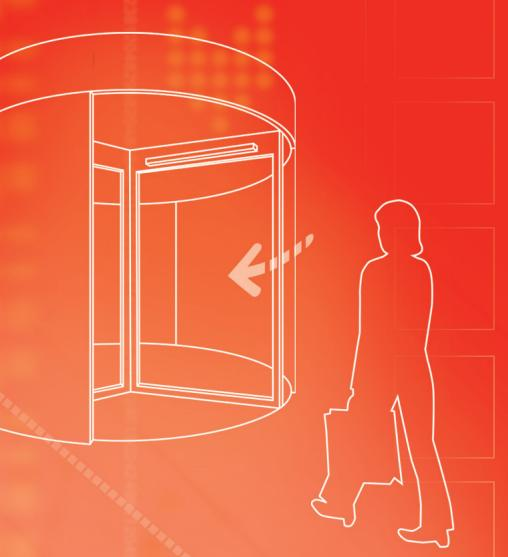

Tekniska data

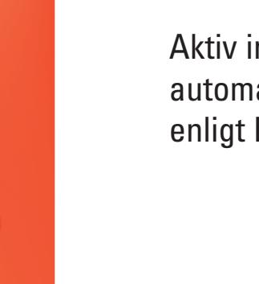

# **UniScan**

Aktiv infraröd närvarodetektor för automatiska slag- och karuselldörrar enligt EN 16005 och DIN 18650

### Praktisk, flexibel, smal

- **Helautomatiskt idrifttagande: snabbt och enkelt med ett knapptryck**
- **Automatisk inställning av monteringshöjd: sparar tid och underlättar monteringen**
- **Design i toppklass: den minsta sensorn i sin klass**

 **Individuellt inställbara AIR-punkter: för perfekt anpassning till omständigheterna på plats**

### **UniScan**

### Aktiv infraröd närvarodetektor för automatiska slag- och karuselldörrar enligt EN 16005 och DIN 18650

#### **Högsta säkerhet vid daglig användning**

Säker passering med UniScan, överallt där människor går in och ut. Tack vare sitt finmaskiga avkänningsfält erbjuder UniScan högsta möjliga skydd, även för småbarn och rörelsehindrade. Säker passering med UniScan, överallt där människor går in och ut. Tack vare sitt finmaskiga avkänningsfält erbjuder

#### **Monteras snabbt och enkelt**

UniScan har inte bara hög säkerhetsnivå, utan sparar även tid vid idrifttagandet. Ett knapptryck räcker – och UniScan är automatiskt inställd och programmerad. Tack vare sin smala form, fina design och små dimensioner är sensorn diskret och kan användas där det är ont om utrymme. UniScan har inte bara hög säkerhetsnivå, utan sparar även tid vid idrifttagandet. Ett knapptryck fina design och små dimensioner är sensorn diskret och kan användas där det är ont om utrymme.

### Fördelar

#### **Snabb montering och idrifttagande**

- Flera optikenheter kan enkelt kopplas samman med flatkabel

- Mekanisk vinkeljustering utan verktyg
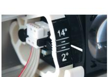

- Automatisk idrifttagande med ett knapptryck, indikering med lysdioder
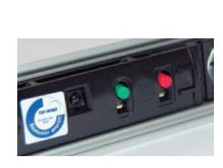

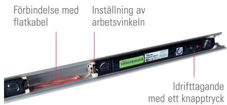

#### **Anpassad inställning**

- Typen av testsignal kan väljas för alla sorters dörrautomatiker
- Detektionshöjden över mark kan ställas in från 10 cm till 100 cm
- Inga interferenser tack vare synkroniserad optik
- Enskilda strålar kan stängas av individuellt, tex. för ett dörrhandtag och ändå uppfylls säkerhetskraven

#### **Kompakta mått**

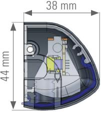

#### **Fältegenskaper för högre säkerhet**

- Finmaskigt fält (471 x 60 mm på 2.2 m höjd) med 8 strålar och mycket kort reaktionstid (< 50 ms)
- Drifthöjd upp till 3.0 m
- Strömsparläge (enligt DIN 18650) med 5 strålar aktiva

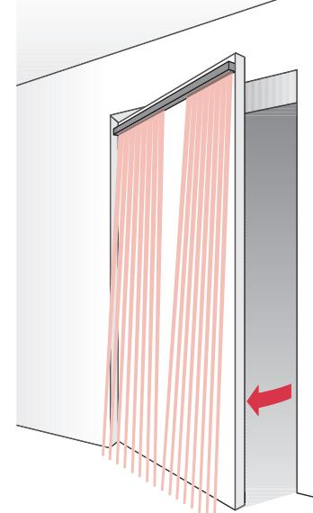

### Tillbehör

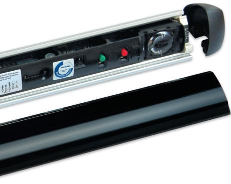

Enskilda komponenter till UniScan, som optikenheten US beam och olika profiler finns tillgängliga. Tillbehöret fjärrkontroll gör det möjligt att ställa in redan monterade sensorer med frontkåpan på. Y-Adaptern är en enkel lösning med bara en kabel för två sensorer på båda sidor av dörren. En smidig anslutning till väggen åstadkoms med någon av de båda karmöverföringarna DLP 6 Box och Door Loop.

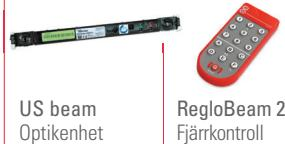

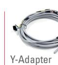

av UniScan på två dörrsidor

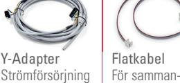

koppling av US beam-enheter

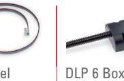

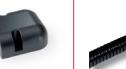

Karmöverföring med väggbox

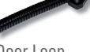

Door Loop Karmöverföring med väggfäste

### UniScan dörrsats

**Säkerhet i ett paket**

UniScan finns även i användarvänlig dörrsats.

#### **Enkel hantering, komplett och översiktligt**

Alla komponenter levereras i ett paket: ordnade på ett strukturerat sätt. Där finns allt som behövs för att säkra en dörr.

#### **Snabb montering och idriftsättning, inga verktyg behövs**

Y-Adaptern trycks in i profilen och förbinder båda dörrsidorna med den praktiska instickslösningen enligt Plug'n'Play-principen. Profilens ändstycken monteras utan verktyg.

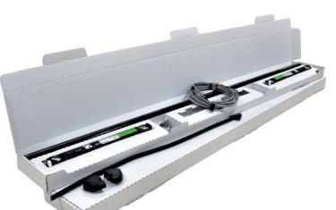

### Säker vid varje användning

#### **Situation**

Passering genom slagdörr

#### **Lösning**

- Dörrens fram- och bakkant övervakas på båda sidor av dörren för att säkra hela slagdörren och förhindra kollisioner
- Dörrörelserna blir smidiga vid kort reaktionstid

#### **Fördelar**

- UniScan säkrar alla kanter perfekt
- En passande enhet för varje dörr: Längd och antal sensorer kan väljas

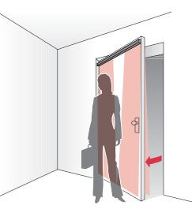

#### **Situation**

Passering genom karuselldörr

#### **Lösning**

- Ett mobilt påkörningsskydd på karuselldörrar gör driften friktionsfri och minimerar risken för olyckor
#### **Fördelar**

- Personer och föremål upptäcks snabbt och utan beröring
- Skydd mot kollisioner och kroppsskador från dörrvingarna

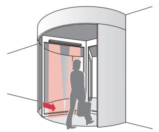

# Orderuppgifter

| Artikel-nr                 | Benämning                                                                                                                        | Antal optikenheter / Mått  |  |
|----------------------------|----------------------------------------------------------------------------------------------------------------------------------|-------------------------------|--|
| 260012 259970 260013 | UniScan I, 350 mm, silver UniScan I, 350 mm, svart UniScan I, 350 mm, vit                                                  | 1 1 1                   |  |
| 256274 256317 256296 | UniScan II, 750 mm, silver UniScan II, 750 mm, svart UniScan II, 750 mm, vit                                               | 2 2 2                   |  |
| 256299 256340 256341 | UniScan II, 900 mm, silver UniScan II, 900 mm, svart UniScan II, 900 mm, vit                                               | 2 2 2                   |  |
| 256859 256596 256881 | UniScan II, 1100 mm, silver UniScan II, 1100 mm, svart UniScan II, 1100 mm, vit                                            | 2 2 2                   |  |
| 257182 257184 257189 | UniScan III, 1600 mm, silver UniScan III, 1600 mm, svart UniScan III, 1600 mm, vit                                         | 3 3 3                   |  |
| 290768 296971 296972 | Dörrpaket: 2 UniScan II, 1100 mm, silver Dörrpaket: 2 UniScan II, 1100 mm, svart Dörrpaket: 2 UniScan II, 1100 mm, vit     | 2 x 2 2 x 2 2 x 2       |  |
| 291030 296973 296974 | Dörrpaket: 2 UniScan II, 1200 mm, silver Dörrpaket: 2 UniScan II, 1200 mm, svart Dörrpaket: 2 UniScan II, 1200 mm, vit     | 2 x 2 2 x 2 2 x 2       |  |
| 256297                     | US beam Optikenhet inkl. hållare                                                                                              | 1                             |  |
| 288879                     | Y-Adapter Kabelförgrening                                                                                                     |                               |  |
| 212354                     | DLP 6 Box, karmöverföring Box och övergångsslang, längd max. 600 mm, innerdiameter max. 6 mm, av plast, svart        |                               |  |
| 220535                     | Door Loop, karmöverföring Väggfäste och övergångsslang, längd max. 600 mm, innerdiameter max. 6 mm, av plast, svart  |                               |  |
| 212356                     | Door Loop, karmöverföring Väggfäste och övergångsslang, längd max. 600 mm, innerdiameter max. 6 mm, av metall, svart |                               |  |
| 291082                     | Kabelsats UniScan Innehåller Y-Adapter 288879 och karmöverföringsats 220535                                                |                               |  |
| 213096 213097           | Flatkabel 500 Flatkabel 800                                                                                                   | 500 mm 800 mm              |  |
| 225452                     | Scan frontkåpa                                                                                                                   | 3350 mm                       |  |
| 219910 247969 247966 | Scan aluminiumprofil silver Scan aluminiumprofil svart Scan aluminiumprofil vit                                            | 3350 mm 3350 mm 3350 mm |  |
| 297705                     | Scan Cap-sats svart Ändstyckesats, svart                                                                                      |                               |  |
| 297706                     | Scan Cap-sats vit Ändstyckesats, vit                                                                                          |                               |  |
| 218810                     | Hållare Beam Universal Fäste för optikenheten                                                                                 |                               |  |
| 243025                     | RPT regnskydd Rulle med 17 m                                                                                                  |                               |  |
| 292393                     | RegloBeam 2 Tvåvägs fjärrkontroll                                                                                             |                               |  |

## Ytterligare produkter

| Öppningsimpulsgivare Merkur 2 radar med elektroniskt inställbart fält           |  |
|------------------------------------------------------------------------------------|--|
| Punktbevakning av närvaro SpotScan aktiv IR med detekteringsområde upp till 3 m |  |

# Tekniska data

| Mekaniska data                       |                                                          |
|--------------------------------------|----------------------------------------------------------|
| Kapslingens material                 | Aluminium                                                |
| Frontkåpa                            | Plexiglas PMMA (svart)                                   |
| Vikt (US beam)                       | 90 g                                                     |
| Mått (US beam)                       | 300 x 31 x 20 mm                                         |
| Vikt                                 | 910 g                                                    |
| (UniScan II, 1100 mm)                |                                                          |
| Anslutningstyp                       | Skruvklämma                                              |
|                                      |                                                          |
| Tekniska data                        |                                                          |
| Teknik                               | Aktiv infraröd (trianguleringsprincip)                   |
| Strålar                              | 8 per US beam                                            |
| Strömsparläget                       | 5 strålar per US beam aktiverade (fabriksinställning) |
| Monteringshöjd                       | 1.7 – 3.0 m                                              |
| Fältstorlek (vid 2.2 m)              | 471 x 60 mm                                              |
| Driftssätt                           | Mobil                                                    |
| Eftersläpningstid vid detektering | < 50 ms                                                  |
| Prestandanivå / utförande            | PLd / kategori 2 (EN ISO 13849-1)                        |
| Max. antal optikenheter              | 4 (endast med                                            |
| anslutna i följd i sensorn           | DC försörjningsspänning)                                 |
| Elektriska data                      |                                                          |
| Försörjningsspänning                 | 15–37 V DC ± 0%                                          |
|                                      | 15–26 V AC ± 0%, 50/60 Hz                                |
|                                      | AC endast för enskild optikenhet                         |
| Inkopplingsström                     | Max. 500 mA                                              |
| Strömförbrukning                     | Max. 3.3 W (138 mA vid 24 V per optikenhet)           |
| Testingång                           | High/Low active, Pull up/Pull down                       |
| Eftersläpningst.vid testning         | < 30 ms (typisk 3 ms)                                    |
| High level                           | Min. 5 V DC – max. 24 V DC / I = < 6.5 mA             |
| Utgång                               | Relä 40 V DC, 40 V AC, 1 A                               |
| Relähålltid                          | 0–10 s (inställbar)                                      |
| Omgivningsvillkor                    |                                                          |
| Skyddsklass                          | IP54 (EN 60529)                                          |
| Driftstemperatur                     | –20 °C till +60 °C                                       |
| Luftfuktighet                        | Max. 95% relativ, icke-kondenserande                     |
|                                      |                                                          |
| Normer                               |                                                          |
| Immission                            | EN 61000-6-1 EN 61000-6-2                             |
| Emission                             | EN 61000-6-3                                             |
|                                      | EN 61000-6-4                                             |
| EG-typtestad enligt                  | EN 16005                                                 |
|                                      | DIN 18650-1 EN 12978                                  |
|                                      | EN ISO 13849-1                                           |
|                                      | EN 61508                                                 |
|                                      |                                                          |

#### **Observera**

Tekniska uppgifter och rekommendationer för våra produkter är empiriska värden och är avsedda att ge användaren orientering. Uppgifter i broschyrer och datablad garanterar inga speciella produktegenskaper. Speciella produktegenskaper som vi skriftligt eller individuellt i undantagsfall medger, finns inte med. Vi förbehåller oss rätten till ändringar på grund av teknisk vidareutveckling.

#### **BBC Bircher Smart Access**

Wiesengasse 20 8222 Beringen Schweiz Tfn +41 52 687 11 11 info@bircher.com www.bircher.com