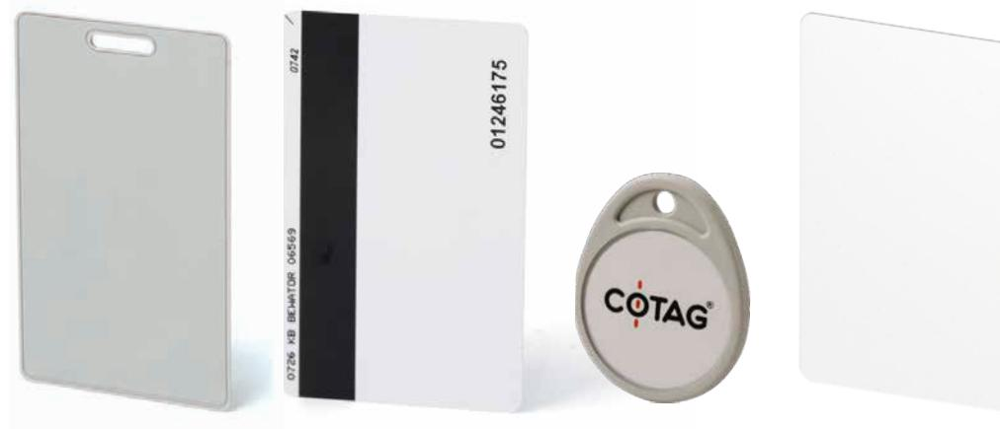
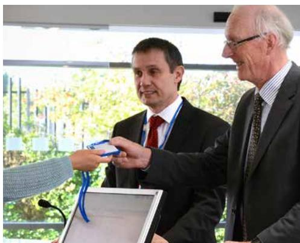
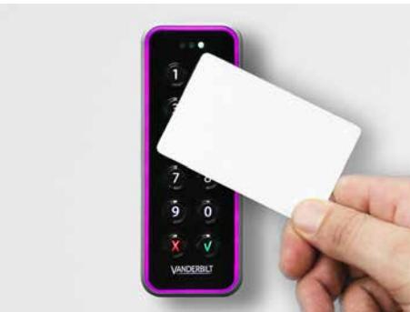
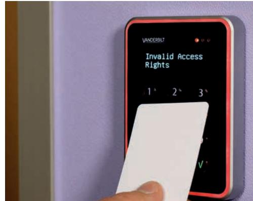

# **Cotag KOMBI-brickor**

Passiv COTAG & MIFARE DESFire EV2

#### **Introduktion:**

Vanderbilts Cotag Combi-brickor erbjuder den bästa övergången för kunder som uppgraderar till smartkortsteknik utan att man behöver byta ut den befintliga installationen av Cotag-läsare. Dessa hybridbrickor använder både passiv Cotag-passerteknik och MIFARE DESFire EV2-teknik.

Cotag-läsare kan läsa både aktiva (lång räckvidd) och passiva (nära) Cotag-kort och taggar och båda kort- och tagg-typerna kan användas i samma system för ultimat bekvämlighet och kostnadseffektivitet. Denna fördel kan nu utökas till Vanderbilts nya och spännande utbud av smartkortläsare på 13,56 MHz. Smarta kort erbjuder en hög nivå av säkerhet och är samtidigt multifunktionella, vilket är en stor fördel. De fungerar som passerkort för närhetsläsare, men eftersom de kan lagra mycket mer information kan de t.ex. också användas som kontantkort på företagets restauranger eller i försäljningsautomater.

Jämfört med tidigare versioner, kan MIFARE DESFire EV2-chip innehålla så många olika applikationer som minnesstorleken stödjer och erbjuder en betydande ökning av rörelse avstånd och hastighet. Installatörerna få möjlighet att erbjuda Cotag-användarna merförsäljning i form av modern, säker kortteknik med ännu fler funktioner och skydd när den används med Vanderbilts kortläsare av typen VR-serie.

# **Cotag KOMBI-brickor**

Passiv COTAG & MIFARE DESFire EV2

### **Huvudfunktionerna omfattar:**

- Brickor för multi-teknik som kombinerar passiv COTAG och 13,56 MHz smart kortteknik för en framtida bevisinvestering.
- MIFARE DESFire EV2-chip erbjuder tillförlitlig höghastighetskommunikation med höga dataintegritet.
- Beprövad, tillförlitlig teknik erbjuder extremt konsekvent avläsningsområde. Opåverkad av kropps avskärmning eller varierande miljöförhållanden.
- Hållbar Stark, flexibel och motståndskraftig mot sprickbildning och brott.

# **Cotag KOMBI-brickor**

Passiv COTAG & MIFARE DESFire EV2

## **Teknisk data/specifikation:**

| Teknologi                                                              | COTAG & MIFARE DESFire EV2                                                                                                                             |
|------------------------------------------------------------------------|--------------------------------------------------------------------------------------------------------------------------------------------------------|
| Operativsystemsfrekvens: • MIFARE DESFire EV2                    | 13,56 MHz                                                                                                                                              |
| Drift                                                                  | Passiv (inget batteri)                                                                                                                                 |
| Avläsningsområde:                                                      | • Mellan 2 cm - 3 cm med Cotag prox-läsare • Ungefär 25 cm med Cotag handsfree-läsare • Mellan 1 cm och 5 cm, beroende på MIFARE läsare |
| Material: • 0968-0-C • 0958-102-C •IB958M-C •IB981-C | ABS PVC PVC ABS, poly-karbonat                                                                                                                |
| Märkning                                                               | Kortnumret är angivet på brickans baksida                                                                                                              |
| Driftstemperatur                                                       | -40° till 70°C                                                                                                                                         |
| Luftfuktighet                                                          | 5-95 % ingen kondens                                                                                                                                   |
| Mått: • 0968-0-C • 0958-102-C •IB958M-C •IB981-C     | 54mm x 85,6mm x 3mm 54mm x 86,0mm x 0,76mm 54mm x 86,0mm x 0,76mm 40mm x 49,0mm x 4,5mm                                                       |
| Garanti                                                                | 3 år                                                                                                                                                   |

### **Beställningsdata:**

| Typ        | Art. nr.         | Beteckning                                                                   | Vikt*   |
|------------|------------------|------------------------------------------------------------------------------|---------|
| 0968-0-C   | V54515-Z130-A100 | 0968-0-C Passiv Cotag Combi Clamshell-kort oprogrammerade - 10st             | 0,09kg  |
| 0958-102-C | V54515-Z131-A100 | 0958-102-C Passive Cotag Combi ISO-kort oprogrammerade – 10st                | 0,058kg |
| IB958M-C   | V54515-Z132-A100 | IB958M-C Passive Cotag Combi ISO-kort med magnetremsa programmerad – 10st | 0,058kg |
| IB981-C    | V54515-Z133-A100 | IB981-C Passive Cotag Combi nyckelringsbricka programmerade – 10st           | 0,080kg |

**Upplaga: 01.04.2019**

*Produktens total vikt inklusive vikten av dess tillbehör och förpackningar.

### **vanderbiltindustries.com**

@VanderbiltInd Vanderbilt Industries

#### **Vanderbilt International Ltd.**

Clonshaugh Business and Technology Park Clonshaugh, Dublin D17 KV 84, Irland

+353 1 437 2560