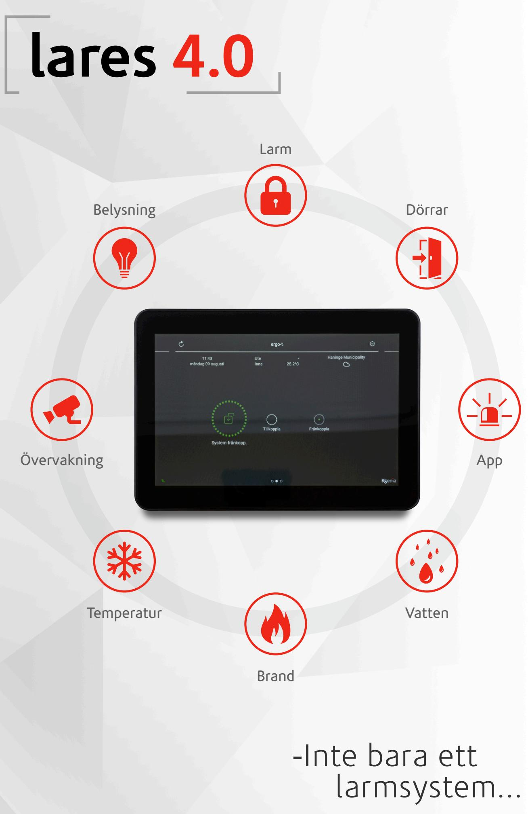

# Upplev möjligheterna med lares 4.0

Larmsystem lares 4.0 är ett säkerhetssystem som passar för villan, företaget och industrin som erbjuder mer än bara säkerhet. Med appen lares 4.0 kan användaren styra och se vad som händer i anläggningen.

Alltifrån att se om anläggningen är till- eller frånkopplad, fjärrstyra en grind till att se bilder ifrån övervakningskameror. Centralapparaten lares 4.0 är moduluppbyggt, vilket innebär att det är enkelt att bygga ut systemet för nya behov.

| Inbrott    | IP-kameror                         |
|------------|------------------------------------|
|            |                                    |
| Drift      | Fastighetsautomation               |
|            |                                    |
| Brand      | Integration med KNX, C4, Crestron, |
|            |                                    |
| Dörrar  | Google Home, Alexa, RTI, Plejd mm. |
|            |                                    |

Med 1000 användare, 30 områden, 644 in- och utgångar är framtiden säkrad.

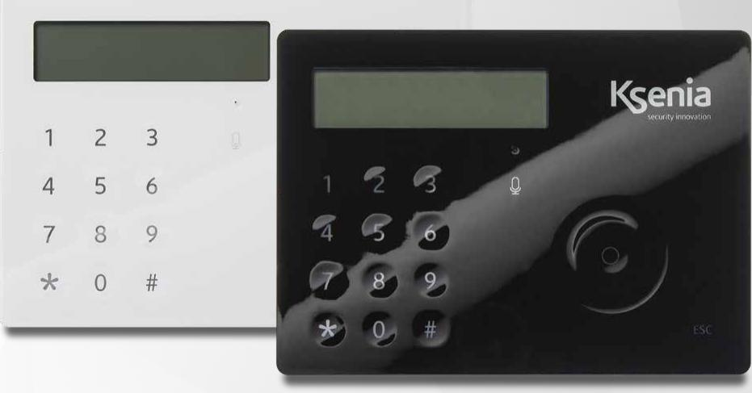

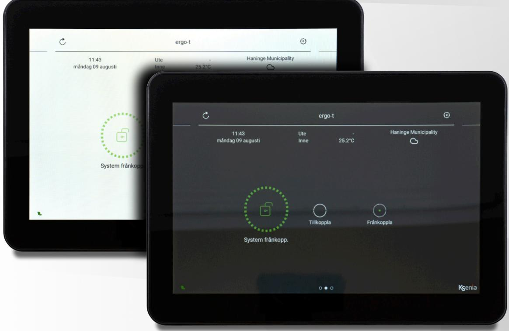

# Integrera mer med lares 4.0

Lares 4.0 kan styra belysning, värme, kyla, ventilation, dörrar och andra system i fastigheten direkt via utgångar i systemet eller via andra system som KNX, plejd, Control 4, Crestron, RTI, Milestone Google Home och Alexa.

IP kameror oavsett fabrikat kan integreras i larmsystem lares 4.0.

Om man väljer en touchpanel ergo-T som manöverpanel kan du få livebilder från kameror att visas direkt i skärmen.

Framtiden är här redan idag.

Det går även att använda kameror som en detektor. Kameror med AI kan känna igen människor och på så sätt ersätta en detektor.

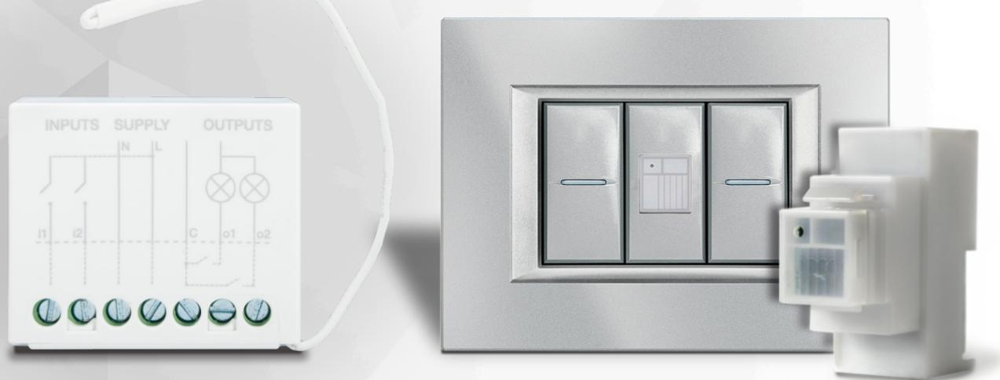

auxi wls för 230 VAC styrning Multisensor domus

Safire kameraövervakning

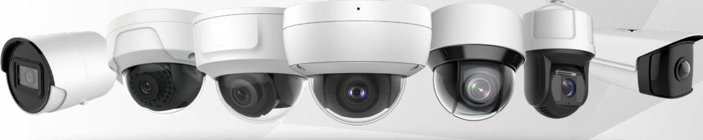

Ergo-T pro

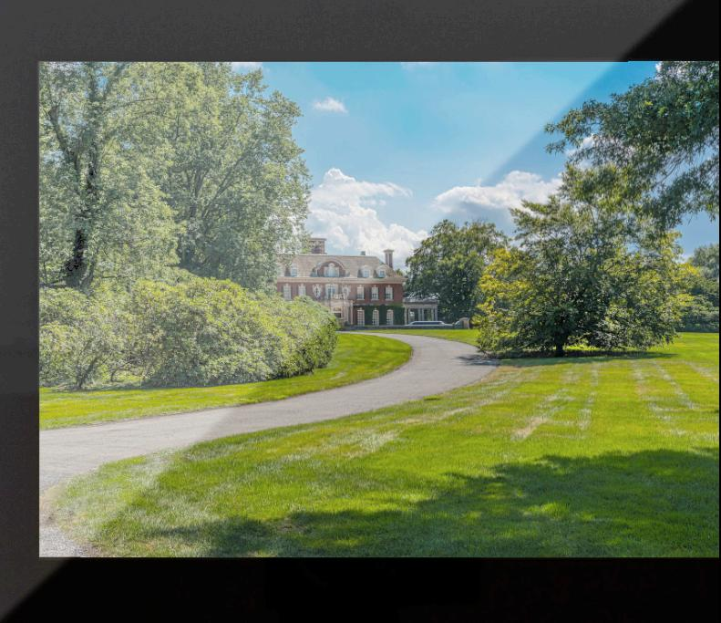

## Mobilapp

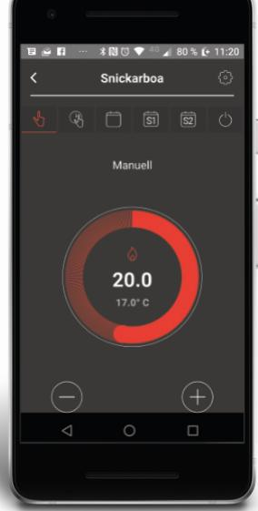

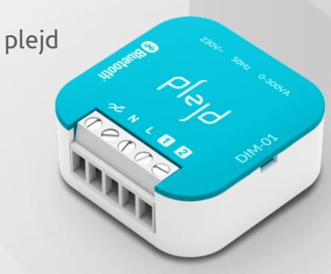

# Enkelt handhavande som förenklar din vardag

Larmsystem lares 4.0 har anpassat tekniken efter människan.

Systemet kan enkelt styras med app, manöverpanel, fjärrkontroll, bricka, kalender eller om ingen aktivitet har detekterats under en längre tid.

Med ergo-X som är avsedd för utomhusbruk, kan man styra både larmsystemet och lås.

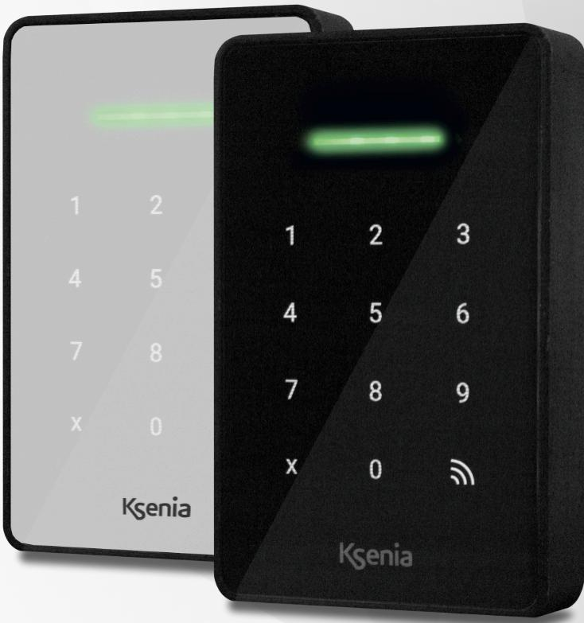

Ergo X

### Mobilapp

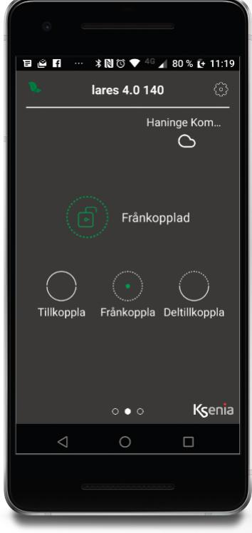

# Minitag i nyckelring Fjärrkontroll opera

# Detektorer med design som passar in

Snygga produkter som har en tilltalande design och som passar in i miljön är mycket viktigt.

Rök och rörelsedetektorer finns i både trådbundna och trådlösa utföranden.

Magnetkontakterna som är trådlösa finns i flera modeller och färger.

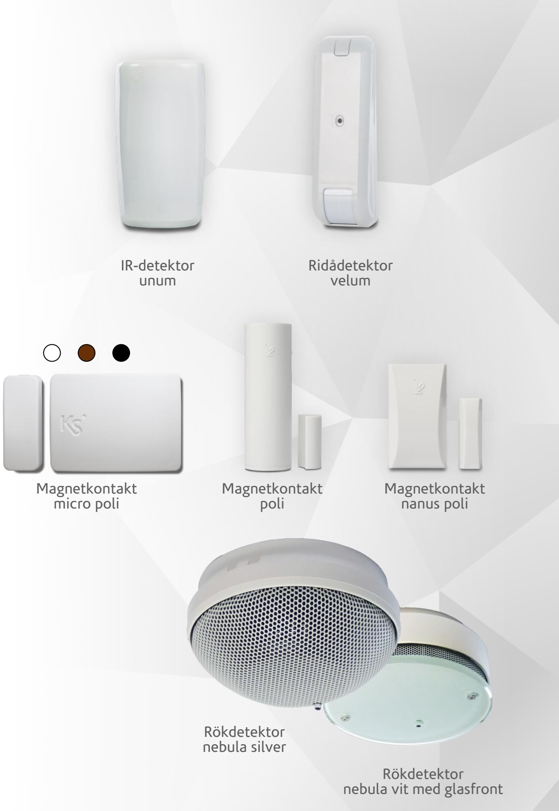

# Snygga larmdon som hörs och syns

Det är mycket viktigt att välja larmdon både inomhus och utomhus.

En inomhussiren ska skrämma iväg en objuden gäst och en utomhussiren ska påkalla uppmärksamhet att ett larm har utlöst. Det finns även utomhussirener som förutom sirenljud även kan spela upp talmeddelanden.

En unik funktion med sirenerna till systemet är nödljusbelysning vid strömbortfall och temperaturgivare för övervakning.

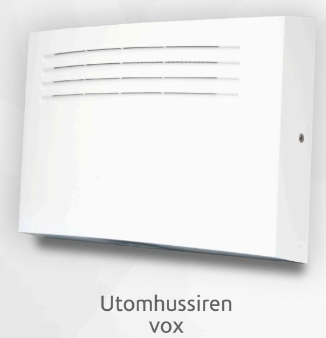

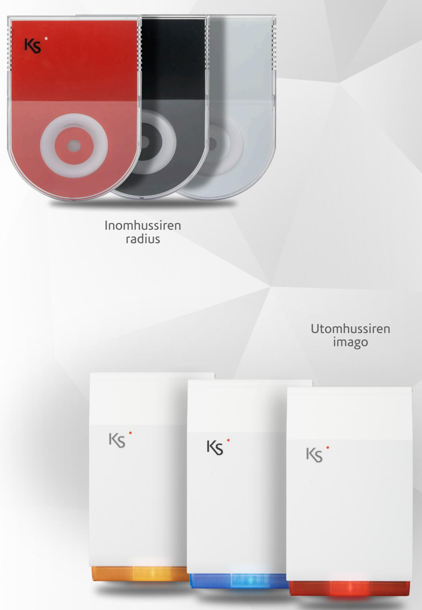

Återförsäljare: E-post: Telefon: Extronic Elektronik info@extronic.se 08-609 29 00

2022-03-25