# **Centralapparat lares 4.0**

**Snabbmanual**

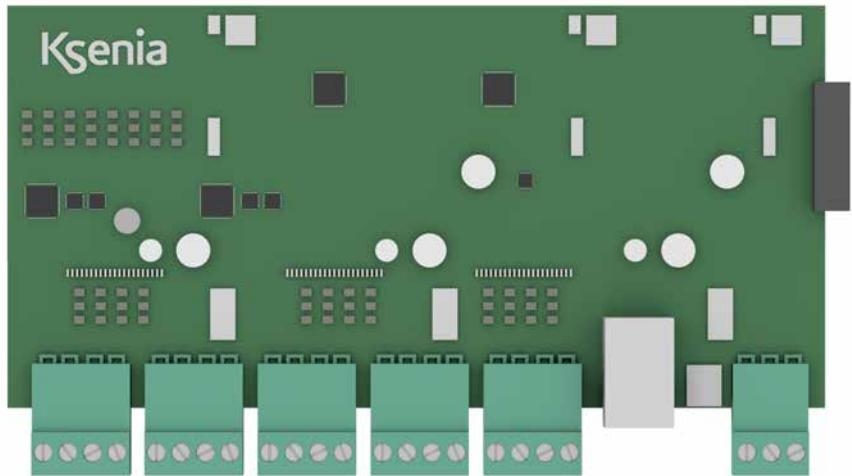

**Revision 2021-08-17**

## **INLEDNING:**

## **Snabbmanual för larmsystem lares 4.0.**

Larmsystem lares 4.0 finns i 5 versioner:

- lares 4.0 16: 10 trådbundna sektioner, expanderbara till 16.
- lares 4.0 40: 10 trådbundna sektioner, expanderbara till 40.
- lares 4.0 40 wls: 10 trådbundna sektioner, expanderbara till 40 (trådbundna och radioöverförda sektioner).
- lares 4.0 140 wls: 10 trådbundna sektioner, expanderbara till 140 (trådbundna och radioöverförda sektioner).
- lares 4.0 640 wls: 640 trådbundna sektioner (trådbundna och radioöverförda sektioner)

#### **Koder**

Följande koder är upplagda vid start: Installatörskod: 123456 Användarkod: 000001

#### **UPPSTART OCH LÄGG TILL EN CENTRALAPPARAT MOLNTPORTALEN KSENIA SECURE WEB**

- 1. Skapa **omgående** ett konto för Ksenia´s molntjänst, registera dig här https://www.kseniasecurity.com/en/registration/. När du har fått ett mail att kontot är godkänt gå vidare till punkt 2. (är det bråttom kan man koppla upp sig direkt till centralapparaten utan molntjänsten genom att använda en webbläsare och ange den lokala IP adressen som centralapparaten fått av routern. T ex https://xxx.xxx.xxx:443). Du ser den lokala IP-adressen i manöverpanelen.
- 2. Anslut nätverkskabel, spänning och batteri.
- 3. För att lägga till centralapparaten på ditt konto på KseniaSecureweb Använd appen **Ksenia Pro SecureWeb** och lägg till centralapparaten på ditt konto genom att skanna in QR taggen med appen.
- 4. Programmera centralapparaten med hjälp av appen eller ännu bättre med en dator och en webbläsare www.kseniasecureweb. com.
- 5. Logga in på centralapparat med installatörskoden 123456.
- 6. Inom någon minut kommer det att dyka upp uppdateringar, klicka på den orange ikonen för uppdatera centralapparaten.

## **Manualer och FAQ/kunskapsdatabas**

Manualer - Finns i vår E-handel, klicka på Produkter och Larmsystem Ksenia.

FAQ/kunskapsdatabas - Det finns en FAQ/Kunskapsdatabas, Finns i vår E-handel, klicka på Produkter och Larmsystem Ksenia.

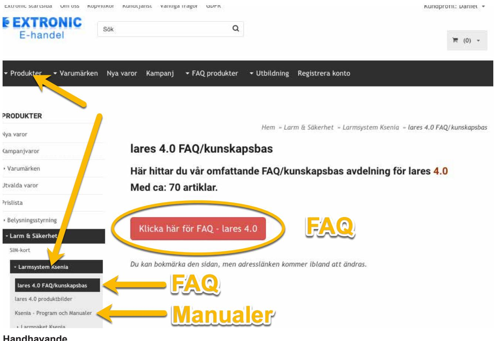

- **Handhavande**
Se sid 12 och även på ksenia.se.

## **Kretskort lares 4.0**

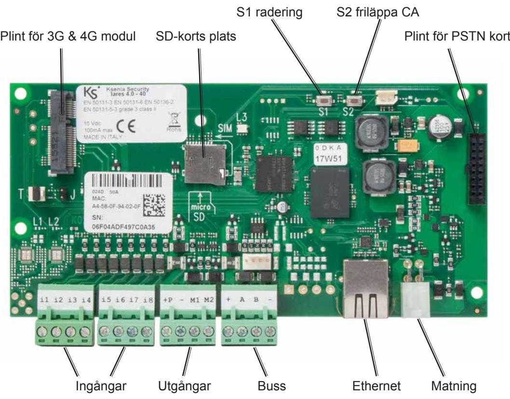

## **Ingångar**

**lares 4** har 8 trådbundna ingångar och 2 trådbunda utgångar som kan fritt programmeras som följande:

- NO (Slutande
- NC (Brytande ingång)
- NO (Slutande ingång)
- Enkelbalanserad (10 Kohm)
- Dubbelbalanserad (4,7K & 4,7K)
- Dubbelbalanserad (10K & 10K
- Valfria motståndsvärden

## **Brytande ingång (NC)**

Larm detekteras när kontakten bryts.

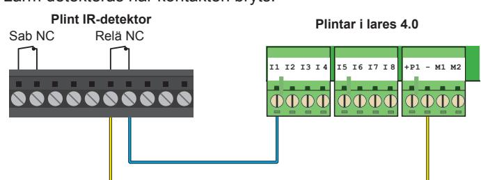

**Kretskort lares 4.0**

**Kretskort lares 4.0**

## **Slutande ingång NO**

Larm detekteras när kontakten sluts.

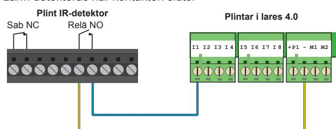

## **Dubbelbalansering 4,7K + 4,7K**

Om motstånd 4,7 Kohm används välj balanseringstyp "Dubbelbalansering 4,7K + 4,7K". Larm kommer att detekteras när relä i detektor bryts och sabotagelarm vid kortslutning och avbrott. **Kretskort lares 4.0**

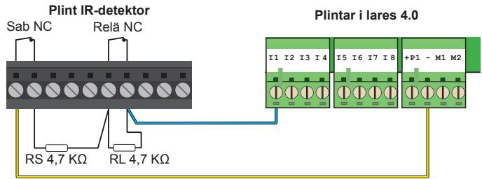

# **Utgångar**

**lares 4,0** har två trådbundna utgångar på kretskortet och klarar max. 500 mA per utgång. Utgångarna kan programmeras individuellt enligt önskemål som: slutande (NO), brytande (NC), (bistabil eller monostabil).

#### **Exempel på inkoppling av siren SIBOX/SX**

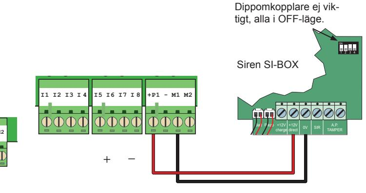

#### **PoE kort ansluten direkt till moderkort lares 4.0**

Eftersom PoE kortet kan dra 1A så måste den strömförsörjas via detektormatning +P eller via bussmatning. ANVÄND INTE säkringskortet SK-8 för detta ändamål eftersom SK-8 bara belastas med 500mA per utgång:

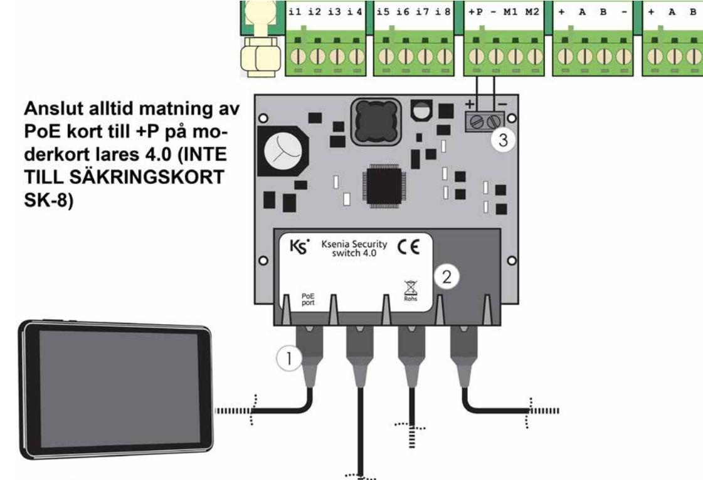

#### **Rökdetektor nebula obalanserad slutande NO**

För att återställa lysdiod i rökdetektor Nebula krävs att plusspänningen bryts, det fungerar inte bra med minus. När centralapparat lares 4.0 används behövs ett reläkort, t ex 20426. Anslut enligt följande: **+P1 lares 4.0 (12V)**

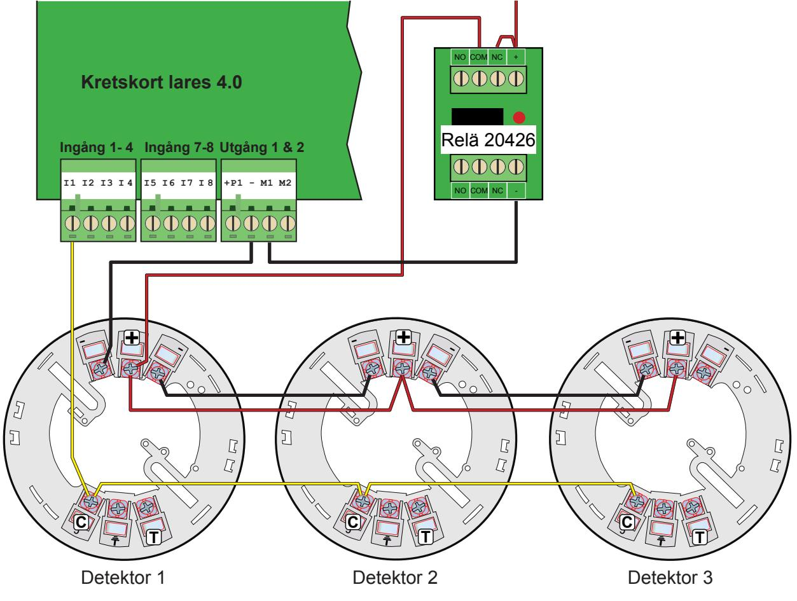

**För programmering se sid 15.**

## **UPPSTART OCH KOPPLA UPP SYSTEMET TILL MOLNTJÄNSTEN**

- 1. Anslut närverkskabel, spänning och batteri.
- 2. För att lägga till centralapparaten på ditt konto på KseniaSecureweb Använd appen **Ksenia Pro SecureWeb** och skanna in QR taggen.
- 3. Fortsätt nu att programmera med en webläsare och webportalen **www.kseniasecureweb.com**.
- 4. Logga in på centralapparat med installatörskoden 123456.
- 5. Klicka på den oranga ikonen för uppdatera centralapparaten.

|  | Om uppdatering finns visas en symbol, klicka på symbolen för att uppdatera. Stäng webbläsaren och logga in i igen. |  |
|--|-----------------------------------------------------------------------------------------------------------------------------|--|

- 6. Det tar 1-2 minuter innan uppdatering är installerad. Logga ut och logga sedan in igen.

7. Logga in igen med 123456. Kontrollera att Firmware och Webserver är uppdaterad samt spänning är korrekt:

|  |                                | Status för nätspänning                 |
|--|--------------------------------|----------------------------------------|
|  | Status för Ethernet och GSM | Nätspänning = 15.0V Batteri = 13.8V |
|  |                                |                                        |
|  |                                |                                        |
|  |                                |                                        |
|  |                                |                                        |
|  |                                |                                        |
|  |                                |                                        |
|  |                                |                                        |
|  |                                |                                        |
|  |                                |                                        |
|  |                                |                                        |

- 8. Kontrollera att spänningen är 15.0V, om inte justera spänningen med hjälp av potetnionemetern på transformatorn så att spänning är exakt 15.0V.
## **Programmering**

Börja med att lägga till (lära in) alla busstillbehör som är anslutna på bussen. Klicka på Busstillbehör - Expansionskort:

Klicka först på **Pennan** för att öppna redigeringsläget:

| Avancerat läge                                        |              | enia                                                            |                                                               | 51            |
|-------------------------------------------------------|--------------|-----------------------------------------------------------------|---------------------------------------------------------------|---------------|
| Hem Områden Hashtags Rum/Ritningar           | 合 17 # | Expansionskort 2 0 auxi (005467) 0 auxi (003037) | 4 Inget objekt vald. Vänligen välj ett objekt från li C | ক P an. |
| Busstillbehör Expansionskort Databuss repeaters | B            |                                                                 | Klicka på pennan för att gå in i redigeringsläge           |               |

Nu visas alla funna tillbehör som är inkopplade. Klicka på blåa steckkodssymboler för att lägga till dessa:

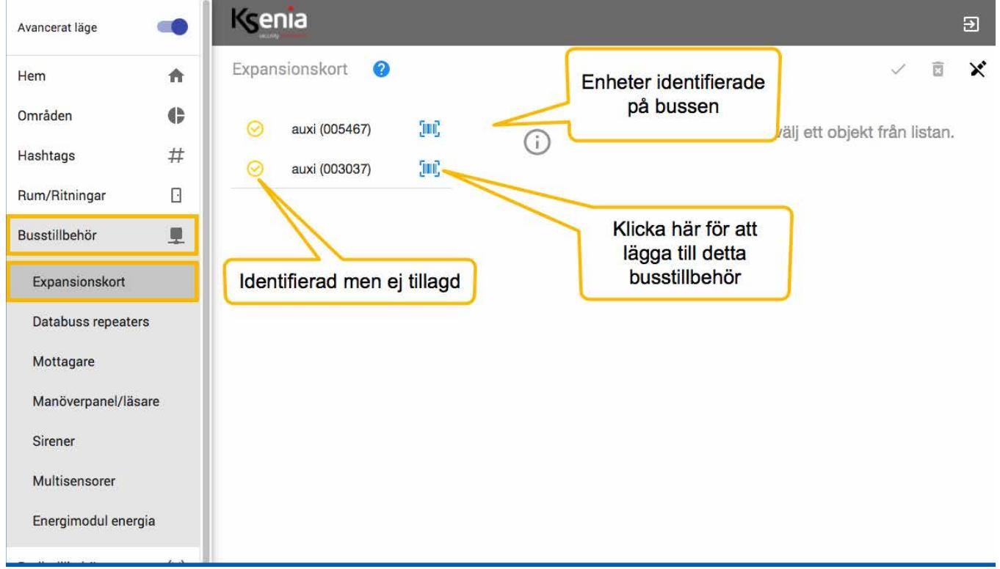

Passa även på att uppdatera tillbehör om uppdaterings finns genom att klicka på Uppdatera knappen på respektive tillbehör. Fortsätt med alla tillbehör som finns anslutna som manöverpaneler, sirener etc.Tryck på **Spara knappen** när du är klar samt **Utför session knappen** för att utföra denna förändring i centralapparaten, det tar bara ett par sekunder.

## **Områden**

För att programmera områden, klicka på **Områden**. Som grundinställt finns det 2 områden. Klicka på ikonen Pennan längst upp till höger för att kunna börja programmera och ändra.

| Avancerat läge |                                                                                                                                                                                | enia              |                   |                   |             |                                              |                      |
|----------------|--------------------------------------------------------------------------------------------------------------------------------------------------------------------------------|-------------------|-------------------|-------------------|-------------|----------------------------------------------|----------------------|
| Hem            | 合                                                                                                                                                                              | Områden           |                   |                   |             |                                              | ਿ 4               |
| Områden        | 수                                                                                                                                                                              | Beskrivning       | Utpassering (sek) | Inpassering (sel  |             |                                              |                      |
| Hashtags       | #                                                                                                                                                                              | Skalskyddsdetekto | 30                | 30                |             | Klicka här för att kunna redigera parametrar |                      |
| Rum/Ritningar  |                                                                                                                                                                                | Beskrivning       | Utpassering (sek) | Inpassering (sek) | Cykel (min) | Rondering (min)                              | Omr, ej tillk, (tim) |
| Busstillbehör  | 0                                                                                                                                                                              | Volymdetektorer   | 30                | 30                | ന്          | 30                                           | 0                    |
| Radiotillbehör | (1)                                                                                                                                                                            |                   |                   |                   |             |                                              |                      |
| IP enheter     | ============================================================================================================================================================================== |                   |                   |                   |             |                                              |                      |
| Anläggning     | 슬                                                                                                                                                                              |                   |                   |                   |             |                                              |                      |
|                | 1                                                                                                                                                                              |                   |                   |                   |             |                                              |                      |

Om du vill ändra områden, ta bort eller lägga till gör det med kryss och plustecken:

| Avancerat läge   |     | senia                          |                         |                         |                  |                                       |                           | 2       |
|------------------|-----|--------------------------------|-------------------------|-------------------------|------------------|---------------------------------------|---------------------------|---------|
| Hem              | 合   | Områden                        |                         |                         |                  |                                       | 0 ក                    | 22 X |
| Områden          | e   | Beskrivning                    | Utpassering (sek)       | Inpassering (sek)       | Cykel (min)      | Rondering (min)                       | Omr. ej tillk. (tim)      |         |
| Hashtags         | #   | Skalskyddsdetektor             | 30                      | 30                      | 3                | 30                                    | 0                         | ×       |
| Rum/Ritningar    |     |                                |                         |                         |                  |                                       |                           |         |
| Busstillbehör    | G   | Beskrivning Volymdetektorer | Utpassering (sek) 30 | Inpassering (sek) 30 | Cykel (min) 3 | Rondering (min) 30                 | Omr. ej tillk. (tim) 0 | ×       |
| Radiotillbehör   | (1) |                                |                         |                         |                  | Klicka här för att ta bort områden    |                           |         |
| IP enheter       | i   |                                |                         |                         |                  |                                       |                           |         |
| Anläggning       | 新   |                                |                         |                         |                  |                                       |                           |         |
| Scheduler Timers | C   |                                |                         |                         |                  | Klicka här för att lägga till områden | +                         |         |
| Termostater      | C   |                                |                         |                         |                  |                                       |                           |         |

## **Sektioner**

För att programmera sektioner, klicka på **Anläggning** och **Sektioner**:

## **Klicka på plustecknet i högra hörnet för att lägga till sektioner:**

- Välj sektionsnamn
- Välj område
- Välj vart detektorn är ansluten
- Välj om sektionen ska vara fördröjd, Magnetkontakt på Entredörr = Nivå 1, första fördöjda IR: Nivå 2, andra fördröjda IR: Nivå 3.
- För dubbelbalanserad välj dubbelbalanserad 4,7K + 4,7K (bilden med 10K är lite missvisande men det blir rätt ändå).

| Avancerat läge       | OTC.   | Senia                        |                                              | ವಿ                                                     |
|----------------------|--------|------------------------------|----------------------------------------------|--------------------------------------------------------|
| Hem                  | 合      | હ Sektioner               |                                              | న్నా ાજિ                                            |
| Områden              | 6      | V, Sök                    | Baskmesitig Ange sektionsnamn MK entré | 0 lares                                             |
| Hashtags             | #      |                              |                                              |                                                        |
| Rum/Ritningar        | E      | MK entré                     | Hasniegs Hashtags y                    | ಲಿ lares                                            |
| Busstillbehör        | 里      |                              | Grossderi Välj område                     | D 11                                                |
| Radiotillbehör       | (૯-))  |                              | Skalskyddsdetektorer × N                  |                                                        |
| IP enheter           | -0     |                              | BUIT Rum ﺮﺓ                            | Välj vart den är ansluten                              |
| Anläggning           | ત્વે ન |                              |                                              | Ingångstyp                                             |
| Tillkopplingslägen   |        |                              | IP kamera                                    | Ingangatyp Standard                                 |
| Utgångar             |        |                              | P Samera                                     |                                                        |
| Räknare              |        |                              | Ej vald >                                 | Välj balansering Balangering Normalt stängd (NC) |
| Special balan.       |        |                              | Kameratrigger                                |                                                        |
| Sektioner            |        |                              |                                              | Antal pulse 1                                       |
| Användare            |        |                              | Notifikation till mottagare                  | Pullango                                               |
| Contact ID mottagare |        |                              |                                              | 400                                                    |
| SIA DC-09 IP mottag. |        | Välj detektortyp             | Deteillarlyn Magnetkontakt                | ((find of the Mark Dour)                               |
| Logiska funktioner   |        |                              |                                              | 0                                                      |
| Scenarier            |        |                              | Faithkoppling Förbikopplingsbar           |                                                        |
| Händelser            |        | Välj utpasseringsfördröjd    |                                              | Klicka här för att lägga till en sektion               |
| Kontaktlista         |        |                              | Lippisseringskigh Fördröjd                |                                                        |
| Notifikationer       |        | Välj inpasseringsfördröjning | Hive Inpasseringsfördröjning 1         |                                                        |
| Scheduler Timers     | 8      |                              |                                              | +                                                      |
| Termostater          | 0      |                              |                                              |                                                        |

Tryck på spara knappen och sedan lägg till denna funktionen i centralapparaten genom att klicka på Utför session till höger om spara knappen.

'

## **Utgångar**

För att programmera utgångar, klicka på **Anläggning** och **Utgångar**:

## **Klicka på plustecknet i högra hörnet för att lägga till utgångar:**

- Välj utgångsnamn.
- Välj område som ska styra utgången.
- Välj vart utgången ska finnas i systemet.
- Välj Larm & Sabotage om det är en siren.

| Avancerat läge          | senia                     |                                                                   | A                                             |
|-------------------------|---------------------------|-------------------------------------------------------------------|-----------------------------------------------|
| 合 Hem                | Utgångar                  |                                                                   | 7% 19 X                                 |
| 15 Områden           | V+ Sök                 |                                                                   | 0 ■                                           |
| # Hashtags           |                           |                                                                   |                                               |
| Rum/Ritningar E      | Siren                     | Allmänt                                                           | Länka till tillbehör                          |
| 1 Busstillbehör      |                           | Beskrivning                                                       |                                               |
| ((-)) Radiotillbehör | Ange namn på utgång/siren | Siren                                                             | 0 radius                                   |
| i IP enheter         |                           | Hashtags Hashtags V                                         | > Siren radius                             |
| 내 Anläggning         |                           | Områden                                                           |                                               |
| Tillkopplingslägen      | Välj område               | Alla x                                                            | LED blixt och siren                           |
| Utgångar                |                           | Rum Rum >                                                   | Välj vart utgången finns                      |
| Räknare                 |                           |                                                                   | Detaijer                                      |
| Special balan.          |                           | Välj Larm & Sabotage                                              | Läge Larm & Sabotage                       |
| Sektioner               |                           |                                                                   |                                               |
| Användare               |                           |                                                                   | Aktivera endast om systemet är tillkopplat |
| Contact ID mottagare    |                           | Välj om siren ska aktiveras endast när systemet är tillkopplat |                                               |
| SIA DC-09 IP mottag.    |                           | (rekommenderas för inomhussirener)                                |                                               |
| Logiska funktioner      |                           |                                                                   | +                                             |
| Cannarian               |                           | Klicka här för att lägga till en utgång                           |                                               |

Tryck på spara knappen och sedan lägg till denna funktionen i centralapparaten genom att klicka på Utföra session till höger om sprara knappen.

## **Användare**

För att programmera Användare, klicka på **Anläggning** och **Användare**:

## **Följande måste programmeras:**

- Namn på användare.
- Område som denna användare ska styra.
- Användarkod

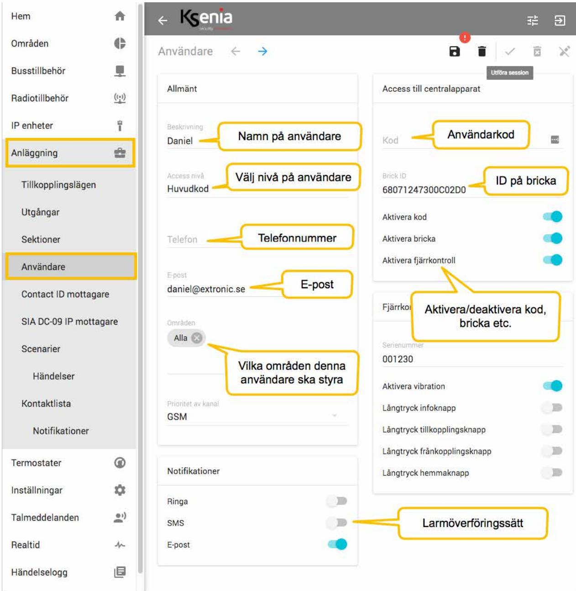

'

## **HANDHAVANDE**

#### **Tillkoppla systemet**

För att tillkoppla systemet kan någon av följande metoder användas:

- 1. Med en kod: Tryck användarkod tillkoppling kommer att utföras.
- 2. Med en bricka på manöverpanelen: Håll brickan framför logotypen på manöverpanelen.
- 
- 

3. Med en bricka på en läsare: Håll brickan framför läsaren (beröringsfri läsare Volo) och vänta till lysdiod tänds röd ta bort brickan nu.

#### **Frånkoppla systemet**

För att frånkoppla använd kan någon av följande metoder:

- 1. Med en kod: Tryck användarkod frånkoppling kommer attutföras. 2. Med en bricka på manöverpanelen: Håll brickan framför logotypen på manöverpanelen. 3. Med en bricka på en läsare: Håll brickan framför läsaren (beröringsfri läsare Volo) och vänta till lysdiod tänds grön.
## **Tillkoppla systemet i hemmaläge:**

För att tillkoppla systemet i hemmaläge kan någon av följande metoder användas:

- 1. Med en kod: Tryck användarkod och sen på knapp 2. 2. Med en bricka på manöverpanelen: Håll brickan framför logotypen på manöverpanelen och tryck sen på knapp 2.
- 3. Med en bricka på en läsare: Håll brickan framför läsaren och vänta tills lysdioden blir blå ta nu bort brickan nu.

För att frånkoppla efter en hemmatillkoppling gör precis som ovan när man ska frånkoppla om det har varit tillkopplat.

#### Larmsystem **lares 4.0** Snabbmanual

#### **Programmering rökdetektor nebula:**

- 1. Programmera sektion för rökdetektor som 24-timmars (Alltid aktiv) och slutande (obalanserad).

| C Områden            | ← Sektion -> 20                                       |
|-------------------------|----------------------------------------------------------------|
| 15 Busstillbehör     | Utföra session Rökdetektor Skapa sektion för rökdetektor |
| ((=)) Radiotillbehör | Områden                                                        |
| i IP enheter         | Skalskydd × Välj område                                     |
| Anläggning gl        | IP kamera                                                      |
| Tillkopplingslägen      |                                                                |
| Utgångar                |                                                                |
| Sektioner               | Tillbehörs association                                         |
| Användare               | auxi10                                                         |
| Contact ID mottagare    | auxi10 2                                                       |
| SIA DC-09 IP mottagare  | Välj vart utgången finns 2 12                               |
| Scenarier               |                                                                |
| Händelser               | Bearbetningsläge                                               |
| Kontaktlista            | Standard                                                       |
| Notifikationer          | Välj Alltid aktiv Alltid aktiv V                         |
| 3 Termostater        | Förbikoppling Förbikopplingsbar                             |
| ಿ Inställningar      |                                                                |
| 0) Talmeddelanden    | Välj Normalt öppen (NO) Balansering Normalt öppen( NO)   |
| Dealid                  |                                                                |

- 2. Programmera utgång som ska återställa rökdetektorer som Monostabil, normalt öppen (NO) & tid 10 sekunder.

| Hem                    | TIS   | દિશાસ                                   |                                                  | 글 글            | M  |
|------------------------|-------|-----------------------------------------|--------------------------------------------------|----------------|----|
| Områden                | 15    | ← ੇ ਤੇ Utgangar                   |                                                  |                | 26 |
| Busstillbehör          | 1     |                                         |                                                  | Utföra session |    |
| Radiotillbehör         | ((-)) | Beskrivning Rökdetektoråterställning | Skapa utgång för att återställa rökdetektorer |                |    |
| IP enheter             | il    | Områden                                 |                                                  |                |    |
| Anläggning             | 1     | Alla (X Välj område                  |                                                  |                |    |
| Tillkopplingslägen     |       |                                         |                                                  |                |    |
| Utgångar               |       | Tillbehörs association                  |                                                  |                |    |
| Sektioner              |       | lares                                   |                                                  |                |    |
| Användare              |       |                                         |                                                  |                |    |
| Contact ID mottagare   |       |                                         |                                                  |                |    |
| SIA DC-09 IP mottagare |       | Välj terminal                           | Välj vart utgången finns                         |                |    |
| Scenarier              |       |                                         |                                                  |                |    |
| Händelser              |       |                                         |                                                  |                |    |
| Kontaktlista           |       | Lage Välj monostabil Monostabil   |                                                  |                |    |
| Notifikationer         |       |                                         |                                                  |                |    |

#### Larmsystem **lares 4.0** Snabbmanual

- 3. Välj det Scenario som frånkopplar systemet (Frånkoppling allt) och programmera att även tysta sirener (Återställ utgångar i larm).

| Områden                        | 45    | ← → Scenario                                                            | তি                                           |
|--------------------------------|-------|----------------------------------------------------------------------------|----------------------------------------------|
| Busstillbehör                  | 网     |                                                                            |                                              |
| Radiotillbehör                 | ((-)) | Välj det scenario som Beskrivning Frånkoppla frånkopplar systemet |                                              |
| IP enheter                     | i     | Områden                                                                    |                                              |
| Anläggning                     | 机     | Alla X                                                                     |                                              |
| Tillkopplingslägen Utgångar |       | App hantering Med kod (lokal) - med kod (fjärr)                         |                                              |
| Sektioner Användare         |       | Åtgärder                                                                   |                                              |
| Contact ID mottagare           |       | Manuell förbikopplad (rekommenderas)                                       | Frånkopplad                                  |
| SIA DC-09 IP mottagare         |       | Återställ utgångar som är aktiverade (i larm)                              | Alla                                         |
| Scenarier                      |       |                                                                            | Lägg till en åtgärd under detta scenario som |
| Händelser                      |       |                                                                            | återställer utgångar som aktiveras vid larm  |
| Kontaktlista                   |       |                                                                            |                                              |

- 4. Välj Scenario som tillkopplar systemet (Tillkoppla och programmera att utgång för rökdetektor att aktiveras vid tillkoppling för att återställa rökdetektorer vid tillkoppling: