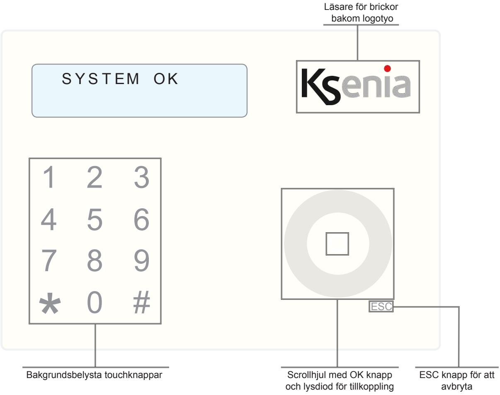
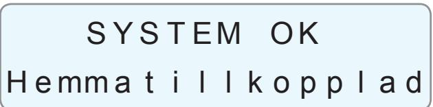
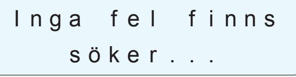
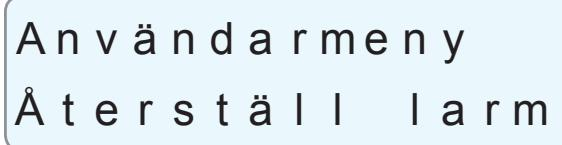

# **Centralapparat lares 4.0**

### Handhavande / Användaranvisning

#### **MANÖVERPANEL ERGO**

Manöverpanel ergo har kapacitiva touchknappar som är bakgrundsbelysta. Längst ner till höger finns ett scrollhjul med OK knapp mitt i och en ESC knapp för avbryta och backa ur menyer. I övre högra hörnet av manöverpanelen (bakom logotypen) finns en inbyggd NFC läsare för brickor.

#### **ANVÄNDARFUNKTIONER**

Tryck på stjärna för att se status för sektioner, använd scrollhjul för se flera områden. Tryck på fyrkant för att se status på områden, använd scrollhjul för se flera områden.

#### **TILL OCH FRÅNKOPPLING**

#### **Frånkoppling:**

Frånkoppla systemet med någon av följande metoder:

- 1. Tryck kod.
- 2. Tryck kod och på knapp 0.
- 3. Håll brickan framför manöverpanelen och upprepa en av de två ovanstående sekvenserna.

#### **Tillkoppling:**

Tillkoppla systemet med någon av följande metoder:

- 1. Tryck kod.
2. Tryck kod och på knapp 1.

- 3. Håll brickan framför manöverpanelen och sedan upprepa en av de två ovanstående sekvenserna.
#### **Tillkoppling i hemmaläge:**

Tillkoppla systemet i hemmaläge med någon av följande metoder:

- 1. Tryck kod och på knapp 2.
- 2. Tryck kod och scrolla till "Tillkoppla hemma och sedan på "OK".
- 3. Håll brickan framför manöverpanelen och upprepa en av de två ovanstående sekvenserna.

#### **TILLKOPPLING**

## S Y S T EM OK F r å n k o p p l a d

System är OK = klart att tillkopplas. För att tillkoppling av hela systemet - tryck din kod!

### T i l l k o p p l i n g u t f ö r d !

Tillkoppling utförd utan fel.

## U T P A S S E R I NG T i l l k o p p l a d

Nu startar utpasseringstiden, lämna fastigheten nu!

Systemet är tillkopplad!

#### **FRÅNKOPPLING**

Systemet är tillkopplad. När du öppnar dörren startar inpasseringsfördröjning, manöverpanelen börjar varna.

### I N P A S S E R I NG

T i l l k o p p l a d

För att frånkoppla tryck din kod!

## F r å n k o p p l i n g u t f ö r d !

Frånkoppling utförd, systemet är frånkopplad.

#### **TILLKOPPLING I HEMMALÄGE**

S Y S T EM OK F r å n k o p p l a d

System är OK = klart att tillkopplas. För att Hemmatillkoppling - tryck din kod och knapp 2.

## H e mm a t i l l k o p p l i n u t f ö r d !

Hemmatillkoppling utförd.

Systemet är nu Hemmatillkopplad.

*Med Hemmatillkoppling menas att Du kan vistas hemma eller kvar i fastigheten medan vissa delar av systemet är tillkopplat. Vilka detektorer som är aktiva beror på installatörens programmering, men vanligtvis är det magnetkontakter på dörrar och fönster. Det kan även vara rörelsedetektorer i vissa delar av huset. För att frånkoppla systemet är det bara att ange din kod!*

### S Y S T EM OK

#### F r å n k o p p l a d

System är frånkopplad.. För att tillkoppla - tryck kod!

Öppna sektioner finns. För att visa öppnade sektioner, tryck OK.

M a g n e t k o n t a k t L A RM

Den öppnade sektionen visas, åtgärda den öppnade sektionen genom att stänga dörren eller fönster som är öppet! Går det inte att lösa problemet nu kan Du förbikoppla sektionen genom att trycka OK.

## M a g n e t k o n t a k t F ö r b i k . s e k t i o n ?

Tryck OK för att bekräfta att du vill förbikoppla sektionen annars ESC för att avbryta.

M a g n e t k o n t a k t F ö r b i k o p p l a d

Sektionen är nu förbikopplad.

A l l a s e k t i o n e r ä r OK

Om du har förbikopplat de sektioner som är påverkade ska du få upp följande information "Alla sektioner är ok

## T i l l k o p p l i n g u t f ö r d !

Tryck OK för att tillkoppla.

## U T P A S S E R I NG

#### T i l l k o p p l a d

Nu startar utpasseringstiden, lämna fastigheten nu!

# F B K / T E S T S E K T I ON

#### T i l l k o p p l a d

System är tillkopplad med en förbikopplad sektion (FBK/TEST SEKTION)!

När systemet frånkopplas kommer denna varning att försvinna automatiskt. Se dock till att åtgärda den öppna sektionern snarast!

#### **FELMINNE**

### L A RMM I N N E F r å n k o p p l a d

När LARMMINNE visas på displayen talar det om ett larm har utlösts under den senaste tillkopplingen.

Tryck på OK för att se vilka sektioner som har utlöst larm.

## M a g n e t k o n t a k t L a r mm i n n e

Använd scrollhjullet för att scrolla för att se om det finns fler sektioner i larmminnet. När Du är klar tryck på ESC. Detta larmminne kommer automatiskt att återställas vid nästa tillkoppling. Vill du återställa larmminne ändå kan du tryck din kod och *.

# A n v ä n d a r m e n y Å t e r s t ä l l l a r m

Tryck OK för att återställa larm.

A n v ä n d a r m e n y F o r t s ä t t ?

Bekräfta med OK.

Klart! Tryck ESC för att lämna denna meny.

|   | F | E | L | M | I | N | N | E |        |  |
|---|---|---|---|---|---|---|---|---|--------|--|
| F | r | å | n | k | o | p | p | l | a d |  |

När FELMINNE visas på displayen talar det om ett fel har funnits men fel kvarstår inte.

Tryck på OK för att se vilka fel som har varit.

## L å g b a t t e r i F e l m i n n e

Använd scrollhjullet för att scrolla för att se vilka fler fel som har varit. När Du är klar tryck på ESC.

Vill du återställa larmminne ändå kan du tryck din kod och # stega med scrollhjul till Fel lista.

Klart! Tryck ESC för att lämna denna meny.

#### **ÄNDRA KOD**

### F E L F I N N S F r å n k o p p l a d

När FEL FINNS visas på displayen talar det om ett fel finns i systemet. Tryck på OK för att se vilka fel som finns.

## L å g b a t t e r i F e l m e d d e l a n d e

Använd scrollhjullet för att scrolla för att se om fler fel finns. När Du är klar tryck på ESC. Åtgärda alla fel som finns, kan du inte göra det själv kontakta din installatör för hjälp.

### S Y S T EM OK F r å n k o p p l a d

Systemet är frånkopplad. Tryck kod och *.

Använd scrollhjullet för att scrolla till meny för Ändra kod.

## A n v ä n d a r m e n y Ä n d r a k o d

Tryck på OK för att öppna meny.

Tryck på OK igen.

Ä n d r a k o d _

Tryck en sexsiffrig kod och sedan på OK.