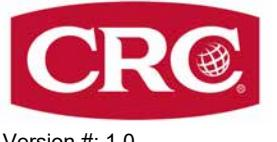
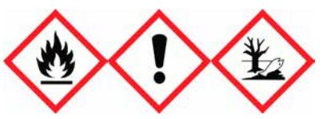
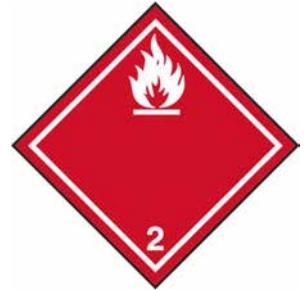

# **SÄKERHETSDATABLAD**

Version #: 1,0 Utgivningsdatum: 22-December-2022 Revisionsdatum: 22-December-2022

# **AVSNITT 1: Namnet på ämnet/blandningen och bolaget/företaget**

| 1.1. Produktbeteckning Blandningens handelsnamn eller beteckning                                    | White Lithium Grease                                                  |                                                 |  |                                                                                                                                 |
|-----------------------------------------------------------------------------------------------------------|-----------------------------------------------------------------------|-------------------------------------------------|--|---------------------------------------------------------------------------------------------------------------------------------|
| Registreringsnummer                                                                                       | -                                                                     |                                                 |  |                                                                                                                                 |
| Synonymer                                                                                                 | Inga.                                                                 |                                                 |  |                                                                                                                                 |
| Produktkod                                                                                                | BDS001367AE                                                           |                                                 |  |                                                                                                                                 |
| 1.2. Relevanta identifierade användningar av ämnet eller blandningen och användningar som det avråds från |                                                                       |                                                 |  |                                                                                                                                 |
| Identifierade användningar                                                                                | Smörjmedel                                                            |                                                 |  |                                                                                                                                 |
| Användningar som det avråds från                                                                       | Inte kända.                                                           |                                                 |  |                                                                                                                                 |
| 1.3. Närmare upplysningar om den som tillhandahåller säkerhetsdatablad                                    |                                                                       |                                                 |  |                                                                                                                                 |
| Företagsnamn                                                                                              | CRC Industries Europe bv                                              |                                                 |  |                                                                                                                                 |
| Adress                                                                                                    | Touwslagerstraat 1                                                    |                                                 |  |                                                                                                                                 |
|                                                                                                           | 9240 Zele                                                             |                                                 |  |                                                                                                                                 |
|                                                                                                           | Belgien                                                               |                                                 |  |                                                                                                                                 |
| Telefonnummer                                                                                             | +32(0)52/45.60.11                                                     |                                                 |  |                                                                                                                                 |
| Fax                                                                                                       | +32(0)52/45.00.34                                                     |                                                 |  |                                                                                                                                 |
| hse@crcind.com e-mail                                                                                  |                                                                       |                                                 |  |                                                                                                                                 |
| www.crcind.com Websida                                                                                 |                                                                       |                                                 |  |                                                                                                                                 |
| 1.4. Telefonnummer för nödsituationer                                                                  |                                                                       | Tel.: +32(0)52/45.60.11 (kontorstid: 9-17h CET) |  |                                                                                                                                 |
| Nationella Giftinformationscentralen                                                                   | 112- och fråga efter Giftinformation (Tillgänglig 24 timmar per dag.) |                                                 |  |                                                                                                                                 |
| AVSNITT 2: Farliga egenskaper                                                                             |                                                                       |                                                 |  |                                                                                                                                 |
| 2.1. Klassificering av ämnet eller blandningen                                                            |                                                                       |                                                 |  |                                                                                                                                 |
| för dessa faror och klassificeringen är följande.                                                         |                                                                       |                                                 |  | Blandningens fysikaliska faror och dess faror för människors hälsa och för miljön har bedömts och/eller blandningen har testats |
| Klassificering enligt förordningen (EG) nr 1272/2008 med ändringar                                        |                                                                       |                                                 |  |                                                                                                                                 |
| Fysikaliska faror Aerosoler                                                                            |                                                                       | Kategori 1                                      |  | H222 - Extremt brandfarlig aerosol.                                                                                             |
|                                                                                                           |                                                                       |                                                 |  | H229 - Tryckbehållare: Kan sprängas vid uppvärmning.                                                                         |
| Hälsofaror                                                                                                |                                                                       |                                                 |  |                                                                                                                                 |
| Frätande/irriterande på huden                                                                             |                                                                       | Kategori 2                                      |  | H315 - Irriterar huden.                                                                                                         |
| Specifik organtoxicitet – enstaka exponering                                                              |                                                                       | Kategori 3 narkosverkan                         |  | H336 - Kan göra att man blir dåsig eller omtöcknad.                                                                          |
| Miljöfaror Farligt för vattenmiljön — fara för skadliga långtidseffekter                            |                                                                       | Kategori 2                                      |  | H411 - Giftigt för vattenlevande organismer med långtidseffekter.                                                            |
| 2.2. Märkningsuppgifter                                                                                   |                                                                       |                                                 |  |                                                                                                                                 |
| Etiketten i enlighet med förordning (EG) nr 1272/2008 med ändringar                                       |                                                                       |                                                 |  |                                                                                                                                 |
|                                                                                                           |                                                                       |                                                 |  |                                                                                                                                 |

**Innehåller:** Kolväten, C6-C7, n-alkaner, isoalkaner, cykliska, < 5% n-heksan

**Faropiktogram**

| Signalord                              | Fara                                                                                                                                                                                                                                                                                                                                                     |
|----------------------------------------|----------------------------------------------------------------------------------------------------------------------------------------------------------------------------------------------------------------------------------------------------------------------------------------------------------------------------------------------------------|
| Faroangivelser                         |                                                                                                                                                                                                                                                                                                                                                          |
| H222 H229 H315 H336 H411   | Extremt brandfarlig aerosol. Tryckbehållare: Kan sprängas vid uppvärmning. Irriterar huden. Kan göra att man blir dåsig eller omtöcknad. Giftigt för vattenlevande organismer med långtidseffekter.                                                                                                                                          |
| Skyddsangivelser                       |                                                                                                                                                                                                                                                                                                                                                          |
| Förebyggande                           |                                                                                                                                                                                                                                                                                                                                                          |
| P102 P210                           | Förvaras oåtkomligt för barn. Får inte utsättas för värme, heta ytor, gnistor, öppen låga eller andra antändningskällor. Rökning förbjuden.                                                                                                                                                                                                        |
| P211                                   | Spreja inte över öppen låga eller andra antändningskällor.                                                                                                                                                                                                                                                                                               |
| P251                                   | Får inte punkteras eller brännas, gäller även tömd behållare. Undvik att inandas ångor.                                                                                                                                                                                                                                                               |
| P261                                   | Används endast utomhus eller i väl ventilerade utrymmen.                                                                                                                                                                                                                                                                                                 |
| P271 P280                           | Använd skyddshandskar.                                                                                                                                                                                                                                                                                                                                   |
| Åtgärder                               | Ej tilldelat.                                                                                                                                                                                                                                                                                                                                            |
| Lagring                                |                                                                                                                                                                                                                                                                                                                                                          |
| P410 + P412                            | Skyddas från solljus. Får inte utsättas för temperaturer över 50 °C/122 °F.                                                                                                                                                                                                                                                                              |
| Avfall                                 |                                                                                                                                                                                                                                                                                                                                                          |
| P501                                   | Innehållet/behållaren lämnas till hantering i enlighet med lokala/regionala/nationella/internationella föreskrifter.                                                                                                                                                                                                                                  |
| Kompletterande märkningsinformation | EUH208 - Innehåller Polysulfider, di-tert-dodekyl-, Nafteniska syror, zinksalter. Kan orsaka en allergisk reaktion. EUH211 - Varning! Farliga respirabla droppar kan bildas vid sprejning. Inandas inte sprej eller dimma.                                                                                                                      |
| 2.3. Andra faror                       | Denna blandning innehåller inte ämnen som bedöms vara vPvB-/PBT-ämnen enligt förordning (EG) nr 1907/2006, bilaga XIII. Produkten innehåller inte beståndsdelar som anses ha hormonstörande egenskaper enligt REACH Artikel 57(f) eller Förordning (EU) 2017/2100 eller Kommissionens förordning (EU) 2018/605 vid nivåer på 0,1 % eller högre. |

### **AVSNITT 3: Sammansättning/information om beståndsdelar**

#### **3.2. Blandningar**

### **Allmän Information**

| Kemiskt namn                                                                                                  | %   | CAS-nummer / EG-nummer      | REACH-registreringsnu mmer                                    | Index nr    | Anmärkningar |
|---------------------------------------------------------------------------------------------------------------|-----|--------------------------------|------------------------------------------------------------------|-------------|--------------|
| Kolväten, C6-C7, n-alkaner, isoalkaner, cykliska, < 5% n-heksan                                            | <25 | - 921-024-6                 | 01-2119475514-35                                                 | -           |              |
| Klassificering:                                                                                               |     | 1;H304, Aquatic Chronic 2;H411 | Flam. Liq. 2;H225, Skin Irrit. 2;H315, STOT SE 3;H336, Asp. Tox. |             |              |
| Nafteniska syror, zinksalter                                                                                  | <1  | 12001-85-3 234-409-2        | 01-2120783834-41                                                 | -           |              |
| Klassificering:                                                                                               |     |                                | Eye Irrit. 2;H319, Skin Sens. 1B;H317, Aquatic Chronic 2;H411    |             |              |
| Polysulfider, di-tert-dodekyl-                                                                                | <1  | 68425-15-0 270-335-7        | 01-2119540516-41                                                 | -           |              |
| Klassificering:                                                                                               |     | Skin Sens. 1B;H317             |                                                                  |             |              |
| titandioxid; [i form av pulver som innehåller minst 1 % partiklar med en aerodynamisk diameter ≤ 10 μm] | <1  | 13463-67-7 236-675-5        | 01-2119489379-17                                                 | 022-006-002 | 10           |
| Klassificering:                                                                                               | -   |                                |                                                                  |             |              |

#### **Lista över förkortningar och symboler som kan användas ovan**

För detta ämne har fastställts Unionens gränsvärde(n) för exponering på arbetsplatsen.

- M: M-faktor
PBT: långlivad, bioackumulerande och toxisk ämne.

vPvB: mycket långlivad och mycket bioackumulerande ämne.

Anmärkning 10 - Klassificeringen som cancerframkallande vid inandning är endast tillämplig på blandningar i form av pulver som innehåller minst 1 % titandioxidpartiklar, som är i form av eller inkorporerade i partiklar med en aerodynamisk diameter på ≤ 10 μm.

Alla halter är angivna i viktprocent förutom i det fallet att beståndsdelen är en gas. Gaskoncentrationer är angivna i volymprocent. **Kommentarer om** Alla H-angivelsernas fullständiga text finns i avsnitt 16.

### **sammansättning**

# **AVSNITT 4: Åtgärder vid första hjälpen**

| Allmän Information                              | Se till att medicinsk personal är medveten om de material (er) som berörs och att de vidtar nödvändiga skyddsåtgärder.                                                  |
|-------------------------------------------------|----------------------------------------------------------------------------------------------------------------------------------------------------------------------------|
| 4.1. Beskrivning av åtgärder vid första hjälpen |                                                                                                                                                                            |
| Inandning                                       | Flytta personen till frisk luft och se till att han eller hon vilar i en ställning som underlättar andningen Vid obehag, kontakta giftinformationscentral eller läkare. |
| Hudkontakt                                      | Tag av nedstänkta kläder. Tvätta med mycket tvål och vatten. Vid hudirritation: Sök läkarhjälp. Nedstänkta kläder ska tvättas innan de används igen.                    |
| Ögonkontakt                                     | Spola med vatten. Kontakta läkare om irritation utvecklas och består.                                                                                                      |

**Förtäring** Vid osannolik händelse av förtäring kontakta en läkare eller förgiftningsavdelning. Skölj munnen.

Kan göra att man blir dåsig eller omtöcknad. Huvudvärk. Illamående, kräkningar. Hudirritation. Kan orsaka rodnad och smärta. **4.2. De viktigaste symptomen och effekterna, både akuta och fördröjda**

**4.3. Angivande av omedelbar medicinsk behandling och särskild behandling som eventuellt krävs**

Ordna allmänna stödåtgärder och behandla på ett symtomatisk sätt. Håll patienten under observation. Symptomen kan vara fördröjda.

# **AVSNITT 5: Brandbekämpningsåtgärder**

| Allmänna brandfaror                                             | Extremt brandfarlig aerosol.                                                                                                                 |
|-----------------------------------------------------------------|----------------------------------------------------------------------------------------------------------------------------------------------|
| 5.1. Släckmedel                                                 |                                                                                                                                              |
| Lämpliga släckmedel                                             | Skum. Koldioxid (CO2). Torrt kemikaliepulver.                                                                                                |
| Olämpliga släckmedel                                            | Vid brandsläckning får vattenstråle inte användas - branden sprids därigenom.                                                                |
| 5.2. Särskilda faror som ämnet eller blandningen kan medföra | Innehåll under tryck. Trycksatt behållare kan explodera när de utsätts för värme eller flammor. Vid brand kan hälsoskadliga gaser bildas. |
|                                                                 |                                                                                                                                              |

#### **5.3. Råd till brandbekämpningspersonal**

| Särskild skyddsutrustning för brandbekämpningsperson al | Brandmän måste använda gängse skyddsutrustning inklusive brandhindrande rock, hjälm med ansiktsskydd, handskar, gummistövlar och, i slutna utrymmen, sluten andningsapparat.                                                                                                 |
|------------------------------------------------------------------|---------------------------------------------------------------------------------------------------------------------------------------------------------------------------------------------------------------------------------------------------------------------------------|
| Speciella förfaranden vid brandbekämpning                     | Flytta behållare från brandområdet om detta kan ske utan risk. Behållare skall kylas med vatten för att förhindra att ångtryck bildas. Använd obemannad slang eller fjärrspridare vid stor brand i lagerområde. Om detta är omöjligt, retirera och låt branden brinna ut. |
| Särskilda åtgärder                                               | Tillämpa gängse rutiner för brandbekämpning och betänk riskerna med övriga inblandade material. Använd finfördelat vatten för att kyla oöppnade behållare. I händelse av brand och/eller explosion andas inte in rök.                                                     |

# **AVSNITT 6: Åtgärder vid oavsiktliga utsläpp**

#### **6.1. Personliga skyddsåtgärder, skyddsutrustning och åtgärder vid nödsituationer**

| För annan personal än räddningspersonal                 | Bär lämplig skyddsutrustning och -kläder under rengöringen. Undvik att inandas gas. Rör inte skadade kärl eller materialspill utan lämpliga skyddskläder. Vidrör inte spill av materialet och gå inte genom det.                                                                                                                                                                                                                                                                                                                                                                   |
|------------------------------------------------------------|------------------------------------------------------------------------------------------------------------------------------------------------------------------------------------------------------------------------------------------------------------------------------------------------------------------------------------------------------------------------------------------------------------------------------------------------------------------------------------------------------------------------------------------------------------------------------------------|
| För räddningspersonal                                      | Håll obehörig personal på avstånd Undvik att inandas gas. Ventilera slutna utrymmen före tillträde. Lokala myndigheter skall underrättas om betydande spill ej kan begränsas. Information om personligt skydd finns i säkerhetsdatabladets avsnitt 8.                                                                                                                                                                                                                                                                                                                              |
| 6.2. Miljöskyddsåtgärder                                   | Undvik utsläpp i avlopp, vattendrag eller på marken och i vattenmiljö.                                                                                                                                                                                                                                                                                                                                                                                                                                                                                                                   |
| 6.3. Metoder och material för inneslutning och sanering | Stoppa läckan om detta kan ske utan risk. Flytta cylindern till ett säkert och öppet område om läckan inte går att reparera. Stäng av området tills gasen har spritts ut. Avlägsna alla antändningskällor (ingen rökning, inga bloss, gnistor eller lågor i omedelbar närhet). Låt inte brännbart material (trä, papper, olja etc.) komma i kontakt med spill av materialet. Produkten är inte blandbar med vatten och sprids på vattenytan. Absorbera i vermikulit, torr sand eller jord och placera i kärl. När materialet samlats upp skall området spolas med vatten. |
|                                                            | Små spill: Torka upp med absorberande material (t.ex. trasa, skinn). Rengör ytan grundligt för att avlägsna kontaminering från utsläppsrester.                                                                                                                                                                                                                                                                                                                                                                                                                                        |
| 6.4. Hänvisning till andra avsnitt                      | Information om personligt skydd finns i säkerhetsdatabladets avsnitt 8. Information om sophantering finns i säkerhetsdatabladets avsnitt 13.                                                                                                                                                                                                                                                                                                                                                                                                                                          |

# **AVSNITT 7: Hantering och lagring**

| 7.1 Skyddsåtgärder för säker hantering                                   | Tryckbehållare: Får inte punkteras eller brännas, gäller även tömd behållare. Använd inte om sprayknappen saknas eller är defekt. Spruta inte mot en öppen låga eller annat glödande material. Rök inte under användning eller förrän det besprutade ytan är helt torrt. Ingen skärning, svetsning, lödning, borrning eller slipning och behållare får inte utsättas för värme, lågor, gnistor eller andra antändningskällor. All utrustning som används vid hantering av produkten måste vara jordad. Återanvänd inte tömd behållare. Undvik att inandas gas. Undvik kontakt med ögonen, huden och kläderna. Undvik långvarig exponering. Sörj för god ventilation. Använd lämplig personlig skyddsutrustning. Följ god kemikaliehygien. |
|-----------------------------------------------------------------------------|----------------------------------------------------------------------------------------------------------------------------------------------------------------------------------------------------------------------------------------------------------------------------------------------------------------------------------------------------------------------------------------------------------------------------------------------------------------------------------------------------------------------------------------------------------------------------------------------------------------------------------------------------------------------------------------------------------------------------------------------------------------|
| 7.2. Förhållanden för säker lagring, inklusive eventuell oförenlighet | Tryckbehållare får ej utsättas för temperaturer över 50 °C. Gäller även tömd behållare. Får inte punkteras, brännas eller krossas. Hanteras eller förvaras inte i närheten en öppen låga, värme eller andra antändningskällor. Detta material kan ackumulera statiska laddningar som kan ge upphov till gnistor och bli en antändningskälla. Förvaras inte i närheten av oförenliga material (se säkerhetsdatabladets avsnitt 10). Förvaringsklass (TRGS 510): 2B (Aerosolbehållare och tändare)                                                                                                                                                                                                                                                |
| 7.3. Specifik slutanvändning                                                | Inte tillgänglig.                                                                                                                                                                                                                                                                                                                                                                                                                                                                                                                                                                                                                                                                                                                                              |
|                                                                             | AVSNITT 8: Begränsning av exponeringen/personligt skydd                                                                                                                                                                                                                                                                                                                                                                                                                                                                                                                                                                                                                                                                                                        |

#### **8.1. Kontrollparametrar**

#### **Gränsvärden för exponering på arbetsplatsen**

| Sverige Komponenter                                                                                                               | Typ                                                                                                                                          | Värde             |                                                                                                       |
|--------------------------------------------------------------------------------------------------------------------------------------|----------------------------------------------------------------------------------------------------------------------------------------------|-------------------|-------------------------------------------------------------------------------------------------------|
| Kolväten, C6-C7, n-alkaner, isoalkaner, cykliska, < 5% n-heksan                                                                | KTV                                                                                                                                          | 300 ppm           |                                                                                                       |
|                                                                                                                                      | NGV                                                                                                                                          | 200 ppm           |                                                                                                       |
|                                                                                                                                      | Sverige. Hygieniska gränsvärden. Arbetsmiljömyndigheten (AV), hygieniska gränsvärden (AFS 2015:7)                                            |                   |                                                                                                       |
| Komponenter                                                                                                                          | Typ                                                                                                                                          | Värde             | Form                                                                                                  |
| titandioxid; [i form av pulver som innehåller minst 1 % partiklar med en aerodynamisk diameter ≤ 10 μm] (CAS 13463-67-7) | NGV                                                                                                                                          | 5 mg/m3           | Totalmängden damm.                                                                                    |
| Biologiska gränsvärden                                                                                                               | Inga biologiska exponeringsgränser upptäckts för beståndsdelarna.                                                                            |                   |                                                                                                       |
| Rekommenderade övervakningsförfaranden                                                                                            | Följ normala uppföljningsprocedurer.                                                                                                         |                   |                                                                                                       |
| Härledda nolleffektnivåer (DNEL)                                                                                                     |                                                                                                                                              |                   |                                                                                                       |
| Arbetare                                                                                                                             |                                                                                                                                              |                   |                                                                                                       |
| Komponenter                                                                                                                          | Värde                                                                                                                                        | Bedömningsfaktor  | Anmärkningar                                                                                          |
|                                                                                                                                      | Kolväten, C6-C7, n-alkaner, isoalkaner, cykliska, < 5% n-heksan (CAS -)                                                                      |                   |                                                                                                       |
| Långvarig, Systemisk, Dermal Långvarig, Systemisk, Inhalativ                                                                      | 773 mg/kg kroppsvikt/dag 2035 mg/m3                                                                                                       |                   |                                                                                                       |
| Nafteniska syror, zinksalter (CAS 12001-85-3)                                                                                        |                                                                                                                                              |                   |                                                                                                       |
| Långvarig, Systemisk, Dermal Långvarig, Systemisk, Inhalativ                                                                      | 3,3 mg/kg 1,18 mg/m3                                                                                                                      | 30 75          | Toxicitet vid upprepad dosering Toxicitet vid upprepad dosering                                    |
| Polysulfider, di-tert-dodekyl- (CAS 68425-15-0)                                                                                      |                                                                                                                                              |                   |                                                                                                       |
| Långvarig, Systemisk, Dermal Långvarig, Systemisk, Inhalativ                                                                      | 46,7 mg/kg 32,9 mg/m3                                                                                                                     | 300 75         | Toxicitet vid upprepad dosering Toxicitet vid upprepad dosering                                    |
| Befolkningen som helhet                                                                                                              |                                                                                                                                              |                   |                                                                                                       |
| Komponenter                                                                                                                          | Värde                                                                                                                                        | Bedömningsfaktor  | Anmärkningar                                                                                          |
| Långvarig, Systemisk, Dermal Långvarig, Systemisk, Inhalativ Långvarig, Systemisk, Oral                                        | Kolväten, C6-C7, n-alkaner, isoalkaner, cykliska, < 5% n-heksan (CAS -) 699 mg/kg kroppsvikt/dag 608 mg/m3 699 mg/kg kroppsvikt/dag |                   |                                                                                                       |
| Nafteniska syror, zinksalter (CAS 12001-85-3)                                                                                        |                                                                                                                                              |                   |                                                                                                       |
| Långvarig, Systemisk, Dermal Långvarig, Systemisk, Inhalativ Långvarig, Systemisk, Oral                                        | 1,7 mg/kg 0,29 mg/m3 0,17 ng/kg                                                                                                        | 60 150 600  | Toxicitet vid upprepad dosering Toxicitet vid upprepad dosering Toxicitet vid upprepad dosering |
| Polysulfider, di-tert-dodekyl- (CAS 68425-15-0)                                                                                      |                                                                                                                                              |                   |                                                                                                       |
| Långvarig, Systemisk, Dermal Långvarig, Systemisk, Inhalativ Långvarig, Systemisk, Oral                                        | 16,7 mg/kg 5,8 mg/m3 1,7 mg/kg                                                                                                         | 600 150 600 | Toxicitet vid upprepad dosering Toxicitet vid upprepad dosering Toxicitet vid upprepad dosering |

Materialnamn: White Lithium Grease - Manufacturers SDS SWEDEN

BDS001367AE Version #: 1,0 Revisionsdatum: 22-December-2022 Utgivningsdatum: 22-December-2022 4 / 10

#### **Uppskattade nolleffektkoncentrationer (PNEC-värden)**

| Komponenter                                                                                                              |                                                                                                | Värde                                                                                     | Bedömningsfaktor | Anmärkningar                                                                                          |
|--------------------------------------------------------------------------------------------------------------------------|------------------------------------------------------------------------------------------------|-------------------------------------------------------------------------------------------|------------------|-------------------------------------------------------------------------------------------------------|
| Nafteniska syror, zinksalter (CAS 12001-85-3)                                                                            |                                                                                                |                                                                                           |                  |                                                                                                       |
| Jord                                                                                                                     |                                                                                                | 0,001 mg/kg                                                                               |                  |                                                                                                       |
| Sediment (sötvatten)                                                                                                     |                                                                                                | 0,015 mg/kg                                                                               |                  |                                                                                                       |
| Sötvatten                                                                                                                |                                                                                                | 0,004 mg/l                                                                                | 1000             |                                                                                                       |
| STP                                                                                                                      |                                                                                                | 689,7 µg/L                                                                                | 1                |                                                                                                       |
| Polysulfider, di-tert-dodekyl- (CAS 68425-15-0)                                                                          |                                                                                                |                                                                                           |                  |                                                                                                       |
| Sediment (havsvatten)                                                                                                    |                                                                                                | 0,385 mg/kg                                                                               | 1000             |                                                                                                       |
| Sediment (sötvatten)                                                                                                     |                                                                                                | 3,85 mg/kg                                                                                | 100              |                                                                                                       |
| Sekundärförgiftning                                                                                                      |                                                                                                | 66,7 mg/kg                                                                                | 300              | Oral                                                                                                  |
| STP                                                                                                                      | 1 g/l                                                                                          |                                                                                           | 10               |                                                                                                       |
| titandioxid; [i form av pulver som innehåller minst 1 % partiklar med en aerodynamisk diameter ≤ 10 μm] (CAS 13463-67-7) |                                                                                                |                                                                                           |                  |                                                                                                       |
| Jord                                                                                                                     |                                                                                                | 100 mg/kg                                                                                 | 10               |                                                                                                       |
| Sediment (sötvatten)                                                                                                     |                                                                                                | 1000 mg/kg                                                                                | 100              |                                                                                                       |
| Sötvatten                                                                                                                |                                                                                                | 0,184 mg/l                                                                                | 10               |                                                                                                       |
| STP                                                                                                                      |                                                                                                | 100 mg/l                                                                                  | 10               |                                                                                                       |
| 8.2. Begränsning av exponeringen                                                                                         |                                                                                                |                                                                                           |                  |                                                                                                       |
| Lämpliga tekniska                                                                                                        |                                                                                                |                                                                                           |                  | Se till att det finns en bra allmän ventilation. Ventilationen skall anpassas efter förhållandena. Om |
| kontrollåtgärder                                                                                                         |                                                                                                | tillämpligt, använd inkapsling av processer, punktutsugning eller andra tekniska          |                  |                                                                                                       |
|                                                                                                                          |                                                                                                | försiktighetsåtgärder för att hålla nivåerna i luften under de rekommenderade             |                  | exponeringsgränserna. Om exponeringsgränserna inte har fastställts, håll luftburna nivåer på en       |
|                                                                                                                          |                                                                                                | acceptabel nivå. Det skall finns tillgång till omedelbar ögonspolning och nöddusch.       |                  |                                                                                                       |
| Individuella skyddsåtgärder, t.ex. personlig skyddsutrustning                                                            |                                                                                                |                                                                                           |                  |                                                                                                       |
| Allmän Information                                                                                                       |                                                                                                |                                                                                           |                  | Använd föreskriven personlig skyddsutrustning. Välj personlig skyddsutrustning i enlighet med         |
|                                                                                                                          |                                                                                                |                                                                                           |                  | gällande CEN-standarder och i samarbete med leverantören av personlig skyddsutrustning.               |
| Ögonskydd/ansiktsskydd                                                                                                   | 166.                                                                                           |                                                                                           |                  | Använd skyddsglasögon med sidoskydd. Använd ögonskydd som är i överensstämmelse med EN                |
| Hudskydd                                                                                                                 |                                                                                                |                                                                                           |                  |                                                                                                       |
| - Handskydd                                                                                                              |                                                                                                |                                                                                           |                  | Vid hantering av produkten Använd handskar som skyddar mot kemikalier (standard EN 374).              |
|                                                                                                                          | Handskens genombrottstid ska vara längre än produktens totala användningstid. Om arbetet varar |                                                                                           |                  |                                                                                                       |
|                                                                                                                          |                                                                                                | längre än genombrottstiden ska handskarna bytas efter halva tiden.                        |                  |                                                                                                       |
|                                                                                                                          | Fullständig kontakt: Handskmaterial: nitrile. Använd handskar med genomträngningstid på 480    |                                                                                           |                  |                                                                                                       |
|                                                                                                                          |                                                                                                | minuter. Minsta handsktjocklek 0.38 mm.                                                   |                  |                                                                                                       |
| - Annat skydd                                                                                                            |                                                                                                | Använd lämpliga kemikaliebeständiga skyddsplagg.                                          |                  |                                                                                                       |
| Andingsskydd                                                                                                             | Använd lämpligt andningsskydd vid otillräcklig ventilation. Andningsapparat med filter mot     |                                                                                           |                  |                                                                                                       |
|                                                                                                                          |                                                                                                | organiska ångor och helmask. (Filter typ AXP2)                                            |                  |                                                                                                       |
| Termisk fara                                                                                                             |                                                                                                | Använd lämpliga skyddskläder som skyddar mot hetta.                                       |                  |                                                                                                       |
| Hygieniska åtgärder                                                                                                      |                                                                                                |                                                                                           |                  | Rök inte under hanteringen. Iakttag alltid god personlig hygien. Exempelvis bör man tvätta sig efter  |
|                                                                                                                          |                                                                                                | hantering av materialet och innan man äter, dricker och/eller röker. Tvätta rutinmässigt  |                  |                                                                                                       |
|                                                                                                                          |                                                                                                | arbetskläderna för att avlägsna föroreningar.                                             |                  |                                                                                                       |
| Begränsning av miljöexponeringen                                                                                      |                                                                                                | kraven i miljöskyddslagstiftningen. Rökskrubbrar, filter eller tekniska modifikationer av |                  | Utsläpp från ventilation eller arbetsutrustning ska kontrolleras för att säkerställa att de uppfyller |
|                                                                                                                          |                                                                                                | processutrustningen kan vara nödvändiga för att minska utsläpp till acceptabla nivåer.    |                  |                                                                                                       |
|                                                                                                                          |                                                                                                |                                                                                           |                  |                                                                                                       |

### **AVSNITT 9: Fysikaliska och kemiska egenskaper**

#### **9.1. Information om grundläggande fysikaliska och kemiska egenskaper**

| Aggregationstillstånd                                     | Flytande.                         |
|-----------------------------------------------------------|-----------------------------------|
| Form                                                      | Aerosol.                          |
| Färg                                                      | Vit                               |
| Lukt                                                      | Karakteristisk lukt.              |
| Smältpunkt/fryspunkt                                      | Inte tillgänglig.                 |
| Kokpunkt eller initial kokpunkt och kokpunktsintervall | 60 - 100 °C (140 - 212 °F)        |
| Brandfarlighet                                            | Inte tillgänglig.                 |
| Flampunkt                                                 | -35,0 °C (-31,0 °F) Sluten bägare |
| Självantändningstemperatur                                | > 200 °C (> 392 °F)               |
| Sönderfallstemperatur                                     | Inte tillgänglig.                 |
| pH-värde                                                  | Inte tillämplig.                  |
| Kinematisk viskositet                                     | Inte tillgänglig.                 |
|                                                           |                                   |

Materialnamn: White Lithium Grease - Manufacturers SDS SWEDEN

BDS001367AE Version #: 1,0 Revisionsdatum: 22-December-2022 Utgivningsdatum: 22-December-2022 5 / 10

| Löslighet i vatten                                              |                                                                                                                                                                                                             |                                 |
|-----------------------------------------------------------------|-------------------------------------------------------------------------------------------------------------------------------------------------------------------------------------------------------------|---------------------------------|
| Löslighet (vatten)                                              | Olösligt i vatten                                                                                                                                                                                           |                                 |
| Fördelningskoefficient (n-oktanol/vatten) (log-värde)        | Inte tillämplig.                                                                                                                                                                                            |                                 |
| Ångtryck                                                        | Inte tillgänglig.                                                                                                                                                                                           |                                 |
| Densitet och/eller relativ densitet                             |                                                                                                                                                                                                             |                                 |
| Relativ densitet                                                | 0,76 g/cm3 vid 20 °C                                                                                                                                                                                        |                                 |
| Ångdensitet                                                     | Inte tillgänglig.                                                                                                                                                                                           |                                 |
| Partikelegenskaper                                              | Inte tillgänglig.                                                                                                                                                                                           |                                 |
| 9.2. Annan information                                          |                                                                                                                                                                                                             |                                 |
| 9.2.1. Information om faroklasser för fysisk fara            | Ingen relevant ytterligare information tillgänglig                                                                                                                                                          |                                 |
| 9.2.2. Andra säkerhetskarakteristika                            |                                                                                                                                                                                                             |                                 |
| VOC (Flyktiga organiska föreningar)                          | 515 g/l                                                                                                                                                                                                     |                                 |
| AVSNITT 10: Stabilitet och reaktivitet                          |                                                                                                                                                                                                             |                                 |
| 10.1. Reaktivitet                                               | Produkten är stabil och icke-reaktiv under normala användnings-, förvarings- och transportförhållanden                                                                                                   |                                 |
| 10.2. Kemisk stabilitet                                         | Materialet är stabilt under normala betingelser.                                                                                                                                                            |                                 |
| 10.3. Risken för farliga reaktioner                          | Inga farliga reaktioner kända under normala användningsförhållanden.                                                                                                                                        |                                 |
| 10.4. Förhållanden som ska undvikas                          | Undvik höga temperaturer.                                                                                                                                                                                   |                                 |
| 10.5. Oförenliga material                                       | Starka oxidationsmedel.                                                                                                                                                                                     |                                 |
| 10.6. Farliga sönderdelningsprodukter                        | Koloxider.                                                                                                                                                                                                  |                                 |
| AVSNITT 11: Toxikologisk information                            |                                                                                                                                                                                                             |                                 |
| Allmän Information                                              | Exponering för ämnet eller blandningen under arbetet kan ha skadliga effekter.                                                                                                                              |                                 |
| Information om sannolika exponeringsvägar                       |                                                                                                                                                                                                             |                                 |
| Inandning                                                       | Kan göra att man blir dåsig eller omtöcknad. Huvudvärk. Illamående, kräkningar. Kan orsaka allergi- eller astmasymtom eller andningssvårigheter vid inandning. Långvarig inandning kan vara skadligt. |                                 |
| Hudkontakt                                                      | Irriterar huden. Kan orsaka allergisk hudreaktion.                                                                                                                                                          |                                 |
| Ögonkontakt                                                     | Direkt kontakt med ögonen kan orsaka tillfällig irritation.                                                                                                                                                 |                                 |
| Förtäring                                                       | Kan ge illamående vid förtäring. Förtäring är sannolikt inte en primär väg för yrkeshygienisk exponering.                                                                                                |                                 |
| Symptom                                                         | Kan göra att man blir dåsig eller omtöcknad. Huvudvärk. Illamående, kräkningar. Hudirritation. Kan orsaka rodnad och smärta.                                                                             |                                 |
| 11.1. Information om de toxikologiska effekterna                |                                                                                                                                                                                                             |                                 |
| Akut toxicitet                                                  | Tillgängliga data tyder på att klassificeringskriterierna inte uppfylls.                                                                                                                                    |                                 |
| Komponenter                                                     | Art                                                                                                                                                                                                         | Testresultat                    |
| Kolväten, C6-C7, n-alkaner, isoalkaner, cykliska, < 5% n-heksan |                                                                                                                                                                                                             |                                 |
| Akut                                                            |                                                                                                                                                                                                             |                                 |
| Dermal                                                          |                                                                                                                                                                                                             |                                 |
| LD50                                                            | Råtta                                                                                                                                                                                                       | 2920 mg/kg kroppsvikt/dag, 24 h |
| Inandning                                                       |                                                                                                                                                                                                             |                                 |
| LC50                                                            | Råtta                                                                                                                                                                                                       | 25200 mg/m³, 4 h                |
| Oral                                                            |                                                                                                                                                                                                             |                                 |
| LD50                                                            | Råtta                                                                                                                                                                                                       | 5840 mg/kg kroppsvikt/dag       |
| Akut                                                            | titandioxid; [i form av pulver som innehåller minst 1 % partiklar med en aerodynamisk diameter ≤ 10 μm] (CAS 13463-67-7)                                                                                    |                                 |

| Dermal LD50    | Kanin | 10000 mg/kg |
|-------------------|-------|-------------|
| Inandning LC50 |       | > 5 mg/l    |

Materialnamn: White Lithium Grease - Manufacturers SDS SWEDEN

| Komponenter                                                                                                                    | Art                                                                                                                        |                                                                                                                                                                                                                               | Testresultat                                                                                                                                                                                  |
|--------------------------------------------------------------------------------------------------------------------------------|----------------------------------------------------------------------------------------------------------------------------|-------------------------------------------------------------------------------------------------------------------------------------------------------------------------------------------------------------------------------|-----------------------------------------------------------------------------------------------------------------------------------------------------------------------------------------------|
| Oral                                                                                                                           |                                                                                                                            |                                                                                                                                                                                                                               |                                                                                                                                                                                               |
| LD50                                                                                                                           | Råtta                                                                                                                      |                                                                                                                                                                                                                               | 10000 mg/kg                                                                                                                                                                                   |
| Frätande/irriterande på huden                                                                                                  | Irriterar huden.                                                                                                           |                                                                                                                                                                                                                               |                                                                                                                                                                                               |
| Allvarlig ögonskada/ögonirritation                                                                                          |                                                                                                                            | Direkt kontakt med ögonen kan orsaka tillfällig irritation.                                                                                                                                                                   |                                                                                                                                                                                               |
| Luftvägssensibilisering                                                                                                        |                                                                                                                            | Tillgängliga data tyder på att klassificeringskriterierna inte uppfylls.                                                                                                                                                      |                                                                                                                                                                                               |
| Hudsensibilisering                                                                                                             |                                                                                                                            | Tillgängliga data tyder på att klassificeringskriterierna inte uppfylls.                                                                                                                                                      |                                                                                                                                                                                               |
| Mutagenitet i könsceller                                                                                                       |                                                                                                                            | Tillgängliga data tyder på att klassificeringskriterierna inte uppfylls.                                                                                                                                                      |                                                                                                                                                                                               |
| Cancerogenitet                                                                                                                 |                                                                                                                            | Risk för cancer kan inte uteslutas vid långvarig exponering.                                                                                                                                                                  |                                                                                                                                                                                               |
| IARC-monografier. Helhetsbedömning av carcinogenicitet                                                                         |                                                                                                                            |                                                                                                                                                                                                                               |                                                                                                                                                                                               |
| titandioxid; [i form av pulver som innehåller minst 1 % partiklar med en aerodynamisk diameter ≤ 10 μm] (CAS 13463-67-7) |                                                                                                                            |                                                                                                                                                                                                                               | 2B Möjligen cancerframkallande för människor.                                                                                                                                                 |
| Reproduktionstoxicitet                                                                                                         |                                                                                                                            | Tillgängliga data tyder på att klassificeringskriterierna inte uppfylls.                                                                                                                                                      |                                                                                                                                                                                               |
| Specifik organtoxicitet – enstaka exponering                                                                                |                                                                                                                            | Kan göra att man blir dåsig eller omtöcknad.                                                                                                                                                                                  |                                                                                                                                                                                               |
| Specifik organtoxicitet – upprepad exponering                                                                               |                                                                                                                            | Tillgängliga data tyder på att klassificeringskriterierna inte uppfylls.                                                                                                                                                      |                                                                                                                                                                                               |
| Fara vid aspiration                                                                                                            |                                                                                                                            | Mindre sannolik pga. produktens form.                                                                                                                                                                                         |                                                                                                                                                                                               |
| Information om ämnen respektive blandningar                                                                                 | Inte tillgänglig.                                                                                                          |                                                                                                                                                                                                                               |                                                                                                                                                                                               |
| 11.2. Information om andra faror                                                                                               |                                                                                                                            |                                                                                                                                                                                                                               |                                                                                                                                                                                               |
| Hormonstörande egenskaper                                                                                                   |                                                                                                                            | Produkten innehåller inte beståndsdelar som anses ha hormonstörande egenskaper enligt REACH Artikel 57(f) eller Förordning (EU) 2017/2100 eller Kommissionens förordning (EU) 2018/605 vid nivåer på 0,1 % eller högre. |                                                                                                                                                                                               |
| Annan information                                                                                                              |                                                                                                                            | Kan orsaka allergiska reaktioner i andningsorganen och huden.                                                                                                                                                                 |                                                                                                                                                                                               |
| AVSNITT 12: Ekologisk information                                                                                              |                                                                                                                            |                                                                                                                                                                                                                               |                                                                                                                                                                                               |
| 12.1. Toxicitet                                                                                                                |                                                                                                                            | stora eller upprepade utsläpp kan ha skadliga effekter på miljön.                                                                                                                                                             | Produkten har inte klassificerats som miljöfarlig. Detta utesluter emellertid inte den möjligheten att                                                                                        |
| Komponenter                                                                                                                    |                                                                                                                            | Art                                                                                                                                                                                                                           | Testresultat                                                                                                                                                                                  |
| Kolväten, C6-C7, n-alkaner, isoalkaner, cykliska, < 5% n-heksan                                                                |                                                                                                                            |                                                                                                                                                                                                                               |                                                                                                                                                                                               |
| Akvatisk                                                                                                                       |                                                                                                                            |                                                                                                                                                                                                                               |                                                                                                                                                                                               |
| Akut                                                                                                                           |                                                                                                                            |                                                                                                                                                                                                                               |                                                                                                                                                                                               |
| Alger                                                                                                                          | EC50                                                                                                                       | Alger                                                                                                                                                                                                                         | > 30 - < 100 mg/l, 72 h                                                                                                                                                                       |
| Fisk                                                                                                                           | LC50                                                                                                                       | Fisk                                                                                                                                                                                                                          | 11,4 mg/l, 96 h                                                                                                                                                                               |
| Kräftdjur                                                                                                                      | EC50                                                                                                                       | Daphnia                                                                                                                                                                                                                       | 3 mg/l, 48 h                                                                                                                                                                                  |
| Akvatisk                                                                                                                       |                                                                                                                            | titandioxid; [i form av pulver som innehåller minst 1 % partiklar med en aerodynamisk diameter ≤ 10 μm] (CAS 13463-67-7)                                                                                                      |                                                                                                                                                                                               |
| Akut                                                                                                                           |                                                                                                                            |                                                                                                                                                                                                                               |                                                                                                                                                                                               |
| Fisk                                                                                                                           | LC50                                                                                                                       | Mummichog (Fundulus heteroclitus)                                                                                                                                                                                             | > 1000 mg/l, 96 timmar                                                                                                                                                                        |
| Kräftdjur                                                                                                                      | EC50                                                                                                                       | Vattenloppa (Daphnia magna)                                                                                                                                                                                                   | > 1000 mg/l, 48 timmar                                                                                                                                                                        |
| 12.2. Persistens och nedbrytbarhet                                                                                          |                                                                                                                            |                                                                                                                                                                                                                               | Ingen information finns tillgänglig om nedbrytbarheten hos någon beståndsdel av detta ämne.                                                                                                   |
| 12.3. Bioackumuleringsförmåga                                                                                               | Ingen information tillgänglig.                                                                                             |                                                                                                                                                                                                                               |                                                                                                                                                                                               |
| Fördelningskoefficient n-oktanol/vatten (log Kow)                                                                           | Inte tillgänglig.                                                                                                          |                                                                                                                                                                                                                               |                                                                                                                                                                                               |
| Biokoncentrationsfaktor (BCF)                                                                                                  |                                                                                                                            | Inte tillgänglig.                                                                                                                                                                                                             |                                                                                                                                                                                               |
| 12.4 Rörlighet i jord                                                                                                          | Ingen information tillgänglig.                                                                                             |                                                                                                                                                                                                                               |                                                                                                                                                                                               |
| 12.5. Resultat av PBT- och vPvB-bedömningen                                                                                 | Denna blandning innehåller inte ämnen som bedöms vara vPvB-/PBT-ämnen enligt förordning (EG) nr 1907/2006, bilaga XIII. |                                                                                                                                                                                                                               |                                                                                                                                                                                               |
| 12.6. Hormonstörande egenskaper                                                                                             | nivåer på 0,1 % eller högre.                                                                                               |                                                                                                                                                                                                                               | Produkten innehåller inte beståndsdelar som anses ha hormonstörande egenskaper enligt REACH Artikel 57(f) eller Förordning (EU) 2017/2100 eller Kommissionens förordning (EU) 2018/605 vid |

**12.7. Andra skadliga effekter** Produkten innehåller lättflyktiga organiska föreningar som kan medverka till fotokemisk ozonbildning. GWP: 2

# **AVSNITT 13: Avfallshantering**

| 13.1. Avfallsbehandlingsmetoder           |                                                                                                                                                                                                                                                                                                |
|-------------------------------------------|------------------------------------------------------------------------------------------------------------------------------------------------------------------------------------------------------------------------------------------------------------------------------------------------|
| Restavfall                                | Avfallshantera enligt lokala föreskrifter. Tomma behållare eller innerhöljer kan innehålla produktrester. Produkt och förpackning skall oskadliggöras på säkert sätt (se: Anvisningar för avfallshantering).                                                                             |
| Förorenade förpackningar                  | Eftersom tömda behållare kan innehålla produktrester, bör man följa varningarna på etiketten också efter att en behållare har blivit tömd. Tomma behållare skall lämnas till godkänd avfallshanteringsanläggning för återanvändning eller kvittblivning. Återanvänd inte tömd behållare. |
| EU:s avfallshanteringskod                 | Avfallskoden skall tilldelas efter diskussion med användaren, producenten och avfallsmottagarföretaget.                                                                                                                                                                                     |
| Avfallshanteringsmetoder / information | Samla upp och återvinn eller deponera i slutna behållare på godkänd plats. Innehåll under tryck. Får inte punkteras, brännas eller krossas. Innehållet/behållaren lämnas till hantering i enlighet med lokala/regionala/nationella/internationella föreskrifter.                         |
| Särskilda säkerhetsåtgärder               | Bortskaffas i enlighet med gällande föreskrifter.                                                                                                                                                                                                                                              |

# **AVSNITT 14: Transportinformation**

### **ADR**

| 14.1. UN-nummer 14.2. Officiell transportbenämning | UN1950 AEROSOLER                                                           |
|----------------------------------------------------------|-------------------------------------------------------------------------------|
| 14.3. Faroklass för transport                            |                                                                               |
| Klass                                                    | 2.1                                                                           |
| Sekundärfara                                             | Ej tilldelat.                                                                 |
| Faronr. (ADR)                                            | Ej tilldelat.                                                                 |
| Tunnelrestriktionskod                                    | (D)                                                                           |
| ADR / RID -                                              | 5F                                                                            |
| Klassificeringskod:                                      |                                                                               |
| 14.4. Förpackningsgrupp                                  | Inte tillämplig                                                               |
| 14.5. Miljöfaror                                         | Nej                                                                           |
| 14.6. Särskilda                                          | Läs säkerhetsinstruktioner, säkerhetsdatablad och nödåtgärder före hantering. |
| skyddsåtgärder                                           |                                                                               |
| IATA                                                     |                                                                               |
| 14.1. UN-nummer                                          | UN1950                                                                        |
| 14.2. Officiell transportbenämning                    | AEROSOLER                                                                     |
| 14.3. Faroklass för transport                            |                                                                               |
|                                                          |                                                                               |
| Klass                                                    | 2.1                                                                           |
| Sekundärfara                                             | Ej tilldelat.                                                                 |
| 14.4. Förpackningsgrupp                                  | Inte tillämplig                                                               |
| 14.5. Miljöfaror                                         | Nej                                                                           |
| 14.6. Särskilda skyddsåtgärder                        | Läs säkerhetsinstruktioner, säkerhetsdatablad och nödåtgärder före hantering. |
| IMDG                                                     |                                                                               |
| 14.1. UN-nummer                                          | UN1950                                                                        |
| 14.2. Officiell                                          | AEROSOLER                                                                     |
| transportbenämning                                       |                                                                               |
| 14.3. Faroklass för transport                            |                                                                               |
| Klass                                                    | 2.1                                                                           |
| Sekundärfara                                             | Ej tilldelat.                                                                 |
| 14.4. Förpackningsgrupp                                  | Inte tillämplig                                                               |
| 14.5. Miljöfaror                                         |                                                                               |
| Vattenförorenande                                        | Nej                                                                           |
|                                                          | F-D, S-U                                                                      |
| EmS 14.6. Särskilda                                   | Läs säkerhetsinstruktioner, säkerhetsdatablad och nödåtgärder före hantering. |
| skyddsåtgärder                                           |                                                                               |
| 14.7. Bulktransport till sjöss                           | Ej tillämpligt.                                                               |
| enligt IMO:s instrument                                  |                                                                               |

# **AVSNITT 15: Gällande föreskrifter**

**15.1. Föreskrifter/lagstiftning om ämnet eller blandningen när det gäller säkerhet, hälsa och miljö**

### **EU-förordningar**

**Förordning (EG) nr 1005/2009 om ämnen som bryter ned ozonskiktet, bilagor I och II med ändringar** Ej listad.

**Förordning (EU) 2019/1021 om långlivade organiska föroreningar (omarbetning), med ändringar** Ej listad.

**Förordning (EU) nr 649/2012 om export och import av farliga kemikalier, Bilaga I, del 1 med ändringar** Ej listad.

**Förordning (EU) nr 649/2012 om export och import av farliga kemikalier, Bilaga I, del 2 med ändringar** Ej listad.

**Förordning (EU) nr 649/2012 om export och import av farliga kemikalier, Bilaga I, del 3 med ändringar** Ej listad.

**Förordning (EU) nr 649/2012 om export och import av farliga kemikalier, Bilaga V med ändringar** Ej listad.

**Förordning (EG) nr 166/2006 Bilaga II Register över utsläpp och överföringar av föroreningar med ändringar** Nafteniska syror, zinksalter (CAS 12001-85-3)

titandioxid; [i form av pulver som innehåller minst 1 % partiklar med en aerodynamisk diameter ≤ 10 μm] (CAS 13463-67-7) **Förordning (EG) nr 1907/2006, REACH Artikel 59(10) Förteckning över kandidater i den form som den för tillfället är publicerad av ECHA**

Ej listad.

### **Godkännanden**

**Förordning (EG) nr 1907/2006 REACH Bilaga XIV Ämne för vilket det krävs tillstånd och ändringarna i den** Ej listad.

### **Begränsningar av användning**

**Förordning (EG) nr 1907/2006, REACH Bilaga XVII Begränsning av utsläppande på marknaden och användning av vissa farliga ämnen i ändrad form**

Nafteniska syror, zinksalter (CAS 12001-85-3)

titandioxid; [i form av pulver som innehåller minst 1 % partiklar med en aerodynamisk diameter ≤ 10 μm] (CAS 13463-67-7) **Direktiv 2004/37/EG: om skydd för arbetstagare mot risker vid exponering för carcinogener eller mutagena ämnen i arbetet, med ändringar**

Ej listad.

#### **Andra EU-förordningar**

**Direktiv 2012/18/EU om åtgärder för att förebygga och begränsa faran för allvarliga olyckshändelser där farliga ämnen ingår med ändringar**

Ej listad.

| Övriga bestämmelser                  | Denna produkt är klassificerad och märkt enligt förordningen (EG) 1272/2008 (CLP-förordningen) med ändringar. Detta säkerhetsdatablad är i enlighet med bestämmelse nr 1907/2006 (EG) med ändringar. |
|--------------------------------------|------------------------------------------------------------------------------------------------------------------------------------------------------------------------------------------------------------|
| Nationella föreskrifter              | Följ nationell lagstiftning för arbete med kemiska agenser i enlighet med direktiv 98/24/EG, med ändringar.                                                                                             |
| 15.2. Kemikaliesäkerhetsbedömning | Ingen bedömning om den kemiska säkerheten har utförts.                                                                                                                                                     |

# **AVSNITT 16: Annan information**

**Lista över förkortningar**

| ADN: Det europeiska avtalet om internationell transport av farligt gods på inre vattenvägar. |
|----------------------------------------------------------------------------------------------|
| ADR: Det europeiska avtalet om internationell transport av farligt gods på väg.              |
| ADR: Det europeiska avtalet om internationell transport av farligt gods på väg.              |
| ATE: Akut uppskattad toxicitet enligt förordning (EG) nr 1272/2008 (CLP).                    |
| CAS: Chemical Abstract Service (kemiska abstracts).                                          |
|                                                                                              |

CLP: Klassificering, märkning och förpackning. Förordning (EG) ne 1272/2008 om klassificering, märkning och förpackning av ämnen och blandningar. GWP: Global uppvärmningspotential. IATA: International Air Transport Association (Internationell organisation för lufttransport). IBC-kod: Den internationella koden för konstruktion och utrustning av fartyg som transporterar farliga kemikalier i bulk. IMDG: Internationella bestämmelser för transport av farligt gods. MAK: Maximale Arbeitsplatzkonzentration - DFG (Threshold limit values Germany (Gränsvärden, Tyskland)). MARPOL: Internationella konventionen till förhindrande av förorening från fartyg. PBT: Persistent, bioackumulerande och toxisk. REACH: Registrering, utvärdering och godkännande av kemikalier (Förordning (EG) nr 1907/2006 om registrering, utvärdering, godkännande och begränsning av kemikalier). RID: Règlement International concernant le transport de marchandises dangereuses par chemin de fer (Regulations concerning the international carriage of dangerous goods by rail (Internationellt regelverk för transport av farligt gods med järnväg)). RID: Internationella bestämmelser om internationell transport av farligt gods med järnväg. STEL: Kortvarig exponeringsgräns. TLV: Threshold Limit Value (Gränsvärde). TWA: Time Weighted Average (medelvärde viktat för tid). VOC: Volatile organic compounds (Organiska ämnen som lätt kan förångas). vPvB: mycket persistent och mycket bioackumulerande. STEL: Short-term Exposure Limit (Korttidsvärde för exponeringar). **Hänvisningar** Inte tillgänglig. Klassificeringen för hälso- och miljöfaror har härletts med en kombination av beräkningsmetoder och testdata, om sådana finns. **Information om bedömningsmetod som leder till klassificering av blandningen** H225 Mycket brandfarlig vätska och ånga. **Den fullständiga ordalydelsen av alla H-angivelser som inte har angetts fullständigt i avsnitten 2-15** H304 Kan vara dödligt vid förtäring om det kommer ner i luftvägarna. H315 Irriterar huden. H317 Kan orsaka allergisk hudreaktion. H319 Orsakar allvarlig ögonirritation. H336 Kan göra att man blir dåsig eller omtöcknad. H411 Giftigt för vattenlevande organismer med långtidseffekter. **Revisionsinformation** Inga. **Utbildningsinformation** Iakttag utbildningsanvisningarna vid hantering av detta material. CRC Industries Europe bvba kan inte förutse alla förhållanden under vilka denna information och dess produkt, eller andra tillverkares produkter i kombination med dess produkt, kan användas. Användaren ansvarar för att se till att säkra förhållanden råder för hantering, förvaring och deponering av produkten, samt är ansvarsskyldig för förlust, personskada, materiell skada eller kostnader till följd av felaktig användning. Informationsbladen har skrivits i enlighet med den bästa kunskap och erfarenhet som i dagsläget finns tillgänglig. Ingen del av dessa dokument får kopieras, oavsett metod, utan skriftligt tillstånd från CRC. Undantag från detta gäller för varje **Friskrivningsklausul**

åtgärd, med ärligt uppsåt, för att studera, forska i samt bedöma risker som berör hälsa, säkerhet

Tak: Korttidsexponering, övre gränsvärde. CEN: Europeiska standardiseringskommittén.

och miljö.