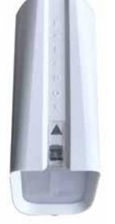
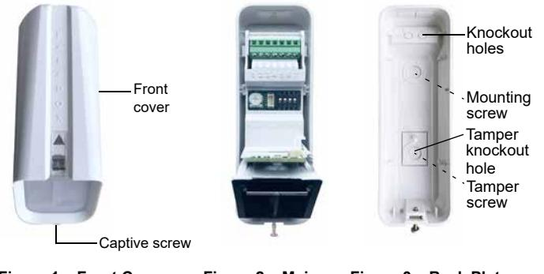
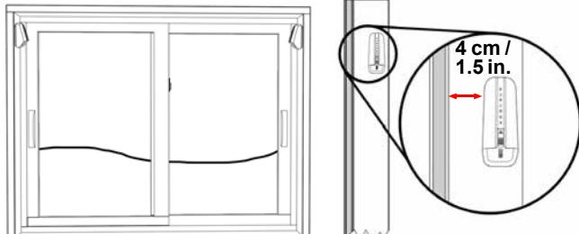
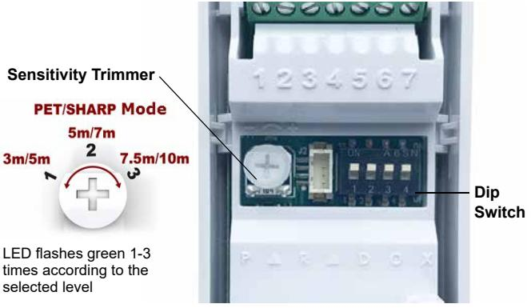
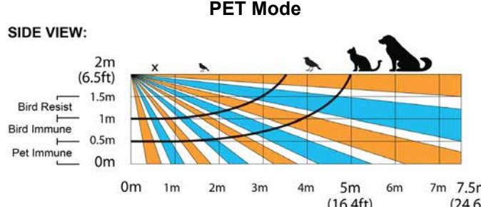
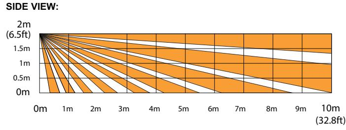
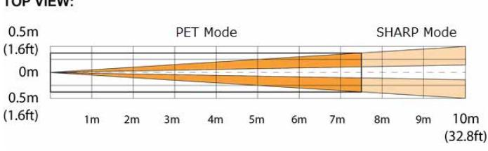

# **NV37M**

**Installation Manual V1.0**

**Outdoor/Indoor Window and Sliding Door Dual Detector with Anti-Masking and Pet Immunity**

## **General Description**

Thank you for choosing the NV37M for your professional protection needs. The NV37M wired version will provide you the most advanced window and sliding door protection either in Pet Immune or Sharp mode. If you have any comments, please write to us at Paradox.com/ products/feedback.

## **Recommended Installations (please read)**

Outdoor installation permits placements within frames of sliding windows or doors and presumes protection from raindrops. This ensures best catch performance, anti-masking ability, and pet alarm immunity.

Other installations are possible but in outdoor conditions, pet immunity can decrease. Moreover, space near the detector must be clear from obstacles from a distance of 30 to 40 cm (11.8 to 15.7 in.) within its pattern.

## **Installing the NV37M**

- 1. Remove the NV37M front cover open the Captive screw.

 **Figure 1 – Front Cover Figure 2 – Main Unit Figure 3 – Back Plate**

- 2. Remove the Main Unit open the two snap-lock mechanisms on each side of the back cover attaching the Main Unit to the back cover, then remove the Main Unit.
- 3. Pull the wires from the control panel through the knockout holes and mount the back cover onto the window frame or wall using screws.

#### *Note: PLEASE KEEP AT LEAST 4 cm / 1.5 in. clearance from window/shutter.*

An optional mounting bracket for the NV37M is available for ordering, part number: SB35.

- 4. Attach the Main Unit to the back cover ensure the locks snap closed.
- 5. Connect the wires to the terminal blocks according to the following wiring assignment.

**Table 1: Wiring Assignment**

| Terminal Connector | Recommended Wiring Assignment |
|--------------------|-------------------------------|
| 1                  | 12V+                          |
| 2                  | Minus (-)                     |
| 3                  | Fault indication              |
| 4                  | Tamper* indication            |
| 5                  | Common (Fault & Tamper)       |
| 6                  | Alarm indication              |
| 7                  | Common (Alarm)                |

** Tamper must be enabled on SP panels.*

- 6. Set the following Detector settings according to requirements.

 **Figure 4 – Detector Settings**

The following table displays the **Dip Switch** settings.

| Table 2: Dip Switch Settings |                             |                                                    |
|------------------------------|-----------------------------|----------------------------------------------------|
| Dip Switch Number         | Function                    | Mode Description                                   |
| 1                            | LED                         | ON: LED on (default) OFF: LED off               |
| 2                            | PET Immunity/ SHARP Mode | ON: PET Immunity mode (default) OFF: SHARP mode |
| 3                            | Anti-mask                   | ON: On (default) OFF: Off                       |
| 4                            | Anti-mask Sensitivity    | ON: High (default) OFF: Low                     |

7. Replace the front cover and close the Captive screw.

*Note: Do not obscure the detector's field of view.*

# **Testing the NV37M**

Perform a **Walk-Test** to test successful installation:

- 1. Walk slowly across the far end of the detection range.
- 2. Ensure detection.

Walk test mode lasts 5 minutes after the tamper screw is closed.

# **Beam Pattern**

**SHARP Mode**

**Top View**

# **LED Display**

| Feature                       | LED Status Indicator                                                                                                                                                                                                                                                         |
|-------------------------------|------------------------------------------------------------------------------------------------------------------------------------------------------------------------------------------------------------------------------------------------------------------------------|
| Tamper open                   | Green: ON for 0.3 seconds every 30 seconds                                                                                                                                                                                                                                |
| PIR sensitivity level setting | Green: Flashes 1-3 times according to the selected level                                                                                                                                                                                                                  |
| Alarm detection               | Red: ON for 2 seconds                                                                                                                                                                                                                                                        |
| Booting/Tamper close          | Green/Red alternating flashes for 30 seconds                                                                                                                                                                                                                              |
| Anti-mask detection           | Flashing Orange: Pre-mask situation is detected. Orange LED flashes ON/OFF 3 times. Solid Orange: Real mask is detected (can take between 20 -150 seconds after the pre-mask situation). Orange LED will remain solid "ON" while mask is present. |

# **Technical Specifications**

| Specification            | Description                                                                                                                                                              |
|--------------------------|--------------------------------------------------------------------------------------------------------------------------------------------------------------------------|
| Infrared sensor type     | 2 Dual elements                                                                                                                                                          |
| Detection range          | • PET Immunity mode: 7.5m x 2m (25 x 7 ft) • Sharp mode: 10 x 2m (33 x 7 ft)                                                                                 |
| Super Pet Immunity       | Pet size approximately 50cm                                                                                                                                              |
| Anti- mask               | Active IR detection for blocking items 30cm and sprayed liquid                                                                                                        |
| Input voltage            | 9 to 16 VDC                                                                                                                                                              |
| Current consumption      | Typical: 15mA Maximum: 19.2mA                                                                                                                                         |
| Compatibility            | EVO, Spectra and Magellan systems                                                                                                                                        |
| Outdoor protection       | IP54                                                                                                                                                                     |
| Operation temperature | -40°c to +70°c                                                                                                                                                           |
| Relative humidity        | 95% non-condensing                                                                                                                                                       |
| Dimensions               | 12.3 x 6.1 x 4.3 cm (4.8 x 2.4 x 1.7 in.)                                                                                                                                |
| Certifications           | CE, EN50131-2-2 Grade 3, Class IVA Certification Body: Applica Test & Certification Note: EN performance tests were conducted on sensitivity level 3 (high). |
| Weight                   | 100g / 0.2 lb                                                                                                                                                            |
|                          |                                                                                                                                                                          |

#### **Warranty**

For complete warranty information on this product, please refer to the Limited Warranty Statement found on the website: www.paradox.com/ terms or contact your local distributor. Specifications may change without prior notice.

#### **Patents**

US, Canadian and international patents may apply. Paradox is a trademark or registered trademark of Paradox Security Systems (Bahamas) Ltd.

