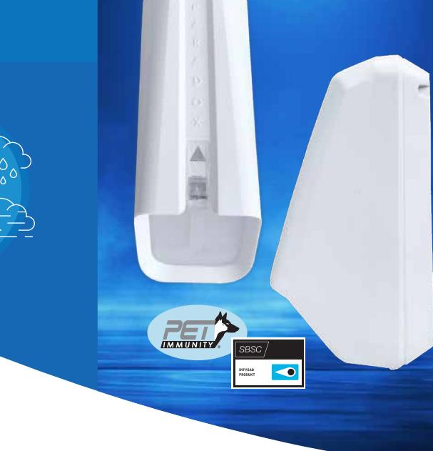
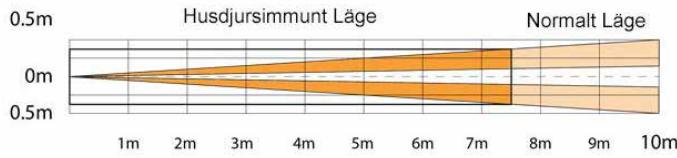
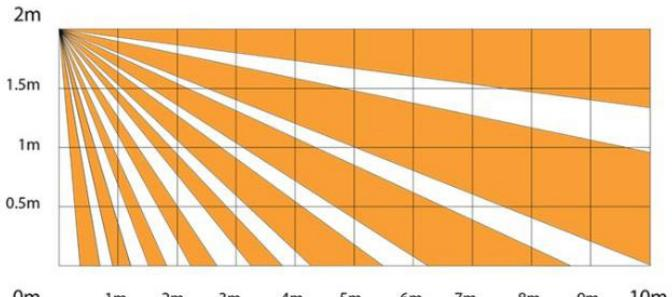
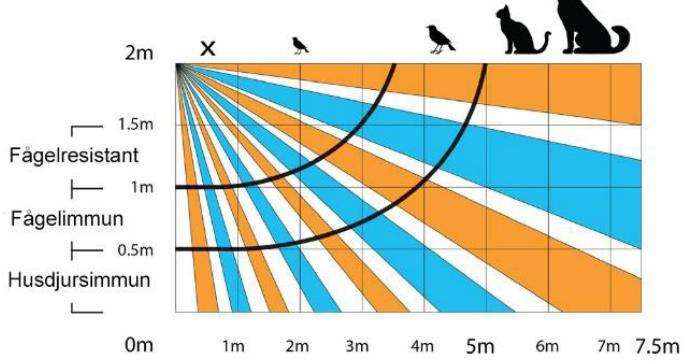
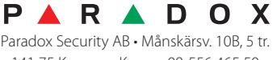

IR detektor med antimask och husdjursimmunitet eller krypzon Ridå skyddar fönster och dörrpartier

# **NV37-serien, ridådetektion**

Trådbunden NV37M, Art. nr 100-154 Bussutgång NV37MX, Art. nr 100-156 Trådlös NV37MR, Art. nr 500-587

> **Detektorn tål tuffa miljöer som vind, kyla regn och snö**

# Detekterar förbestämd begränsad yta

NV37 ser över en specifik yta vid bestämda fönsteroch dörrpartier då detektorn har ett detekteringsmönster med smala strålar (0,5m vid 5m). Detektorn fungerar lika bra inom,- som utomhus.

Flera inställningsmöjligheter finns. I husdjursimmunt läge utomhus ignoreras små fåglar, katter och hundar. I skarpt läge (sharp mode) ger det er en förlängd räckvidd och förbättrad detektering.

## Paradox oöverträffade teknologi

Husdjursimmunt läge är baserat på dubbel optiskt detekterings systems topologi där båda sensorerna måste känna av rörelse. Denna unika funktion hindrar husdjur upp till runt 70 cm från att detekteras, vilket ger den bästa husdjursimmuniteten.

# Få bästa räckvidd vid marknivå

Ridådetektorn har en intergrerad krypzon. Den hindrar inkräktare vid krypläge att nå det skyddade området.

## Antimask

Antimask avkänning känner av när ett objekt placeras nära (upp till 30 cm) eller på linsen. Detta gäller transparant lack, och produkter som aluminiumfolie och genomskinlig tejp. Men även rörelser nära linsen och störningar från damm och andra partiklar detekteras av antimask.

## Tuffa miljöer

NV37-serien fungerar i tuffa miljöer såsom kyla, vind och snö och ansluts till befintlig centralapparat. NV37M och NV37MX är godkänd av SBSC i larmklass 3.

#### u Utomhus / inomhus ridådetektor för fönster och skjutdörrar

u Välj husdjursimmun detektering alternativt längre räckvidd

u Antimask - aktiv IR detektering för sprejade vätskor och blockerande objekt upp till 30 cm från lins

**Produktinnehåll**

- u Dubbel sabotagedetektering
u Tydliga LED indikationer för detektering och antimask

# NV37M, NV37MX, NV37MR

Ridådetektion som reducerar falsklarm För inom- och utomhusbruk IR detektorer

Trådbunden NV37M, Art. nr 100-154 Bussutgång NV37MX, Art. nr 100-156 Trådlös NV37MR, Art. nr 500-587

#### Topvy

#### Normalt läge, sidovy

## Husdjursimmunitet, sidovy

Återförsäljare

### **Rörelsedetektering**

2 Dual Element sensorer

# **Täckning**

Husdjursimmunt läge: 7.5 x 2m Normalt läge: 10 x 2m Strålbredd: 0.5m vid 5m

#### **Antimask**

Aktiv IR detektering av blockerande objekt upp till 30 cm från detektorn och sprejade vätskor

#### **Indikationer**

RGB status LED

**Strömförbrukning**

NV37M, NV37MX: 12 Vdc standard,10V –15 Vdc, 20 mA NV37MR: 2 x AA batterier, kapacitet i upp mot 3 år

### **Driftstemperatur**

-40º till 70º C

**Sabotageavkänning**

Dubbel - skal och vägg

**Dimensioner**

12.3 x 6.1 x 4.3 cm

#### **Vikt**

100 g

### **Certifiering**

NV37M/ NV37MX: CE, FG. SBSC i larmklass 3, cert nr 21-568 /21-569. SSF1014, larmklass 3, utgåva 5. EN 50131 Grad 3. EN50130-5 Class IV. NV37MR: CE. EN 50131 Grad 2. EN50130-5 Class IV.

141 75 Kungens Kurva • 08-556 465 50 www.paradox-security.se