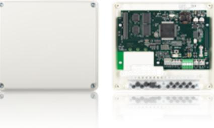

## UC-50/8 GEN2 LK 2

Artikelnummer: 20080154, E-nummer: 5871920

Undercentral för åtta dörrmiljöer (online). Undercentralen är adresserbar med sabotageskyddad kapsling.

Centralenheten UC-50 är hjärnan i R-CARD 5000. Det är UC:n som tar beslut och övervakar övriga anslutna enheter. Ett passage-/säkerhetssystem kan bestå av flera centralenheter. I ett integrerat larmsystem utgör en av UC-50- centralerna centralapparat för larmsystemet.

UC-50 Gen2 är utformad för att möta uppdaterade krav gällande elsäkerhet och bl.a. försedd med säkring för inkommande matningsspänning.

* För larmklassade produkter gäller miljöklassningens temperaturområde.

| Utförande:        | 8 dörrmiljöer, larmklass 2                       |
|-------------------|--------------------------------------------------|
| Mått (mm, BxHxD): | 201 x 181 x 50                                   |
| Temperaturområde: | +5°C till +60°C *                                |
| Ingångar:         | 1 ingång                                         |
| Utgångar:         | 1 reläutgång (Max 500mA)                         |
| Kommunikation:    | RS-485 (lokalbuss), CAN (systembuss) I2C (BT-xx) |
| Matningsspänning: | 12-30V DC                                        |
| Strömförbrukning: | Max. 119 mA                                      |
| SBSC Certifierad: | Larmklass 2 SSF 1014 Certnr: 8-561               |
| Kapslingsklass:   | IP20                                             |
| Miljöklass:       | 1                                                |
|                   |                                                  |