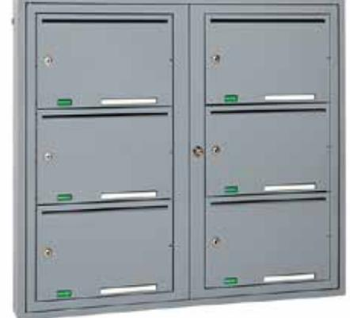

# Fastighetsbox Svenskboxen Stående

# Produktbeskrivning

Svenskboxen Stående är fylld med smarta funktioner. Stående är specialanpassad för smalare entrÈer där fastighetsboxens djup kan vara avgörande. Genom att posten placeras stående i fastighetsboxen kan mycket utrymme vinnas.

## Funktioner

- » Digitala namnskyltar
- » Elektroniska lås, cylinderlås eller hänglåsklinka
- » Säkerhetsklass 2 och Inbrottsklass 2
- » Dubbel plåt i luckorna
- » 10 mm inkast
- » 1-10 fack i en eller två kolumner
- » Snedtak med eller utan LED-skena
- » Blindskena för oanvända fack
- » Huvuddörr med 90-graders-stopp
- » Namnskylt på hyllplanet
- » Skylt för reklammärkning
- » Dörrdämpning
- » Monteringsskena

### Specifikationer

- » Korrosivitetsklass C4
- » Ramverk i 1 mm stålplåt, huvuddörr samt inkast 1,5 mm stålplåtl
- » Pulverlackad i RAL-kulör, alterantivt ytskikt i mässings eller rostfritt stål
- » SundaHusklassning A
- » Godkänd av ByggKlokt
- » Rekommenderad av Forum För Fastighetsboxar
- » P-märkning från SP Sveriges Tekniska Institut
- » Alla material godkända av ByggvaruBedömningen
- » 5 års garanti

### Artikel

| Artikelnummer    | Bredd (mm) | Höjd (mm) | Djup (mm) | Vikt (kg) |
|------------------|------------|-----------|-----------|-----------|
| SVBsXX-XXXX-1000 | 499/955    | 355-1395  | 120       | 8,9-28    |

Dinbox Drottninggatan 97 113 60 Stockholm 010-33 000 10 info@dinbox.se http://dinbox.se