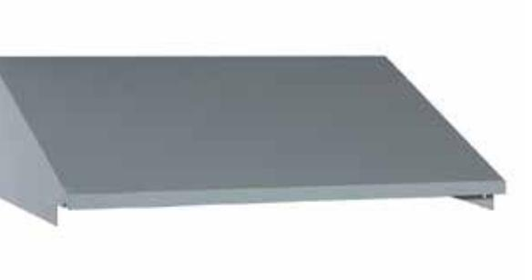

# Tillbehör Snedtak Svenskboxen

## Produktbeskrivning

Snedtak för fastighetsbox Svenskboxen förhindrar att reklam, skräp och tidningar läggs ovanpå fastighetsboxen. Snedtak kan monteras antingen med eller utan LED-slinga i takets framkant.

# Funktioner

- » LED-belysning
- » Förenklar städning
- » Förhindrar att oönskad post läggs ovanpå fastighetboxen
- » ÷kar skydd mot nederbörd
- » Samma RAL-kulör som fastighetsboxen
- » Kan monteras i efterhand

### Specifikationer

- » Korrosivitetsklass C4
- » 1 mm stålplåt
- » Pulverlackerad

#### Artikel

| Artikelnummer | Bredd (mm) | Höjd (mm) | Djup (mm) | Vikt (kg) |
|---------------|------------|-----------|-----------|-----------|
| SVBXX-XXXX    | 400-1002   | 80-150    | 150-430   | 1,3-5,2   |

Dinbox Drottninggatan 97 113 60 Stockholm 010-33 000 10 info@dinbox.se http://dinbox.se