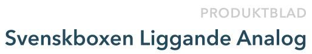
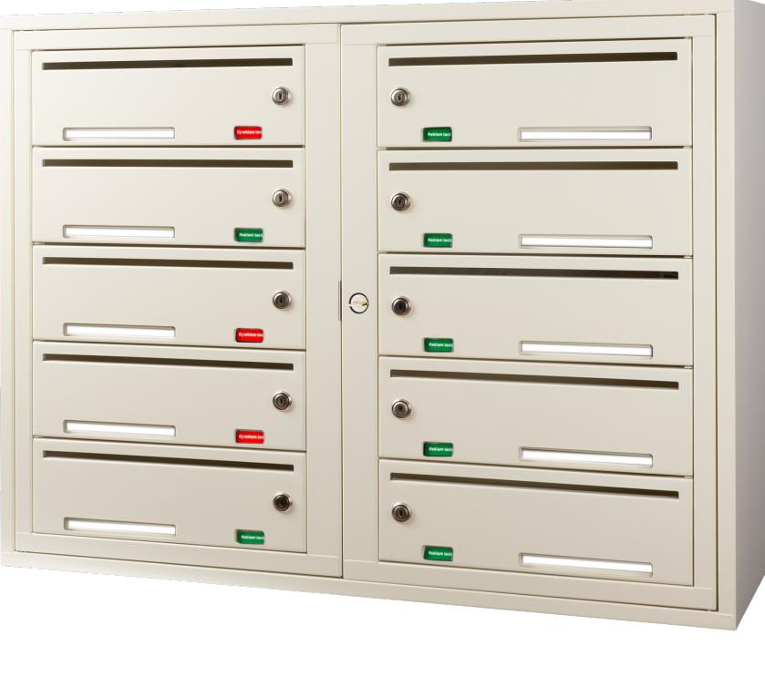
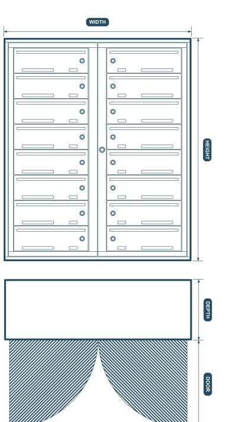
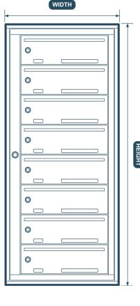
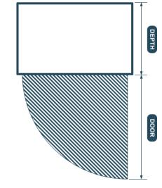

# Fastighetsbox

# Svenskboxen Liggande Analog

Svenskboxen Liggande Analog är en välbeprövad produkt och Sveriges mest populära fastighetsbox. Med en rad smarta funktioner är den det självklara valet för de flesta flerbostadshus.

## Sveriges mest sålda box

Den perfekta kombinationen av höjd, djup och bredd.

### Alla våra modeller är tillverkade för enkel montering inomhus. Enkel montering

+

#### Funktioner

- Säkerhetsklassade lås
- 3 nycklar per fack ingår
- 10 mm inkast
- 1-20 fack i en eller två kolumner
- Tillval: Snedtak med eller utan LEDskena
- Blindskena för oanvända fack
- Huvuddörr med 90-graders-stopp
- Namnskylt på hyllplanet
- Skylt för reklammärkning
- Inbyggt avlastningsbord
- Tillval: Servicefack för större paket
- Dörrdämpning
- Monteringsskena

#### Specifikationer

- 5 års garanti
- Pulverlackad i RAL-kulör, alternativt ytskikt i mässings eller rostfritt stål
- Korrosivitetsklass C3
- Material Stålplåt: Centraldörr 1,0 mm. Stomme 0,8 mm. Luckor: 0,8 mm
- Dubbel plåt i luckorna

| Rader | Höjd (mm) |
|-------|-----------|
| 1     | 228       |
| 2     | 355       |
| 3     | 486       |
| 4     | 615       |
| 5     | 745       |
| 6     | 875       |
| 7     | 1005      |
| 8     | 1135      |
| 9*    | 1265      |
| 10*   | 1395      |

| 955 mm                   |                |  |
|--------------------------|----------------|--|
| Bredd 1 kolumn 499 mm |                |  |
| Djup 308 mm           | Dörr 450 mm |  |
| Artikelnummer            |                |  |

Bredd 2 kolumner

SVBXX XXXX-1000

*Kräver dispens

## Våra säljare hjäper dig

salj@dinbox.se 010 33 000 10

Vår boxväljare kan räkna ut vilken konfiguration som passar er bäst. Besök dinbox.se/boxvaljaren eller skanna QR-koden

Ta hjälp av våra experter för vägledning, tips och råd eller för offert. Vi guidar er gärna till ett så tryggt val som möjligt tveka inte på att höra av dig.