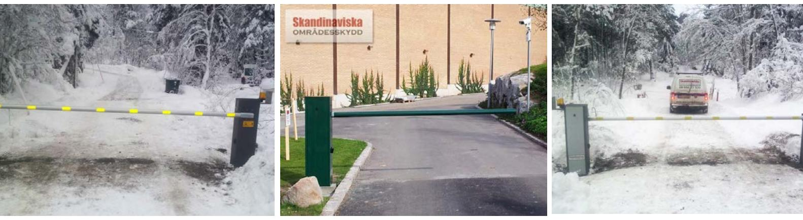
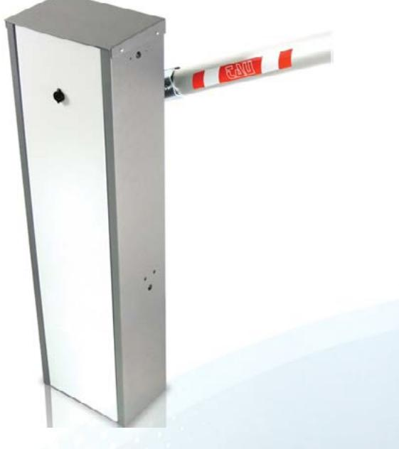

## Automatisk bom Rapid *Rapid - sveriges snabbaste bom?*

Rapid är en snabböppnande automatisk vägbom som är idealisk att använda på högt trafikerade infarter där köbildning lätt uppstår.

Bommen har en lägsta öppningstid på 1,9 sekunder vilket förhindrar att passagen blir en flaskhals om det är mycket trafik.

## Utförande

Bommen levereras komplett med bomhus (Grafit/ lackat), integrerat styrskåp, bomrör i aluminium, 2 st. fotoceller samt mottagarklyka. Kontrollenheten är placerad i toppen av bommen vilket gör att det är enkelt att installera och utföra service arbeten på bommen. Redan vid leveransen är kontrollenheten redan ansluten till motorn vilket gör hela installationsarbetet väldigt enkelt.

Driften kan garanteras till och med vid strömavbrott tack vara möjligheten att välja till batteridrift som tar över vid strömbortfall.

**Teknisk specifikation:**

- >> Eldata:
- 230V/50-60Hz 3,5A 1400rpm
- >> Dragkraft: 46 Nm
- >> Livslängd motor:
- 1 miljon cykler
- >> Max cykler per dygn: 500 st
- >> Vikt:
- 47 kg
- >> Bomlängd: 1-4 m
- >> Material:
- Skåp i lackerat stål, bomrör ALU

**2 års garanti på all elektronik. 5 års garanti med serviceavtal.**

**Den här produkten är en lagervara. Det betyder att leveranstiden är minimal.**

**Kan utrustas med all typ av styrning, t ex telefon, radio, kodlås och kortläsare.**

**Vi monterar i hela Sverige. Kontakta oss för mer information.**

# Automatisk bom Rapid forts.

## Montage

När vi levererar bommen tillsammans med styrningen hjälper vi till med inkopplingen av elektroniken. Det enda som återstår när bommen levereras är att förankra den på fundamentet, montera dit mottagarklykan och ansluta elen. Tryck på knappen och bommen är igång och redo att användas!

### Komplettera

Alla typer av styrenheter går att koppla till Rapid, och du väljer själv om öppning ska ske via fjärrkontroll, tidur, kodläsare eller via annat passagesystem. Rapid kan kompletteras med ett stort urval av tilläggsprodukter för att passa alla ändamål och behov.

# Skandinaviska **områdesskydd**

info@skandinaviska.nu www.skandinaviska.nu www.stangselbutiken.se **Kontakta oss!** Telefon: 08-500 11 530 Fax: 08-458 11 66

**Kontor / Söderort** Kilowattvägen 12 136 44 Handen

**Kontor / Norrort** Storstensvägen 12 761 53 Norrtälje