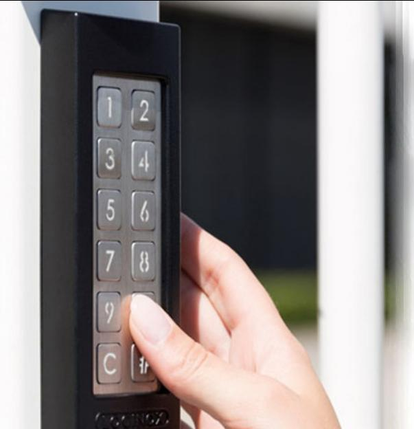
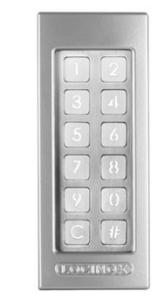

# Kodlås SlimLock

## Vattentätt, frostsäkert och starkt kodlås med integrerat relä. Finns i färgerna svart eller silver.

IP68 klassade vilket innebär att kodlåsen är extremt vatten- och dammresistenta. Utformad med vandalsäker kåpa i aluminium med repavvisande lack gör dessa lås extremt användbara i tuffa miljöer eller där många passerar.

#### Utförande

SlimLock kodlås har en enkel och stilren design som passar i alla miljöer. Dom högkvalitativa tryckknapparna i rostfritt stål är testade för att klara över 1.000.000 tryck.

Kodlåsen är även testade för att fungera i temperaturer från -30 ° upp till +85 ° Celsius. Med sin inyggda uppvärmning är låsen helt frostfria.

### **Produktfakta:**

- IP68 klassad
- LED-belysning
- Upp till 100 användarkoder
- Frostskydd
- Arbetsström från 10 upp till 26 Volt AC/DC
- Ström 1.0 A med värme / PPmax = 13,5 W med max värme

**2 års garanti på all elektronik. 5 års garanti med serviceavtal.**

**Den här produkten är en lagervara. Det betyder att leveranstiden är minimal.**

**Kompletta paket.**

**Vi monterar i hela Sverige. Kontakta oss för mer information.**