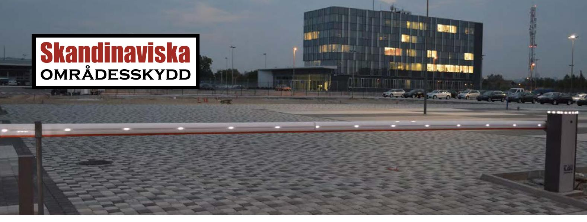
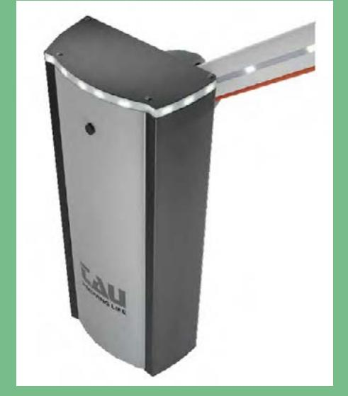
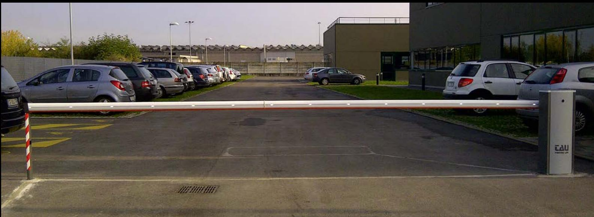
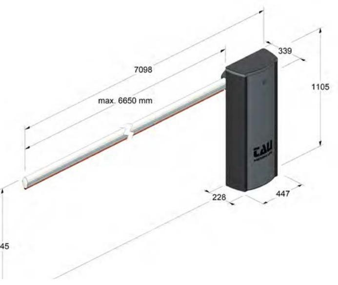

## Automatisk bom LUXE *Komplett automatisk bom* • Bomlängd: 4-7 m

Luxe är en rejäl, automatisk vägbom som är mycket enkel att installera. Det finns ett stort utbud av tillvalsutrustning och styrning som kan anpassas för att möta alla typer av behov. LED-belysning (tillval) gör bommen synlig även under det mörka vinterhalvåret.

#### Utförande

Bommen levereras komplett med rostfritt och lackerat bomhus med integrerat styrskåp, bomrör i aluminium, 1 st styrkort, 2 st. IR fotoceller, 1 st ingjutningsplatta, 1 st bomstör med integrerad fotocell och 1 st varningslampa. Kontrollenheten är placerad i toppen av bommen vilket gör att det är enkelt att installera och utföra service arbeten på bommen. Redan vid leveransen är kontrollenheten redan ansluten till motorn vilket gör hela installationsarbetet väldigt enkelt.

Driften kan garanteras till och med vid strömavbrott tack vara möjligheten att välja till batteridrift som tar över vid strömbortfall.

### **Teknisk specifikation:**

- 
- Vikt: 70 kg
- Minsta öppningstid:10 sekunder
- Öppningsfrekvens: obegränsad
- Eldata: 230V 50-60Hz / 12-24 Vdc / 3,5A / 1450rpm
- Säkerhet: inbyggt belastningsskydd
- Tillval:
	- Inbyggd LED-belysning
	- gummiskydd på bommens undersida

**2 års garanti på all elektronik. 5 års garanti med serviceavtal.**

**Den här produkten är en lagervara. Det betyder att leveranstiden är minimal.**

**Kan utrustas med all typ av styrning, t ex telefon, radio, kodlås och kortläsare.**

**Vi monterar i hela Sverige. Kontakta oss för mer information.**

# Automatisk bom LUXE forts.

#### Montage

Enkel och snabb installation ger god totalekonomi. När vi levererar bommen tillsammans med styrningen kan vi hjälpa vi er med inkopplingen av styrenheter. Det enda som återstår när bommen levereras är att förankra den på fundamentet, montera dit mottagarklykan och ansluta elen. Tryck på knappen och bommen är igång och redo att användas!

#### Komplettera

Alla typer av styrenheter går att koppla till Luxe, och du väljer själv om öppning ska ske via fjärrkontroll, tidur, kodläsare eller via annat passagesystem. Luxe kan kompletteras med ett stort urval av tilläggsprodukter för att passa alla ändamål och behov. Om det finns ett befintligt passagesystem kan bommen lätt anslutas till detta.

### **Komplett paket:**

- 1 st. bomhus lackerat
- 1 st. bomrör upp till 7000mm
- 1 st. styrkort
- 2 st. IR-fotoceller (säkerhet)
- 1 st. ingjutningsplatta
- 1 st. bomstöd med integrerad fotocell
- 1 st. varningslampa.

## Skandinaviska **områdesskydd**

Skandinaviska Områdesskydd AB www.skandinaviska.nu www.stangselbutiken.se

### **Kontakta oss!**

Telefon: 08-500 11 530 info@skandinaviska.nu

**Kontor / Stockholm** Kilowattvägen 12 136 44 Handen

**Kontor / Norrtälje** Södra kustvägen 30 761 93 Norrtälje

**Kontor / Göteborg** Karlsbogårdsgatan 7D 25 37 Hising Kärra