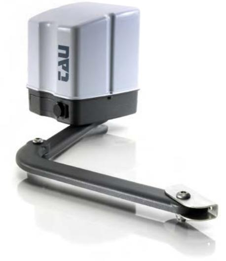

# Skötsel & underhåll

# EASY grindmotor

EASY motorerna behöver mycket lite underhåll. De åtgärder som behövs för att hålla motorn i perfekt skick beskrivs nedan. **OBSERVERA:** Ingen, med undantag för auktoriserad servicetekniker, ska ha möjlighet att starta det automatiska systemet vid underhåll. Stäng av huvudströmmen för att eliminera risken för elektriska stötar. Om strömförsörjningen måste vara påslagen för vissa arbeten måste all styrning kontrolleras eller vara inaktiv (fjärrkontroller, tryckknapp lister etc.) utom den som används av serviceteknikern.

## Skötsel och underhåll

Var och en av följande åtgärder ska utföras vid behov och alltid var 6e månad för hemmabruk (ca.. 3000 arbetscykler) och varannan månad för intensiv användning sådant som flerbostadshus (alltid 3000 arbetscykler ).

- Grind: Smörj gångjärnen på grinden.
- Automatiksystemet: Olja den ledade armens stift, armen som är kopplat till motorns utgående axel och alla delar som
- utsätts för slitage på grund av friktion.
- kontrollera hur säkerhetsanordningarna fungerar .
- Särskilda underhåll. Om större arbete på mekaniska och / eller elektromekaniska delar måste utföras bör kuggväxelmotorn avlägsnas för reparation i verkstaden av tillverkarens eller annan behörig tekniker.

### Rengöringsregler

- Behöver normalt ej rengöras
#### Målning

- Målas ej.

Skandinaviska Områdesskydd AB www.skandinaviska.nu www.stangselbutiken.se

**Kontakta oss!** Telefon: 08-500 11 530 info@skandinaviska.nu