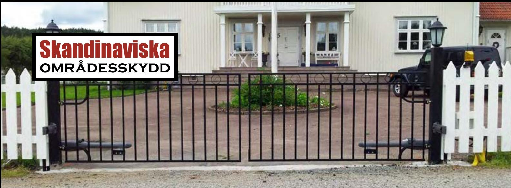
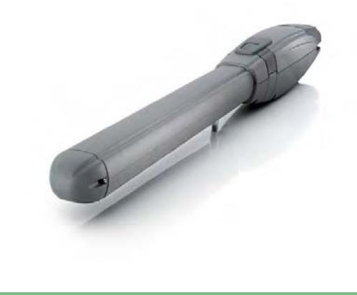
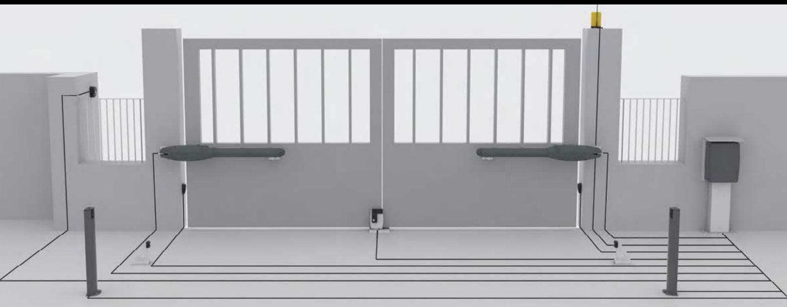
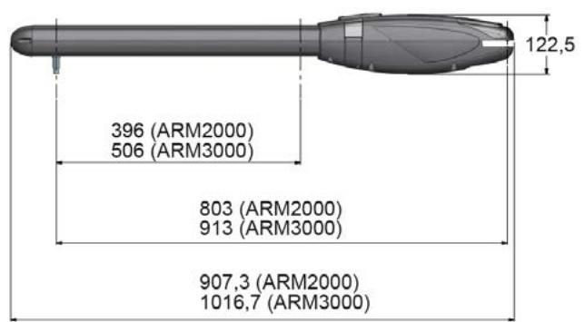

## Grindautomatik Karm

Karm är en elektrisk grindöppnare framtagen för villagrindar. Den tidlösa och diskreta designen gör att Karm passar till de flesta grindmodeller.

#### Utförande

Grindmotorn går att montera på så gott som alla grindar och ingen svetsning är nödvändig då fästen för såväl grindramar som grindstolpar medföljer. I paketet ingår alltid 2 st. grindmotorer, 2 st. fästen för grindram, 2 st. fästen för stolpe, 1 st. styrskåp, 2 st. fotoceller, inbyggd radiomottagare samt 2 st. fjärrkontroller.

Driften kan garanteras till och med vid strömavbrott tack vara möjligheten att välja till batteridrift som tar över vid strömbortfall.

#### Flexibel och anpassningsbar elektronik

Alla typer av styrenheter går att koppla till KARM, och du väljer själv om öppning ska ske via fjärrkontroll, tidur, kodläsare eller via annat passagesystem.

### **Teknisk specifikation:**

- Maxlängd per grindblad: 3000mm
- Maxvikt per grindblad: 100 kg
- Livslängd motor: 1 miljon cykler
- Max cykler per dygn: 250 st
- Öppningsgrad: 100 grader

- Öppningstid: 12,5 sek. (justerbart)
- Matning: 230V50-60Hz/12-24 Vdc

**2 års garanti på all elektronik. 5 års garanti med serviceavtal.**

**Den här produkten är en lagervara. Det betyder att leveranstiden är minimal.**

**Kan utrustas med all typ av styrning, t ex telefon, radio, kodlås och kortläsare.**

**Vi monterar i hela Sverige. Kontakta oss för mer information.**

## Grindautomatik Karm forts.

#### Garanti

Vi ger alltid 2 års motorgaranti och 2 års elektronikgaranti på Karm grindmotorer. Vi installerade vår första Karm grindmotor redan 2006 och sedan dess har det blivit ungefär 500 till. Än så länge har inte en enda gått sönder utan yttre påverkan, och det tycker vi är ett bra betyg!

#### Montage

Enkel och snabb installation ger god totalekonomi. Vi åtar oss kompletta installationsarbeten där vi är din enda kontakt, och vi ansvarar för såväl materialleverans, installation, kvalitetssäkring och om så önskas serviceavtal.

#### Komplettera

Karm2000 kan kompletteras med ett stort urval av til läggsprodukter för att passa alla ändamål och behov. Om det finns ett befintligt passagesystem kan grindmotorn enkelt anslutas till detta.

### **Komplett paket:**

- 2 st. grindmotorer
- 2 st. fästen för grindram
- 2 st. fästen för stolpe
- 1 st. styrskåp
- 2 st. fotoceller
- 1 st. radiomottagare
- 1 st. fjärrkontroll.

# Skandinaviska **områdesskydd**

Skandinaviska Områdesskydd AB www.skandinaviska.nu www.stangselbutiken.se

**Kontakta oss!** Telefon: 08-500 11 530 info@skandinaviska.nu

**Kontor / Stockholm** Kilowattvägen 12 136 44 Handen

**Kontor / Norrtälje** Södra kustvägen 30 761 93 Norrtälje

**Kontor / Göteborg** Karlsbogårdsgatan 7D 25 37 Hising Kärra