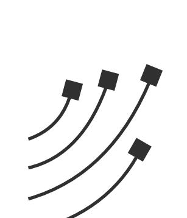
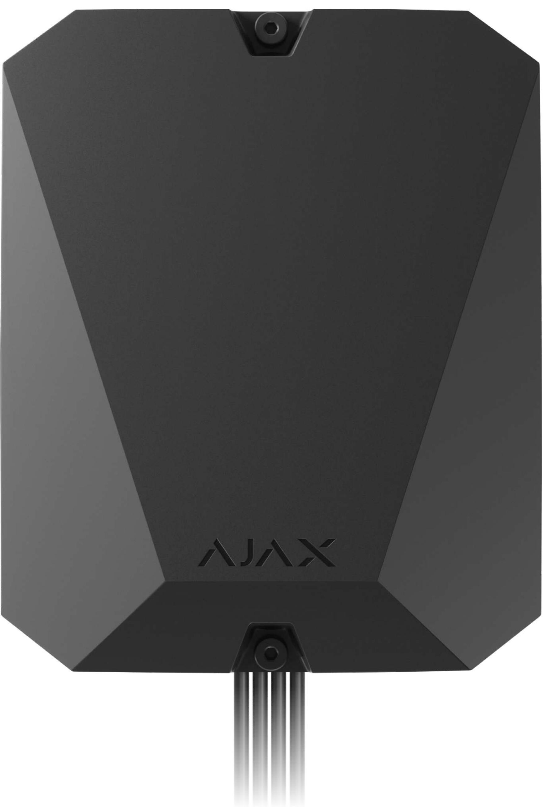
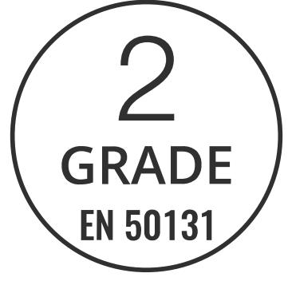
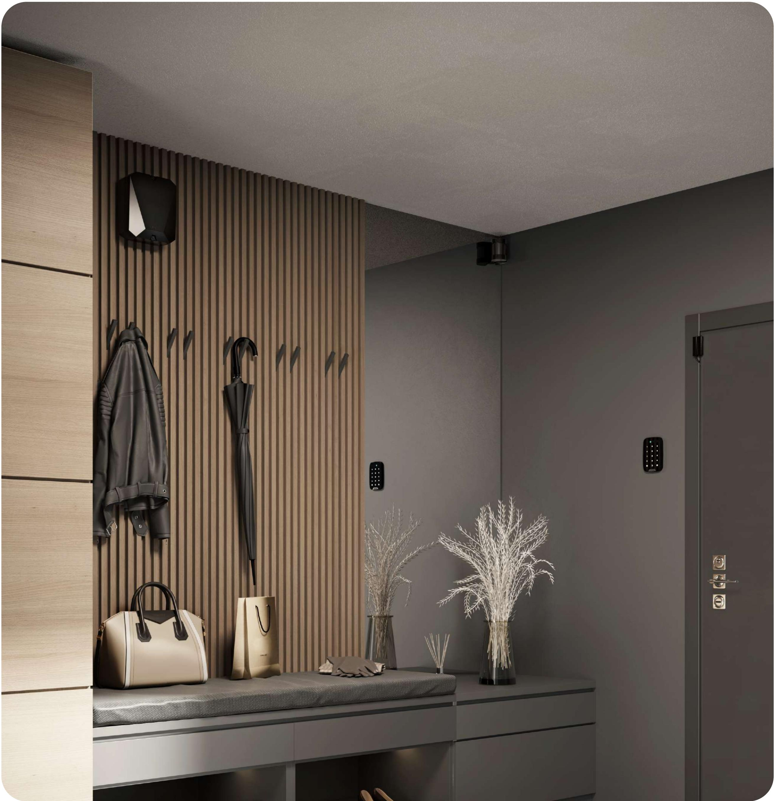
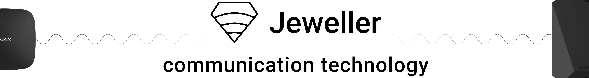
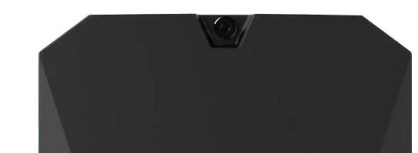
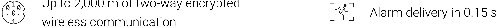

1

# MultiTransmitter

Module to integrate third-party wired detectors with Ajax security system

Technical Data Sheet: MultiTransmitter

A hub is required for operation. Find the detailed information on the device by the link:

https://ajax.systems/support/devices/multitransmitter/

18 inputs for third-party wired devices

400 m Up to 400 m of cable length between devices and MultiTransmitter

#### The second life of an old wired alarm

MultiTransmitter opens new markets and allows building modern complex security based on existing wired equipment installed at a facility.

Ajax s security system users get security control via app, data-rich notifications, and scenarios with this integration module and old third-party wired devices.

An installer can set up the system or device in the PRO app, both while on-site and remotely.

Technical Data Sheet: MultiTransmitter 2

We'll stop shipping old versions of MultiTransmitter in favor of the new one. New devices will have different packaging with 3EOL icons to avoid confusion. Choose and install the equipment that precisely matches the client's needs.

## Maximum compatibility with the new firmware

MultiTransmitter allows connecting a wide range of wired sensors. The integration module with firmware version 2.13.0 and higher supports NC, NO, EOL, 2EOL, and 3EOL connection types. EOL resistance detects automatically in the PRO app.

The device supports EOL's with resistance from 1 kΩ to 15 kΩ1 each with total resistance of 30 kΩ. To increase the protection against sabotage, EOL's with different resistance can be used in one sensor. MultiTransmitter has three independent 12 V⎓ power outputs for third-party wired sensors: one for fire sensors and two for the rest devices. Recommended EOL ratio: R1=R , R2=2·R , R3=3·R .

MultiTransmitter has four 12 V⎓ power outputs for third-party wired sensors: one for fire sensors and three for other devices.

### Two-way encrypted communication

Jeweller is a two-way wireless data transfer protocol that provides fast and reliable communication between hub and devices. The protocol delivers instant data-rich alarms: security companies and users know which device was triggered, when and where it happened.

Jeweller features encryption and authentication to prevent forgery and polling to display devices status in real time. Supporting up to 2,000 m of wireless connectivity, Jeweller is ready to protect facilities and deliver the best user experience for both end users and installers.

Up to 2,000 m of two-way encrypted

### Technical specifications

Technical Data Sheet: MultiTransmitter 3

Compliance with standards

#### EN 50131 (Grade 2) PD 6662:2017

Communication with control panel

 Jeweller communication technology 

Frequency bands 866.0 – 866.5 MHz 868.0 – 868.6 MHz 868.7 – 869.2 MHz 905.0 – 926.5 MHz 915.85 – 926.5 MHz 921.0 – 922.0 MHz Depends on the region of sale

Maximum effective radiated power (ERP) ≤ 25 mW 

Communication range up to 2,000 m in a line of sight 

Polling interval 12–300 sec Set by admin in the app Compatibility Hubs

 All Ajax hubs2 

Range extenders all Ajax radio signal range extenders

#### Connected devices Number of zones 18

Connection types NO, NC, EOL With MultiTransmitter firmware version under 2.13.0 

NO, NC, EOL, 2EOL, 3EOL With MultiTransmitter firmware version 

One wired device per zone 

EOL resistance from 1 kΩ to 7.5 kΩ with 100 Ω increment With MultiTransmitter firmware version under 2.13.0 

from 1 kΩ to 15 kΩ for each resistor, up to 30 kΩ of total resistance With MultiTransmitter firmware version 2.13.0

2.13.0 and higher 

Alarm types pulse, bistable and higher, EOL resistance measured automatically in PRO apps

Casing Colour white, black 

> Dimensions 196 × 238 × 100 mm

Weight 805 g 

Tampering alarm 

|              | Two tampers to detect the lid opening and alert of detachment from a wall                                      |              | 4 main power outputs: 10.5–15 V⎓, up to 1 A in total One power output for fire detectors, and three outputs for other devices |
|--------------|-------------------------------------------------------------------------------------------------------------------------|--------------|----------------------------------------------------------------------------------------------------------------------------------------------|
| Power supply | Main power supply 100–240 V, 50/60 Hz                                                                                | Installation | Operating temperature range from –10°С to +40°С                                                                                        |
|              | Backup power supply 12V⎓ accumulator with up to 7 Ah capacity with a full charge cycle of up                   |              | Operating humidity up to 75%                                                                                                              |
|              | to 30 h Backup battery not included                                                                               |              | Ingress protection IP50                                                                                                                   |
| Complete set | MultiTransmitter Power cable 12 V⎓ battery connection cable Casing Installation kit Quick Start Guide |              |                                                                                                                                              |

Power supply for connected devices

Connected devices Cable length between detectors and MultiTransmitter up to 400 m When using a signal cable with a 0.22 mm² copper clad aluminium conductor

- Available on MultiTransmitter with firmware version 2.13.0 and higher. With firmware version under 2.13.0 available EOL resistance from 1 kΩ to 7.5 kΩ with 100 Ω increment.
- 2EOL/3EOL connection support and EOL resistance from 1 kΩ to 15 kΩ are available on MultiTransmitter with firmware version 2.13.0 and higher.