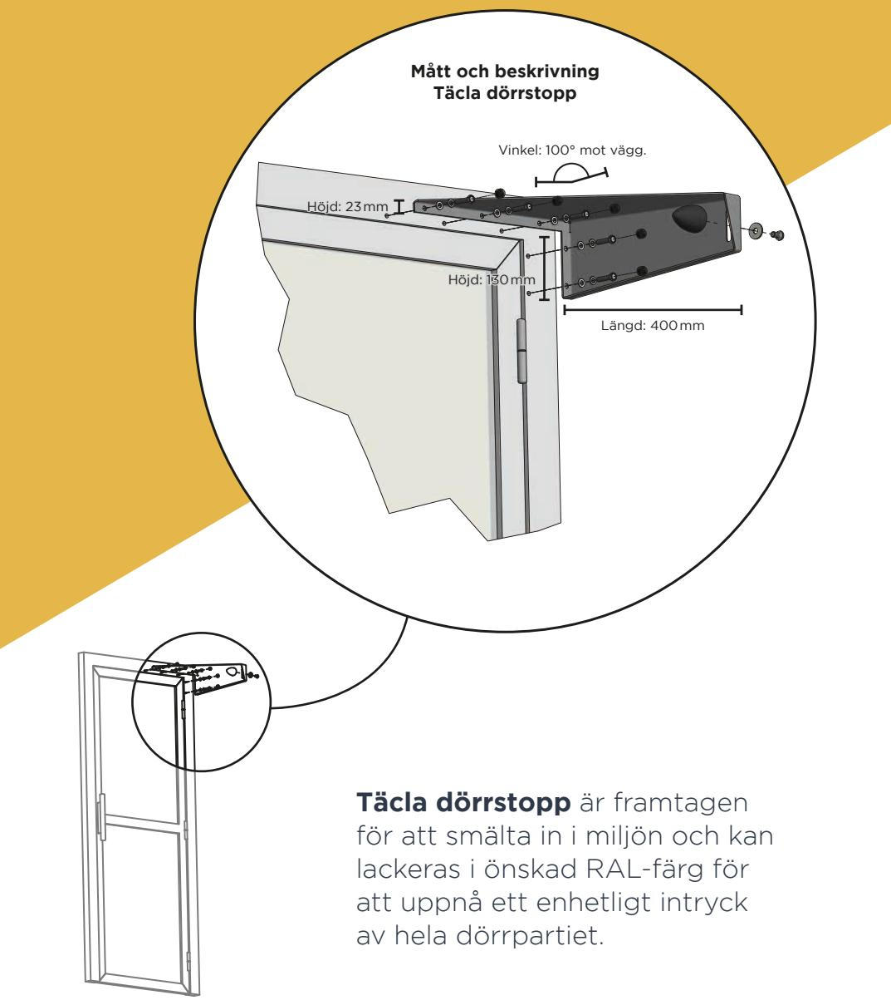

## **SKYDDA ENTRÉPARTIER** med Täcla dörrstopp

**FÖRLÄNG ENTRÉNS** livslängd

## **MED DESIGN OCH FUNKTION** skyddas dörr och automatik

## **Entréer och dörrpartier**

utsätts ofta av dagligt slitage. Därför har vi på Täcla tagit fram marknadens absolut bästa dörrstopp. Ett dörrstopp som skyddar både dörrkarm, dörrblad, gångjärn, dörrstängare och dörrautomatik.

**Vår unika** konstruktion tillverkas efter SS-EN 1090 Standard. Dörrstoppet består av en laserskuren, bockad och TIG-svetsad konstruktion. Våra produkter är specifikt framtagna för att erbjuda snygg design,

hög kvalitet och långsiktig hållbarhet. Med Täcla dörrstopp har dörrpartiet längre livslängd och därmed lägre underhållskostnader.

Enkel att montera, enkelt att underhålla.

**Täcla erbjuder** produkter i en tilltalande design med ett hållbart koncept och enkel montering. Vi jobbar kontinuerligt med att utveckla nya högkvalitativa produkter som kan hjälpa dig som kund i din vardag.

## **TÄCLA AB** skyddar din dörr

**Täcla är ett företag** som jobbar med smarta, funktionella lösningar som skyddar entrépartier mot slitage. Vårt mål är enkelt, vi vill vara det första alternativet när det kommer till att skydda dörrpartier i alla tänkbara miljöer för att ge dörren längre livslängd och högre säkerhet.

**Intresserad av att veta mer** om våra produkter och tjänster? Ring André Tärnlöv på **073-5272449**

**DEMO?**

tacla.se • info@tacla.se • 073-5272449