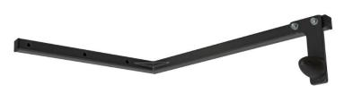
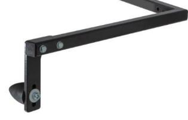
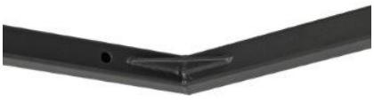
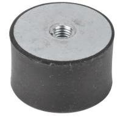
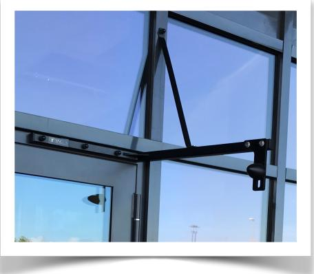
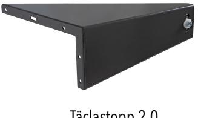
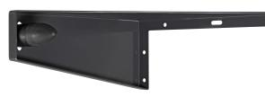
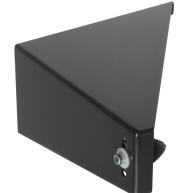
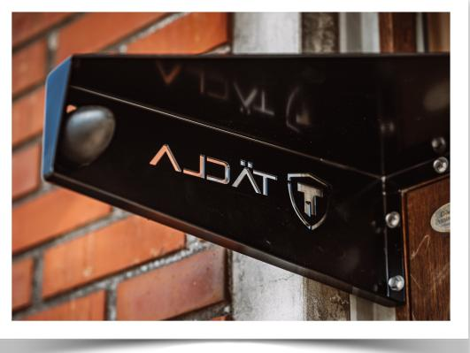

# **FKR Stopp**

Svetsad förstärkt konstruktion

Förlängare används för sensorlister

#### **FKR Stopp**

Täclas FKR stopp är marknadsledande för sin kraftiga konstruktion. FKR stoppet är en stum dörrstopp som är tänkt att användas där Täclastoppet inte får plats.

FKR stoppet är vändbart vilket betyder att man kan det både för höger eller vänster sida.

### TÄCLASTOPP ARTIKELNUMMER

#### **Täclastopp 2.0**

1002-TVS - Täclastopp 2.0 Höger Svart 1002-THS - Täclastopp 2.0 Vänster Svart 1002-THG - Täclastopp 2.0 Höger Grå 1002-TVS - Täclastopp 2.0 Vänster Grå

**FKR Stopp**

1003-FKRS - FKR Stopp Svart 1003-FKRG - FKR Stopp Grå **Tillbehör** 1004-FRL - Förlängare för sensorlist 1004-GUM Gummistopp

**Täcla AB** Brearedsvägen 432 56 Varberg

Tel: 073-527 24 49 www.tacla.se [info@tacla.se](mailto:info@tacla.se)

# **Täclastopp**

Täclastopp 2.0 SS-EN 1090 standard 105 graders vinkel

## **Varför välja dörrstopp från Täcla AB?**

När det kommer till slitage på alltsom har med entré att göra är det viktigt att ha bra skydd. Täcla AB har nu tagit fram marknadens absolut bästa dörrstopp. Produkten består av bockad och tig-svetsad konstruktion.

Våra produkter är specifikt framtagna för att erbjuda snygg design, högkvalitet och långsiktig hållbarhet .Vår unika konstruktion tillverkas efter SS-EN1090 standard.

Produkten är framtagen för att skydda din dörrkarm, dörrblad, gångjärn, dörrstängare och dörrautomatik. Dörrstoppen rekommenderas i alla offentliga miljöer – inomhus, som utomhus

produkten *

Täclastopp 2.0 erbjuder företagsprofilering Vi erbjuder 5 års garanti på

* Vid godkänd garanti ersätts produkten men inte arbetstid. Garantin gäller stålkonstruktionen.

**Täcla AB** Brearedsvägen 432 56 Varberg

Tel: 073-527 24 49 www.tacla.se [info@tacla.se](mailto:info@tacla.se)