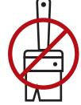
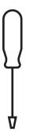
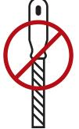
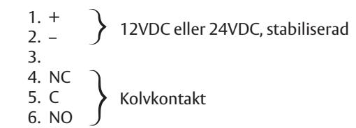
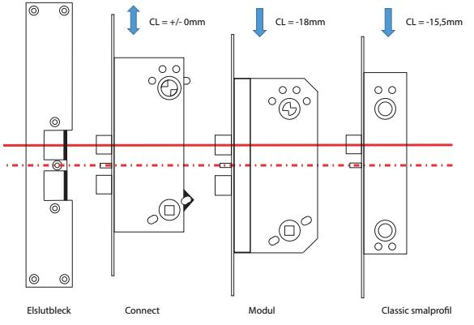
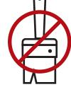
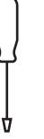
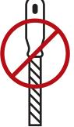
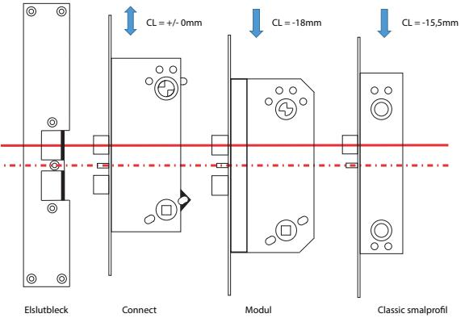

# **Installationsbeskrivning ASSA ABLOY Elslutbleck 990/940**

### **Allmänna riktlinjer vid installation**

- ASSA ABLOY Elslutbleck i 990/940-serien passar för monteringsstolpar i 9XX/9XXX-serien med 2 alt 4 fästskruvar.
- För att bibehålla egenskaper måste Elslutblecket:
	- Monteras parallellt mot låshuset.
	- Avståndet mellan låsstolpe och monteringsstolpe 3mm +/- 1mm
- Smörj cylinder- och tryckesfall på låshuset med ASSA ABLOY låsfett.

Tänk på följande:

Rätt spänning Ej övermålning Noggrannt

montage

Ej vattentät Justera ej med elslutblecket monterat

### **Inkoppling:**

- Spänning 12V DC eller 24V DC, stabiliserad
- Effekt 6 W max
- Inbyggd skyddsdiod
- Samtliga Elslutbleck i 990/940-serien har mikrobrytare (kolvkontakt)

## **Höjdförhållande låstyper Connect & Classic**

**ASSA ABLOY Opening Solutions Sweden**  Customer support: Phone intl. +46 (0)16 17 71 00 Phone nat. 0771-640 640 Fax +46 (0)16 17 73 72 e-mail: helpdesk.se.openingsolutions@assaabloy.com

www.assaabloyopeningsolutions.se

# **Fitting instruction ASSA ABLOY Electric Strike 990/940**

### **Fitting guidelines**

- ASSA ABLOY Electric Strike in 990/940-series should be fitted with faceplates in the 9XX/9XXX-series with 2 or 4 fitting screws.
- To retain the characteristics of the strike it must be:
	- Aligned parallel to the lock case
	- Fitted with a 3mm +/- 1mm gap between the faceplate of the lock case and the face plate of the electric strike
- Lubricate both cylinder- and the handle latch with ASSA ABLOY lock grease

Tänk på följande:

Correct voltage No overcoating Careful

- assembly
1. + 2. – 3. 4. NC 5. C 6. NO

Not waterproof Do not adjust with fitted strike

12VDC eller 24VDC, regulated

Latch bolt monitor

### **Inkoppling:**

- Power supply 12V DC or 24V DC, regulated
- Effect 6 W peak
- Protection diode is not required
- All Electric Strikes in the 990/940-series are equipped with micro switch

## **Height ratios for lock case Connect & Classic**

**ASSA ABLOY Opening Solutions Sweden**  Customer support: Phone intl. +46 (0)16 17 71 00 Phone nat. 0771-640 640 Fax +46 (0)16 17 73 72 e-mail: helpdesk.se.openingsolutions@assaabloy.com

www.assaabloyopeningsolutions.se