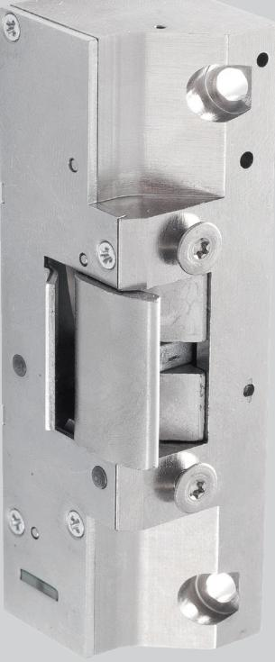
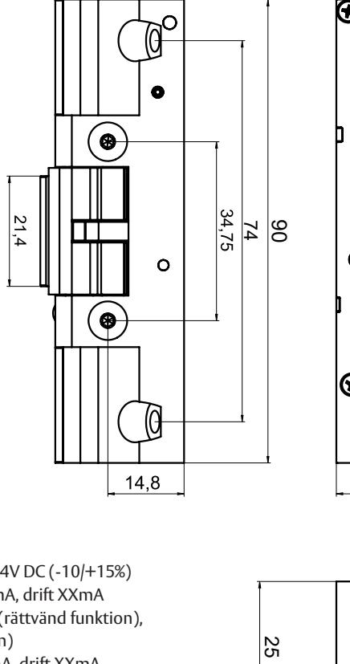
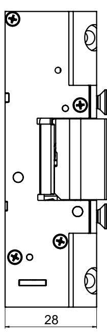
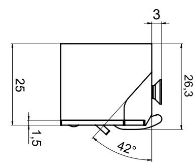

## ASSA ABLOY Elslutbleck 990/991

## **Användningsområden**

ASSA ABLOY Elslutbleck 990/991 för dörrar med normalt ställda krav på säkerhet. Passar bra som daglåsning i skalskydd och intern låsning inom handel, kontor och industri eller entréer och allmänna utrymmen i flerfamiljshus. Uppfyller krav för installation i brandcellsgräns.

#### **Funktion**

- Elslutbleck 990
	- Rättvänd funktion (låst spänning av)
	- Multispänning 12-24V DC (-10/+15%)
	- Låskolvkontakt (mikrobrytare)
	- Listtrycksteknik 50kg
- Brythållfasthet 900kg
- Knacksäker
- Brandklass E/EI 120, CE-märkt enligt SS-EN 14846:2008
	- Symmetriskt utformat, vändbart höger/vänster

### • Elslutbleck 991

- Omvänd funktion (låst spänning på)
- Multispänning 12-24V DC (-10/+15%)
- Låskolvkontakt (mikrobrytare)
- Listtrycksteknik 100kg
- Brythållfasthet 900kg
- Knacksäker
- Brandklass E/EI120, CE-märkt enligt SS-EN 14846:2008 OBS! Fall på låshus för brandigenhållning måste vara på mekaniskt hål i monteringsstolpe på variant 991
	- Symmetriskt utformat, vändbar höger/vänster

#### **Egenskaper**

Konstruerat för användning i dörrar i kombination med förreglade enkel- och dubbelfallås.

# ASSA ABLOY Elslutbleck 990/991

### **Tekniska data**

- Spänningsmatning 12-24V DC (-10/+15%)
- Startström vid 24V XX mA, drift XXmA
- Viloström vid 24V 0mA (rättvänd funktion), XXmA (omvänd funktion)
- Startström vid 12V XXmA, drift XXmA
- Viloström vid 12V 0mA (rättvänd funktion), XXmA (omvänd funktion)

ASSA ABLOY Opening Solutions Sweden P.O. Box 371 SE-631 05 Eskilstuna Sweden Phone +46 (0)16 17 70 00

Customer support: Phone intl. +46 (0)16 17 71 00 Phone nat. 0771-640 640 helpdesk.se.openingsolutions@assaabloy.com assaabloyopeningsolutions.se