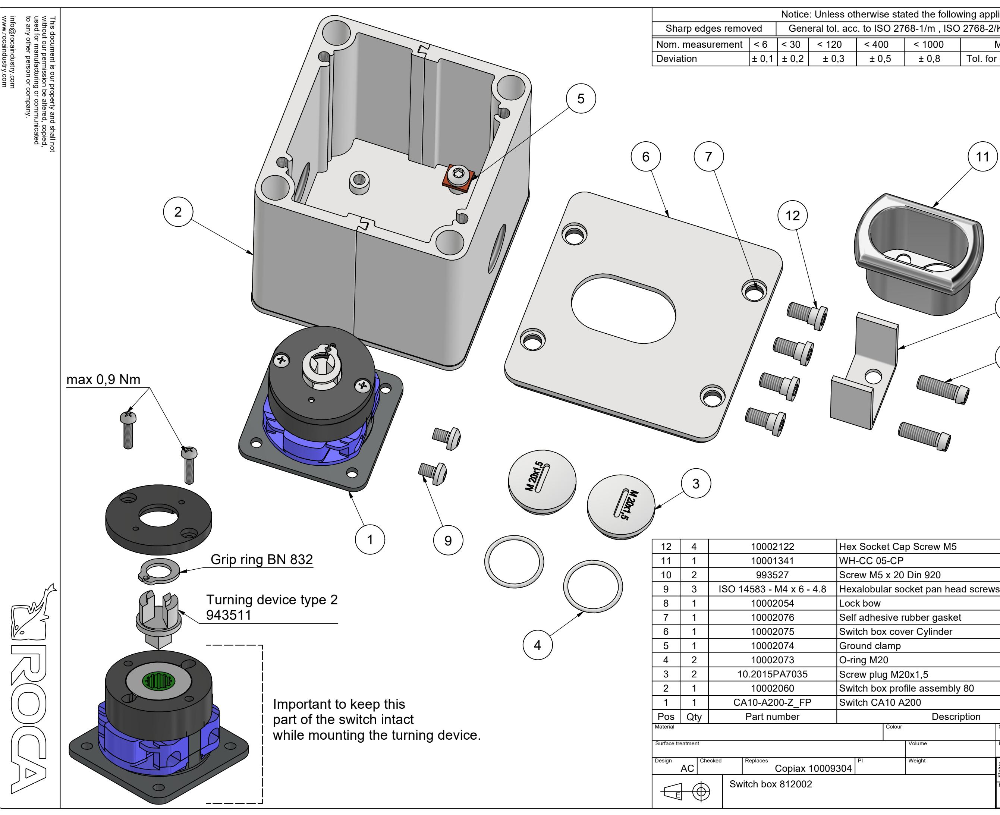

| Notice: Unless otherwise stated the following applies                                            |   |                                    |                   |                 |                                    |                             |     |                         |                                                                               |                     | A3               |  |
|--------------------------------------------------------------------------------------------------|---|------------------------------------|-------------------|-----------------|------------------------------------|-----------------------------|-----|-------------------------|-------------------------------------------------------------------------------|---------------------|------------------|--|
| Sharp edges removed General tol. acc. to ISO 2768-1/m , ISO 2768-2/K Rough castings ±1,0mm |   |                                    |                   |                 |                                    |                             |     |                         |                                                                               |                     |                  |  |
| Nom. measurement < 6 < 30                                                                        |   |                                    |                   | < 120           | < 400                              | < 1000                      |     | M-thread 6H/6g - ISO965 |                                                                               |                     |                  |  |
| Deviation                                                                                        |   |                                    | ± 0,1 ± 0,2       | ± 0,3           | ± 0,5                              | ± 0,8                       |     |                         | Tol. for out / inside diameter h11 / H11                                      |                     |                  |  |
| 3                                                                                                | 7 |                                    | 12                |                 |                                    |                             | 11  | 8 10                 |                                                                               |                     |                  |  |
| 412                                                                                              |   | 10002122                           |                   |                 |                                    | Hex Socket Cap Screw M5     |     |                         |                                                                               |                     |                  |  |
| 111                                                                                              |   | 10001341                           |                   |                 | WH-CC 05-CP                        |                             |     |                         |                                                                               |                     | 943290 993527 |  |
| 210                                                                                              |   | 993527 ISO 14583 - M4 x 6 - 4.8 |                   |                 | Screw M5 x 20 Din 920              |                             |     |                         |                                                                               |                     |                  |  |
| 39                                                                                               |   |                                    |                   |                 | Hexalobular socket pan head screws |                             |     |                         |                                                                               |                     |                  |  |
| 18                                                                                               |   | 10002054                           |                   |                 | Lock bow                           |                             |     |                         |                                                                               |                     |                  |  |
| 17                                                                                               |   | 10002076                           |                   |                 |                                    | Self adhesive rubber gasket |     |                         |                                                                               |                     |                  |  |
| 16                                                                                               |   | 10002075                           |                   |                 | Switch box cover Cylinder          |                             |     |                         |                                                                               |                     |                  |  |
| 5 1                                                                                           |   | 10002074                           |                   |                 | Ground clamp                       |                             |     |                         |                                                                               |                     |                  |  |
| 24                                                                                               |   | 10002073                           |                   |                 | O-ring M20                         |                             |     |                         |                                                                               |                     |                  |  |
| 23                                                                                               |   | 10.2015PA7035                      |                   |                 | Screw plug M20x1,5                 |                             |     |                         |                                                                               |                     |                  |  |
| 12                                                                                               |   | 10002060                           |                   |                 | Switch box profile assembly 80     |                             |     |                         |                                                                               |                     |                  |  |
| 11                                                                                               |   |                                    | CA10-A200-Z_FP    |                 | Switch CA10 A200                   |                             |     |                         |                                                                               |                     |                  |  |
|                                                                                                  |   |                                    |                   |                 | Description                        |                             |     |                         |                                                                               |                     |                  |  |
| Pos Qty Material                                                                           |   | Part number                        |                   |                 | Colour                             |                             |     | Scale                   |                                                                               | Item number Date |                  |  |
| Surface treatment                                                                                |   |                                    |                   |                 |                                    | Volume                      |     | Item no.                | 1 : 1 943503                                                               |                     | 2022-05-03       |  |
| Design Checked Replaces                                                                    |   |                                    |                   |                 | PI                                 | Weight                      | N/A |                         | A - Only for price inquiry                                                    |                     |                  |  |
| AC                                                                                               |   |                                    |                   | Copiax 10009304 |                                    |                             | N/A | tus at S          | B - Only for production of tooling and samples P - Approved for production |                     | B                |  |
| E                                                                                                |   |                                    | Switch box 812002 |                 |                                    |                             |     |                         | Rev. Drawing no. 1 10002110                                          |                     |                  |  |

